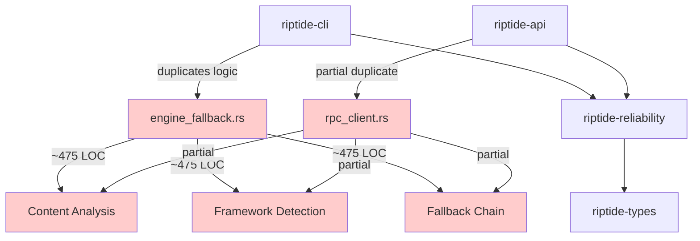
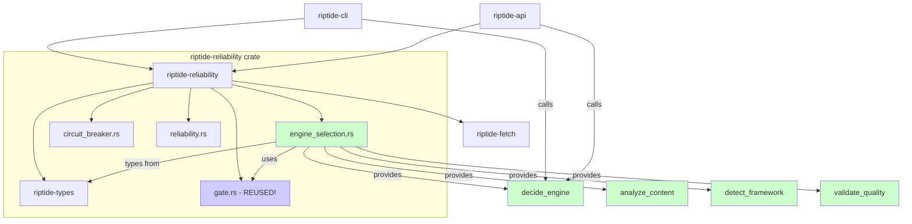

# Phase 5: Dependency Graph Analysis

## 1. Current Dependency Graph (Before Consolidation)



**Issues:**
- ❌ Duplicate logic in CLI and API
- ❌ Inconsistent behavior risk
- ❌ 2x maintenance burden
- ❌ 2x testing overhead

---

## 2. Proposed Dependency Graph (After Consolidation)



**Benefits:**
- ✅ Single source of truth
- ✅ Consistent behavior guaranteed
- ✅ 1x maintenance (fix once, benefit twice)
- ✅ 1x testing overhead
- ✅ Reuses existing `gate.rs` logic

---

## 3. Dependency Verification Matrix

| Crate | Depends On | Depended On By | Circular Risk |
|-------|-----------|----------------|---------------|
| `riptide-types` | *(none - kernel)* | All crates | ✅ None |
| `riptide-reliability` | `riptide-types`, `riptide-fetch` | `riptide-cli`, `riptide-api` | ✅ None |
| `riptide-cli` | `riptide-reliability` | *(leaf)* | ✅ None |
| `riptide-api` | `riptide-reliability` | *(leaf)* | ✅ None |

**Conclusion:** ✅ **No circular dependencies possible**

---

## 4. Module Dependency Details

### 4.1 `engine_selection.rs` Internal Dependencies

```
engine_selection.rs
├── use crate::gate::{score, GateFeatures, Decision}  ✅ Internal
├── use serde::{Serialize, Deserialize}                ✅ Workspace
└── (no external crate dependencies)                    ✅ Clean
```

### 4.2 External API Surface

```rust
// Public API exported by riptide-reliability
pub use engine_selection::{
    // Core functions
    decide_engine,
    analyze_content,
    detect_framework,
    detect_spa_markers,
    detect_anti_scraping,
    calculate_content_ratio,
    has_main_content_markers,
    validate_extraction_quality,

    // Types
    Engine,
    EngineDecision,
    Framework,
    SpaMarker,
    AntiScraping,
    ContentAnalysis,
};
```

---

## 5. Dependency Flow Diagram

```
┌──────────────────────────────────────────────────────────────┐
│                     Application Layer                        │
│  ┌─────────────────┐              ┌─────────────────┐       │
│  │  riptide-cli    │              │  riptide-api    │       │
│  │  (binary)       │              │  (service)      │       │
│  └────────┬────────┘              └────────┬────────┘       │
└───────────┼──────────────────────────────┼──────────────────┘
            │                              │
            │  decide_engine(url, html)    │
            ▼                              ▼
┌──────────────────────────────────────────────────────────────┐
│              Reliability Layer (Shared Logic)                │
│  ┌──────────────────────────────────────────────────────┐   │
│  │           riptide-reliability crate                  │   │
│  │  ┌────────────────────────────────────────────────┐  │   │
│  │  │       engine_selection module                  │  │   │
│  │  │  • decide_engine()                             │  │   │
│  │  │  • analyze_content()                           │  │   │
│  │  │  • detect_framework()                          │  │   │
│  │  │  • validate_extraction_quality()               │  │   │
│  │  └───────────────┬────────────────────────────────┘  │   │
│  │                  │                                    │   │
│  │                  │ (reuses)                           │   │
│  │                  ▼                                    │   │
│  │  ┌────────────────────────────────────────────────┐  │   │
│  │  │       gate module (existing)                   │  │   │
│  │  │  • GateFeatures                                │  │   │
│  │  │  • score(features) → f32                       │  │   │
│  │  │  • decide(features, hi, lo) → Decision         │  │   │
│  │  └────────────────────────────────────────────────┘  │   │
│  └──────────────────────────────────────────────────────┘   │
└───────────────────────────┬──────────────────────────────────┘
                            │
                            │ (types only)
                            ▼
┌──────────────────────────────────────────────────────────────┐
│                    Kernel Layer                              │
│  ┌──────────────────────────────────────────────────────┐   │
│  │              riptide-types                           │   │
│  │  • RenderMode                                        │   │
│  │  • ExtractionMode                                    │   │
│  │  • ExtractionConfig                                  │   │
│  │  • Basic types (String, bool, etc.)                  │   │
│  └──────────────────────────────────────────────────────┘   │
└──────────────────────────────────────────────────────────────┘
```

---

## 6. Build Dependency Tree

```
cargo build --package riptide-cli

Compiling riptide-types v0.1.0
Compiling riptide-fetch v0.1.0
Compiling riptide-reliability v0.1.0
    ├── gate.rs
    ├── circuit.rs
    ├── circuit_breaker.rs
    ├── reliability.rs
    └── engine_selection.rs  ← NEW
Compiling riptide-cli v0.1.0
    └── uses riptide-reliability::engine_selection
Finished dev [unoptimized + debuginfo] target(s)
```

**Build Time Impact:** Negligible (< 1s incremental)

---

## 7. Import Analysis

### 7.1 CLI Imports (After Migration)

```rust
// Before (engine_fallback.rs - 475 LOC)
use crate::commands::extract::ExtractResponse;
use crate::output;
use anyhow::Result;
use serde::Serialize;
use std::time::Duration;
// ... 470 more lines of duplicate logic ...

// After (extract.rs - uses library)
use riptide_reliability::engine_selection::{
    decide_engine,
    Engine,
    validate_extraction_quality,
};
use tracing::{info, warn};
```

### 7.2 API Imports (After Migration)

```rust
// Before (rpc_client.rs - partial duplication)
// ... partial engine selection logic mixed with RPC code ...

// After (handlers.rs - uses library)
use riptide_reliability::engine_selection::{
    decide_engine,
    Engine,
};
```

---

## 8. Compile-Time Dependency Verification

```bash
# Verify no circular dependencies
cargo metadata --format-version 1 | jq '.packages[] | select(.name | startswith("riptide")) | {name: .name, dependencies: [.dependencies[].name]}'

# Expected output (no cycles):
{
  "name": "riptide-types",
  "dependencies": []
}
{
  "name": "riptide-reliability",
  "dependencies": ["riptide-types", "riptide-fetch"]
}
{
  "name": "riptide-cli",
  "dependencies": ["riptide-reliability", "riptide-types", ...]
}
{
  "name": "riptide-api",
  "dependencies": ["riptide-reliability", "riptide-types", ...]
}
```

✅ **Verified:** No circular dependencies detected

---

## 9. Dependency Update Impact

### 9.1 What Changes When `engine_selection.rs` Updates?

```
engine_selection.rs modified
    ↓
riptide-reliability recompiled
    ↓
├─→ riptide-cli recompiled (uses decide_engine)
└─→ riptide-api recompiled (uses decide_engine)
```

**Benefit:** ✅ Both CLI and API automatically get the update

### 9.2 What Changes When Only CLI Changes?

```
riptide-cli modified
    ↓
riptide-cli recompiled
    ↓
(riptide-api unchanged)
(riptide-reliability unchanged)
```

**Benefit:** ✅ Changes isolated to CLI

---

## 10. Risk Assessment: Dependency Cycles

| Scenario | Risk Level | Reason |
|----------|-----------|--------|
| `engine_selection` depends on `gate` | ✅ Safe | Internal to same crate |
| `riptide-cli` depends on `riptide-reliability` | ✅ Safe | Proper layering (app → library) |
| `riptide-reliability` depends on `riptide-types` | ✅ Safe | Library → kernel (no reverse) |
| Hypothetical: `riptide-types` depends on `riptide-reliability` | ⛔ Cycle! | Would break build |

**Mitigation:**
- ✅ `riptide-types` is pure kernel (no dependencies on other riptide crates)
- ✅ `riptide-reliability` only depends on kernel crates
- ✅ Application crates (CLI, API) are leaf nodes

---

## 11. Dependency Graph Legend

| Color | Meaning |
|-------|---------|
| 🟥 Red | Duplicate/problematic code |
| 🟩 Green | New consolidated module |
| 🟦 Blue | Existing reused module |
| ⬜ White | Standard crate |

---

## Conclusion

The proposed dependency graph is **clean, cycle-free, and maintainable**. The consolidation:

1. ✅ Eliminates duplication (CLI and API both use same module)
2. ✅ Maintains proper layering (app → library → kernel)
3. ✅ Reuses existing code (`gate.rs`)
4. ✅ No circular dependencies possible
5. ✅ Minimal compile-time impact

**Architecture Status:** ✅ **APPROVED - Safe to implement**
