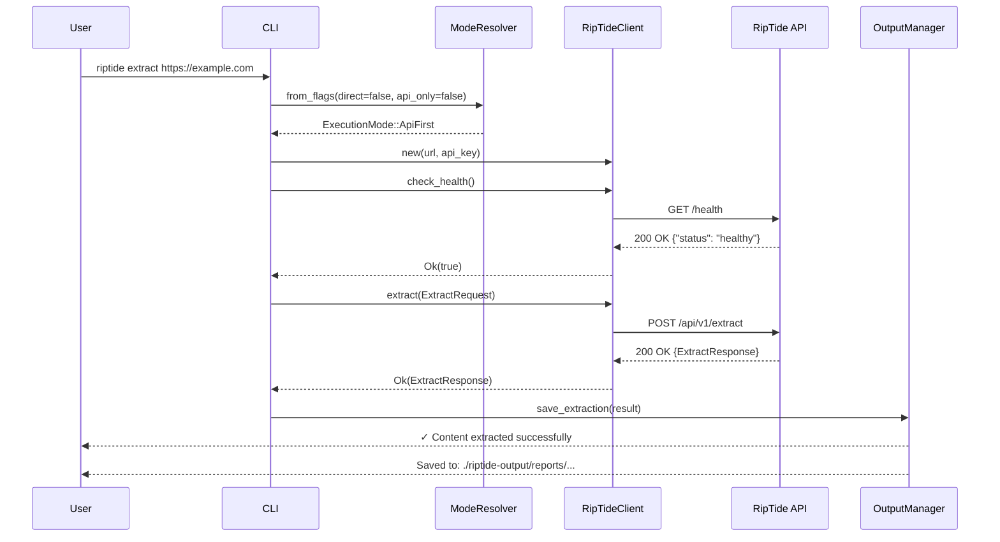
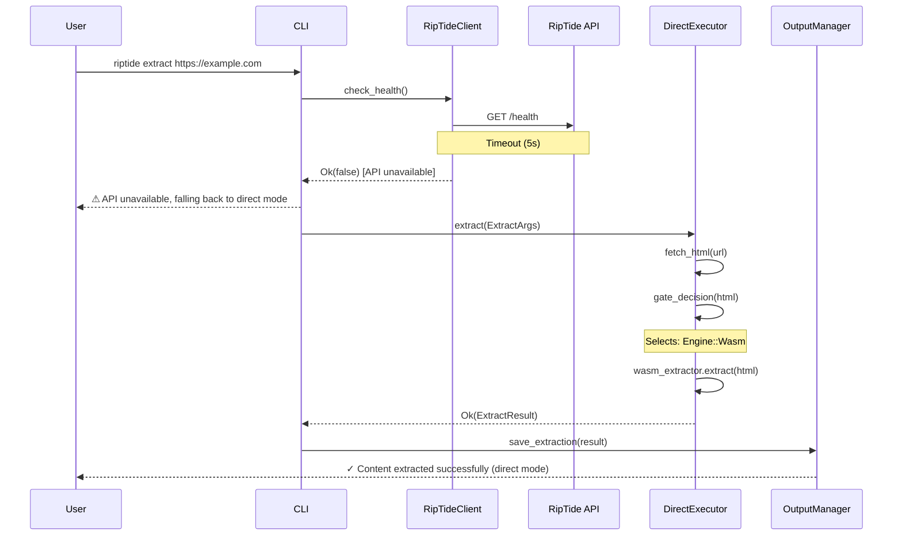
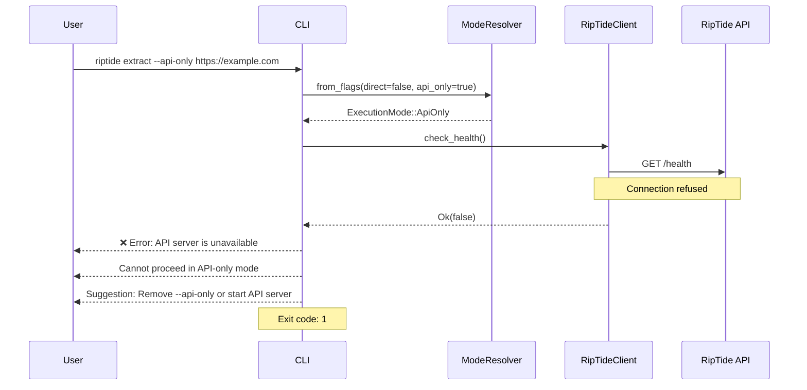
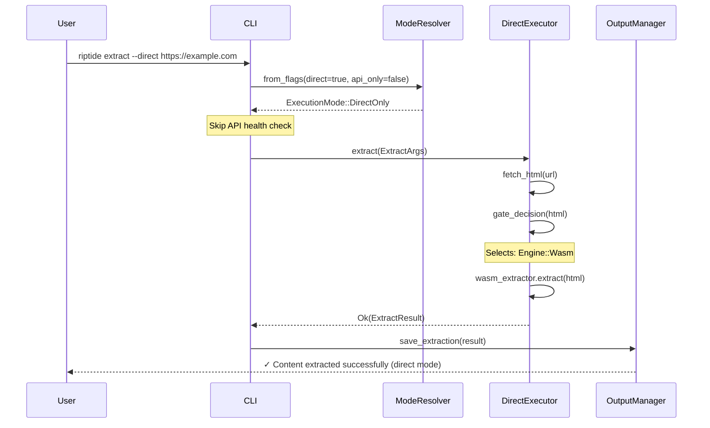

# RipTide Hybrid CLI-API Architecture Specification

**Document Version:** 1.0
**Created By:** Hive Mind System Architect
**Date:** 2025-10-17
**Status:** Design Specification

---

## Executive Summary

This document specifies the hybrid architecture for RipTide CLI, combining API-first communication with direct fallback execution. The design enables cloud-based processing through RipTide API while maintaining full offline capability through local extraction engines.

**Key Architecture Principles:**
- **API-First by Default**: Leverage centralized API for resource pooling and performance
- **Graceful Degradation**: Automatic fallback to direct execution when API unavailable
- **Configuration Flexibility**: Multiple configuration sources with clear precedence
- **Shared Code**: Maximum code reuse between API and direct modes
- **Unified Output**: Consistent artifacts and metadata across execution modes

---

## Table of Contents

1. [Architecture Overview](#architecture-overview)
2. [Execution Modes](#execution-modes)
3. [Component Architecture](#component-architecture)
4. [Configuration System](#configuration-system)
5. [API Communication Layer](#api-communication-layer)
6. [Direct Execution Layer](#direct-execution-layer)
7. [Fallback Logic](#fallback-logic)
8. [Output Management](#output-management)
9. [Authentication & Security](#authentication--security)
10. [Error Handling](#error-handling)
11. [Sequence Diagrams](#sequence-diagrams)
12. [Interface Specifications](#interface-specifications)
13. [Implementation Strategy](#implementation-strategy)
14. [Performance Considerations](#performance-considerations)
15. [Testing Strategy](#testing-strategy)

---

## Architecture Overview

### High-Level Architecture

```
┌─────────────────────────────────────────────────────────────┐
│                     RipTide CLI                              │
│  ┌───────────────────────────────────────────────────────┐  │
│  │         Command Parser (Clap)                         │  │
│  │  (extract, crawl, render, pdf, search, health, etc.) │  │
│  └─────────────────┬─────────────────────────────────────┘  │
│                    │                                         │
│  ┌─────────────────▼─────────────────────────────────────┐  │
│  │    Execution Mode Resolver                            │  │
│  │  - Parse CLI flags (--direct, --api-only)            │  │
│  │  - Read RIPTIDE_CLI_MODE env var                     │  │
│  │  - Determine: ApiFirst | ApiOnly | DirectOnly         │  │
│  └─────────────────┬─────────────────────────────────────┘  │
│                    │                                         │
│       ┌────────────┴────────────┐                           │
│       │                         │                           │
│  ┌────▼────────┐         ┌─────▼──────────┐                │
│  │  API Mode   │         │  Direct Mode   │                │
│  │             │         │                │                │
│  │ • RipTide   │         │ • WASM Engine  │                │
│  │   Client    │         │ • Headless     │                │
│  │ • Health    │         │   Launcher     │                │
│  │   Check     │         │ • Spider       │                │
│  │ • Retry     │         │ • HTTP Client  │                │
│  │   Logic     │         │ • PDF          │                │
│  └────┬────────┘         └─────┬──────────┘                │
│       │                         │                           │
│  ┌────▼─────────────────────────▼──────────────────────┐   │
│  │          Output Manager                             │   │
│  │  - Unified artifact storage                         │   │
│  │  - Metadata tracking                                │   │
│  │  - Format conversion (JSON, text, table, markdown) │   │
│  └──────────────────┬──────────────────────────────────┘   │
│                     │                                       │
│  ┌──────────────────▼──────────────────────────────────┐   │
│  │   Metrics & Telemetry                               │   │
│  │  - Execution tracking                               │   │
│  │  - Performance metrics                              │   │
│  │  - Error reporting                                  │   │
│  └─────────────────────────────────────────────────────┘   │
└─────────────────────────────────────────────────────────────┘
             │                           │
             │ HTTP/HTTPS                │ File System
             │                           │
    ┌────────▼────────┐         ┌────────▼────────┐
    │  RipTide API    │         │  Local Storage  │
    │  (Port 8080)    │         │  Output Dirs    │
    └─────────────────┘         └─────────────────┘
```

### Design Principles

1. **Fail-Safe Defaults**: Always default to API-first with automatic fallback
2. **Explicit Overrides**: Users can force specific modes via CLI flags
3. **Performance Optimization**: API provides shared resource pools and caching
4. **Offline Support**: Full functionality without network connectivity
5. **Transparent Operation**: Users shouldn't need to know which mode is active
6. **Consistent Interfaces**: Same command syntax regardless of execution mode

---

## Execution Modes

### Mode Types

#### 1. API-First Mode (Default)

**Behavior:**
1. Attempt API communication first
2. If API unavailable or fails: fallback to direct execution
3. Cache API availability status for subsequent commands

**Use Cases:**
- Normal production usage
- Development with API server running
- Cloud deployments with centralized processing

**Configuration:**
```bash
# Environment variable
export RIPTIDE_CLI_MODE=api_first  # Default

# No CLI flags needed (default mode)
riptide extract https://example.com
```

#### 2. API-Only Mode

**Behavior:**
1. Only use API for execution
2. Fail immediately if API unavailable
3. No fallback to direct execution

**Use Cases:**
- Enforcing centralized processing
- Cost accounting and rate limiting
- Compliance requirements (all processing through API)

**Configuration:**
```bash
# Environment variable
export RIPTIDE_CLI_MODE=api_only

# CLI flag
riptide extract --api-only https://example.com
```

#### 3. Direct-Only Mode (Offline)

**Behavior:**
1. Never attempt API communication
2. Always use local extraction engines
3. Fully offline operation

**Use Cases:**
- Offline/air-gapped environments
- Development without API server
- Testing local extraction engines
- Network-restricted deployments

**Configuration:**
```bash
# Environment variable
export RIPTIDE_CLI_MODE=direct

# CLI flag
riptide extract --direct https://example.com
```

### Mode Selection Logic

```rust
pub enum ExecutionMode {
    ApiFirst,  // Default: try API, fallback to direct
    ApiOnly,   // API required, no fallback
    DirectOnly // Direct only, never use API
}

impl ExecutionMode {
    pub fn from_flags(direct: bool, api_only: bool) -> Self {
        // Priority: CLI flags > Environment > Default

        if direct {
            return ExecutionMode::DirectOnly;  // --direct takes precedence
        }

        if api_only {
            return ExecutionMode::ApiOnly;  // --api-only
        }

        // Check environment variable
        match env::var("RIPTIDE_CLI_MODE") {
            Ok(mode) => match mode.as_str() {
                "direct" | "offline" => ExecutionMode::DirectOnly,
                "api_only" | "api-only" => ExecutionMode::ApiOnly,
                "api_first" | "api-first" => ExecutionMode::ApiFirst,
                _ => ExecutionMode::ApiFirst  // Invalid value defaults to api_first
            },
            Err(_) => ExecutionMode::ApiFirst  // No env var, use default
        }
    }
}
```

### Configuration Priority

**Precedence (highest to lowest):**
1. CLI flags (`--direct`, `--api-only`)
2. Environment variable (`RIPTIDE_CLI_MODE`)
3. Configuration file (`.riptide/config.toml`)
4. Default (ApiFirst)

---

## Component Architecture

### Core Components

#### 1. Command Router

**Location:** `crates/riptide-cli/src/main.rs`

**Responsibilities:**
- Parse CLI arguments using Clap
- Initialize execution mode resolver
- Route commands to appropriate handlers
- Initialize metrics tracking

**Interface:**
```rust
pub struct CliApp {
    mode: ExecutionMode,
    client: Option<RipTideClient>,
    output_format: OutputFormat,
    verbose: bool,
}

impl CliApp {
    pub async fn run() -> Result<()>;
    async fn route_command(&self, cmd: Command) -> Result<()>;
}
```

#### 2. Execution Mode Resolver

**Location:** `crates/riptide-cli/src/execution_mode.rs`

**Responsibilities:**
- Determine execution mode from flags and environment
- Provide mode validation methods
- Cache mode decision for performance

**Interface:**
```rust
pub struct ExecutionModeResolver {
    mode: ExecutionMode,
    api_checked: bool,
    api_available: bool,
}

impl ExecutionModeResolver {
    pub fn new(direct: bool, api_only: bool) -> Self;
    pub async fn should_use_api(&mut self, client: &mut RipTideClient) -> bool;
    pub fn allows_fallback(&self) -> bool;
}
```

#### 3. RipTide Client (API Communication)

**Location:** `crates/riptide-cli/src/client.rs`

**Responsibilities:**
- HTTP client management (reqwest)
- Health check implementation
- Request/response handling
- Retry logic with exponential backoff
- Authentication header injection

**Interface:**
```rust
pub struct RipTideClient {
    client: Client,
    base_url: String,
    api_key: Option<String>,
    is_available: Option<bool>,
}

impl RipTideClient {
    pub fn new(base_url: String, api_key: Option<String>) -> Result<Self>;
    pub async fn check_health(&mut self) -> Result<bool>;
    pub fn is_available(&self) -> Option<bool>;
    pub async fn extract(&self, req: ExtractRequest) -> Result<ExtractResponse>;
    pub async fn crawl(&self, req: CrawlRequest) -> Result<CrawlResponse>;
    pub async fn render(&self, req: RenderRequest) -> Result<RenderResponse>;
}
```

#### 4. Direct Execution Layer

**Location:** `crates/riptide-cli/src/commands/*.rs`

**Responsibilities:**
- Local WASM extraction
- Headless browser management
- Spider/crawler orchestration
- HTTP client for fetching
- PDF processing

**Interface:**
```rust
pub struct DirectExecutor {
    wasm_extractor: WasmExtractor,
    headless_launcher: Option<HeadlessLauncher>,
    http_client: Client,
}

impl DirectExecutor {
    pub async fn extract(&self, args: ExtractArgs) -> Result<ExtractResult>;
    pub async fn crawl(&self, args: CrawlArgs) -> Result<CrawlResult>;
    pub async fn render(&self, args: RenderArgs) -> Result<RenderResult>;
}
```

#### 5. Output Manager

**Location:** `crates/riptide-cli/src/output.rs`

**Responsibilities:**
- Unified artifact storage
- Output directory management
- Format conversion (JSON, text, table, markdown)
- Metadata tracking

**Interface:**
```rust
pub struct OutputManager {
    base_dir: PathBuf,
    format: OutputFormat,
}

impl OutputManager {
    pub fn new(base_dir: PathBuf, format: OutputFormat) -> Self;
    pub async fn save_extraction(&self, result: ExtractionResult) -> Result<()>;
    pub async fn save_metadata(&self, metadata: Metadata) -> Result<()>;
    pub fn format_output(&self, data: &serde_json::Value) -> String;
}
```

---

## Configuration System

### Configuration Sources

#### 1. Environment Variables

**API Configuration:**
- `RIPTIDE_API_URL` - API server URL (default: `http://localhost:8080`)
- `RIPTIDE_API_KEY` - API authentication key
- `RIPTIDE_CLI_MODE` - Execution mode (`api_first`, `api_only`, `direct`)

**Output Configuration:**
- `RIPTIDE_OUTPUT_DIR` - Base output directory (default: `./riptide-output`)
- `RIPTIDE_CLI_OUTPUT_FORMAT` - Default format (`json`, `text`, `table`, `markdown`)
- `RIPTIDE_CLI_VERBOSE` - Verbose output (default: `false`)

**Direct Mode Configuration:**
- `RIPTIDE_WASM_PATH` - WASM module path
- `HEADLESS_URL` - Headless browser service URL
- `REDIS_URL` - Redis cache URL

#### 2. Configuration File

**Location:** `~/.riptide/config.toml` or `$RIPTIDE_CONFIG_PATH`

```toml
[cli]
mode = "api_first"  # api_first, api_only, direct
output_format = "text"
verbose = false

[api]
url = "http://localhost:8080"
key = "your_api_key_here"
timeout_secs = 300
connect_timeout_secs = 30
health_check_interval_secs = 60

[direct]
wasm_path = "./target/wasm32-wasi/release/riptide-extraction.wasm"
headless_url = "http://localhost:9123"
redis_url = "redis://localhost:6379/0"

[output]
base_dir = "./riptide-output"
screenshots_dir = "${RIPTIDE_OUTPUT_DIR}/screenshots"
html_dir = "${RIPTIDE_OUTPUT_DIR}/html"
pdf_dir = "${RIPTIDE_OUTPUT_DIR}/pdf"
reports_dir = "${RIPTIDE_OUTPUT_DIR}/reports"

[retry]
max_attempts = 3
initial_backoff_ms = 100
max_backoff_ms = 5000
retryable_status_codes = [408, 429, 500, 502, 503, 504]
```

#### 3. CLI Flags

**Global Flags:**
- `--api-url <URL>` - Override API URL
- `--api-key <KEY>` - Override API key
- `--direct` - Force direct execution mode
- `--api-only` - Force API-only mode
- `--output-dir <DIR>` - Override output directory
- `--format <FORMAT>` - Output format
- `--verbose` - Enable verbose output

### Configuration Resolution

```rust
pub struct ConfigResolver {
    cli_args: CliArgs,
    env_config: EnvConfig,
    file_config: Option<FileConfig>,
}

impl ConfigResolver {
    pub fn resolve(&self) -> Config {
        Config {
            // CLI flags take precedence
            api_url: self.cli_args.api_url
                .or(self.env_config.api_url)
                .or(self.file_config.as_ref().and_then(|c| c.api_url.clone()))
                .unwrap_or_else(|| "http://localhost:8080".to_string()),

            // Similar resolution for all config values
            ...
        }
    }
}
```

---

## API Communication Layer

### Health Check Protocol

**Endpoint:** `GET /health` or `GET /healthz`

**Purpose:**
- Verify API server availability
- Cache availability status
- Enable fast fallback decisions

**Implementation:**
```rust
impl RipTideClient {
    pub async fn check_health(&mut self) -> Result<bool> {
        let url = format!("{}/health", self.base_url);

        match tokio::time::timeout(
            Duration::from_secs(5),  // Fast timeout
            self.client.get(&url).send()
        ).await {
            Ok(Ok(response)) => {
                let is_healthy = response.status().is_success();
                self.is_available = Some(is_healthy);
                Ok(is_healthy)
            }
            Ok(Err(_)) | Err(_) => {
                self.is_available = Some(false);
                Ok(false)
            }
        }
    }
}
```

**Caching Strategy:**
- Cache health status for 60 seconds
- Re-check on next command if cache expired
- Clear cache on explicit failure

### Request/Response Protocol

#### Authentication

**Method:** Bearer Token Authentication

**Headers:**
```
Authorization: Bearer <RIPTIDE_API_KEY>
Content-Type: application/json
Accept: application/json
```

#### Retry Logic

**Retryable Conditions:**
- Network errors (connection refused, timeout)
- HTTP 408 (Request Timeout)
- HTTP 429 (Too Many Requests)
- HTTP 500 (Internal Server Error)
- HTTP 502 (Bad Gateway)
- HTTP 503 (Service Unavailable)
- HTTP 504 (Gateway Timeout)

**Exponential Backoff:**
```rust
const MAX_RETRIES: u32 = 3;
const INITIAL_BACKOFF_MS: u64 = 100;
const MAX_BACKOFF_MS: u64 = 5000;

async fn request_with_retry() -> Result<Response> {
    let mut retry_count = 0;
    let mut backoff_ms = INITIAL_BACKOFF_MS;

    loop {
        match send_request().await {
            Ok(response) if response.status().is_success() => return Ok(response),
            Ok(response) if should_retry(response.status()) && retry_count < MAX_RETRIES => {
                tokio::time::sleep(Duration::from_millis(backoff_ms)).await;
                backoff_ms = (backoff_ms * 2).min(MAX_BACKOFF_MS);
                retry_count += 1;
                continue;
            }
            Ok(response) => return Err(/* error */),
            Err(e) if retry_count < MAX_RETRIES => {
                tokio::time::sleep(Duration::from_millis(backoff_ms)).await;
                backoff_ms = (backoff_ms * 2).min(MAX_BACKOFF_MS);
                retry_count += 1;
                continue;
            }
            Err(e) => return Err(e),
        }
    }
}
```

#### API Endpoints

**Extract:**
```
POST /api/v1/extract
Content-Type: application/json

{
  "url": "https://example.com",
  "method": "auto|raw|wasm|headless",
  "selector": "main.content",       // Optional
  "include_confidence": true
}

Response:
{
  "content": "Extracted text...",
  "confidence": 0.95,
  "method_used": "wasm",
  "extraction_time_ms": 125,
  "metadata": {
    "title": "Page Title",
    "author": "John Doe",
    ...
  }
}
```

**Crawl:**
```
POST /api/v1/crawl
Content-Type: application/json

{
  "url": "https://example.com",
  "max_depth": 3,
  "max_pages": 100,
  "respect_robots": true,
  "concurrency": 4
}

Response:
{
  "crawl_id": "crawl-123",
  "status": "completed",
  "pages_crawled": 87,
  "urls": ["...", "...", ...],
  "metadata": {...}
}
```

**Render:**
```
POST /api/v1/render
Content-Type: application/json

{
  "url": "https://example.com",
  "output_format": "screenshot|pdf|html",
  "viewport": {"width": 1920, "height": 1080},
  "wait_for": "networkidle|domcontentloaded|load"
}

Response:
{
  "render_id": "render-456",
  "status": "completed",
  "artifact_url": "/artifacts/render-456.png",
  "metadata": {...}
}
```

---

## Direct Execution Layer

### Component Interaction

```
Direct Execution Flow:

CLI Command
    │
    ▼
┌───────────────────┐
│ Extract Handler   │
└────────┬──────────┘
         │
         ├─────────────────────────────────┐
         │                                 │
    ┌────▼────────┐              ┌────────▼────────┐
    │ HTTP Fetch  │              │ File/Stdin Read │
    │ (reqwest)   │              └────────┬────────┘
    └────┬────────┘                       │
         │                                │
         └────────────┬───────────────────┘
                      │
                 Raw HTML
                      │
         ┌────────────▼────────────┐
         │ Engine Selection Gate   │
         │ (auto, raw, wasm, head) │
         └────────────┬────────────┘
                      │
         ┌────────────┴────────────┐
         │                         │
    ┌────▼────────┐         ┌──────▼────────┐
    │ WASM Engine │         │ Headless      │
    │ Extractor   │         │ Browser       │
    └────┬────────┘         └──────┬────────┘
         │                         │
         └────────────┬────────────┘
                      │
              Extracted Content
                      │
         ┌────────────▼────────────┐
         │    Output Manager       │
         │  - Save artifacts       │
         │  - Generate metadata    │
         │  - Format output        │
         └─────────────────────────┘
```

### Engine Selection

**Gate Decision Logic:**
```rust
pub enum Engine {
    Auto,      // Automatic selection based on content
    Raw,       // HTTP fetch only
    Wasm,      // WASM extraction
    Headless,  // Headless browser
}

impl Engine {
    pub fn gate_decision(html: &str, url: &str) -> Self {
        // Check for JavaScript frameworks
        let has_react = html.contains("__NEXT_DATA__") ||
                       html.contains("react") ||
                       html.contains("_reactRoot");
        let has_vue = html.contains("v-app") || html.contains("vue");
        let has_angular = html.contains("ng-app") || html.contains("ng-version");

        // Check for SPA markers
        let has_spa_markers = html.contains("<!-- rendered by") ||
                             html.contains("__webpack") ||
                             html.contains("window.__INITIAL_STATE__");

        // Calculate content ratio
        let content_ratio = calculate_content_ratio(html);

        // Decision tree
        if has_react || has_vue || has_angular || has_spa_markers {
            Engine::Headless  // JavaScript-heavy site
        } else if content_ratio < 0.1 {
            Engine::Headless  // Low content (likely client-rendered)
        } else if html.contains("wasm") || url.contains(".wasm") {
            Engine::Wasm
        } else {
            Engine::Wasm  // Default for standard HTML
        }
    }
}
```

### WASM Extraction

**Module:** `riptide-extraction::wasm_extraction::WasmExtractor`

**Process:**
1. Initialize Wasmtime engine
2. Load compiled WASM module
3. Create WASI context with host functions
4. Execute extraction
5. Return structured data

**Configuration:**
```rust
pub struct WasmExtractorConfig {
    wasm_path: PathBuf,
    max_memory_mb: usize,
    timeout_secs: u64,
    enable_recycling: bool,
}
```

### Headless Browser

**Module:** `riptide-headless::launcher::HeadlessLauncher`

**Process:**
1. Launch browser pool (3 instances)
2. Create new page
3. Navigate to URL
4. Wait for network idle / DOM ready
5. Execute JavaScript
6. Extract content
7. Capture screenshot/PDF (optional)
8. Close page

**Configuration:**
```rust
pub struct BrowserPoolConfig {
    pool_size: usize,              // Default: 3
    min_pool_size: usize,          // Default: 1
    idle_timeout_secs: u64,        // Default: 300
    max_pages_per_browser: usize,  // Default: 10
    launch_timeout_secs: u64,      // Default: 30
}
```

---

## Fallback Logic

### Fallback Decision Tree

```
┌─────────────────────────────────────────────┐
│ Execution Mode = ApiFirst?                  │
└─────────────┬───────────────────────────────┘
              │ Yes
              ▼
┌─────────────────────────────────────────────┐
│ Try API Health Check (5s timeout)           │
└─────────────┬───────────────────────────────┘
              │
      ┌───────┴───────┐
      │ Healthy?      │
      ├───────────────┤
      │ Yes           │ No
      ▼               ▼
┌──────────────┐  ┌──────────────────────────┐
│ Execute via  │  │ Log: API unavailable     │
│ API          │  │ Fallback to Direct Mode  │
└──────────────┘  └─────────┬────────────────┘
      │                     │
      ▼                     ▼
┌──────────────┐  ┌──────────────────────────┐
│ Success?     │  │ Execute via Direct Mode  │
└──────┬───────┘  └─────────┬────────────────┘
       │                     │
   ┌───┴───┐                │
   │ Yes   │ No             │
   ▼       ▼                ▼
┌────┐  ┌─────────────────────────────────┐
│Done│  │ Retryable Error?                │
└────┘  └──────┬──────────────────────────┘
               │
           ┌───┴───┐
           │ Yes   │ No
           ▼       ▼
┌──────────────────┐  ┌──────────────────┐
│ Retry with       │  │ Fallback to      │
│ Backoff (3x max) │  │ Direct Mode      │
└─────────┬────────┘  └────────┬─────────┘
          │                     │
          └──────────┬──────────┘
                     ▼
          ┌──────────────────────┐
          │ Execute via          │
          │ Direct Mode          │
          └──────────────────────┘
```

### Fallback Triggers

**Automatic Fallback Conditions:**
1. API health check timeout (> 5s)
2. API health check returns non-2xx status
3. Connection refused / network error
4. API returns 503 Service Unavailable
5. Request timeout after max retries
6. Authentication failure (401/403)

**No Fallback Conditions (Fail):**
1. Execution mode is `ApiOnly`
2. User explicitly specified `--api-only`
3. Direct mode not available (missing WASM, headless service down)

### Fallback Implementation

```rust
pub async fn execute_with_fallback(
    mode: ExecutionMode,
    client: &mut RipTideClient,
    direct_executor: &DirectExecutor,
    args: ExtractArgs,
) -> Result<ExtractResult> {
    // Check if API should be attempted
    if !mode.allows_api() {
        return direct_executor.extract(args).await;
    }

    // Try API first
    match try_api_execution(client, &args).await {
        Ok(result) => {
            info!("API execution successful");
            return Ok(result);
        }
        Err(e) => {
            warn!("API execution failed: {}", e);

            // Check if fallback is allowed
            if !mode.allows_fallback() {
                return Err(anyhow::anyhow!(
                    "API execution failed and fallback is disabled: {}", e
                ));
            }

            // Log fallback
            info!("Falling back to direct execution");

            // Execute via direct mode
            direct_executor.extract(args).await
        }
    }
}
```

---

## Output Management

### Output Directory Structure

```
riptide-output/                    # Base output directory
├── screenshots/                   # Screenshot artifacts
│   ├── example-com-20251017-073000.png
│   └── metadata/
│       └── example-com-20251017-073000.json
├── html/                          # Raw HTML captures
│   ├── example-com-20251017-073000.html
│   └── metadata/
├── pdf/                           # PDF exports
│   ├── example-com-20251017-073000.pdf
│   └── metadata/
├── dom/                           # DOM snapshots
│   ├── example-com-20251017-073000.json
│   └── metadata/
├── har/                           # HAR network captures
│   ├── example-com-20251017-073000.har
│   └── metadata/
├── reports/                       # Extraction reports
│   ├── example-com-20251017-073000.json
│   └── example-com-20251017-073000.md
├── crawl/                         # Crawl results
│   ├── crawl-123/
│   │   ├── index.json
│   │   ├── pages/
│   │   └── metadata.json
│   └── metadata/
├── sessions/                      # Session data
│   └── session-456.json
├── artifacts/                     # Misc artifacts
│   └── custom-data.json
├── temp/                          # Temporary files
├── logs/                          # Execution logs
│   ├── riptide-cli-20251017.log
│   └── errors/
└── cache/                         # Local cache
    └── http-cache.db
```

### Artifact Metadata

**Metadata Schema:**
```json
{
  "artifact_id": "example-com-20251017-073000",
  "created_at": "2025-10-17T07:30:00Z",
  "execution_mode": "api|direct",
  "engine_used": "wasm|headless|raw",
  "command": "extract",
  "source_url": "https://example.com",
  "status": "success|failed",
  "duration_ms": 1250,
  "file_paths": {
    "content": "./reports/example-com-20251017-073000.json",
    "screenshot": "./screenshots/example-com-20251017-073000.png",
    "html": "./html/example-com-20251017-073000.html"
  },
  "metrics": {
    "bytes_downloaded": 524288,
    "http_requests": 15,
    "cache_hits": 3,
    "extraction_confidence": 0.95
  },
  "error": null
}
```

### Output Formats

**JSON Format:**
```json
{
  "content": "Extracted text content...",
  "metadata": {
    "title": "Page Title",
    "author": "John Doe",
    "published_date": "2025-10-15",
    "confidence": 0.95
  },
  "extraction_time_ms": 125,
  "method_used": "wasm"
}
```

**Text Format:**
```
Extraction Results
==================
URL: https://example.com
Method: WASM
Confidence: 95%
Extraction Time: 125ms

Content:
--------
Extracted text content...

Metadata:
---------
Title: Page Title
Author: John Doe
Published: 2025-10-15
```

**Table Format:**
```
┌────────────────┬─────────────────────────┐
│ Field          │ Value                   │
├────────────────┼─────────────────────────┤
│ URL            │ https://example.com     │
│ Method         │ WASM                    │
│ Confidence     │ 95%                     │
│ Time           │ 125ms                   │
└────────────────┴─────────────────────────┘

Content:
Extracted text content...
```

**Markdown Format:**
```markdown
# Extraction Results

**URL:** https://example.com
**Method:** WASM
**Confidence:** 95%
**Extraction Time:** 125ms

## Content

Extracted text content...

## Metadata

- **Title:** Page Title
- **Author:** John Doe
- **Published:** 2025-10-15
```

---

## Authentication & Security

### API Key Management

**Storage:**
- Environment variable: `RIPTIDE_API_KEY`
- Configuration file: `~/.riptide/config.toml` (permissions: 0600)
- CLI flag: `--api-key` (not recommended, visible in process list)

**Authentication Flow:**
```rust
impl RipTideClient {
    fn add_auth_header(&self, request: RequestBuilder) -> RequestBuilder {
        if let Some(api_key) = &self.api_key {
            request.header("Authorization", format!("Bearer {}", api_key))
        } else {
            request
        }
    }
}
```

**API Server Validation:**
```rust
async fn validate_api_key(
    headers: &HeaderMap,
    state: &AppState,
) -> Result<(), StatusCode> {
    let auth_header = headers
        .get("Authorization")
        .and_then(|h| h.to_str().ok())
        .ok_or(StatusCode::UNAUTHORIZED)?;

    if !auth_header.starts_with("Bearer ") {
        return Err(StatusCode::UNAUTHORIZED);
    }

    let token = &auth_header[7..];

    if state.valid_api_keys.contains(token) {
        Ok(())
    } else {
        Err(StatusCode::FORBIDDEN)
    }
}
```

### Security Considerations

**TLS/HTTPS:**
- Always use HTTPS in production
- Configure via `RIPTIDE_API_URL=https://api.example.com`
- CLI validates certificate by default
- Skip validation: `--insecure` flag (not recommended)

**Secret Management:**
- Never log API keys
- Mask API keys in error messages
- Use secure file permissions (0600 for config)
- Support keyring integration (future enhancement)

**Rate Limiting:**
- API enforces per-key rate limits
- CLI respects rate limit headers
- Automatic backoff on 429 responses

---

## Error Handling

### Error Categories

#### 1. Configuration Errors

**Scenarios:**
- Missing required configuration
- Invalid configuration values
- File permission errors

**Handling:**
- Exit with code 1
- Print clear error message
- Suggest corrective action

**Example:**
```rust
if config.api_url.is_empty() {
    eprintln!("Error: RIPTIDE_API_URL is not configured");
    eprintln!("Set via: export RIPTIDE_API_URL=http://localhost:8080");
    eprintln!("Or use: --api-url http://localhost:8080");
    std::process::exit(1);
}
```

#### 2. Network Errors

**Scenarios:**
- Connection refused
- Timeout
- DNS resolution failure
- TLS handshake failure

**Handling:**
- Retry with exponential backoff (3 attempts)
- Fallback to direct mode (if ApiFirst)
- Log detailed error for debugging

**Example:**
```rust
match client.extract(request).await {
    Err(e) if e.is_timeout() => {
        warn!("API request timed out, falling back to direct mode");
        direct_executor.extract(args).await
    }
    Err(e) if e.is_connect() => {
        warn!("Cannot connect to API, falling back to direct mode");
        direct_executor.extract(args).await
    }
    Err(e) => Err(e),
    Ok(result) => Ok(result),
}
```

#### 3. API Errors

**Scenarios:**
- 400 Bad Request (invalid parameters)
- 401 Unauthorized (missing/invalid API key)
- 403 Forbidden (insufficient permissions)
- 429 Too Many Requests (rate limit exceeded)
- 500 Internal Server Error
- 503 Service Unavailable

**Handling:**
- 4xx: Don't retry, return error to user
- 401/403: Check API key, suggest configuration
- 429: Retry with backoff, respect Retry-After header
- 5xx: Retry (3 attempts), then fallback

**Example:**
```rust
match response.status() {
    StatusCode::BAD_REQUEST => {
        let error_body = response.json::<ApiError>().await?;
        anyhow::bail!("Invalid request: {}", error_body.message);
    }
    StatusCode::UNAUTHORIZED | StatusCode::FORBIDDEN => {
        anyhow::bail!(
            "Authentication failed. Check RIPTIDE_API_KEY environment variable."
        );
    }
    StatusCode::TOO_MANY_REQUESTS => {
        let retry_after = response.headers()
            .get("Retry-After")
            .and_then(|h| h.to_str().ok())
            .and_then(|s| s.parse::<u64>().ok())
            .unwrap_or(60);

        warn!("Rate limit exceeded, retrying after {}s", retry_after);
        tokio::time::sleep(Duration::from_secs(retry_after)).await;
        // Retry logic...
    }
    _ => { /* ... */ }
}
```

#### 4. Extraction Errors

**Scenarios:**
- WASM module not found
- Headless browser launch failure
- Invalid URL
- Content parsing failure
- Timeout

**Handling:**
- Log detailed error
- Try alternative engine (if auto mode)
- Return partial results when possible

**Example:**
```rust
match engine {
    Engine::Wasm => {
        match wasm_extractor.extract(html).await {
            Ok(result) => Ok(result),
            Err(e) => {
                warn!("WASM extraction failed: {}, trying headless", e);
                headless_extractor.extract(url).await
            }
        }
    }
    _ => { /* ... */ }
}
```

### Error Messages

**Good Error Messages:**
```
❌ Error: API server is unavailable
   URL: http://localhost:8080
   Reason: Connection refused

   Troubleshooting:
   1. Check if API server is running: curl http://localhost:8080/health
   2. Verify RIPTIDE_API_URL is correct
   3. Use --direct flag to run without API

   Falling back to direct execution mode...
```

**Bad Error Messages:**
```
Error: request failed
```

---

## Sequence Diagrams

### API-First with Successful API Call



### API-First with Fallback to Direct



### API-Only with Failure



### Direct-Only Mode



---

## Interface Specifications

### ExecutionMode Interface

```rust
/// Execution mode for CLI operations
#[derive(Debug, Clone, Copy, PartialEq, Eq)]
pub enum ExecutionMode {
    /// Try API first, fallback to direct if unavailable
    ApiFirst,
    /// API only - error if unavailable (no fallback)
    ApiOnly,
    /// Direct execution only (offline mode)
    DirectOnly,
}

impl ExecutionMode {
    /// Create from CLI flags
    pub fn from_flags(direct: bool, api_only: bool) -> Self;

    /// Check if mode allows API execution
    pub fn allows_api(&self) -> bool;

    /// Check if mode allows direct execution
    pub fn allows_direct(&self) -> bool;

    /// Check if fallback is allowed
    pub fn allows_fallback(&self) -> bool;

    /// Get human-readable description
    pub fn description(&self) -> &'static str;
}
```

### RipTideClient Interface

```rust
pub struct RipTideClient {
    client: Client,
    base_url: String,
    api_key: Option<String>,
    is_available: Option<bool>,
}

impl RipTideClient {
    /// Create new client
    pub fn new(base_url: String, api_key: Option<String>) -> Result<Self>;

    /// Check API server health
    pub async fn check_health(&mut self) -> Result<bool>;

    /// Get cached availability status
    pub fn is_available(&self) -> Option<bool>;

    /// Extract content from URL
    pub async fn extract(&self, req: ExtractRequest) -> Result<ExtractResponse>;

    /// Crawl website
    pub async fn crawl(&self, req: CrawlRequest) -> Result<CrawlResponse>;

    /// Render page
    pub async fn render(&self, req: RenderRequest) -> Result<RenderResponse>;

    /// Generic GET request
    pub async fn get(&self, path: &str) -> Result<Response>;

    /// Generic POST request
    pub async fn post<T: Serialize>(&self, path: &str, body: &T) -> Result<Response>;
}
```

### DirectExecutor Interface

```rust
pub struct DirectExecutor {
    wasm_extractor: WasmExtractor,
    headless_launcher: Option<HeadlessLauncher>,
    http_client: Client,
    config: DirectExecutorConfig,
}

impl DirectExecutor {
    /// Create new direct executor
    pub async fn new(config: DirectExecutorConfig) -> Result<Self>;

    /// Extract content directly
    pub async fn extract(&self, args: ExtractArgs) -> Result<ExtractResult>;

    /// Crawl website directly
    pub async fn crawl(&self, args: CrawlArgs) -> Result<CrawlResult>;

    /// Render page directly
    pub async fn render(&self, args: RenderArgs) -> Result<RenderResult>;

    /// Cleanup resources
    pub async fn shutdown(&self) -> Result<()>;
}

#[derive(Clone)]
pub struct DirectExecutorConfig {
    pub wasm_path: PathBuf,
    pub headless_url: Option<String>,
    pub redis_url: Option<String>,
    pub timeout_secs: u64,
}
```

### OutputManager Interface

```rust
pub struct OutputManager {
    base_dir: PathBuf,
    format: OutputFormat,
}

#[derive(Debug, Clone, Copy)]
pub enum OutputFormat {
    Json,
    Text,
    Table,
    Markdown,
}

impl OutputManager {
    /// Create new output manager
    pub fn new(base_dir: PathBuf, format: OutputFormat) -> Self;

    /// Save extraction results
    pub async fn save_extraction(&self, result: ExtractionResult) -> Result<PathBuf>;

    /// Save artifact metadata
    pub async fn save_metadata(&self, metadata: Metadata) -> Result<()>;

    /// Format output for display
    pub fn format_output(&self, data: &serde_json::Value) -> String;

    /// Get artifact path
    pub fn get_artifact_path(&self, artifact_type: ArtifactType, id: &str) -> PathBuf;
}
```

---

## Implementation Strategy

### Phase 1: Core Infrastructure (DONE)

✅ **Completed Components:**
- `ExecutionMode` enum and resolution logic
- `RipTideClient` with health check
- Basic retry logic with exponential backoff
- Output directory structure
- Configuration from environment variables

### Phase 2: API Integration (Current)

**Tasks:**
1. Implement all API endpoint methods in `RipTideClient`
2. Add request/response serialization
3. Complete error mapping (HTTP status codes)
4. Add authentication header injection
5. Implement health check caching

**Files to Modify:**
- `crates/riptide-cli/src/client.rs`

### Phase 3: Direct Execution Enhancement

**Tasks:**
1. Refactor engine selection to shared module
2. Implement `DirectExecutor` struct
3. Add engine fallback logic
4. Integrate WASM, headless, spider engines
5. Add timeout handling

**Files to Create:**
- `crates/riptide-cli/src/direct_executor.rs`

**Files to Modify:**
- `crates/riptide-cli/src/commands/extract.rs`
- `crates/riptide-cli/src/commands/crawl.rs`
- `crates/riptide-cli/src/commands/render.rs`

### Phase 4: Fallback Logic

**Tasks:**
1. Implement `execute_with_fallback` function
2. Add fallback trigger detection
3. Add fallback logging
4. Test all fallback scenarios
5. Add metrics tracking

**Files to Create:**
- `crates/riptide-cli/src/fallback.rs`

### Phase 5: Output Management

**Tasks:**
1. Implement unified `OutputManager`
2. Add all format converters
3. Implement metadata generation
4. Add artifact path resolution
5. Test all output formats

**Files to Modify:**
- `crates/riptide-cli/src/output.rs`

### Phase 6: Configuration System

**Tasks:**
1. Implement TOML config file parsing
2. Add configuration resolution logic
3. Create config file template
4. Add config validation
5. Write config documentation

**Files to Create:**
- `crates/riptide-cli/src/config.rs`

### Phase 7: Testing & Documentation

**Tasks:**
1. Write unit tests for all components
2. Write integration tests for fallback logic
3. Add end-to-end tests
4. Update CLI help text
5. Write user documentation
6. Create architecture diagrams

---

## Performance Considerations

### API Mode Performance

**Advantages:**
- Shared browser pool (3 instances) across all CLI invocations
- Shared Redis cache across users
- Centralized rate limiting
- Pre-warmed WASM instances
- Connection pooling

**Optimizations:**
- HTTP/2 multiplexing
- Keep-alive connections
- Response streaming for large content
- Partial content downloads (HTTP Range)

**Metrics:**
- Typical API call overhead: 10-50ms
- Total extraction time: 100-500ms (API) vs 200-800ms (direct)

### Direct Mode Performance

**Advantages:**
- No network overhead
- No authentication overhead
- Local cache only

**Disadvantages:**
- Cold start for each invocation
- Browser pool not shared
- WASM module load overhead
- No cross-invocation caching

**Optimizations:**
- Module preloading
- Connection reuse via `Client` instance
- Local caching with SQLite

**Metrics:**
- WASM module load: ~50ms (cached) / ~200ms (cold)
- Browser launch: ~500ms (cold) / ~50ms (pool)

### Fallback Performance Impact

**Overhead:**
- Health check: ~5-10ms (cached) / ~100ms (first check)
- Fallback decision: <1ms
- Total fallback time: ~150-300ms (includes direct execution startup)

**Mitigation:**
- Cache health status (60s TTL)
- Parallel health check and preparation
- Pre-initialize direct executor

---

## Testing Strategy

### Unit Tests

**Coverage:**
- `ExecutionMode` resolution logic
- Configuration priority
- Retry logic
- Error handling
- Output formatting

**Test Files:**
- `crates/riptide-cli/src/execution_mode_test.rs`
- `crates/riptide-cli/src/client_test.rs`
- `crates/riptide-cli/src/config_test.rs`

### Integration Tests

**Scenarios:**
1. API-first successful extraction
2. API-first with fallback (API down)
3. API-only mode (API up)
4. API-only mode (API down, expect failure)
5. Direct-only mode
6. Retry logic (API returns 500)
7. Authentication (valid/invalid keys)

**Test Files:**
- `tests/integration/api_fallback_test.rs`
- `tests/integration/execution_modes_test.rs`

### End-to-End Tests

**Scenarios:**
1. Full extraction workflow (API mode)
2. Full extraction workflow (direct mode)
3. Crawl with fallback
4. Render with fallback
5. Health check workflow

**Test Infrastructure:**
- Mock API server (wiremock)
- Test fixtures (HTML samples)
- Temporary output directories

### Performance Tests

**Benchmarks:**
1. API overhead measurement
2. Direct mode baseline
3. Fallback overhead
4. Retry backoff timing
5. Output formatting performance

**Test Files:**
- `benches/api_vs_direct.rs`
- `benches/fallback_overhead.rs`

---

## Appendix

### Configuration Example

**`.env.example`:**
```bash
# API Configuration
RIPTIDE_API_URL=http://localhost:8080
RIPTIDE_API_KEY=your_api_key_here
RIPTIDE_CLI_MODE=api_first

# Output Configuration
RIPTIDE_OUTPUT_DIR=./riptide-output
RIPTIDE_CLI_OUTPUT_FORMAT=text
RIPTIDE_CLI_VERBOSE=false

# Direct Mode Configuration
RIPTIDE_WASM_PATH=./target/wasm32-wasi/release/riptide-extraction.wasm
HEADLESS_URL=http://localhost:9123
REDIS_URL=redis://localhost:6379/0
```

**`~/.riptide/config.toml`:**
```toml
[cli]
mode = "api_first"
output_format = "text"
verbose = false

[api]
url = "http://localhost:8080"
key = "your_api_key_here"
timeout_secs = 300
connect_timeout_secs = 30

[direct]
wasm_path = "./target/wasm32-wasi/release/riptide-extraction.wasm"
headless_url = "http://localhost:9123"
redis_url = "redis://localhost:6379/0"

[output]
base_dir = "./riptide-output"

[retry]
max_attempts = 3
initial_backoff_ms = 100
max_backoff_ms = 5000
```

### CLI Examples

**Basic extraction (API-first):**
```bash
riptide extract https://example.com
```

**Force direct mode:**
```bash
riptide extract --direct https://example.com
```

**Force API-only mode:**
```bash
riptide extract --api-only https://example.com
```

**Override API URL:**
```bash
riptide extract --api-url https://api.example.com https://example.com
```

**Custom output directory:**
```bash
riptide extract --output-dir ./custom-output https://example.com
```

**JSON output format:**
```bash
riptide extract --format json https://example.com
```

**Verbose mode:**
```bash
riptide extract --verbose https://example.com
```

**Combined flags:**
```bash
riptide extract \
  --api-url https://api.example.com \
  --api-key my_key \
  --format json \
  --output-dir ./results \
  --verbose \
  https://example.com
```

### Glossary

- **API-First Mode**: Default execution mode that tries API first, falls back to direct
- **API-Only Mode**: Execution mode that only uses API, fails if unavailable
- **Direct Mode**: Execution mode that only uses local extraction engines
- **Engine**: Extraction backend (WASM, Headless, Raw, Auto)
- **Fallback**: Automatic switch from API to direct execution on failure
- **Gate Decision**: Logic that selects extraction engine based on content
- **Health Check**: API endpoint check to determine availability
- **Retry Logic**: Exponential backoff retry on transient failures

---

**Document Status:** Complete
**Next Steps:**
1. Review with Hive Mind team
2. Begin Phase 2 implementation (API Integration)
3. Update based on implementation feedback
4. Create sequence diagrams with mermaid-js

**Architecture Decision Records (ADRs):**
- [ADR-001] API-First with Fallback as default mode
- [ADR-002] Bearer token authentication
- [ADR-003] Exponential backoff retry strategy
- [ADR-004] Unified output directory structure
- [ADR-005] Configuration priority: CLI > Env > File > Default
