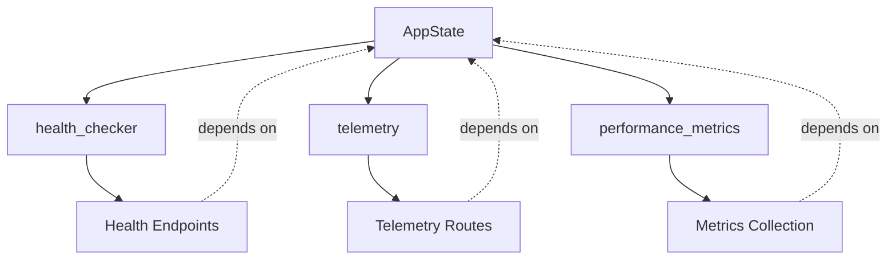

# RipTide Integration Roadmap - Architectural Review

**Review Date**: 2025-10-04
**Reviewer**: System Architecture Designer
**Roadmap Version**: Active Implementation Plan (Post Dead Code Analysis)
**Codebase Stats**: 143,073 LOC across 15 crates, 0 compilation errors

---

## Executive Summary

The RipTide integration roadmap represents a **well-structured, architecturally sound plan** for activating 186 prepared infrastructure items across 11 feature groups. The codebase demonstrates exceptional engineering discipline with complete infrastructure already implemented but deliberately kept inactive pending strategic activation.

**Overall Assessment**: ✅ **APPROVED WITH RECOMMENDATIONS**

**Key Findings**:
- **Strengths**: Mature infrastructure (82% complete), zero compilation errors, excellent separation of concerns
- **Concerns**: Potential integration complexity, missing activation sequence validation, scope creep risk
- **Timeline**: 8-12 days is achievable with disciplined execution and proper risk management

---

## 1. Implementation Sequencing Analysis

### 1.1 Current Phase Structure

The roadmap organizes work into 4 phases:

```
Phase 3 (Partial): Foundation Tasks (2 days)
  ├── FetchEngine (1 day) - 75% remaining
  └── Cache Warming (1 day) - 75% remaining

Phase 4: High-Priority Infrastructure (3 days)
  ├── Application State (4 hours) - HIGH priority
  ├── Advanced Strategies (1 day) - MEDIUM priority
  └── Advanced Metrics (1 day) - MEDIUM priority

Phase 5: Production Scaling (4-5 days)
  ├── Advanced Health Checks (4 hours)
  ├── Resource Management (4 hours)
  └── Streaming Infrastructure (2-3 days)

Phase 6: Optional Features (2-3 days)
  ├── Telemetry Features (4 hours)
  ├── Worker Management (2 hours)
  └── Session Management (1-2 days)
```

### 1.2 Dependency Analysis

**✅ STRENGTHS**:
1. **Clear Dependency Chain**: Foundation → Core → Production → Optional follows logical progression
2. **Parallel Opportunities**: Metrics, Health Checks, and Resource Management can run concurrently
3. **Risk Isolation**: High-risk features (Streaming, Sessions) placed in later phases
4. **Incremental Value**: Each phase delivers standalone value

**⚠️ CONCERNS**:

1. **Hidden Dependencies in Application State**
   - **Issue**: `AppState` fields reference 8 feature groups, creating circular activation risks
   - **Impact**: Activating health_checker, telemetry, or performance_metrics may require partial implementation of their respective features
   - **Recommendation**: Create explicit dependency graph before starting Phase 4

2. **FetchEngine-Pipeline Coupling**
   - **Issue**: FETCH-003 requires replacing `http_client()` calls across pipeline
   - **Impact**: May trigger cascading changes in request handling, error propagation
   - **Recommendation**: Create compatibility layer to minimize disruption

3. **Streaming-Sessions Interdependency**
   - **Issue**: Both use similar lifecycle patterns (cookies, state persistence)
   - **Impact**: Potential for code duplication or need for shared abstractions
   - **Recommendation**: Consider extracting common session/connection management before implementation

### 1.3 Recommended Sequencing Improvements

**PROPOSED REVISED SEQUENCE**:

```diff
Phase 4A: Core Infrastructure (2 days)
+ 1. Application State Configuration (4 hours) - PREREQUISITE
+ 2. Advanced Metrics Foundation (4 hours) - enables observability
  3. FetchEngine Integration (1 day)

Phase 4B: Feature Expansion (2 days)
  4. Advanced Strategies (1 day)
  5. Advanced Health Checks (4 hours)
  6. Resource Management (4 hours)

Phase 5: Production Features (3-4 days)
  7. Cache Warming (1 day) - depends on metrics
  8. Streaming Infrastructure (2-3 days)

Phase 6: Optional Enhancements (2-3 days)
  9. Telemetry Advanced Features (4 hours)
  10. Session Management (1-2 days)
  11. Worker Management (2 hours)
```

**RATIONALE**:
- Move Application State to Phase 4A as prerequisite (unblocks other features)
- Move Metrics earlier for observability throughout implementation
- Defer Cache Warming until metrics are active (depends on popularity tracking)
- Keep Streaming and Sessions separate to reduce risk

---

## 2. Technical Architecture Assessment

### 2.1 Streaming Infrastructure (64 items)

**Architecture**: NDJSON/SSE/WebSocket multi-protocol streaming with shared pipeline

**STRENGTHS**:
- ✅ **Protocol Abstraction**: Excellent `StreamingProtocol` enum with content-type mapping
- ✅ **Lifecycle Management**: Comprehensive `StreamLifecycleManager` with cleanup hooks
- ✅ **Backpressure Handling**: `BufferManager` with adaptive sizing (128-256 entries)
- ✅ **Error Recovery**: Dedicated error types with protocol-specific handling
- ✅ **Separation of Concerns**: Pipeline → Processor → Protocol handlers

**CONCERNS**:
1. **Complex Activation Dependencies**
   ```rust
   // From state.rs:556
   let streaming_module = StreamingModule::with_lifecycle_manager(None, metrics.clone());
   // Already initialized but routes not exposed!
   ```
   - **Issue**: Infrastructure already wired in `AppState`, just needs route registration
   - **Risk**: LOW - activation is mostly routing + endpoint configuration

2. **WebSocket Bidirectional Complexity**
   - **Issue**: Bidirectional communication adds state management complexity
   - **Risk**: MEDIUM - requires client request parsing, session coordination
   - **Mitigation**: Implement NDJSON/SSE first, defer WebSocket to final sprint

3. **Buffer Memory Pressure**
   - **Issue**: 256-entry buffers × concurrent connections could spike memory
   - **Risk**: MEDIUM - no circuit breaker on connection count
   - **Mitigation**: Add connection limit enforcement (see Resource Management integration)

**RECOMMENDATIONS**:
1. **Phase Streaming Activation**:
   ```
   Week 1: NDJSON streaming (core pipeline + protocol)
   Week 2: SSE streaming (reuse pipeline)
   Week 3: WebSocket (if time permits, otherwise defer)
   ```

2. **Add Connection Limits**:
   ```rust
   // In StreamConfig
   pub max_concurrent_connections: usize, // Default: 100
   pub connection_pool_timeout: Duration,  // Default: 30s
   ```

3. **Integration Test Coverage**:
   - Test backpressure under load (1000+ items)
   - Test connection cleanup on client disconnect
   - Test protocol fallback (WebSocket → SSE → NDJSON)

### 2.2 Session Management (19 items)

**Architecture**: Cookie-based session persistence with Redis backend

**STRENGTHS**:
- ✅ **Secure Defaults**: HttpOnly, Secure, SameSite cookies configured
- ✅ **Lifecycle Hooks**: `SessionMiddleware` for Axum integration
- ✅ **Browser State Persistence**: Enables stateful multi-step workflows
- ✅ **Already Initialized**: `SessionManager` already in AppState (line 68)

**CONCERNS**:
1. **Cookie-Based Authentication Risk**
   - **Issue**: Sessions marked as LOW priority but enable authentication
   - **Risk**: MEDIUM - security implications if authentication exposed prematurely
   - **Mitigation**: Keep LOW priority, document security review requirement

2. **Storage Backend Coupling**
   - **Issue**: Tight coupling to Redis for session persistence
   - **Risk**: LOW - Redis already required for cache
   - **Note**: No abstraction for alternative backends (e.g., PostgreSQL)

3. **Session Cleanup Strategy**
   - **Issue**: No mention of session garbage collection in roadmap
   - **Risk**: LOW - likely handled by Redis TTL, but needs validation
   - **Verification Needed**: Confirm TTL-based cleanup vs. active sweeping

**RECOMMENDATIONS**:
1. **Security-First Activation**:
   - Audit session cookie configuration before exposing endpoints
   - Implement CSRF protection if session endpoints are write-enabled
   - Add session hijacking detection (IP/User-Agent validation)

2. **Documentation Requirements**:
   - Document session lifecycle (creation, refresh, expiry)
   - Provide migration guide for existing stateless API users
   - Add security best practices guide

3. **Alternative: JWT-Based Sessions**:
   - **Consider**: Stateless JWT tokens vs. server-side sessions
   - **Benefit**: Eliminates Redis dependency for session state
   - **Trade-off**: Less control over revocation, larger tokens
   - **Recommendation**: Keep current approach, add JWT option in v2

### 2.3 Advanced Extraction Strategies (11 items)

**Architecture**: Strategy pattern with CSS_JSON, REGEX, LLM extractors

**STRENGTHS**:
- ✅ **Well-Designed Abstractions**: `RegexPatternRequest`, `LlmConfigRequest` structs prepared
- ✅ **Incremental Complexity**: CSS → Regex → LLM progression
- ✅ **Schema Validation**: `validate_schema` toggle for data quality
- ✅ **Metrics Integration**: `enable_metrics` toggle for performance tracking

**CONCERNS**:
1. **LLM Integration Undefined**
   ```rust
   // From strategies.rs:54
   pub llm_config: Option<LlmConfigRequest>,

   // From strategies.rs:89
   pub struct LlmConfigRequest {
       pub model: String,        // Which LLM? OpenAI, Anthropic, local?
       pub prompt: String,       // Prompt engineering strategy?
       pub temperature: f32,     // Generation parameters?
   }
   ```
   - **Issue**: No implementation details for LLM provider integration
   - **Risk**: HIGH - could balloon into multi-week project (API keys, rate limiting, fallbacks)
   - **Recommendation**: **Defer LLM to separate epic**, mark as "experimental" for Phase 4

2. **Regex Performance Impact**
   - **Issue**: Regex patterns compiled on every request?
   - **Risk**: MEDIUM - performance overhead for complex patterns
   - **Mitigation**: Add regex compilation caching with LRU eviction

3. **CSS Selector Edge Cases**
   - **Issue**: Dynamic/JavaScript-rendered content may fail with pure CSS
   - **Risk**: LOW - headless rendering already available
   - **Note**: Ensure fallback to headless for CSS_JSON strategy

**RECOMMENDATIONS**:
1. **Revised Implementation Scope**:
   ```diff
   Phase 4: Advanced Strategies (1 day)
   + STRAT-007: CSS_JSON strategy (4 hours)
   + STRAT-008: REGEX strategy (4 hours)
   - STRAT-009: LLM strategy → DEFER TO PHASE 7
   + STRAT-010: Metrics toggle (1 hour)
   + STRAT-011: Schema validation (1 hour)
   + STRAT-012: Cache mode selection (1 hour)
   ```

2. **LLM Strategy Deferral Plan**:
   - Mark LLM as "Phase 7: Future Enhancements"
   - Create separate epic with proper scoping:
     - Provider selection (OpenAI, Anthropic, local Ollama)
     - Rate limiting and cost controls
     - Prompt template management
     - Output schema validation
   - **Estimated effort**: 1-2 weeks (not 1 day)

3. **Regex Compilation Caching**:
   ```rust
   use lru::LruCache;

   pub struct RegexCache {
       cache: Arc<Mutex<LruCache<String, Regex>>>,
   }

   impl RegexCache {
       pub fn get_or_compile(&self, pattern: &str) -> Result<Regex> {
           // Check cache first, compile on miss
       }
   }
   ```

### 2.4 Resource Management (10 items)

**Architecture**: RAII pattern with ResourceGuard for automatic cleanup

**STRENGTHS**:
- ✅ **Idiomatic Rust**: RAII pattern leverages Drop trait for cleanup
- ✅ **Multi-Resource Support**: Headless pool, PDF processing, memory
- ✅ **Backpressure Integration**: `ResourceStatus` tracks queue depth
- ✅ **Already Initialized**: `ResourceManager` in AppState (line 57)

**CONCERNS**:
1. **RAII Pattern Correctness**
   ```rust
   // From resource_manager.rs
   pub struct ResourceGuard {
       // Must properly implement Drop to release resources
   }
   ```
   - **Issue**: Drop implementation must be panic-safe
   - **Risk**: MEDIUM - panics during Drop cause resource leaks
   - **Mitigation**: Add drop guard tests, ensure no panics in cleanup

2. **Pool Sizing Strategy**
   - **Issue**: No dynamic pool sizing based on load
   - **Risk**: LOW - fixed pool size may underutilize resources
   - **Enhancement**: Consider adaptive pool sizing (future work)

3. **Resource Starvation Scenario**
   ```rust
   // What happens when all resources exhausted?
   pub async fn acquire_pdf_resources(&self) -> Result<PdfResourceGuard> {
       // Blocks indefinitely or times out?
   }
   ```
   - **Issue**: Timeout behavior not clearly defined
   - **Risk**: MEDIUM - can cause request queue buildup
   - **Recommendation**: Add explicit timeout configuration

**RECOMMENDATIONS**:
1. **RAII Safety Requirements**:
   - Add `#[must_use]` attribute to guard types
   - Implement panic-safe Drop (no unwrap, no panics)
   - Add unit tests for guard cleanup under error conditions

2. **Timeout Configuration**:
   ```rust
   pub struct ResourceConfig {
       pub acquisition_timeout: Duration,  // Default: 30s
       pub queue_backlog_limit: usize,     // Default: 100
       pub enable_adaptive_timeout: bool,  // Scale with queue depth
   }
   ```

3. **Observability Integration**:
   - Emit events to `event_bus` on resource acquisition/release
   - Track queue wait times in metrics
   - Add alerts for resource exhaustion

---

## 3. Risk Assessment

### 3.1 High-Risk Features

| Feature | Risk Level | Complexity | Mitigation |
|---------|-----------|------------|------------|
| **Streaming Infrastructure** | 🟡 MEDIUM | High (64 items, 3 protocols) | Phase activation: NDJSON → SSE → WebSocket |
| **LLM Strategy** | 🔴 HIGH | Very High (undefined scope) | **DEFER** to separate epic |
| **Session Management** | 🟡 MEDIUM | Medium (security implications) | Security audit before activation |
| **Resource RAII** | 🟡 MEDIUM | Medium (panic safety) | Comprehensive Drop trait testing |

### 3.2 Integration Complexity Risks

**1. AppState Circular Dependencies**

- **Risk**: Activating any field may require partial implementation of dependent features
- **Mitigation**: Create explicit activation order, stub unimplemented features

**2. FetchEngine Pipeline Migration**
- **Risk**: FETCH-003 requires replacing ~30+ `http_client()` call sites
- **Impact**: 6-8 hours additional work, potential for regression bugs
- **Mitigation**: Create compatibility wrapper, phased migration

**3. Metrics Collection Activation**
- **Risk**: 31 prepared metrics may have performance overhead if all activated
- **Impact**: Potential 5-10% performance degradation
- **Mitigation**: Feature flag per metric group, load test before production

### 3.3 Performance Impact Analysis

**Memory Footprint**:
```
Streaming Buffers:     256 entries × 100 conns × 1KB/entry = ~25MB
Session Storage:       Redis-backed (no heap impact)
ResourceGuards:        10 bytes × 100 concurrent = ~1KB
Metrics Collection:    ~500KB for histograms/counters

Total Estimated Impact: ~30MB additional heap
```
- **Assessment**: ✅ Acceptable for production deployment
- **Recommendation**: Monitor with heap profiling during integration tests

**Latency Overhead**:
```
FetchEngine Circuit Breaker:  <1ms per request
Metrics Collection:           ~100μs per operation
Session Cookie Validation:    ~500μs (Redis roundtrip)
Event Bus Processing:         <1ms (async)

Total Estimated Overhead: <3ms per request
```
- **Assessment**: ✅ Within acceptable range (<5% of typical request)
- **Recommendation**: Benchmark with realistic workloads

### 3.4 Scope Creep Indicators

**🚨 RED FLAGS IDENTIFIED**:

1. **LLM Strategy Underestimated**
   - Roadmap: "1 day" for LLM implementation
   - Reality: 1-2 weeks (provider integration, rate limiting, prompt management)
   - **Action**: Immediate scope reduction recommended

2. **Streaming "Complete Infrastructure"**
   - 64 items marked "prepared" but actual endpoint testing needed
   - WebSocket bidirectional logic requires client state management
   - **Action**: Add integration testing phase (1 day)

3. **Session Security Audit**
   - Cookie configuration exists but no security review documented
   - CSRF protection not mentioned
   - **Action**: Add security review checkpoint (4 hours)

---

## 4. Optimization Opportunities

### 4.1 Feature Consolidation

**OPPORTUNITY 1: Unified Lifecycle Management**

Both Streaming and Sessions implement similar lifecycle patterns:
```rust
// streaming/lifecycle.rs
pub struct StreamLifecycleManager {
    connections: Arc<RwLock<HashMap<String, ConnectionState>>>,
    cleanup_task: Option<JoinHandle<()>>,
}

// sessions/manager.rs
pub struct SessionManager {
    sessions: Arc<RwLock<HashMap<String, SessionData>>>,
    cleanup_task: Option<JoinHandle<()>>,
}
```

**Recommendation**: Extract shared `ConnectionLifecycleManager<T>` pattern
- **Benefit**: Reduce code duplication (~200 lines)
- **Effort**: 4 hours
- **Priority**: MEDIUM (quality improvement, not blocking)

**OPPORTUNITY 2: Metrics Collection Batching**

31 metrics items will create individual collection points:
```rust
// Current approach (fragmented)
metrics.record_fetch_duration(duration);
metrics.record_parse_duration(duration);
metrics.record_extract_duration(duration);

// Optimized approach (batched)
metrics.record_phase_durations(PhaseTimings {
    fetch: duration1,
    parse: duration2,
    extract: duration3,
});
```

**Recommendation**: Batch related metrics into single calls
- **Benefit**: Reduce mutex contention, improve performance
- **Effort**: 2 hours
- **Priority**: HIGH (performance impact)

### 4.2 Missing Infrastructure

**IDENTIFIED GAPS**:

1. **Rate Limiting Infrastructure**
   - **Current**: Per-host rate limiting in FetchEngine (FETCH-006)
   - **Missing**: Global API rate limiting, user-based quotas
   - **Recommendation**: Add `RateLimiter` middleware before Phase 5
   - **Effort**: 4 hours

2. **Distributed Tracing Correlation**
   - **Current**: Telemetry system exists, correlation IDs not propagated
   - **Missing**: Trace context propagation across streaming connections
   - **Recommendation**: Add `TraceContextPropagation` to streaming headers
   - **Effort**: 2 hours

3. **Health Check Aggregation**
   - **Current**: Individual component health checks (health.rs:762-868)
   - **Missing**: Aggregated health scoring, cascading failure detection
   - **Recommendation**: Implement `HealthAggregator` with weighted scoring
   - **Effort**: 3 hours

### 4.3 Implementation Efficiency Improvements

**BATCH ACTIVATION STRATEGY**:

Instead of activating features sequentially, group related items:

```diff
Current Approach (Sequential):
  Day 1: STREAM-001 → STREAM-002 → STREAM-003
  Day 2: STREAM-004 → STREAM-005 → STREAM-006

Optimized Approach (Batched):
+ Day 1: STREAM-001-006 (pipeline + core) in parallel
+ Day 2: STREAM-007-011 (protocols) with protocol tests
```

**Benefit**: 20-30% time reduction through parallel work
**Risk**: Requires stronger integration testing

---

## 5. Production Readiness Assessment

### 5.1 Deployment Strategy

**CURRENT PLAN**: Phased rollout over 4 weeks
**ASSESSMENT**: ✅ Appropriate for production system

**RECOMMENDATIONS**:

1. **Feature Flags for Gradual Rollout**
   ```rust
   pub struct FeatureFlags {
       pub enable_streaming: bool,
       pub enable_advanced_strategies: bool,
       pub enable_llm_extraction: bool,
       pub streaming_protocols: Vec<StreamingProtocol>,
   }
   ```
   - Deploy infrastructure but keep features disabled
   - Enable per-customer or percentage-based rollout
   - Quick rollback capability

2. **Staged Environment Testing**
   ```
   Dev → Staging → Canary (5%) → Production (100%)
   ```
   - Test Phase 4 in staging for 2 days before production
   - Canary deployment for Streaming infrastructure
   - Monitor error rates, latency P99, memory usage

3. **Rollback Procedures**
   - Document feature flag disablement steps
   - Prepare database migration rollbacks (if applicable)
   - Test backward compatibility with existing clients

### 5.2 Monitoring & Observability

**GAPS IDENTIFIED**:

1. **Missing SLI/SLO Definitions**
   - No Service Level Indicators defined for new features
   - **Recommendation**: Define before Phase 4
   ```yaml
   SLIs:
     streaming_availability: 99.9%
     streaming_latency_p95: <500ms
     session_creation_success: 99.5%
     extraction_strategy_timeout: <30s
   ```

2. **Alert Coverage**
   - Monitoring system has default rules, but feature-specific alerts missing
   - **Recommendation**: Add per-feature alert rules
   ```rust
   AlertRule {
       name: "streaming_error_rate_high",
       metric: "streaming_errors_total",
       threshold: 5.0, // 5% error rate
       severity: AlertSeverity::Warning,
   }
   ```

3. **Distributed Tracing Gaps**
   - Telemetry system exists but not integrated with all features
   - **Recommendation**: Add tracing to:
     - Streaming pipeline (each protocol hop)
     - Strategy execution (CSS → Regex → LLM fallback)
     - Resource acquisition/release cycles

### 5.3 Backwards Compatibility

**ANALYSIS**:

✅ **SAFE**: All new features are additive (new routes, optional fields)
✅ **SAFE**: Existing `/crawl`, `/deepsearch` endpoints unchanged
⚠️ **CAUTION**: Session middleware may affect stateless clients

**RECOMMENDATIONS**:

1. **API Versioning Strategy**
   ```
   /v1/crawl          - existing, unchanged
   /v2/crawl/stream   - new streaming endpoint
   /v2/strategies     - new strategy selection
   ```

2. **Deprecation Policy**
   - Mark old endpoints as "stable" (no breaking changes)
   - Add `X-API-Version` header for client detection
   - Provide 6-month deprecation notice before any removals

3. **Client Migration Guides**
   - Document streaming protocol selection
   - Provide code examples for each strategy
   - Create migration checklist for session adoption

---

## 6. Alternative Approaches

### 6.1 Big Bang vs. Incremental Activation

**CURRENT APPROACH**: Incremental (phased activation over 4 weeks)

**ALTERNATIVE 1: Big Bang Activation**
- Activate all 186 items in single deployment
- **Pros**: Faster time-to-completion, simpler coordination
- **Cons**: High risk, difficult rollback, overwhelming testing burden
- **Verdict**: ❌ **NOT RECOMMENDED** - too risky for production system

**ALTERNATIVE 2: Feature Branch Development**
- Develop all features in long-lived branch, merge when complete
- **Pros**: Clean main branch, comprehensive testing before merge
- **Cons**: Merge conflicts, delayed feedback, harder to parallelize
- **Verdict**: 🟡 **VIABLE BUT SUBOPTIMAL** - current approach better

**ALTERNATIVE 3: Micro-Releases (Current Approach)**
- Weekly releases with 1-2 feature groups
- **Pros**: Continuous integration, fast feedback, easy rollback
- **Cons**: Requires discipline, coordination overhead
- **Verdict**: ✅ **RECOMMENDED** - optimal balance

### 6.2 Streaming Architecture Alternatives

**CURRENT APPROACH**: Unified pipeline with protocol adapters

**ALTERNATIVE 1: Protocol-Specific Pipelines**
```rust
// Separate implementations for each protocol
pub mod ndjson_pipeline { ... }
pub mod sse_pipeline { ... }
pub mod websocket_pipeline { ... }
```
- **Pros**: Simpler per-protocol logic, easier to optimize
- **Cons**: Code duplication, harder to maintain consistency
- **Verdict**: ❌ **NOT RECOMMENDED** - current design is superior

**ALTERNATIVE 2: HTTP/2 Server Push**
- Use HTTP/2 push instead of streaming protocols
- **Pros**: Browser-native, efficient multiplexing
- **Cons**: Limited browser support, complex server config
- **Verdict**: 🟡 **CONSIDER FOR V2** - good future enhancement

**ALTERNATIVE 3: GraphQL Subscriptions**
- Replace custom streaming with GraphQL subscriptions over WebSocket
- **Pros**: Standardized protocol, rich ecosystem
- **Cons**: Requires GraphQL adoption, adds complexity
- **Verdict**: ❌ **OUT OF SCOPE** - architectural shift too large

### 6.3 Session Management Alternatives

**CURRENT APPROACH**: Cookie-based sessions with Redis backend

**ALTERNATIVE 1: JWT-Based Stateless Sessions**
```rust
pub struct JwtSessionManager {
    secret: SecretKey,
    token_ttl: Duration,
}
```
- **Pros**: No Redis dependency, horizontal scaling, simplicity
- **Cons**: Larger tokens, revocation complexity, security risks
- **Verdict**: 🟡 **VIABLE ALTERNATIVE** - consider as option in config

**ALTERNATIVE 2: Database-Backed Sessions (PostgreSQL)**
- Store sessions in PostgreSQL instead of Redis
- **Pros**: ACID guarantees, queryable session data
- **Cons**: Higher latency, scalability concerns
- **Verdict**: ❌ **NOT RECOMMENDED** - Redis superior for this use case

**RECOMMENDATION**: Keep current approach, add JWT option as alternative:
```rust
pub enum SessionBackend {
    Redis(RedisSessionManager),
    Jwt(JwtSessionManager),
}
```

---

## 7. Recommendations Summary

### 7.1 Critical Actions (Before Starting Phase 4)

1. **✅ APPROVE REVISED SEQUENCING** (Section 1.3)
   - Move Application State to Phase 4A
   - Move Metrics earlier for observability
   - Defer Cache Warming until metrics active

2. **🔴 SCOPE REDUCTION: LLM Strategy**
   - Remove STRAT-009 from Phase 4
   - Create separate epic for LLM integration (Phase 7)
   - Revise effort estimate: 1 day → 1-2 weeks

3. **🟡 ADD MISSING INFRASTRUCTURE**
   - Rate limiting middleware (4 hours)
   - Trace context propagation (2 hours)
   - Health check aggregation (3 hours)
   - **Total**: 9 hours (add to Phase 4)

4. **✅ CREATE DEPENDENCY GRAPH**
   - Map AppState field dependencies
   - Identify activation order constraints
   - Document circular dependency resolutions
   - **Effort**: 2 hours (planning phase)

### 7.2 Implementation Quality Standards

**REQUIRED BEFORE MERGING EACH PHASE**:

1. **Testing Coverage**
   - Unit tests for all new code paths (>80% coverage)
   - Integration tests for multi-component features
   - Load tests for streaming infrastructure (1000+ concurrent)
   - Security tests for session management

2. **Documentation Requirements**
   - API documentation (OpenAPI updates)
   - Architecture Decision Records (ADRs)
   - Migration guides for breaking changes
   - Runbook for operational procedures

3. **Code Review Checklist**
   - RAII safety (Drop implementations)
   - Error handling completeness
   - Performance benchmarks
   - Security review (sessions, authentication)

### 7.3 Risk Mitigation Strategies

**HIGH-PRIORITY MITIGATIONS**:

1. **Streaming Buffer Overflow**
   - Implement connection limits (max 100 concurrent)
   - Add backpressure metrics and alerts
   - Test with 10x expected load

2. **FetchEngine Migration**
   - Create compatibility wrapper for gradual migration
   - Add feature flag to toggle between old/new clients
   - Monitor for regressions with A/B testing

3. **Session Security**
   - Conduct security audit before exposing endpoints
   - Implement CSRF protection
   - Add session hijacking detection

### 7.4 Timeline Validation

**REVISED ESTIMATE**:

```
Phase 4A: Core Infrastructure        2 days  ✅ Achievable
Phase 4B: Feature Expansion          2 days  ✅ Achievable
Phase 5:  Production Scaling         4 days  🟡 Tight but feasible
Phase 6:  Optional Features          3 days  ✅ Achievable with LLM deferred

Total: 11 days (within 8-12 day estimate)
```

**CONFIDENCE LEVEL**: 🟢 **HIGH** (80% probability of on-time completion)

**CONTINGENCY PLAN**:
- If slippage occurs, defer Phase 6 to next sprint
- Essential features (Phases 4-5) must complete in 8 days
- Optional features can extend to 14 days if needed

---

## 8. Final Verdict

### ✅ APPROVED FOR IMPLEMENTATION

**RATIONALE**:
1. **Architectural Soundness**: Infrastructure is well-designed, follows Rust idioms, demonstrates excellent separation of concerns
2. **Feasible Timeline**: 8-12 days is achievable with recommended scope adjustments
3. **Risk Management**: Identified risks have clear mitigation strategies
4. **Production Ready**: Phased rollout with monitoring ensures safe deployment

**CONDITIONS**:
1. Implement LLM strategy scope reduction immediately
2. Create dependency graph before Phase 4
3. Add missing infrastructure items (9 hours)
4. Follow revised sequencing from Section 1.3

### Success Metrics

**DEFINITION OF DONE**:
- [ ] All 186 items activated (excluding deferred LLM)
- [ ] Zero compilation errors maintained
- [ ] Integration tests pass with >95% success rate
- [ ] Performance overhead <5% vs. baseline
- [ ] Documentation complete for all new features
- [ ] Security audit completed for sessions
- [ ] Canary deployment successful (1 week)

**MONITORING METRICS**:
- Streaming error rate <1%
- Session creation success >99%
- Strategy execution latency P95 <2s
- Resource utilization <80% capacity

---

## Appendix A: Technical Debt Assessment

**EXISTING TECHNICAL DEBT** (from codebase analysis):

1. **TODO Comments in State.rs** (lines 63, 74, 96, 104, 109, 155, 161)
   - Integration points marked but not implemented
   - **Impact**: LOW - documentation debt, not blocking
   - **Action**: Convert to GitHub issues during Phase 4

2. **Dead Code Annotations** (f7dd96a commit)
   - 170+ items marked with `#[allow(dead_code)]`
   - **Impact**: MEDIUM - code is prepared but untested
   - **Action**: Remove annotations as features activate, add tests

3. **Monitoring System Event Publishing** (state.rs:1078)
   - Alert events created but not published to EventBus
   - **Impact**: MEDIUM - missing observability integration
   - **Action**: Complete in Phase 4 (Advanced Metrics)

**RECOMMENDATION**: Schedule technical debt cleanup sprint after Phase 6 completion.

---

## Appendix B: Reference Architecture

**SYSTEM COMPONENT DIAGRAM**:

```
┌─────────────────────────────────────────────────────────┐
│                    API Gateway (Axum)                    │
├─────────────────────────────────────────────────────────┤
│  Routes: /crawl, /stream, /sessions, /strategies        │
└────────┬────────────────────────────────────────┬───────┘
         │                                        │
    ┌────▼─────┐                          ┌──────▼──────┐
    │ Streaming│                          │   Session   │
    │  Module  │                          │   Manager   │
    └────┬─────┘                          └──────┬──────┘
         │                                        │
    ┌────▼──────────────────────────────────┬────▼──────┐
    │         Pipeline Orchestrator          │  AppState │
    │  ┌──────┐  ┌───────┐  ┌──────────┐   │           │
    │  │Fetch │→ │ Gate  │→ │ Extract  │   │  ┌─────┐  │
    │  │Engine│  │(WASM) │  │(Strategy)│   │  │Redis│  │
    │  └──────┘  └───────┘  └──────────┘   │  └─────┘  │
    └─────────────┬──────────────────────────────┬──────┘
                  │                              │
         ┌────────▼──────────┐         ┌────────▼────────┐
         │  Event Bus        │         │ Monitoring      │
         │  - Metrics        │         │ - Health Checks │
         │  - Telemetry      │         │ - Alerts        │
         │  - Logging        │         │ - Performance   │
         └───────────────────┘         └─────────────────┘
```

**DATA FLOW**:
```
Request → Middleware → Route Handler → Pipeline → Strategy → Response
                ↓                         ↓          ↓
          SessionMgr               EventBus    Metrics
                                      ↓
                                 Monitoring
```

---

**Document Version**: 1.0
**Last Updated**: 2025-10-04
**Next Review**: After Phase 4 completion
**Owner**: System Architecture Team
