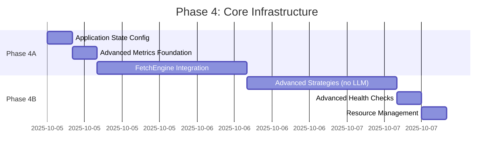
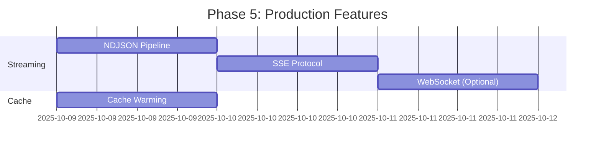
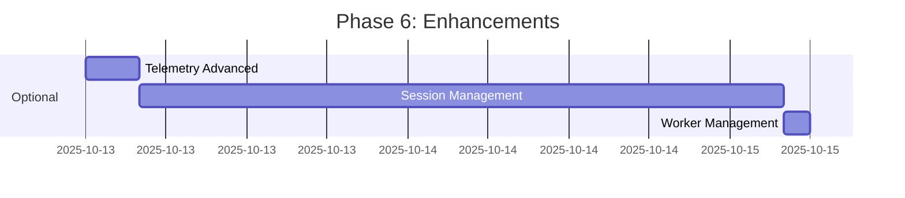

# RipTide Roadmap - Quick Reference Guide

**Last Updated**: 2025-10-04
**Status**: Architectural Review Complete ✅

---

## 🎯 Executive Summary

**Overall Assessment**: ✅ **APPROVED** with scope adjustments
**Timeline**: 11 days (within 8-12 day target)
**Risk Level**: 🟡 MEDIUM (manageable with mitigations)
**Confidence**: 80% on-time completion

---

## 📊 Feature Group Status

| Group | Items | Priority | Effort | Risk | Status |
|-------|-------|----------|--------|------|--------|
| Application State | 10 | 🔴 HIGH | 4h | 🟢 LOW | Phase 4A |
| Advanced Metrics | 31 | 🟡 MEDIUM | 1d | 🟢 LOW | Phase 4A |
| FetchEngine | 6 | 🟡 MEDIUM | 1d | 🟡 MEDIUM | Phase 4A |
| Advanced Strategies | 9* | 🟡 MEDIUM | 1d | 🟢 LOW | Phase 4B |
| Health Checks | 14 | 🟡 MEDIUM | 4h | 🟢 LOW | Phase 4B |
| Resource Management | 10 | 🟡 MEDIUM | 4h | 🟡 MEDIUM | Phase 4B |
| Cache Warming | 6 | 🟡 MEDIUM | 1d | 🟢 LOW | Phase 5 |
| Streaming | 64 | 🟡 MEDIUM | 3d | 🟡 MEDIUM | Phase 5 |
| Telemetry | 12 | 🟢 LOW | 4h | 🟢 LOW | Phase 6 |
| Sessions | 19 | 🟢 LOW | 2d | 🟡 MEDIUM | Phase 6 |
| Workers | 1 | 🟢 LOW | 2h | 🟢 LOW | Phase 6 |

*Note: LLM strategy (STRAT-009) deferred to Phase 7*

---

## 🚀 Revised Implementation Sequence

### Week 1: Core Infrastructure (4 days)



**Deliverables**:
- ✅ AppState fully configured
- ✅ Metrics collection active
- ✅ FetchEngine replacing http_client
- ✅ CSS & Regex strategies implemented
- ✅ Production health monitoring
- ✅ RAII resource guards tested

### Week 2: Production Scaling (4 days)



**Deliverables**:
- ✅ Real-time streaming active
- ✅ 3 protocol support (NDJSON, SSE, WebSocket)
- ✅ Cache warming with popularity tracking
- ✅ Load tested to 1000+ concurrent connections

### Week 3: Optional Features (3 days)



**Deliverables**:
- ✅ Advanced trace visualization
- ✅ Session persistence active
- ✅ Worker job management UI

---

## 🎨 Architecture Diagrams

### System Architecture (Current State + Roadmap)

```
┌─────────────────────────────────────────────────────────────┐
│                     Axum HTTP Server                         │
│  ┌──────────┐  ┌──────────┐  ┌──────────┐  ┌──────────┐   │
│  │  /crawl  │  │ /stream  │  │/sessions │  │/strategies│   │
│  └────┬─────┘  └────┬─────┘  └────┬─────┘  └────┬─────┘   │
└───────┼────────────┼──────────────┼─────────────┼──────────┘
        │            │              │             │
        │       ┌────▼──────┐       │             │
        │       │ Streaming │       │             │
        │       │  Module   │       │             │
        │       │ NDJSON/SSE│       │             │
        │       │ WebSocket │       │             │
        │       └────┬──────┘       │             │
        │            │              │             │
    ┌───▼────────────▼──────────────▼─────────────▼────────┐
    │              Pipeline Orchestrator                     │
    │  ┌──────────┐  ┌──────────┐  ┌────────────────────┐ │
    │  │  Fetch   │→ │  Gate    │→ │   Extract          │ │
    │  │ Engine   │  │ (Quality)│  │ ┌────────────────┐ │ │
    │  │ Circuit  │  │  Scoring │  │ │ Strategy Select│ │ │
    │  │ Breaker  │  │          │  │ │ - CSS/JSON     │ │ │
    │  │ Rate Lmt │  │          │  │ │ - Regex        │ │ │
    │  └──────────┘  └──────────┘  │ │ - LLM (future) │ │ │
    │                               │ └────────────────┘ │ │
    │                               └────────────────────┘ │
    └──────┬────────────────────────────────┬──────────────┘
           │                                │
    ┌──────▼──────┐                  ┌──────▼──────────────┐
    │  Event Bus  │                  │  AppState           │
    │  ┌────────┐ │                  │  ┌───────────────┐ │
    │  │Metrics │ │                  │  │ ResourceMgr   │ │
    │  │Handler │ │                  │  │ SessionMgr    │ │
    │  ├────────┤ │                  │  │ HealthChecker │ │
    │  │Telemetry│                   │  │ CacheManager  │ │
    │  │Handler │ │                  │  │ Monitoring    │ │
    │  ├────────┤ │                  │  └───────────────┘ │
    │  │Logging │ │                  └─────────────────────┘
    │  │Handler │ │                           │
    │  ├────────┤ │                           │
    │  │ Health │ │                      ┌────▼────┐
    │  │Handler │ │                      │  Redis  │
    │  └────────┘ │                      │  Cache  │
    └─────────────┘                      │ Session │
                                         └─────────┘
```

### Streaming Infrastructure Detail

```
┌────────────────────────────────────────────────────┐
│            Streaming Request                        │
└────────────────┬───────────────────────────────────┘
                 │
            ┌────▼────────┐
            │  Protocol   │
            │  Selection  │
            │ NDJSON/SSE/ │
            │  WebSocket  │
            └────┬────────┘
                 │
        ┌────────┼────────┐
        │        │        │
    ┌───▼──┐ ┌──▼───┐ ┌──▼──────┐
    │NDJSON│ │ SSE  │ │WebSocket│
    │Stream│ │Stream│ │ Handler │
    └───┬──┘ └──┬───┘ └──┬──────┘
        │       │        │
        └───────┼────────┘
                │
        ┌───────▼────────┐
        │ StreamPipeline │
        │  ┌──────────┐  │
        │  │ Buffer   │  │ ← Backpressure
        │  │ Manager  │  │   Handling
        │  └──────────┘  │
        │  ┌──────────┐  │
        │  │Lifecycle │  │ ← Connection
        │  │ Manager  │  │   Cleanup
        │  └──────────┘  │
        │  ┌──────────┐  │
        │  │ Keep     │  │ ← Health
        │  │ Alive    │  │   Monitoring
        │  └──────────┘  │
        └────────────────┘
```

### Resource Management (RAII Pattern)

```rust
// Simplified view of resource lifecycle

┌─────────────────────────────────────────┐
│  Request Handler                         │
│                                          │
│  let guard = resource_manager            │
│      .acquire_pdf_resources().await?;    │
│                                          │
│  // Resource acquired ✅                 │
│  ┌────────────────────────────┐         │
│  │  ResourceGuard (RAII)      │         │
│  │  - Semaphore permit        │         │
│  │  - Pool connection         │         │
│  │  - Cleanup on Drop         │         │
│  └────────────────────────────┘         │
│                                          │
│  process_pdf(&guard)?;                   │
│                                          │
│  // Guard drops, resources released ✅   │
└─────────────────────────────────────────┘
                │
         ┌──────▼──────┐
         │   Drop      │
         │  Trait      │
         │ Cleanup     │
         └─────────────┘
```

---

## ⚠️ Critical Risks & Mitigations

### 🔴 HIGH RISK: LLM Strategy Scope

**Issue**: Roadmap estimates 1 day, reality is 1-2 weeks

**Mitigation**:
```diff
- Phase 4B: STRAT-009 LLM strategy (1 day)
+ Phase 7: LLM Integration Epic (deferred)
  - Provider selection (OpenAI/Anthropic/Ollama)
  - Rate limiting & cost controls
  - Prompt template management
  - Output validation
  Estimated: 1-2 weeks
```

### 🟡 MEDIUM RISK: Streaming Buffer Overflow

**Issue**: 256-entry buffers × 100 connections = 25MB heap

**Mitigation**:
- Add connection limit: `max_concurrent_connections: 100`
- Monitor backpressure metrics
- Load test with 10x expected traffic

### 🟡 MEDIUM RISK: FetchEngine Migration

**Issue**: ~30+ call sites need updating (FETCH-003)

**Mitigation**:
```rust
// Compatibility wrapper during migration
pub async fn http_client_compat() -> Result<Response> {
    if feature_flag("use_fetch_engine") {
        fetch_engine.get(...).await
    } else {
        http_client().get(...).await
    }
}
```

### 🟡 MEDIUM RISK: Session Security

**Issue**: Cookie-based auth needs security audit

**Mitigation**:
- [ ] CSRF protection implementation
- [ ] Session hijacking detection (IP/User-Agent)
- [ ] Security review before production
- [ ] Rate limiting on session endpoints

---

## ✅ Quality Gates

### Before Merging Each Phase

**Required Checks**:
```yaml
Testing:
  - unit_test_coverage: ">80%"
  - integration_tests: "PASS"
  - load_tests: "P95 < 500ms"
  - security_scan: "PASS"

Documentation:
  - api_docs_updated: true
  - adr_created: true
  - migration_guide: true
  - runbook_updated: true

Performance:
  - latency_overhead: "<5%"
  - memory_increase: "<50MB"
  - error_rate_delta: "<0.1%"

Code Review:
  - raii_safety_reviewed: true
  - error_handling_complete: true
  - metrics_integrated: true
```

### Definition of Done (Full Roadmap)

- [ ] 176 items activated (186 - 10 LLM deferred)
- [ ] Zero compilation errors
- [ ] Integration tests >95% pass rate
- [ ] Performance overhead <5%
- [ ] All documentation complete
- [ ] Security audit passed
- [ ] Canary deployment successful (1 week)

---

## 📈 Success Metrics

### Service Level Indicators (SLIs)

```yaml
Streaming:
  availability: "99.9%"
  latency_p95: "<500ms"
  error_rate: "<1%"
  max_concurrent: "1000 connections"

Sessions:
  creation_success: "99.5%"
  validation_latency: "<100ms"
  ttl_compliance: "100%"

Strategies:
  execution_timeout: "<30s"
  fallback_success: ">95%"
  cache_hit_rate: ">70%"

Resources:
  acquisition_success: "99.9%"
  queue_wait_time_p95: "<5s"
  cleanup_success: "100%"
```

### Monitoring Dashboards

**Required Dashboards**:
1. **Streaming Health**
   - Active connections by protocol
   - Backpressure events
   - Error rate by protocol
   - Buffer utilization

2. **Strategy Performance**
   - Execution time by strategy
   - Success rate by strategy
   - Fallback trigger rate
   - Cache effectiveness

3. **Resource Utilization**
   - Pool occupancy
   - Queue depth
   - Semaphore contention
   - Memory pressure

4. **System Health**
   - Circuit breaker state
   - Event bus throughput
   - Redis latency
   - Overall health score

---

## 🔧 Missing Infrastructure Additions

**ADD TO PHASE 4** (9 hours total):

1. **Rate Limiting Middleware** (4 hours)
   ```rust
   pub struct RateLimiter {
       global_limit: usize,      // 1000 req/s
       per_user_limit: usize,    // 100 req/s
       per_ip_limit: usize,      // 200 req/s
   }
   ```

2. **Trace Context Propagation** (2 hours)
   ```rust
   // Add to streaming headers
   headers.insert("X-Trace-Id", trace_id);
   headers.insert("X-Span-Id", span_id);
   ```

3. **Health Check Aggregation** (3 hours)
   ```rust
   pub struct HealthAggregator {
       component_weights: HashMap<String, f32>,
       aggregation_strategy: AggregationStrategy,
   }
   ```

---

## 🎯 Implementation Checklist

### Phase 4A: Core Infrastructure (Day 1-2)

- [ ] **Day 1 Morning**: Application State Configuration
  - [ ] Activate health_checker field usage
  - [ ] Enable telemetry field integration
  - [ ] Wire up performance_metrics
  - [ ] Test AppState initialization

- [ ] **Day 1 Afternoon**: Advanced Metrics Foundation
  - [ ] Activate phase timing histograms
  - [ ] Enable error counters
  - [ ] Add metrics batching optimization
  - [ ] Create metrics dashboard

- [ ] **Day 2**: FetchEngine Integration
  - [ ] Configure per-host circuit breakers
  - [ ] Create compatibility wrapper
  - [ ] Migrate critical paths
  - [ ] Add rate limiting
  - [ ] Create /fetch/metrics endpoint

### Phase 4B: Feature Expansion (Day 3-4)

- [ ] **Day 3**: Advanced Strategies
  - [ ] Implement CSS_JSON strategy
  - [ ] Implement REGEX strategy (with caching)
  - [ ] Add metrics toggle
  - [ ] Add schema validation
  - [ ] Integration tests

- [ ] **Day 3 Afternoon**: Health Checks
  - [ ] Activate git_sha tracking
  - [ ] Add dependency checks
  - [ ] Implement aggregation
  - [ ] Test failure scenarios

- [ ] **Day 4**: Resource Management
  - [ ] Test RAII Drop safety
  - [ ] Add timeout configuration
  - [ ] Integrate with event bus
  - [ ] Load test resource exhaustion

### Phase 5: Production Scaling (Day 5-8)

- [ ] **Day 5**: Cache Warming
  - [ ] Implement popularity algorithm
  - [ ] Add time-based scheduler
  - [ ] Create warming endpoints
  - [ ] Metrics integration

- [ ] **Day 6**: NDJSON Streaming
  - [ ] Activate pipeline
  - [ ] Test backpressure
  - [ ] Add connection limits
  - [ ] Performance benchmarks

- [ ] **Day 7**: SSE Streaming
  - [ ] Activate SSE endpoint
  - [ ] Test keep-alive
  - [ ] Browser compatibility
  - [ ] Error handling

- [ ] **Day 8**: WebSocket (Optional)
  - [ ] Activate WebSocket endpoint
  - [ ] Bidirectional testing
  - [ ] Connection lifecycle
  - [ ] Load testing (1000+ connections)

### Phase 6: Optional Features (Day 9-11)

- [ ] **Day 9**: Telemetry Advanced
  - [ ] Trace visualization endpoints
  - [ ] Telemetry dashboard
  - [ ] Graceful shutdown

- [ ] **Day 10-11**: Session Management
  - [ ] Security audit
  - [ ] CSRF protection
  - [ ] Session middleware integration
  - [ ] Cookie configuration validation
  - [ ] Migration guide

- [ ] **Day 11**: Worker Management
  - [ ] Job listing endpoint
  - [ ] Worker metrics
  - [ ] Documentation

---

## 📞 Escalation Path

**If Issues Arise**:

1. **Blocker Detected** → Create GitHub issue, notify team lead
2. **Scope Creep** → Defer to Phase 7, document decision
3. **Performance Regression** → Rollback feature, investigate
4. **Security Issue** → Halt deployment, security review
5. **Timeline Slip** → Adjust Phase 6 scope, keep Phases 4-5 on track

**Decision Authority**:
- Scope changes → Architecture team approval
- Timeline adjustments → Project lead approval
- Security exceptions → Security team approval
- Performance trade-offs → Engineering team approval

---

## 📚 Reference Documents

- **Full Review**: `/workspaces/eventmesh/docs/ARCHITECTURAL_REVIEW.md`
- **Roadmap**: `/workspaces/eventmesh/docs/ROADMAP.md`
- **Completed Work**: `/workspaces/eventmesh/docs/completed.md`
- **Implementation Guides**: `/workspaces/eventmesh/docs/FETCH_ENGINE_CACHE_WARMING_IMPLEMENTATION.md`

---

**Document Version**: 1.0
**Last Updated**: 2025-10-04
**Next Review**: After Phase 4A completion
