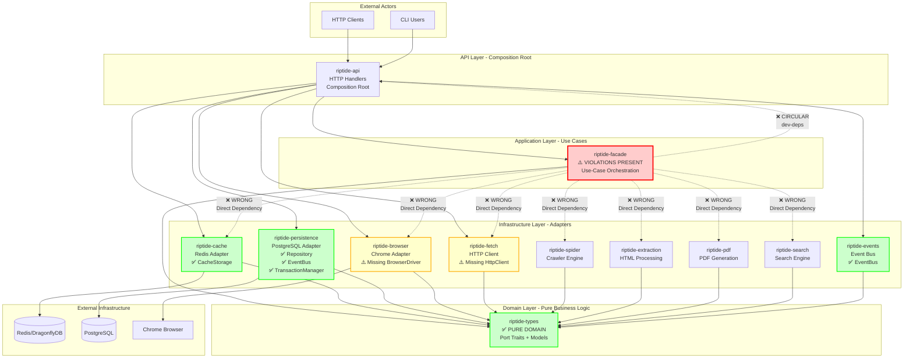
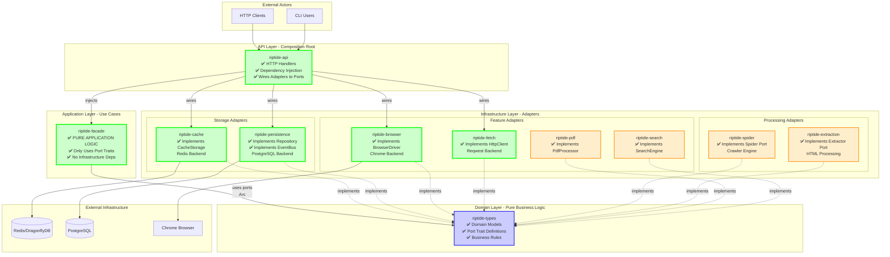
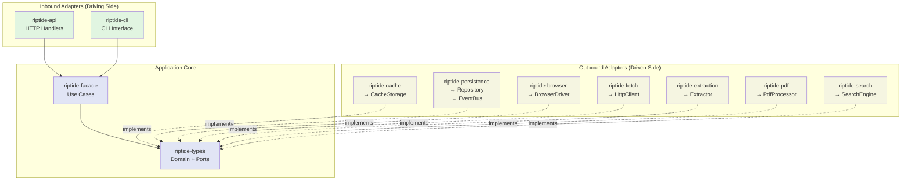
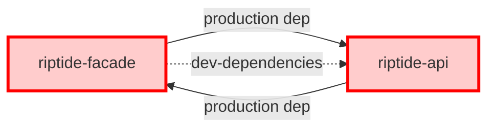
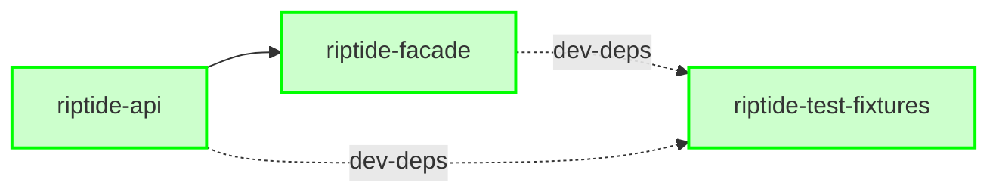

# Hexagonal Architecture Diagrams - Riptide

## 1. Current Architecture (With Violations)



## 2. Ideal Target Architecture



## 3. Port and Adapter Pattern Detail

```mermaid
graph LR
    subgraph "Application Layer (riptide-facade)"
        UC[Use Case:<br/>ExtractionFacade]
    end

    subgraph "Domain Layer (riptide-types)"
        PORT[Port Trait:<br/>trait HttpClient]
    end

    subgraph "Infrastructure (riptide-fetch)"
        ADAPTER[Adapter:<br/>ReqwestAdapter]
        REQWEST[reqwest::Client]
    end

    subgraph "Composition Root (riptide-api)"
        DI[ApplicationContext]
    end

    %% Use case uses port
    UC -->|depends on<br/>Arc<dyn HttpClient>| PORT

    %% Adapter implements port
    ADAPTER -.->|implements| PORT
    ADAPTER --> REQWEST

    %% DI wires adapter to use case
    DI -->|injects<br/>Arc::new(ReqwestAdapter)| UC

    classDef app fill:#e1f5e1
    classDef domain fill:#e1e5f5
    classDef infra fill:#f5e1e1

    class UC app
    class PORT domain
    class ADAPTER,REQWEST infra
```

## 4. Layer Dependencies - Current vs Ideal

### Current State (Violations)

```
┌─────────────────────────────────────────┐
│         riptide-facade                  │
│         (Application Layer)             │
│                                         │
│  Depends on:                            │
│  ❌ riptide-cache                       │
│  ❌ riptide-browser                     │
│  ❌ riptide-fetch                       │
│  ❌ riptide-spider                      │
│  ❌ riptide-extraction                  │
│  ❌ riptide-pdf                         │
│  ❌ riptide-search                      │
│  ❌ riptide-stealth                     │
│  ❌ riptide-monitoring                  │
│  ❌ riptide-reliability                 │
│  ❌ riptide-intelligence                │
│  ❌ riptide-headless                    │
│  ❌ riptide-workers                     │
│  ✅ riptide-types (CORRECT)             │
│                                         │
│  Total: 13 infrastructure dependencies  │
│  ⚠️ ARCHITECTURAL DEBT                  │
└─────────────────────────────────────────┘
```

### Target State (Compliant)

```
┌─────────────────────────────────────────┐
│         riptide-facade                  │
│         (Application Layer)             │
│                                         │
│  Depends on:                            │
│  ✅ riptide-types ONLY                  │
│                                         │
│  All infrastructure via:                │
│  • Arc<dyn CacheStorage>                │
│  • Arc<dyn BrowserDriver>               │
│  • Arc<dyn HttpClient>                  │
│  • Arc<dyn Repository<T>>               │
│  • Arc<dyn EventBus>                    │
│  • Arc<dyn PdfProcessor>                │
│  • Arc<dyn SearchEngine>                │
│                                         │
│  Dependencies: 1 (domain only)          │
│  ✅ ARCHITECTURALLY PURE                │
└─────────────────────────────────────────┘
```

## 5. Facade Dependency Injection Pattern

### Before (Violation)

```rust
// ❌ WRONG: Concrete infrastructure types
pub struct ExtractionFacade {
    http_client: Arc<reqwest::Client>,          // ❌ Concrete
    cache: Arc<RedisStorage>,                   // ❌ Concrete
    browser: Arc<BrowserPool>,                  // ❌ Concrete
}

impl ExtractionFacade {
    pub fn new(
        http_client: Arc<reqwest::Client>,      // ❌ Violates DIP
        cache: Arc<RedisStorage>,               // ❌ Violates DIP
        browser: Arc<BrowserPool>,              // ❌ Violates DIP
    ) -> Self {
        Self { http_client, cache, browser }
    }

    pub async fn extract(&self, url: &str) -> Result<Data> {
        // Uses concrete types - tightly coupled to infrastructure
        let response = self.http_client.get(url).send().await?;
        // ...
    }
}
```

### After (Compliant)

```rust
// ✅ CORRECT: Port trait abstractions
use riptide_types::ports::{HttpClient, CacheStorage, BrowserDriver};

pub struct ExtractionFacade {
    http_client: Arc<dyn HttpClient>,           // ✅ Port trait
    cache: Arc<dyn CacheStorage>,               // ✅ Port trait
    browser: Arc<dyn BrowserDriver>,            // ✅ Port trait
}

impl ExtractionFacade {
    pub fn new(
        http_client: Arc<dyn HttpClient>,       // ✅ Follows DIP
        cache: Arc<dyn CacheStorage>,           // ✅ Follows DIP
        browser: Arc<dyn BrowserDriver>,        // ✅ Follows DIP
    ) -> Self {
        Self { http_client, cache, browser }
    }

    pub async fn extract(&self, url: &str) -> Result<Data> {
        // Uses port traits - decoupled from infrastructure
        let response = self.http_client.get(url).await?;
        // ...
    }
}
```

### Composition Root Wiring

```rust
// crates/riptide-api/src/composition/mod.rs

impl ApplicationContext {
    pub async fn new(config: &DiConfig) -> Result<Self> {
        // ✅ Wire concrete adapters to ports
        let http_client: Arc<dyn HttpClient> = Arc::new(
            ReqwestAdapter::new(config.http)?
        );

        let cache: Arc<dyn CacheStorage> = Arc::new(
            RedisStorage::new(config.redis).await?
        );

        let browser: Arc<dyn BrowserDriver> = Arc::new(
            ChromeBrowserAdapter::new(config.browser)?
        );

        // ✅ Inject ports into facade
        let extraction_facade = ExtractionFacade::new(
            http_client,
            cache,
            browser,
        );

        Ok(Self {
            extraction_facade,
            // ...
        })
    }

    pub fn for_testing() -> Self {
        // ✅ Inject test doubles
        let http_client: Arc<dyn HttpClient> = Arc::new(
            MockHttpClient::new()
        );

        let cache: Arc<dyn CacheStorage> = Arc::new(
            InMemoryCache::new()
        );

        let browser: Arc<dyn BrowserDriver> = Arc::new(
            MockBrowserDriver::new()
        );

        let extraction_facade = ExtractionFacade::new(
            http_client,
            cache,
            browser,
        );

        Self {
            extraction_facade,
            // ...
        }
    }
}
```

## 6. Testing Benefits of Port-Based Design

```mermaid
graph TB
    subgraph "Production Environment"
        PROD_FACADE[ExtractionFacade]
        PROD_HTTP[ReqwestAdapter<br/>implements HttpClient]
        PROD_CACHE[RedisStorage<br/>implements CacheStorage]
        PROD_BROWSER[ChromeBrowserAdapter<br/>implements BrowserDriver]

        PROD_FACADE --> PROD_HTTP
        PROD_FACADE --> PROD_CACHE
        PROD_FACADE --> PROD_BROWSER

        PROD_HTTP --> REQWEST[reqwest::Client]
        PROD_CACHE --> REDIS[(Redis)]
        PROD_BROWSER --> CHROME[Chrome]
    end

    subgraph "Test Environment"
        TEST_FACADE[ExtractionFacade<br/>Same Code!]
        TEST_HTTP[MockHttpClient<br/>implements HttpClient]
        TEST_CACHE[InMemoryCache<br/>implements CacheStorage]
        TEST_BROWSER[MockBrowserDriver<br/>implements BrowserDriver]

        TEST_FACADE --> TEST_HTTP
        TEST_FACADE --> TEST_CACHE
        TEST_FACADE --> TEST_BROWSER

        TEST_HTTP --> MEMORY1[In-Memory<br/>Responses]
        TEST_CACHE --> MEMORY2[HashMap]
        TEST_BROWSER --> MEMORY3[Mock<br/>Browser]
    end

    subgraph "Port Trait Definition (riptide-types)"
        PORT_HTTP[trait HttpClient]
        PORT_CACHE[trait CacheStorage]
        PORT_BROWSER[trait BrowserDriver]
    end

    PROD_HTTP -.implements.-> PORT_HTTP
    PROD_CACHE -.implements.-> PORT_CACHE
    PROD_BROWSER -.implements.-> PORT_BROWSER

    TEST_HTTP -.implements.-> PORT_HTTP
    TEST_CACHE -.implements.-> PORT_CACHE
    TEST_BROWSER -.implements.-> PORT_BROWSER

    classDef prod fill:#ffe6e6
    classDef test fill:#e6ffe6
    classDef port fill:#e6e6ff

    class PROD_FACADE,PROD_HTTP,PROD_CACHE,PROD_BROWSER prod
    class TEST_FACADE,TEST_HTTP,TEST_CACHE,TEST_BROWSER test
    class PORT_HTTP,PORT_CACHE,PORT_BROWSER port
```



**Benefits**:
- ✅ Same facade code runs in both production and tests
- ✅ Fast, deterministic tests with no external dependencies
- ✅ Easy to simulate error conditions
- ✅ No Docker containers required for unit tests
- ✅ Parallel test execution without conflicts

## 7. Crate Dependency Flow (Should Be)



**Key Principle**: Dependencies point **inward** toward the domain.

- Inbound adapters (API, CLI) → depend on → Application (facade)
- Application (facade) → depends on → Domain (types)
- Outbound adapters (cache, persistence, etc.) → implement → Domain ports

**NO adapter should depend on another adapter** (prevents coupling).

## 8. Circular Dependency Problem

### Current Issue



**Problem**: This creates a circular dependency that:
- Prevents parallel compilation
- Makes testing difficult
- Violates architectural boundaries
- Causes tight coupling

### Solution



**Solution**: Extract test utilities to shared `riptide-test-fixtures` crate.

---

## Legend

```
✅ = Compliant with hexagonal architecture
❌ = Violates hexagonal architecture
⚠️ = Partially compliant / needs improvement

Solid arrows (→) = Production dependencies
Dotted arrows (-..->) = Implements interface / dev dependencies
```

---

**End of Architecture Diagrams**
