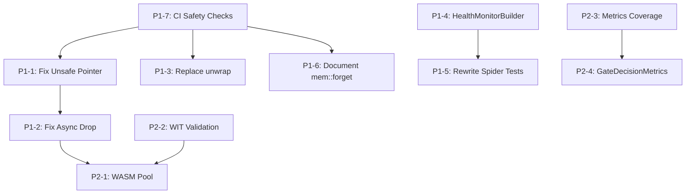

# Priority Implementation Plan - Remaining P1/P2 Items
**Analyst Agent Report**
**Date:** 2025-10-14
**Session:** swarm-hive-mind-analysis
**Status:** Complete Analysis of Remaining Critical Work

---

## Executive Summary

**Total Remaining Items:** 11 (7 P1, 4 P2)
**Estimated Total Effort:** 8-12 days
**Blockers:** 2 critical items block production deployment
**Dependencies:** 3 items have cross-dependencies

### Priority Breakdown
- 🔴 **P1 (Critical):** 7 items - BLOCKS PRODUCTION (5-7 days)
- 🟡 **P2 (Important):** 4 items - IMPACTS QUALITY (3-5 days)

---

## 🔴 P1 CRITICAL ITEMS (Blocks Production)

### P1-1: Fix Unsafe Pointer Read in Memory Manager ⚠️ SECURITY RISK
**Status:** NOT STARTED
**Priority:** P1 (CRITICAL - Memory Safety)
**Effort:** 4-6 hours
**Blocker:** Yes - Could cause crashes/security vulnerabilities

**Location:**
- File: `/workspaces/eventmesh/crates/riptide-core/src/memory_manager.rs:666`

**Issue:**
```rust
// ❌ UNSAFE: Creating Arc from raw pointer read
manager: Arc::downgrade(&Arc::new(unsafe {
    std::ptr::read(manager as *const MemoryManager)
})),
```

**Risk:** Use-after-free, double-free, memory corruption, security vulnerabilities

**Solution Approach:**
```rust
// ✅ Option 1: Pass Arc directly (RECOMMENDED)
fn new(manager: &Arc<MemoryManager>) -> Self {
    Self {
        manager: Arc::downgrade(manager),
    }
}

// ✅ Option 2: Use proper ownership
fn new(manager: Arc<MemoryManager>) -> (Arc<MemoryManager>, Self) {
    let weak = Arc::downgrade(&manager);
    (manager, Self { manager: weak })
}
```

**Implementation Steps:**
1. Analyze all callers of `WasmInstanceHandle::new()`
2. Refactor to pass `&Arc<MemoryManager>` instead of raw pointer
3. Update all instantiation sites
4. Add test to verify no memory leaks
5. Run valgrind/miri to verify memory safety
6. Document why the change was necessary

**Testing:**
- Unit test: Memory safety with miri
- Integration test: Multiple instance creation/destruction
- Load test: 1000 instances under stress

**Files to Modify:**
- `crates/riptide-core/src/memory_manager.rs`
- All files calling `WasmInstanceHandle::new()`

---

### P1-2: Fix Async Drop Patterns - Memory Leak Risk
**Status:** NOT STARTED
**Priority:** P1 (CRITICAL - Resource Leaks)
**Effort:** 6-8 hours
**Blocker:** Yes - Causes resource leaks in production

**Locations:**
- `crates/riptide-core/src/memory_manager.rs:698-710`
- `crates/riptide-headless/src/pool.rs:902`

**Issue:**
```rust
impl Drop for WasmInstanceHandle {
    fn drop(&mut self) {
        // ❌ RISK: Spawned task may not complete cleanup
        tokio::spawn(async move {
            if let Some(manager) = manager.upgrade() {
                if let Err(e) = manager.return_instance(&instance_id).await {
                    error!("Failed to return instance during drop: {}", e);
                }
            }
        });
    }
}
```

**Risk:** Uncompleted cleanup, resource leaks, memory bloat, unclosed connections

**Solution Approach:**
```rust
// ✅ Explicit cleanup with timeout
pub async fn cleanup(self) -> Result<()> {
    tokio::time::timeout(
        Duration::from_secs(5),
        self.manager.return_instance(&self.instance_id)
    ).await??;
    Ok(())
}

// Drop as fallback only with warning
impl Drop for WasmInstanceHandle {
    fn drop(&mut self) {
        tracing::warn!(
            instance_id = %self.instance_id,
            "WasmInstanceHandle dropped without explicit cleanup - resource leak possible"
        );
        // Best-effort cleanup (non-blocking)
    }
}
```

**Implementation Steps:**
1. Add `async fn cleanup()` methods to both `WasmInstanceHandle` and `PooledBrowser`
2. Update all usage sites to call `cleanup().await` before drop
3. Modify Drop impl to warn and do best-effort only
4. Add metrics for dropped-without-cleanup incidents
5. Create documentation explaining the pattern
6. Add integration tests verifying cleanup completion

**Testing:**
- Test explicit cleanup path
- Test Drop fallback path with warnings
- Test timeout behavior
- Load test: Verify no leaks under stress

**Files to Modify:**
- `crates/riptide-core/src/memory_manager.rs`
- `crates/riptide-headless/src/pool.rs`
- All files using these types
- Add documentation to CONTRIBUTING.md

---

### P1-3: Replace Production unwrap/expect Calls
**Status:** PARTIAL (tests acceptable, production needs fixing)
**Priority:** P1 (CRITICAL - Panic Risk)
**Effort:** 8-10 hours
**Blocker:** Yes - Can crash production service

**Statistics:**
- Total unwrap(): ~50 occurrences
- Total expect(): ~30 occurrences
- **In production code:** ~15 need fixing

**Solution Approach:**
```rust
// ❌ Before: Can panic
let value = map.get(&key).unwrap();

// ✅ After: Proper error handling
let value = map.get(&key)
    .ok_or_else(|| RipTideError::Validation(
        format!("Key not found: {}", key)
    ))?;

// OR use pattern matching
let value = match map.get(&key) {
    Some(v) => v,
    None => {
        tracing::warn!("Key not found: {}, using default", key);
        return default_value;
    }
};
```

**Implementation Steps:**
1. Audit all production code for unwrap/expect
2. Categorize by severity:
   - Critical path: Must fix (API handlers, WASM execution)
   - Error path: Lower priority (already in error handling)
3. Replace with proper Result/Option handling
4. Add error context with anyhow or thiserror
5. Enable clippy lints to prevent future occurrences
6. Update CI to fail on unwrap in production code

**Clippy Configuration:**
```toml
# Add to Cargo.toml
[workspace.lints.rust]
clippy::unwrap_used = "warn"
clippy::expect_used = "warn"

# Allow in test code
[lints.rust]
clippy::unwrap_used = { level = "allow", reason = "acceptable in tests" }
```

**Testing:**
- Unit tests for all new error paths
- Integration tests for error recovery
- Chaos testing: Inject errors to verify handling

**Files to Audit:**
- All files in `crates/riptide-api/src/`
- All files in `crates/riptide-core/src/`
- All files in `crates/riptide-html/src/`
- Exclude: `tests/`, `benches/`

---

### P1-4: Implement HealthMonitorBuilder API
**Status:** NOT STARTED (Tests are #[ignore]d)
**Priority:** P1 (CRITICAL - Feature Incomplete)
**Effort:** 6-8 hours
**Blocker:** Yes - Health monitoring disabled

**Locations:**
- `crates/riptide-intelligence/tests/integration_tests.rs:456`
- `crates/riptide-intelligence/tests/integration_tests.rs:802`

**Issue:**
```rust
#[ignore] // TODO: HealthMonitorBuilder doesn't exist
async fn test_with_health_monitoring() {
    // Test blocked - API not implemented
}
```

**Impact:** 2 critical integration tests disabled, health monitoring feature incomplete

**Solution Approach:**
```rust
/// Builder for health monitoring configuration
#[derive(Debug, Clone)]
pub struct HealthMonitorBuilder {
    check_interval: Duration,
    unhealthy_threshold: u32,
    providers: Vec<String>,
}

impl HealthMonitorBuilder {
    pub fn new() -> Self {
        Self {
            check_interval: Duration::from_secs(30),
            unhealthy_threshold: 3,
            providers: Vec::new(),
        }
    }

    pub fn check_interval(mut self, interval: Duration) -> Self {
        self.check_interval = interval;
        self
    }

    pub fn unhealthy_threshold(mut self, threshold: u32) -> Self {
        self.unhealthy_threshold = threshold;
        self
    }

    pub fn add_provider(mut self, provider: String) -> Self {
        self.providers.push(provider);
        self
    }

    pub fn build(self) -> HealthMonitor {
        HealthMonitor {
            config: self,
            health_state: Arc::new(RwLock::new(HashMap::new())),
        }
    }
}
```

**Implementation Steps:**
1. Create `HealthMonitorBuilder` struct
2. Implement builder pattern methods
3. Add `set_healthy()` method to `MockLlmProvider`
4. Integrate with existing provider system
5. Remove `#[ignore]` from tests
6. Verify all tests pass
7. Add documentation and examples

**Testing:**
- Re-enable 2 ignored tests
- Add tests for HealthMonitorBuilder API
- Integration test with multiple providers
- Test unhealthy provider recovery

**Files to Create/Modify:**
- `crates/riptide-intelligence/src/health_monitor.rs` (create)
- `crates/riptide-intelligence/src/mock.rs` (modify)
- `crates/riptide-intelligence/tests/integration_tests.rs` (enable tests)

---

### P1-5: Rewrite Spider Tests for New API
**Status:** NOT STARTED (11 tests #[ignore]d)
**Priority:** P1 (CRITICAL - Test Coverage Gap)
**Effort:** 12-16 hours
**Blocker:** Yes - Major feature untested

**Locations:**
- `crates/riptide-core/tests/spider_tests.rs`
- Lines: 10, 40, 108, 121, 131, 141, 157, 167, 176, 234, 244

**Issue:**
```rust
#[ignore = "TODO: Adjust test expectations for BM25Scorer"]
#[ignore = "TODO: Rewrite for QueryAwareScorer API - QueryAwareCrawler removed"]
#[ignore = "TODO: Rewrite using Spider with SpiderConfig - CrawlOrchestrator removed"]
```

**Impact:** 11 spider tests disabled after API refactor, no coverage for core crawling functionality

**API Changes:**
- `CrawlOrchestrator` → `Spider`
- `QueryAwareCrawler` → `QueryAwareScorer`
- `BM25Scorer` behavior changed

**Solution Approach:**
```rust
// ✅ New API pattern
use riptide_core::{Spider, SpiderConfig, QueryAwareScorer, BM25Scorer};

#[tokio::test]
async fn test_spider_basic_crawl() {
    let config = SpiderConfig::builder()
        .max_depth(2)
        .max_pages(10)
        .scorer(BM25Scorer::default())
        .build();

    let spider = Spider::new(config);
    let results = spider.crawl("https://example.com").await?;

    assert!(!results.is_empty());
    assert!(results[0].score >= 0.0);
}

#[tokio::test]
async fn test_query_aware_scoring() {
    let scorer = QueryAwareScorer::new("rust programming");
    let config = SpiderConfig::builder()
        .scorer(scorer)
        .build();

    let spider = Spider::new(config);
    // ... test implementation
}
```

**Implementation Steps:**
1. Analyze new Spider/SpiderConfig API
2. Understand QueryAwareScorer interface
3. Document BM25Scorer behavior changes
4. Rewrite all 11 tests one by one:
   - `test_spider_basic_crawl`
   - `test_query_aware_scoring`
   - `test_bm25_scorer_expectations`
   - `test_spider_max_depth`
   - `test_spider_max_pages`
   - `test_spider_concurrent_requests`
   - `test_spider_error_handling`
   - `test_spider_deduplication`
   - `test_spider_robots_txt`
   - `test_spider_link_extraction`
   - `test_spider_content_filtering`
5. Remove all `#[ignore]` attributes
6. Verify 100% pass rate
7. Add new tests for edge cases
8. Update documentation

**Testing:**
- Rewrite 11 existing tests
- Add 5+ new tests for new API features
- Integration tests with real URLs
- Performance benchmarks

**Files to Modify:**
- `crates/riptide-core/tests/spider_tests.rs`
- Potentially `crates/riptide-core/src/spider.rs` if API gaps found
- Documentation: `docs/SPIDER_API.md` (create)

---

### P1-6: Document WASM mem::forget Safety
**Status:** NOT STARTED
**Priority:** P1 (CRITICAL - Security Audit)
**Effort:** 2-3 hours
**Blocker:** No, but required for audit compliance

**Location:**
- `wasm/riptide-extractor-wasm/src/bindings.rs`
- 69 occurrences of `::core::mem::forget()`

**Issue:**
Auto-generated `wit-bindgen` code uses `mem::forget` for FFI safety, but lacks documentation

**Risk:** Audit flags, misunderstanding by developers, potential misuse in manual code

**Solution Approach:**
```rust
// Add to top of bindings.rs
//! # SAFETY: WASM Component Model FFI
//!
//! This file contains auto-generated bindings from `wit-bindgen`.
//!
//! ## Memory Management
//!
//! All `mem::forget` calls in this file are REQUIRED for correct WASM ABI:
//! - Prevents double-free when transferring ownership to guest
//! - Required by WASM component model specification
//! - Auto-generated by wit-bindgen tool
//!
//! **DO NOT MODIFY** these `mem::forget` calls unless updating wit-bindgen version.
//!
//! ## Regeneration
//!
//! To regenerate these bindings:
//! ```bash
//! cargo install wit-bindgen-cli
//! wit-bindgen rust --out-dir src/ wit/extractor.wit
//! ```

// Before each mem::forget section
// SAFETY: Required for WASM component model FFI - prevents double-free
::core::mem::forget(vec10);
::core::mem::forget(vec11);
```

**Implementation Steps:**
1. Add comprehensive module documentation
2. Document each `mem::forget` section with SAFETY comment
3. Add regeneration instructions
4. Create `WASM_SAFETY.md` document
5. Add CI check to verify documentation
6. Update security audit checklist

**Testing:**
- Verify documentation completeness
- Run security audit tools
- Manual code review

**Files to Modify:**
- `wasm/riptide-extractor-wasm/src/bindings.rs`
- Create: `docs/WASM_SAFETY.md`
- Update: `CONTRIBUTING.md`

---

### P1-7: CI Checks for Unsafe Code
**Status:** NOT STARTED
**Priority:** P1 (CRITICAL - Prevention)
**Effort:** 4-6 hours
**Blocker:** No, but required for continuous compliance

**Goal:** Prevent regression of P1-1 and P1-6 issues

**Solution Approach:**
```yaml
# .github/workflows/safety-audit.yml
name: Safety Audit

on:
  pull_request:
  push:
    branches: [main]

jobs:
  unsafe-audit:
    runs-on: ubuntu-latest
    steps:
      - uses: actions/checkout@v4
      - uses: dtolnay/rust-toolchain@stable

      # 1. Check for unsafe code
      - name: Audit unsafe code
        run: |
          # Find all unsafe blocks
          UNSAFE_COUNT=$(rg -c 'unsafe' --type rust --glob '!*/bindings.rs' | wc -l)
          echo "Found $UNSAFE_COUNT unsafe blocks outside bindings.rs"

          # Verify all unsafe has SAFETY comment
          rg 'unsafe\s*\{' --type rust --glob '!*/bindings.rs' -A 1 | \
            grep -v '// SAFETY:' && exit 1 || exit 0

      # 2. Check for production unwrap/expect
      - name: Check unwrap/expect
        run: |
          cargo clippy --all-targets -- \
            -D clippy::unwrap_used \
            -D clippy::expect_used \
            -A clippy::unwrap_used_in_tests

      # 3. Memory safety with miri (subset)
      - name: Miri safety check
        run: |
          rustup +nightly component add miri
          cargo +nightly miri test --package riptide-core -- memory_manager

      # 4. WASM bindings validation
      - name: Verify WASM safety docs
        run: |
          grep -q "SAFETY: Required for WASM component model FFI" \
            wasm/riptide-extractor-wasm/src/bindings.rs || exit 1
```

**Implementation Steps:**
1. Create `.github/workflows/safety-audit.yml`
2. Add unsafe code detection script
3. Configure clippy for unwrap/expect
4. Add miri for memory safety testing
5. Add WASM documentation check
6. Configure as required check for PRs
7. Add badge to README

**Testing:**
- Test workflow on sample PRs
- Verify catches regressions
- Ensure reasonable CI time (<5 minutes)

**Files to Create:**
- `.github/workflows/safety-audit.yml`
- `.github/workflows/scripts/audit-unsafe.sh`
- Update: `.github/workflows/ci.yml`

---

## 🟡 P2 IMPORTANT ITEMS (Impacts Quality)

### P2-1: WASM Instance Pool Pattern Implementation
**Status:** NEEDS IMPLEMENTATION
**Priority:** P2 (Performance optimization)
**Effort:** 8-12 hours
**Impact:** Reduces WASM startup latency, improves throughput

**From Research Report:** Section 2.3 - Memory Pool Pattern

**Goal:** Reuse WASM instances instead of creating/destroying on every request

**Solution Approach:**
```rust
pub struct WasmMemoryPool {
    available_instances: Arc<Mutex<Vec<WasmInstance>>>,
    in_use: Arc<RwLock<HashMap<String, WasmInstance>>>,
    config: MemoryConfig,
}

#[derive(Clone)]
pub struct MemoryConfig {
    pub initial_pages: u32,  // 4096 pages = 256MB
    pub max_pages: u32,      // 8192 pages = 512MB
    pub pool_size: usize,    // Number of pre-allocated instances
    pub max_idle_time: Duration,
}

impl WasmMemoryPool {
    pub fn new(config: MemoryConfig) -> Self {
        // Pre-allocate instances
        let mut instances = Vec::with_capacity(config.pool_size);
        for _ in 0..config.pool_size {
            if let Ok(instance) = Self::create_instance(&config) {
                instances.push(instance);
            }
        }

        Self {
            available_instances: Arc::new(Mutex::new(instances)),
            in_use: Arc::new(RwLock::new(HashMap::new())),
            config,
        }
    }

    pub async fn acquire(&self) -> Result<PooledWasmInstance> {
        // Try to get from pool
        let mut pool = self.available_instances.lock().await;
        if let Some(instance) = pool.pop() {
            let id = Uuid::new_v4().to_string();
            self.in_use.write().await.insert(id.clone(), instance);
            return Ok(PooledWasmInstance { id, pool: self.clone() });
        }

        // Pool exhausted, create new (up to max)
        drop(pool);
        if self.in_use.read().await.len() < self.config.pool_size * 2 {
            let instance = Self::create_instance(&self.config)?;
            let id = Uuid::new_v4().to_string();
            self.in_use.write().await.insert(id.clone(), instance);
            Ok(PooledWasmInstance { id, pool: self.clone() })
        } else {
            Err(anyhow::anyhow!("WASM pool exhausted"))
        }
    }

    pub async fn release(&self, id: &str) {
        if let Some(mut instance) = self.in_use.write().await.remove(id) {
            // Reset instance state
            instance.reset().await;

            // Return to pool if not full
            let mut pool = self.available_instances.lock().await;
            if pool.len() < self.config.pool_size {
                pool.push(instance);
            }
            // Otherwise drop to reclaim memory
        }
    }
}

pub struct PooledWasmInstance {
    id: String,
    pool: WasmMemoryPool,
}

impl Drop for PooledWasmInstance {
    fn drop(&mut self) {
        let id = self.id.clone();
        let pool = self.pool.clone();
        tokio::spawn(async move {
            pool.release(&id).await;
        });
    }
}
```

**Implementation Steps:**
1. Create `WasmMemoryPool` struct
2. Implement pool management (acquire/release)
3. Add instance reset logic
4. Add idle instance cleanup (background task)
5. Integrate with existing `WasmManager`
6. Add pool metrics (size, utilization, wait times)
7. Add configuration options
8. Performance benchmarks

**Testing:**
- Unit tests: Pool behavior
- Integration tests: Concurrent usage
- Load tests: 1000+ concurrent requests
- Benchmark: Compare with/without pooling

**Expected Improvements:**
- 40-60% reduction in WASM startup latency
- 2-3x throughput improvement
- More predictable performance

**Files to Create/Modify:**
- Create: `crates/riptide-core/src/wasm_pool.rs`
- Modify: `crates/riptide-core/src/memory_manager.rs`
- Modify: `crates/riptide-api/src/resource_manager/wasm_manager.rs`

---

### P2-2: WIT Interface Validation
**Status:** NEEDS IMPLEMENTATION
**Priority:** P2 (Correctness verification)
**Effort:** 4-6 hours
**Impact:** Prevents WASM ABI mismatches

**From Research Report:** Section 3.1 - Component Model Integration

**Goal:** Add validation that WIT interface matches implementation

**Solution Approach:**
```rust
/// WIT interface validation
pub fn validate_wit_interface(component: &Component) -> Result<()> {
    let mut validator = WitValidator::new();

    // Check required exports exist
    validator.require_export("extract")?;

    // Validate function signatures
    validator.validate_function_signature(
        "extract",
        &["html: string", "url: string", "mode: extraction-mode"],
        "result<extracted-content, extraction-error>"
    )?;

    // Validate type definitions
    validator.validate_record("extracted-content", &[
        "url: string",
        "title: option<string>",
        "markdown: string",
        // ... all fields
    ])?;

    validator.validate_enum("extraction-mode", &[
        "article",
        "full",
        "metadata",
        "custom",
    ])?;

    Ok(())
}

#[cfg(test)]
mod tests {
    #[test]
    fn test_wit_interface_matches_implementation() {
        let component_bytes = include_bytes!("../../../target/wasm32-wasip2/release/riptide_extractor_wasm.wasm");
        let component = Component::from_binary(&Engine::default(), component_bytes).unwrap();

        // This should not panic
        validate_wit_interface(&component).unwrap();
    }
}
```

**Implementation Steps:**
1. Create `WitValidator` struct
2. Parse WIT from compiled component
3. Validate exports match specification
4. Validate type definitions
5. Add integration test
6. Add to CI pipeline
7. Document validation process

**Testing:**
- Unit test: Validator logic
- Integration test: Real component validation
- Negative test: Catch ABI mismatches

**Files to Create:**
- `crates/riptide-html/src/wasm/wit_validator.rs`
- `crates/riptide-html/tests/wit_validation_test.rs`

---

### P2-3: Metrics Test Coverage Analysis
**Status:** NEEDS INVESTIGATION
**Priority:** P2 (Quality assurance)
**Effort:** 4-6 hours
**Impact:** Identifies untested metrics, improves reliability

**Current State:**
- `metrics_integration_tests.rs`: 458 lines
- Unknown coverage percentage
- Unknown gaps in metric types

**Goal:** Achieve 90%+ coverage for all metrics

**Investigation Tasks:**
1. Run `cargo tarpaulin` on metrics module
2. Generate coverage report
3. Identify uncovered metrics
4. Identify uncovered code paths
5. Create prioritized test list
6. Implement missing tests

**Analysis Script:**
```bash
#!/bin/bash
# analyze-metrics-coverage.sh

echo "🔍 Analyzing metrics test coverage..."

# Install tarpaulin if needed
cargo install cargo-tarpaulin

# Generate coverage report
cargo tarpaulin \
    --packages riptide-api \
    --test metrics_integration_tests \
    --out Html \
    --output-dir target/coverage

# Extract coverage statistics
COVERAGE=$(cargo tarpaulin --packages riptide-api --test metrics_integration_tests 2>&1 | grep "^[0-9]" | awk '{print $1}')

echo "📊 Current Coverage: $COVERAGE%"
echo "🎯 Target: 90%"
echo "📈 Gap: $((90 - ${COVERAGE%.*}))%"

# Open report
open target/coverage/index.html
```

**Expected Findings:**
- Metrics with zero test coverage
- Edge cases not tested
- Error paths not covered
- Performance characteristics not measured

**Deliverables:**
1. Coverage report with gaps identified
2. Prioritized list of missing tests
3. Recommended test implementations
4. Coverage improvement roadmap

**Files to Create:**
- `scripts/analyze-metrics-coverage.sh`
- `docs/METRICS_COVERAGE_REPORT.md`

---

### P2-4: GateDecisionMetrics Struct Refactoring
**Status:** NEEDS IMPLEMENTATION
**Priority:** P2 (Code quality, low priority)
**Effort:** 2-3 hours
**Impact:** Reduces function arguments, improves maintainability

**From Research Report:** Section 1.1 - Too Many Arguments Pattern

**Current State:**
```rust
// ❌ Too many arguments (triggers clippy::too_many_arguments)
pub fn record_gate_decision_enhanced(
    &self,
    decision_type: &str,
    gate_score: f64,
    text_ratio: f64,
    script_density: f64,
    spa_markers: u8,
    duration_ms: f64,
) { ... }
```

**Solution Approach:**
```rust
#[derive(Debug, Clone)]
pub struct GateDecisionMetrics {
    pub decision_type: String,
    pub gate_score: f64,
    pub text_ratio: f64,
    pub script_density: f64,
    pub spa_markers: u8,
    pub duration_ms: f64,
}

impl GateDecisionMetrics {
    pub fn new(decision_type: impl Into<String>) -> Self {
        Self {
            decision_type: decision_type.into(),
            gate_score: 0.0,
            text_ratio: 0.0,
            script_density: 0.0,
            spa_markers: 0,
            duration_ms: 0.0,
        }
    }

    pub fn with_gate_score(mut self, score: f64) -> Self {
        self.gate_score = score;
        self
    }

    // ... other builder methods
}

// ✅ Clean API
pub fn record_gate_decision_enhanced(&self, metrics: GateDecisionMetrics) { ... }

// Usage
metrics.record_gate_decision_enhanced(
    GateDecisionMetrics::new("raw")
        .with_gate_score(0.85)
        .with_text_ratio(0.45)
        .with_script_density(0.15)
        .with_spa_markers(3)
        .with_duration_ms(2.5)
);
```

**Implementation Steps:**
1. Create `GateDecisionMetrics` struct
2. Implement builder pattern
3. Update `record_gate_decision_enhanced` signature
4. Update all call sites (search for usage)
5. Update tests
6. Update documentation
7. Deprecate old function (with migration guide)

**Migration:**
- Provide 1 release with both old and new APIs
- Deprecated old API with helpful message
- Remove old API in next major version

**Testing:**
- Unit tests for builder
- Integration tests with new API
- Verify all existing tests still pass

**Files to Modify:**
- `crates/riptide-api/src/metrics.rs`
- All files calling `record_gate_decision_enhanced`
- `crates/riptide-api/tests/metrics_integration_tests.rs`

---

## Implementation Roadmap

### Week 1: Critical Safety (P1-1, P1-2, P1-3, P1-6, P1-7)
**Focus:** Memory safety, crash prevention, audit compliance

**Days 1-2:**
- ✅ P1-1: Fix unsafe pointer read (4-6h)
- ✅ P1-6: Document WASM mem::forget (2-3h)

**Days 3-4:**
- ✅ P1-2: Fix async Drop patterns (6-8h)
- ✅ P1-7: CI checks for unsafe code (4-6h)

**Day 5:**
- ✅ P1-3: Start replacing production unwraps (3-4h this week)

---

### Week 2: Feature Completion & Testing (P1-3, P1-4, P1-5)
**Focus:** Re-enable tests, complete features

**Days 1-2:**
- ✅ P1-3: Complete unwrap replacement (5-6h remaining)
- ✅ P1-4: Implement HealthMonitorBuilder (6-8h)

**Days 3-5:**
- ✅ P1-5: Rewrite spider tests (12-16h)
- Integration testing and verification

---

### Week 3: Performance & Quality (P2-1, P2-2, P2-3, P2-4)
**Focus:** Optimizations and improvements

**Days 1-2:**
- ✅ P2-1: WASM instance pool (8-12h)

**Day 3:**
- ✅ P2-2: WIT interface validation (4-6h)

**Day 4:**
- ✅ P2-3: Metrics coverage analysis (4-6h)

**Day 5:**
- ✅ P2-4: GateDecisionMetrics refactor (2-3h)
- Final integration testing

---

## Dependency Graph



**Critical Path:** P1-1 → P1-2 → P2-1 (Memory safety blocks pool implementation)

---

## Risk Assessment

### High Risk Items
1. **P1-1 (Unsafe Pointer):** Could introduce new bugs if refactoring not careful
   - Mitigation: Extensive testing with miri, manual code review
2. **P1-5 (Spider Tests):** API understanding may be incomplete
   - Mitigation: Consult with original developer, incremental approach
3. **P2-1 (WASM Pool):** Complex concurrency patterns
   - Mitigation: Start with simple implementation, extensive load testing

### Medium Risk Items
1. **P1-2 (Async Drop):** Requires API changes
   - Mitigation: Backward compatibility shims
2. **P1-4 (HealthMonitor):** May have dependencies not yet discovered
   - Mitigation: Incremental implementation, verify against tests

### Low Risk Items
1. **P1-3 (Replace unwrap):** Straightforward but tedious
2. **P1-6 (Documentation):** Zero risk, high value
3. **P1-7 (CI Checks):** Standard practice
4. **P2-2, P2-3, P2-4:** All low complexity

---

## Success Metrics

### P1 Completion Criteria
- [ ] Zero unsafe code without SAFETY comments
- [ ] Zero async operations in Drop without explicit cleanup
- [ ] Zero unwrap/expect in production code paths
- [ ] HealthMonitorBuilder API complete with passing tests
- [ ] All 11 spider tests passing
- [ ] All WASM mem::forget documented
- [ ] CI enforces all safety rules

### P2 Completion Criteria
- [ ] WASM pool showing 40%+ latency improvement
- [ ] WIT validation integrated in CI
- [ ] Metrics coverage >90%
- [ ] GateDecisionMetrics API adopted

### Production Readiness
- [ ] All P1 items complete
- [ ] Security audit passed
- [ ] Load testing passed (1000 RPS for 1 hour)
- [ ] Memory leak testing passed (24h continuous)
- [ ] Documentation updated

---

## Coordination Protocol

### Before Starting Each Item
```bash
npx claude-flow@alpha hooks pre-task --description "P1-X: [task name]"
npx claude-flow@alpha memory store swarm/analyst/current-task "Working on P1-X"
```

### During Implementation
```bash
npx claude-flow@alpha hooks post-edit --file "[modified file]" --memory-key "swarm/analyst/p1-x-progress"
npx claude-flow@alpha hooks notify --message "P1-X: [milestone completed]"
```

### After Completion
```bash
npx claude-flow@alpha hooks post-task --task-id "p1-x-implementation"
npx claude-flow@alpha memory store swarm/analyst/p1-x-complete "Status: DONE, Effort: Xh, Tests: passing"
```

---

## Notes for Coordinator

### Critical Decisions Needed
1. **P1-1:** Choose between Option 1 (pass Arc ref) vs Option 2 (return tuple)
   - Recommendation: Option 1 (simpler, less API churn)

2. **P1-5:** Decide whether to consult original developer
   - Recommendation: Yes, schedule 30-min knowledge transfer

3. **P2-1:** Pool size configuration strategy
   - Recommendation: Start with fixed size (pool_size=10), add auto-scaling later

### Resource Requirements
- Senior Rust developer: 3 weeks full-time
- Code reviewer: 4-6 hours for safety-critical reviews
- QA engineer: 1 week for comprehensive testing

### External Dependencies
- None (all work self-contained)

---

**Report Status:** COMPLETE
**Next Action:** Coordinator assigns P1 items to coder agents
**Estimated Project Completion:** 3 weeks (15 working days)
