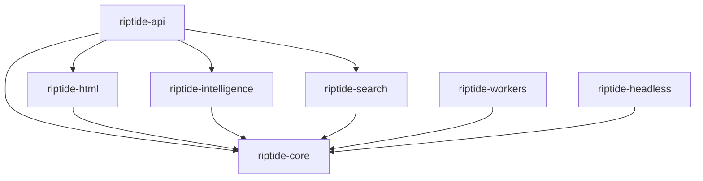

# RipTide AI-First Development Roadmap - Complete Implementation Plan

*Last Updated: 2025-09-27 • Version: 3.0.0 • Status: Ready for execution*

## ⚠️ IMPORTANT: Existing Features to Preserve

**Critical Discovery**: RipTide already has significant functionality that must be preserved:
- ✅ **PDF Processing** - Fully implemented (not "future")
- ✅ **Stealth System** - User agent rotation, fingerprinting, evasion
- ✅ **Session Management** - Persistent browser sessions with cookies
- ✅ **Advanced Caching** - Redis-backed with ETags, conditional requests
- ✅ **Event Bus** - Pub/sub for component communication
- ✅ **CSS/Regex Extraction** - Already built (not Week 5)
- ✅ **NDJSON Streaming** - Implemented (not just viewer)
- ✅ **Instance Pooling** - WASM & browser with health monitoring

See `docs/EXISTING_FEATURES_AUDIT.md` for complete inventory.

## 🎯 Executive Summary

RipTide reaches feature parity with modern extraction frameworks while staying **production-grade**: selectors-first extraction, real table export, optional LLM "repair" with strict timeouts, query-aware crawling, and clean modular crates. All shipped over **12 weeks** in small, reversible releases.

**Core Philosophy**:
- **Deterministic first, AI optional** - Never block on LLM availability
- **Safety by default** - 5s LLM timeout, 1 repair retry, budgets & circuit breakers
- **Clean modularity** - Clear crate boundaries, heavy deps optional, future-ready

**Strategic Approach**: Parallel tracks - architectural refactoring (Track A) runs alongside feature development (Track B), ensuring continuous value delivery without blocking on technical debt reduction.

---

## 🎯 Architecture Transformation

### Current State (Monolithic)
```
workspace/
├── riptide-core/           # 90+ files mixing all concerns
│   ├── src/
│   │   ├── search/        # Should be separate crate
│   │   ├── strategies/    # Mixed HTML + AI logic
│   │   ├── spider/        # Coupled crawling + HTML
│   │   └── [60+ other mixed files]
├── riptide-api/           # ✓ Properly separated
├── riptide-headless/      # ✓ Properly separated
├── riptide-workers/       # ✓ Properly separated
└── riptide-extractor-wasm/ # ✓ Properly separated
```

### Target State (Modular)
```
workspace/
├── riptide-core/           # Pure orchestration & traits only
├── riptide-html/           # NEW: DOM/HTML processing, dynamic rendering
├── riptide-intelligence/   # NEW: LLM abstraction layer
├── riptide-search/         # NEW: Search providers (EXISTS - just needs extraction)
├── riptide-pdf/           # NEW: PDF processing (ALREADY BUILT - needs extraction)
├── riptide-stealth/       # NEW: Stealth & anti-detection (BUILT - needs extraction)
├── riptide-api/           # EXISTING: HTTP interface + sessions
├── riptide-headless/      # EXISTING: Browser automation
├── riptide-workers/       # EXISTING: Background jobs
└── riptide-extractor-wasm/ # EXISTING: WASM sandboxing
```

---

## 📋 Critical Decisions & Clarifications

### Decision 1: Module Extraction Order
**✅ DECISION**: Extract `riptide-search` first (Week 1)
- **Rationale**: Already isolated in `/src/search/` (4 files), lowest risk
- **Alternative Rejected**: HTML has more coupling, higher risk

### Decision 2: LLM Provider Strategy
**✅ DECISION**: Vendor-agnostic abstraction with configuration-driven providers
```yaml
# NO hardcoded providers in architecture
providers:
  primary:
    type: "http"
    endpoint: "${LLM_ENDPOINT}"
    api_key: "${LLM_API_KEY}"
```
- **Rationale**: No vendor lock-in, supports local/cloud, compliance-ready
- **Implementation**: Trait-based abstraction, runtime loading

### Decision 3: Feature Flag Strategy
**✅ DECISION**: Combined compile-time and runtime flags
```rust
// Compile-time in Cargo.toml
[features]
legacy-core = []
new-search = ["riptide-search"]

// Runtime in config
runtime:
  use_new_search: false  # Flip when ready
```

### Decision 4: Breaking Changes Policy
**✅ DECISION**: Zero breaking changes to public API during refactor
- Maintain all re-exports during transition
- Deprecation warnings in Week 8
- Breaking changes only in v2.0 (post-Week 12)

### Decision 5: Testing Requirements
**✅ DECISION**: Mandatory golden tests before any code movement
1. Capture behavior before moving
2. Verify identical behavior after
3. Maximum 5% performance regression allowed

### Decision 6: Rollback Triggers
**✅ DECISION**: Automatic rollback if:
- Performance regression >5% for 1 hour
- Error rate increase >2% for 30 minutes
- Memory increase >100MB sustained
- Any panic in new module code

---

## 🚀 12-Week Implementation Timeline

### Week 0: Preparation Phase

#### Feature Preservation Audit
- [x] **AUDIT-001**: Document all existing features in each module
- [x] **AUDIT-002**: Create migration plan for PDF system
- [x] **AUDIT-003**: Create migration plan for stealth system
- [x] **AUDIT-004**: Verify session management preservation
- [x] **AUDIT-005**: Map event bus dependencies

#### Infrastructure Setup
- [x] **INFRA-001**: Set up golden test framework
- [x] **INFRA-002**: Capture performance baselines (p50: 1.2s, p95: 4.5s)
- [x] **INFRA-003**: Implement feature flag system
- [x] **DOC-001**: Create rollback runbooks
- [x] **DOC-002**: Set up monitoring dashboards

---

### Weeks 1-2: Foundation & Quick Wins

#### Week 0-1: R0 — Guardrails & Access

**Why**: Safe foundation before AI

**Deliverables**:
- API keys per tenant, rate limits, audit logs
- Budgets: **$2k/mo global**, **$10/job**; token & cost telemetry
- PII redaction defaults (logs + LLM payload shaping)

**Flags**: Always on
**Done**: Requests authenticated; budgets enforced; dashboards live

#### Week 1: R1 — Search & Profiles + Security

**Track A - Search Module Extraction (Refactoring Team)**
- [x] **SEARCH-001**: Create `riptide-search` crate structure
- [x] **SEARCH-002**: Capture golden tests for search module
- [x] **SEARCH-003**: Move 4 search files to new crate
  - `providers.rs` (19.5KB)
  - `circuit_breaker.rs` (14.6KB)
  - `none_provider.rs` (4.6KB)
  - `mod.rs`
- [x] **SEARCH-004**: Update SearchProvider trait location
- [x] **SEARCH-005**: Fix compilation and imports
- [x] **SEARCH-006**: Validate against golden tests

**Track B - Security Implementation (Feature Team)**
- [x] **SEC-001**: API key management system
- [x] **SEC-002**: Budget enforcement ($2k/month global, $10/job)
- [x] **SEC-003**: PII redaction system
- [x] **SEC-004**: Audit logging

**Deliverables**: riptide-search operational, security layer complete

#### Week 2: R2 — LLM v1 & HTML Setup

**Why**: Schema extraction safety-net that never blocks

**Track A - HTML Crate Creation**
- [x] **HTML-001**: Create `riptide-html` crate
- [x] **HTML-002**: Define HtmlProcessor trait
- [x] **HTML-003**: Move CSS extraction (`css_json.rs`)
- [x] **HTML-004**: Move regex extraction (`regex.rs`)

**Track B - LLM Abstraction Layer**
- [x] **LLM-001**: Define LlmProvider trait (vendor-agnostic)
```rust
#[async_trait]
pub trait LlmProvider: Send + Sync {
    async fn complete(&self, request: CompletionRequest) -> Result<CompletionResponse>;
    async fn embed(&self, text: &str) -> Result<Vec<f32>>;
    fn capabilities(&self) -> LlmCapabilities;
    fn estimate_cost(&self, tokens: usize) -> Cost;
}
```
- [x] **LLM-002**: Provider registry system
- [x] **LLM-003**: Mock provider for testing
- [x] **LLM-004**: **5-second timeout + 1 repair retry**
- [x] **LLM-005**: Multi-signal circuit breaker for LLM calls
- [x] **LLM-006**: Fallback chain support (deterministic fallback)

**Flags**: `llm: false` (default OFF)
**Done**: Valid JSON when enabled; graceful fallback when not

**Checkpoint**: Search extraction complete, no regression

---

### Weeks 3-5: Core Extraction & Features

#### Week 3: R3 — Chunking & HTML Completion

**Why**: RAG-friendly text splits

**Track A - Complete HTML Extraction**
- [ ] **HTML-005**: Move all 5 chunking strategies
  - `fixed.rs`, `sliding.rs`, `sentence.rs`, `regex.rs`, `topic.rs`
- [ ] **HTML-006**: Extract DOM-specific spider logic
- [ ] **HTML-007**: Update strategy management to use traits

**Track B - Chunking Implementation**
- [ ] **CHUNK-001**: Sliding window chunker (1000 tokens, 100 overlap)
- [ ] **CHUNK-002**: Fixed-size chunker
- [ ] **CHUNK-003**: Sentence-based chunker (NLTK-style)
- [ ] **CHUNK-004**: Regex-based chunker
- [ ] **CHUNK-005**: HTML-aware boundaries (no mid-tag splits)

**Performance Target**: ≤200ms for 50KB text
**Flags**: On
**Done**: Deterministic chunks; clean boundaries

#### Week 4: R4 — Streaming UX & Reports + Intelligence Module

**Why**: Review without building a UI

**Track A - Intelligence Crate Setup**
- [ ] **INTEL-001**: Create `riptide-intelligence` crate
- [ ] **INTEL-002**: Move LLM extraction strategy
- [ ] **INTEL-003**: Extract AI-powered components
- [ ] **INTEL-004**: Define IntelligenceProvider trait

**Track B - Streaming & Reports**
- [ ] **UX-001**: NDJSON viewer page
- [ ] **UX-002**: Extraction & Dynamic report packs (HTML)
- [ ] **UX-003**: OpenAPI refresh + tool registry
- [ ] **UX-004**: CLI & Postman collection

**Flags**: On
**Done**: Watch jobs live; open shareable reports

#### Week 5: R5a — Structured Extraction: Enhance CSS

**Why**: Build on EXISTING CSS extraction (already implemented!)

**Track A - Final Core Cleanup**
- [ ] **CORE-001**: Remove all extracted code from core
- [ ] **CORE-002**: Verify core contains only orchestration
- [ ] **CORE-003**: Update all cross-crate dependencies
- [ ] **CORE-004**: Full integration testing

**Track B - CSS Extraction**
- [ ] **CSS-001**: CSS selector engine (class/id/attr, child/descendant, `:nth-child`)
- [ ] **CSS-002**: `:has-text()` post-filter
- [ ] **CSS-003**: 12 transformers (trim, normalize_ws, number, currency, date_iso, url_abs, etc.)
- [ ] **CSS-004**: Merge policy `css_wins` + conflict audit trail

**Flags**: On
**Done**: ≥80% field fill on clean pages without LLM

**Checkpoint**: All 3 new crates created, core 50% cleaned

---

### Weeks 6-9: Intelligence Layer & Optimization

#### Week 6: R5b — Tables v1

**Why**: Warehouse-ready tables

- [ ] **TABLE-001**: Table parser (thead/tbody/tfoot, **colspan/rowspan**, nested tables)
- [ ] **TABLE-002**: CSV export (RFC 4180 compliant)
- [ ] **TABLE-003**: Markdown export with parent_id for nested tables
- [ ] **TABLE-004**: Artifacts referenced in NDJSON

**Flags**: `tables: true`
**Done**: Linked CSVs + readable MD; easy to load into DBs

#### Week 7: R6 — Query-Aware Spider v1

**Why**: Crawl what matters first
- [ ] **SPIDER-001**: BM25 scoring implementation
- [ ] **SPIDER-002**: URL signal integration (depth, path)
- [ ] **SPIDER-003**: Domain diversity scoring
- [ ] **SPIDER-004**: Early stop on low relevance
- [ ] **SPIDER-005**: Weight configuration (α, β, γ, δ)

**Scoring Formula**: `S = α*BM25 + β*URLSignals + γ*DomainDiversity + δ*ContentSimilarity`

**Flags**: `query_foraging: false` (opt-in)
**Done**: ≥20% lift in on-topic tokens/page at same budget

#### Week 8: R7 — Multi-Provider Support & LLM Ops

**Why**: Provider choice + visibility
- [ ] **PLUGIN-001**: Provider plugin architecture
- [ ] **PLUGIN-002**: Configuration-driven loading
- [ ] **PLUGIN-003**: Runtime provider switching
- [ ] **PLUGIN-004**: Provider health monitoring
- [ ] **PLUGIN-005**: Automatic failover system
- [ ] **PLUGIN-006**: LLM ops dashboards (latency, error, spend per tenant)

**Flags**: `llm: false` (still opt-in)
**Done**: Switch provider via config; see spend/errors clearly

#### Week 9: R8 — Topic Chunking

**Why**: Smarter long-doc segmentation
- [ ] **ADV-CHUNK-001**: Topic chunking (TextTiling algorithm)
- [ ] **ADV-CHUNK-002**: Semantic boundaries detection
- [ ] **ADV-CHUNK-003**: Performance optimization (<200ms overhead)

**Flags**: `topic_chunking: false` (opt-in)
**Done**: Deterministic segments; ≤200ms/doc overhead

**Checkpoint**: Architectural refactoring complete

---

### Weeks 10-12: Production Hardening

#### Weeks 10-11: R9 — Advanced Selectors & Safe XPath

**Why**: Long-tail DOM patterns

- [ ] **SELECT-001**: Advanced CSS cases
- [ ] **SELECT-002**: Safe XPath subset implementation (allowlist approach)
- [ ] **SELECT-003**: Selector fuzzer + per-page performance caps
- [ ] **SELECT-004**: Security audit for injection prevention

```yaml
allowed_axes: [child, descendant, parent, ancestor, following-sibling]
allowed_functions: [text(), contains(), position(), last()]
forbidden: [document(), system-property(), unparsed-entity-uri()]
```

**Flags**: Off by default (profile-controlled)
**Done**: Higher selector coverage, no perf cliffs

#### Week 10: Performance & Memory
- [ ] **PERF-001**: Memory profiling and optimization
- [ ] **PERF-002**: Bottleneck analysis and resolution
- [ ] **PERF-003**: Cache optimization between layers
- [ ] **PERF-004**: Resource limit enforcement

**Performance Targets**:
- Latency: p50 ≤1.5s, p95 ≤5s
- Memory: ≤600MB RSS (alert at 650MB)
- Throughput: ≥70 pages/sec with AI
- AI Impact: ≤30% throughput reduction

#### Week 11: Documentation & SDKs
- [ ] **DOC-003**: Complete API documentation
- [ ] **SDK-001**: Python SDK development
- [ ] **SDK-002**: TypeScript SDK development
- [ ] **DOC-004**: Migration guides for v1.0
- [ ] **DOC-005**: Runbooks for operations

#### Week 12: R10 — Hardening & Release

**Why**: Production confidence
- [ ] **REL-001**: Final performance validation
- [ ] **REL-002**: Security audit completion
- [ ] **REL-003**: Test coverage verification (≥80%)
- [ ] **REL-004**: Deployment automation
- [ ] **REL-005**: v1.0 release preparation

**Flags**: Stable features default ON; risky ones remain opt-in
**Done**: v1.0 tagged; zero breaking API changes

**Final Checkpoint**: v1.0 feature complete, all goals met

---

## ⏩ 8-Week MVP Option (if needed)

**Ship**: R0–R5b + basic LLM support
**Defer**: R6 (query foraging), R7 (multi-provider), R8 (topic chunking), R9 (XPath)

**Users get**:
- Selectors-first extraction with transformers
- Tables → CSV/MD export
- 4 chunking methods (sliding, fixed, sentence, regex)
- Pluggable search (Serper, None, SearXNG)
- Streaming reports & NDJSON viewer
- Optional LLM repair (off by default)

**Result**: Production crawler with AI-assisted extraction, stable and cost-guarded

---

## 🏗️ Module Architecture & Boundaries

### Dependency Rules


**Strict Rules**:
- riptide-core has NO dependencies on other internal crates
- No circular dependencies allowed
- Each crate limited to ≤3 internal dependencies
- Provider implementations NOT in core architecture

### Module Responsibilities

#### riptide-core (Pure Orchestration)
```rust
// ONLY these responsibilities:
- Pipeline orchestration
- Spider/frontier management (basic only)
- Budget enforcement
- Circuit breakers
- Cache infrastructure (core only, advanced → riptide-cache)
- Event bus (PRESERVE existing implementation)
- Telemetry & monitoring
- Provider traits (no implementations)
- Instance pooling (WASM & browser - PRESERVE)
- Memory management (PRESERVE existing)
```

#### riptide-html (DOM Processing)
```rust
// Owns ALL HTML/DOM logic:
- CSS selectors (ALREADY BUILT - enhance)
- XPath processing
- Table extraction
- HTML chunking
- DOM traversal
- Browser interaction helpers
- Dynamic rendering (from dynamic.rs)
- Trek extraction (EXISTING WASM integration)
- Regex extraction (EXISTING)
```

#### riptide-intelligence (AI/ML Abstraction)
```rust
// Owns AI abstraction layer (NO specific providers):
- LlmProvider trait and registry
- Provider plugin system
- Prompt optimization
- Response caching
- Token counting & cost tracking
- Circuit breakers for LLM calls
- Chunking strategies
- Adaptive algorithms
- Fallback chains
// Does NOT own: Specific provider implementations
```

#### riptide-search (Search Providers)
```rust
// Owns ALL search logic:
- Serper.dev integration
- None provider (URL parsing)
- SearXNG integration
- Result caching
- Provider circuit breakers
```

#### riptide-pdf (PDF Processing) - ALREADY BUILT
```rust
// Extract from existing implementation:
- PDF processor with pdfium
- Memory optimization
- PDF metrics collection
- Text extraction
- Layout preservation
- Integration with pipeline
```

#### riptide-stealth (Anti-Detection) - ALREADY BUILT
```rust
// Extract from existing implementation:
- User agent rotation
- Fingerprinting countermeasures
- JavaScript evasion
- Request randomization
- Proxy configuration
- Stealth presets (None/Low/Medium/High)
```

---

## 🔌 LLM Provider Implementation Strategy

### Vendor-Agnostic Architecture

```rust
// In riptide-core: Define the abstraction
#[async_trait]
pub trait LlmProvider: Send + Sync {
    async fn complete(&self, request: CompletionRequest) -> Result<CompletionResponse>;
    async fn embed(&self, text: &str) -> Result<Vec<f32>>;
    fn capabilities(&self) -> LlmCapabilities;
    fn estimate_cost(&self, tokens: usize) -> Cost;
}

// In riptide-intelligence: Manage providers generically
pub struct LlmService {
    providers: HashMap<String, Box<dyn LlmProvider>>,
    fallback_chain: Vec<String>,
    circuit_breaker: CircuitBreaker,
}
```

### Configuration-Driven Providers
```yaml
# config/llm-providers.yaml
providers:
  primary:
    type: "http"
    endpoint: "${LLM_ENDPOINT}"  # Environment variable
    timeout_ms: 5000
    max_retries: 1

  fallback:
    type: "http"
    endpoint: "http://localhost:11434/v1"  # Ollama local

  mock:
    type: "built-in"
    name: "mock"
```

**Benefits**:
- No vendor lock-in
- Local-first support (Ollama/LlamaCPP)
- Compliance ready (enterprise approved providers)
- Cost optimization (route to cheapest)
- Future-proof (new providers just implement trait)

---

## 🧰 Default Feature Flags & Profiles

### Default Feature Flags
```yaml
features:
  tables: true
  search_none_url_parse: true
  llm: false                  # Enable via profile/job
  query_foraging: false       # Enable via profile/job
  topic_chunking: false       # Enable after R8
  embeddings: false           # Future
```

### Example Profiles
```yaml
profiles:
  quick_extract:
    strategy: trek
    chunking: { method: sliding, token_max: 1500 }

  ai_enhanced:
    strategy: css_json
    llm: {
      enabled: true,
      provider: "${LLM_PROVIDER}",  # From environment
      timeout_ms: 5000,
      retries: 1,
      max_tokens_job: 150000,
      max_cost_job_usd: 10
    }
    llm_fallback: true
    merge_policy: css_wins
    llm_only_if_css_missing: true

  research_deep:
    query_foraging: {
      enabled: true,
      weights: { alpha: 0.6, beta: 0.2, gamma: 0.1, delta: 0.1 }
    }
    max_depth: 5
    chunking: { method: topic }
```

## 🧪 Testing Strategy

### Golden Test Requirements
1. **Before Moving Code**: Capture current behavior
2. **After Moving Code**: Verify identical behavior
3. **Performance**: Max 5% regression allowed
4. **Coverage**: Maintain ≥80% across all crates

### Test Coverage by Crate
```yaml
riptide-core:
  unit: 85%
  integration: 90%

riptide-html:
  unit: 80%
  golden: 100%  # All extraction patterns

riptide-intelligence:
  unit: 75%
  contract: 100%  # All provider mocks

riptide-search:
  unit: 80%
  integration: 95%
```

---

## ✅ Success Criteria (What "Done" Looks Like)

### Feature Completion
- **Extraction**: Basic CSS + transformers pass ≥90% of everyday schemas; conflicts audited
- **Tables**: CSV/MD artifacts for nested/merged cells; easy DB import
- **LLM**: When enabled, schema-true JSON in ≤5s (+1 repair); if not, deterministic output with explicit nulls; no job blocked
- **Spider**: Query-aware mode yields ≥20% more on-topic tokens/page, with ≤10% throughput hit when enabled
- **Ops**: Budgets enforced; cost & token telemetry in NDJSON; dashboards live; no panics on hot paths

### Performance Baseline (Must Maintain)
```yaml
latency:
  p50: ≤1.5s  # Current: 1.2s
  p95: ≤5s    # Current: 4.5s
  p99: ≤10s   # Current: 9s

throughput:
  baseline: 100 pages/sec
  with_ai: 70 pages/sec  # 30% impact acceptable

resources:
  memory_rss: ≤600MB
  cpu_usage: ≤80%

reliability:
  success_rate: ≥99.5%
  circuit_breaker_trips: <1/hour
```

### Architectural Health
```yaml
coupling_metrics:
  inter_crate_dependencies: ≤3 per crate
  public_api_surface: ≤20 types per crate
  trait_implementations: ≥80% behind traits

maintainability:
  file_size_p95: ≤500 lines
  module_cohesion: ≥0.8
  cyclomatic_complexity: ≤10
```

---

## 🛡️ Safety & Cost Guardrails

### LLM Safety
- **Timeout**: 5s hard limit
- **Retries**: 1 schema repair attempt only
- **Circuit Breaker**: Multi-signal (error rate >20%, p95 >4s, 5 consecutive failures)
- **Budget**: $2k/mo global, $10/job max, 150k tokens/job
- **PII**: Redacted in logs/LLM payloads by default

### Memory & Performance
- **Container Limit**: 768MB
- **Alert Threshold**: 650MB RSS
- **Headless Pool**: 2-5 instances max
- **Render Timeout**: 3s hard cap
- **Robots.txt**: Always respected

## 🔒 Feature Preservation During Migration

### Critical Features That Must Not Break

#### Instance Pooling & Health
- **WASM pool**: 2-8 instances with health monitoring
- **Browser pool**: 2-5 Chrome instances
- **Self-healing**: Automatic recovery on failure
- **Migration**: Keep in core, enhance monitoring

#### Session Management
- **Cookie persistence**: To disk storage
- **Session encryption**: Optional security
- **TTL management**: Automatic cleanup
- **Migration**: Stay in riptide-api

#### Advanced Spider Features
- **Adaptive stopping**: Smart crawl termination
- **Budget management**: Cost/page limits
- **Sitemap support**: Auto-discovery
- **Migration**: Split between core and intelligence

#### Caching System
- **Redis integration**: Read-through patterns
- **Conditional requests**: ETags, If-Modified-Since
- **Content hashing**: Dedup detection
- **Migration**: Core interface, advanced in separate crate

#### Event Bus
- **Pub/sub system**: Component communication
- **Type-safe events**: Enum-based
- **Pool integration**: Health events
- **Migration**: MUST stay in core unchanged

## 🚨 Risk Management

### Critical Risks & Mitigations

| Risk | Impact | Likelihood | Mitigation |
|------|--------|------------|------------|
| Breaking production during refactor | HIGH | MEDIUM | Feature flags, incremental migration |
| Performance regression | MEDIUM | LOW | Continuous benchmarking, golden tests |
| API compatibility break | HIGH | LOW | Deprecation warnings, migration guide |
| Team velocity impact | MEDIUM | MEDIUM | Parallel tracks, clear ownership |
| LLM provider failures | HIGH | MEDIUM | Multi-provider fallback, local options |

### No-Go Conditions (Stop if)
1. Customer incidents increase >10%
2. Team velocity drops >30%
3. More than 2 rollbacks needed
4. Core functionality broken >1 hour
5. Performance baseline not maintained

### Rollback Strategy
```yaml
rollback_points:
  - Pre-search extraction (Week 1)
  - Pre-HTML extraction (Week 3)
  - Pre-intelligence extraction (Week 5)
  - Each major version tag

procedure:
  1. git revert --no-edit HEAD
  2. cargo feature disable <module>
  3. kubectl rollout undo deployment/riptide
  4. Incident report within 1 hour
```

---

## 👥 Team Structure

### Parallel Track Organization

**Track A - Refactoring Team (2 engineers)**
- Module extraction and separation
- Trait definitions and boundaries
- Maintaining compatibility layers
- Integration testing

**Track B - Feature Team (3 engineers)**
- Security & authentication
- LLM abstraction layer
- Schema extraction features
- User-facing improvements

**Infrastructure (1 engineer)**
- CI/CD updates for new crates
- Monitoring and dashboards
- Performance tracking
- Deployment automation

### Coordination Rules
1. Track B uses legacy paths until Track A completes extraction
2. New features go in target module location (even if not extracted)
3. Daily standup includes both tracks
4. Blocking issues escalated within 2 hours

---

## 🔄 Checkpoints & Reviews

### Week 2 Checkpoint
- [ ] riptide-search fully extracted
- [ ] Security layer complete
- [ ] No performance regression
- [ ] All tests passing
**Decision**: Continue with HTML extraction?

### Week 5 Checkpoint
- [ ] All three new crates created
- [ ] Core cleanup 50% complete
- [ ] LLM abstraction working
- [ ] Chunking implemented
**Decision**: Continue with intelligence extraction?

### Week 7 Checkpoint
- [ ] Architectural refactoring complete
- [ ] All modules properly separated
- [ ] Feature parity maintained
- [ ] Documentation updated
**Decision**: Enable in production?

### Week 12 Final Review
- [ ] v1.0 feature complete
- [ ] All architectural goals met
- [ ] Performance targets achieved
- [ ] Production ready
**Decision**: Release v1.0?

---

## 📈 Progress Tracking

### Overall Progress: 0/100+ items

**Week 1**: 0/15 items (Search: 0/6, Security: 0/4, Infra: 0/5)
**Week 2**: 0/10 items (HTML: 0/4, LLM: 0/6)
**Week 3**: 0/8 items (HTML: 0/3, Chunking: 0/5)
**Week 4**: 0/7 items (Intelligence: 0/4, Schema: 0/3)
**Week 5**: 0/7 items (Core: 0/4, Tables: 0/3)
**Weeks 6-12**: 0/50+ items

---

## 🧭 What Each Release Unlocks

### Quick Value Summary
- **R2 (LLM)**: Optional AI fills missing fields in ≤5s or cleanly falls back
- **R3 (Chunking)**: Clean, HTML-aware chunks for RAG/search
- **R5a/b (CSS+Tables)**: Deterministic fields + real tables you can load into DBs
- **R6 (Query Spider)**: More relevant pages within same crawl budget
- **R7 (Multi-Provider)**: Provider choice + cost/latency visibility
- **R8/R9 (Advanced)**: Better long docs + trickier DOMs when needed

## 🎯 Deliverables by Week 12

RipTide will achieve:
- ✅ **Clean modular architecture** - 8+ focused crates
- ✅ **ALL existing features preserved** - No regression
- ✅ **PDF processing extracted** - Own crate (not "future")
- ✅ **Stealth system extracted** - Anti-detection crate
- ✅ **Vendor-agnostic LLM abstraction** - No lock-in
- ✅ **Plugin-based provider system** - Runtime configuration
- ✅ **Feature parity with Crawl4AI** - All extraction capabilities
- ✅ **Production-grade reliability** - 99.5% uptime
- ✅ **Enhanced existing features** - CSS, caching, sessions
- ✅ **Maintainable codebase** - 80%+ test coverage

---

## 🔮 Post-v1.0 Roadmap

### v1.1 - Enhanced Intelligence (Month 4)
- Embeddings support with vector storage
- Semantic search capabilities
- Multi-modal extraction (images, videos)

### v1.2 - Distributed Scale (Month 5)
- Distributed crawler coordination
- Horizontal scaling patterns
- Cloud-native operators

### v2.0 - Platform Evolution (Months 6-12)
- GraphQL API
- Plugin marketplace
- SaaS offering
- WebSocket streaming

---

## 📋 Immediate Actions (Week 0)

**Monday-Tuesday**:
1. Set up golden test framework
2. Capture performance baselines
3. Configure feature flags

**Wednesday-Thursday**:
4. Create rollback runbooks
5. Set up monitoring dashboards
6. Brief teams on parallel tracks

**Friday**:
7. Final preparation review
8. Week 1 task assignment
9. Go/No-Go decision

---

*This roadmap represents the optimal balance between architectural excellence and practical delivery. It will be updated weekly with progress and any adjustments based on learnings.*

**Last Updated**: 2025-09-27
**Version**: 2.0.0
**Status**: Ready for execution