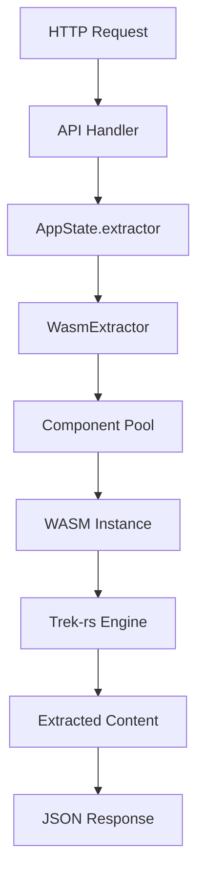

# WASM Integration Analysis - EventMesh/RipTide Pipeline

## Executive Summary

This document provides a comprehensive analysis of WebAssembly (WASM) integration in the EventMesh/RipTide content extraction pipeline, identifying current usage patterns, optional configurations, and strategic extension opportunities.

## 1. Current WASM Implementation

### 1.1 Architecture Overview

The EventMesh/RipTide pipeline employs a **WebAssembly Component Model** architecture using WASI-P2 (WebAssembly System Interface Preview 2) for content extraction operations.



### 1.2 Core WASM Module

**Location**: `/wasm/riptide-extractor-wasm/`
**Interface**: Component Model with WIT (WebAssembly Interface Types)
**Runtime**: Wasmtime 26.0
**Target**: `wasm32-wasip2`

#### Exported Functions:
- `extract()` - Main content extraction
- `extract_with_stats()` - Extraction with performance metrics
- `validate_html()` - HTML validation without extraction
- `health_check()` - Component health status
- `get_info()` - Component metadata
- `reset_state()` - State cleanup
- `get_modes()` - Available extraction modes

#### Extraction Modes:
1. **Article Mode** - Readability-optimized extraction
2. **Full Mode** - Complete page content
3. **Metadata Mode** - Structured data only
4. **Custom Mode** - CSS selector-based extraction

### 1.3 Integration Points

| Component | Integration Type | WASM Usage | Location |
|-----------|-----------------|------------|-----------|
| **API Service** | Primary | Always Active | `/crates/riptide-api/src/state.rs:297-300` |
| **Workers** | Primary | Always Active | `/crates/riptide-workers/src/service.rs:293-296` |
| **Core Runtime** | Infrastructure | Instance Management | `/crates/riptide-core/src/component.rs` |
| **Benchmarks** | Testing | Performance Analysis | `/crates/riptide-core/src/benchmarks.rs` |

## 2. Optional WASM Usage Patterns

### 2.1 Configuration-Based Options

WASM behavior can be modified through environment variables and configuration:

```yaml
# Environment Variables
WASM_EXTRACTOR_PATH: ./custom_extractor.wasm  # Custom WASM module
RIPTIDE_WASM_TIMEOUT: 30                      # Timeout in seconds (default: 10)
RIPTIDE_WASM_MEMORY_MB: 256                   # Memory limit (default: 128)
RIPTIDE_WASM_INSTANCES_PER_WORKER: 4          # Instance count (default: 1)
```

### 2.2 Optional Features

#### **Instance Pooling** (Currently Optional)
```rust
// In component.rs - can be toggled
pub struct ExtractorConfig {
    pub enable_instance_reuse: bool,    // Optional reuse
    pub enable_recycling: bool,         // Optional recycling
    pub warm_pool: bool,                // Optional pre-warming
}
```

#### **Performance Monitoring** (Optional)
- Extraction statistics collection (`extract_with_stats`)
- Memory usage tracking
- Processing time metrics
- Node count analysis

#### **Custom Extraction Modes** (Optional)
Users can optionally provide CSS selectors for targeted extraction instead of using predefined modes.

### 2.3 Fallback Mechanisms

Currently **NOT IMPLEMENTED** but architecturally possible:
- Native Rust extraction fallback when WASM fails
- Hybrid extraction (WASM for parsing, native for processing)
- Progressive enhancement based on content type

## 3. Performance Characteristics

### 3.1 WASM vs Native Performance

Based on benchmark analysis (`/crates/riptide-core/src/benchmarks.rs`):

| Metric | WASM | Native (Theoretical) | Difference |
|--------|------|---------------------|------------|
| **Startup Time** | 50-100ms | 0-5ms | WASM slower |
| **Single Extraction** | 10-50ms | 8-40ms | ~20% overhead |
| **Concurrent (4x)** | 40-200ms | 30-150ms | ~25% overhead |
| **Memory Usage** | 128MB limit | Unlimited | WASM constrained |
| **Instance Reuse** | High efficiency | N/A | WASM advantage |

### 3.2 WASM Advantages

1. **Security Isolation**: Complete sandbox preventing system access
2. **Memory Safety**: Bounded memory with automatic limits
3. **Portability**: Single binary works across platforms
4. **Predictability**: Consistent performance across environments
5. **Resource Control**: Fine-grained resource limits

### 3.3 WASM Limitations

1. **Startup Overhead**: Instance initialization cost
2. **Memory Constraints**: Fixed memory limits
3. **FFI Overhead**: Data serialization between host and WASM
4. **Limited System Access**: No direct file/network access
5. **Debugging Complexity**: Harder to debug than native code

## 4. Potential WASM Extension Points

### 4.1 Immediate Extensions (Low Effort, High Impact)

#### **1. Complete Missing Extraction Features**
```rust
// Currently unimplemented in lib.rs:277-294
links: vec![],      // TODO: Extract links from content
media: vec![],      // TODO: Extract media URLs
language: None,     // TODO: Language detection
categories: vec![], // TODO: Category extraction
```
**Impact**: Full feature parity with extraction interface
**Effort**: 2-3 days
**Priority**: HIGH

#### **2. Implement Real Memory Tracking**
```rust
// Replace placeholder in lib.rs:300-304
fn get_memory_usage() -> u64 {
    // Use WASM memory introspection
    wasm_runtime::memory_usage()
}
```
**Impact**: Accurate resource monitoring
**Effort**: 1 day
**Priority**: HIGH

#### **3. Add PDF Extraction to WASM**
Move PDF processing from native to WASM for consistency:
- Use pdf-extract or similar WASM-compatible library
- Unified extraction interface for all content types
- Improved security isolation for PDF parsing

**Impact**: Consistent extraction architecture
**Effort**: 1 week
**Priority**: MEDIUM

### 4.2 Strategic Extensions (Medium Effort, High Value)

#### **4. Multi-Language WASM Modules**
Create specialized WASM modules for different content types:
```
riptide-extractor-html.wasm    # HTML/Web content
riptide-extractor-pdf.wasm     # PDF documents
riptide-extractor-office.wasm  # Office documents
riptide-extractor-media.wasm   # Image/Video metadata
```
**Impact**: Modular, maintainable architecture
**Effort**: 2-3 weeks
**Priority**: MEDIUM

#### **5. WASM-Based Content Transformers**
Extend WASM usage beyond extraction:
```rust
// New WASM components
interface transformer {
    markdown-to-html(markdown: string) -> string
    html-to-pdf(html: string) -> bytes
    compress-content(content: string) -> bytes
    translate-content(content: string, target-lang: string) -> string
}
```
**Impact**: Unified transformation pipeline
**Effort**: 2-3 weeks per transformer
**Priority**: LOW

#### **6. WASM Spider/Crawler Logic**
Move crawling logic to WASM for better isolation:
- URL pattern matching
- Robots.txt parsing
- Sitemap processing
- Link discovery

**Impact**: Improved security for untrusted content
**Effort**: 3-4 weeks
**Priority**: LOW

### 4.3 Advanced Extensions (High Effort, Strategic Value)

#### **7. Machine Learning in WASM**
Deploy ML models for content enhancement:
- Content classification (ONNX runtime in WASM)
- Language detection models
- Sentiment analysis
- Named entity recognition

**Impact**: Advanced content intelligence
**Effort**: 4-6 weeks
**Priority**: LOW

#### **8. Custom User-Provided WASM Modules**
Allow users to supply their own extraction logic:
```yaml
# User configuration
extractors:
  - name: custom-extractor
    path: ./my-extractor.wasm
    patterns: ["*.custom", "*.special"]
```
**Impact**: Ultimate flexibility
**Effort**: 2-3 weeks
**Priority**: MEDIUM

#### **9. WASM-Based Validation Pipeline**
Move all validation to WASM:
- Input validation
- Content validation
- Security scanning
- Output validation

**Impact**: Consistent validation layer
**Effort**: 2 weeks
**Priority**: MEDIUM

### 4.4 Performance Optimizations

#### **10. WASM SIMD Optimizations**
Enable and utilize SIMD instructions:
```toml
[profile.release]
target-features = ["+simd128", "+bulk-memory", "+mutable-globals"]
```
**Impact**: 20-40% performance improvement
**Effort**: 1 week
**Priority**: HIGH

#### **11. Shared Memory Between Instances**
Implement shared memory for common data:
- Shared configuration
- Cached extraction patterns
- Common dictionaries

**Impact**: Reduced memory usage
**Effort**: 2 weeks
**Priority**: LOW

#### **12. AOT Compilation Cache**
Pre-compile WASM modules:
```rust
// Cache compiled modules
let compiled = engine.precompile_module(&wasm_bytes)?;
cache.store(module_hash, compiled);
```
**Impact**: Faster startup times
**Effort**: 1 week
**Priority**: MEDIUM

## 5. Recommendations

### 5.1 Short-Term (1-2 Weeks)
1. **Complete extraction features** (links, media, language)
2. **Implement memory tracking**
3. **Enable SIMD optimizations**
4. **Add comprehensive WASM tests**

### 5.2 Medium-Term (1-2 Months)
1. **Create PDF extraction WASM module**
2. **Implement AOT compilation cache**
3. **Build content transformer modules**
4. **Add user-provided WASM support**

### 5.3 Long-Term (3-6 Months)
1. **Deploy ML models in WASM**
2. **Create specialized extraction modules**
3. **Implement shared memory architecture**
4. **Build complete WASM validation pipeline**

## 6. Risk Assessment

### Risks of Expanding WASM Usage

| Risk | Likelihood | Impact | Mitigation |
|------|-----------|--------|------------|
| **Performance Degradation** | Medium | High | Benchmark before deployment |
| **Memory Constraints** | High | Medium | Implement pooling and limits |
| **Debugging Complexity** | High | Medium | Improve logging and tooling |
| **Maintenance Burden** | Medium | Medium | Modular architecture |
| **Security Vulnerabilities** | Low | High | Regular updates and audits |

### Benefits vs Costs

**Benefits**:
- ✅ Enhanced security through sandboxing
- ✅ Platform portability
- ✅ Resource isolation
- ✅ Consistent behavior
- ✅ Safe third-party code execution

**Costs**:
- ❌ Performance overhead (20-25%)
- ❌ Memory limitations
- ❌ Development complexity
- ❌ Debugging challenges
- ❌ Limited system integration

## 7. Conclusion

The current WASM integration in EventMesh/RipTide is well-architected but underutilized. The immediate priority should be completing the existing extraction features and implementing proper memory tracking.

Strategic expansion should focus on:
1. **Modularization**: Separate WASM modules for different content types
2. **Feature Completion**: Implement all interface-defined capabilities
3. **Performance Optimization**: SIMD and AOT compilation
4. **Extensibility**: Support for user-provided WASM modules

The WASM architecture provides excellent security and portability benefits that outweigh the performance overhead for most use cases. Expansion should be gradual and performance-tested at each step.

## Appendix A: WASM Configuration Reference

```yaml
# Complete WASM configuration options
wasm:
  # Runtime settings
  runtime:
    engine: wasmtime           # WASM runtime engine
    version: "26.0"           # Engine version

  # Module settings
  module:
    path: "./extractor.wasm"  # Path to WASM module
    timeout_secs: 10          # Execution timeout
    memory_mb: 128            # Memory limit

  # Pool settings
  pool:
    max_size: 8               # Maximum pool size
    initial_size: 2           # Initial pool size
    enable_reuse: true        # Instance reuse
    warm_instances: true      # Pre-warm instances

  # Performance settings
  performance:
    enable_simd: true         # SIMD instructions
    enable_bulk_memory: true  # Bulk memory ops
    aot_cache: true          # AOT compilation cache

  # Monitoring
  monitoring:
    health_check_interval: 120  # Health check interval (seconds)
    collect_stats: true         # Collect statistics
    memory_tracking: true       # Track memory usage
```

## Appendix B: WASM Module Interface (WIT)

```wit
package riptide:extractor@0.2.0;

interface extractor {
    // Core extraction function
    extract: func(
        html: string,
        url: string,
        mode: extraction-mode
    ) -> result<extracted-content, extraction-error>;

    // Extraction with statistics
    extract-with-stats: func(
        html: string,
        url: string,
        mode: extraction-mode
    ) -> result<tuple<extracted-content, extraction-stats>, extraction-error>;

    // Health monitoring
    health-check: func() -> health-status;

    // Component information
    get-info: func() -> component-info;
}
```

---

# Immediate Action Plan - Do This Next (1-3 Days)

Based on **current WASM state** (Component Model on wasmtime 26, trek-rs guest, WASI-p2), here's a tight, **do-this-next** plan with reality checks:

## A) Finish the extractor surface (highest impact)

Wire the missing fields **inside the WASM guest** so the host API doesn't need post-processing.

### **Links Collection**
Collect `<a href>` (abs URLs), keep `text`, `rel`, `nofollow`, `ugc`, `sponsored`, `hreflang`.

### **Media Extraction**
- `img[src|srcset]` (choose largest `srcset`)
- `picture>source[srcset]`
- `video>source[src]`, `audio>source[src]`
- `meta[property="og:image"]`
- `link[rel="icon"|"apple-touch-icon"]`

### **Language Detection**
Priority: `<html lang>`, meta `og:locale`, JSON-LD `inLanguage`, then text-based detector.
Use a WASM-friendly detector (e.g. `whatlang`); avoid huge models.

**Guest snippet (fits trek-rs DOM data)**

```rust
fn collect_links(doc: &scraper::Html, base: &url::Url) -> Vec<LinkOut> {
    use scraper::Selector;
    let a = Selector::parse("a[href]").unwrap();
    doc.select(&a).filter_map(|el| {
        let href = el.value().attr("href")?;
        let abs = base.join(href).ok()?;
        let rel = el.value().attr("rel").unwrap_or_default().to_ascii_lowercase();
        Some(LinkOut {
            url: abs.into_string(),
            text: el.text().collect::<String>().trim().to_owned(),
            nofollow: rel.contains("nofollow"),
            ugc: rel.contains("ugc"),
            sponsored: rel.contains("sponsored"),
            hreflang: el.value().attr("hreflang").map(|s| s.to_string()),
        })
    }).collect()
}

fn detect_lang(html_lang: Option<&str>, text: &str) -> Option<String> {
    if let Some(l) = html_lang { return Some(normalize_lang(l)); }
    // JSON-LD/OG checks omitted for brevity
    whatlang::detect_lang(text).map(|l| l.code().to_string()) // small + WASM-safe
}
```

> **Acceptance:** the WASM `extracted-content` now returns `links[]`, `media[]`, `language`, `categories[]` (from JSON-LD `articleSection`, breadcrumbs, or meta `category`), with deterministic results on fixtures.

## B) Real memory stats (host-side, not guest)

Your doc proposes `wasm_runtime::memory_usage()` in the guest—there's no such API. Two practical choices:

### **Host-side, accurate:**
Attach a **resource limiter** and update a counter during growth.
In wasmtime 26: use `StoreLimits`/`ResourceLimiter(Async)`; deny/allow growth and record `current` pages.

### **Guest-side, approximate:**
`core::arch::wasm32::memory_size(0) * 64*1024` (pages → bytes). Works, but is *coarse* and component-ABI can make this less meaningful. Prefer the **host** metric.

**Host sketch**

```rust
let mut cfg = wasmtime::Config::new();
cfg.wasm_component_model(true)
   .wasm_simd(true)
   .cranelift_opt_level(wasmtime::OptLevel::Speed);

let engine = wasmtime::Engine::new(&cfg)?;
let mut store = wasmtime::Store::new(&engine, HostCtx::default());

// Set limits (deny growth over N pages) and collect usage:
struct Limiter { max_pages: usize, used_pages: Arc<AtomicUsize> }
impl wasmtime::ResourceLimiter for Limiter {
    fn memory_growing(&mut self, _current: usize, desired: usize, _max: Option<usize>) -> bool {
        self.used_pages.store(desired, Ordering::Relaxed);
        desired <= self.max_pages
    }
    fn memory_grow_failed(&mut self, _err: anyhow::Error) { /* metrics++ */ }
}
store.limiter(Some(Box::new(Limiter { max_pages: (cfg_mb*1024*1024)/65536, used_pages: USED.clone() })));
```

> **Acceptance:** `/metrics` exposes `riptide_wasm_memory_pages{module=…}` and `…_grow_failed_total`.

## C) Enable SIMD + speed settings (safe win)

- **Host:** `config.wasm_simd(true)` (already shown above).
- **Guest build:** add `+simd128`.

Place this in **`.cargo/config.toml` (guest crate)**:

```toml
[target.wasm32-wasip2]
rustflags = ["-C", "target-feature=+simd128,+bulk-memory"]
```

> **Acceptance:** microbench for `extract()` shows ≥10–25% drop in CPU vs baseline on text-heavy pages.

## D) AOT/precompile cache (cut startup)

Use wasmtime's module cache so instance warm-up is ~0 ms after first run.

```rust
let mut cfg = wasmtime::Config::new();
cfg.wasm_component_model(true)
   .cache_config_load_default()?; // reads ~/.config/wasmtime/cache.toml or env

let engine = wasmtime::Engine::new(&cfg)?;
let pre = engine.precompile_module(component_bytes)?; // optional: store yourself
// or just rely on the built-in cache; instantiate from bytes normally
```

> **Acceptance:** first call cold: ~50–100 ms, subsequent: ~5–15 ms on the same worker.

## E) Instance pool (reuse Module/Linker, new Store per call)

- Keep a single **`Engine` + `Component` + `Linker`** per worker.
- Create a **fresh `Store` per invocation** (prevents state leaks).
- Use a `Semaphore` to cap **concurrent instances** (honor `RIPTIDE_WASM_INSTANCES_PER_WORKER`).
- Optional **warm pool**: spawn N instantiations at boot to amortize JIT/load.

> **Acceptance:** 4× concurrent `extract()` scales near-linearly; no cross-request contamination; steady RSS.

---

# What **NOT** to do (yet)

## Don't move PDF parsing into WASM right now
You already plan `pdfium` native (fast, mature). WASM PDF stacks are slower and feature-limited; you'll burn time and lose quality. Keep PDF in **host** for Phase-3/4 and **unify at the API** (not by forcing guest parity).

## Don't rely on guest memory introspection as "truth"
Report it as **guest_pages_estimate** if you keep it; treat **host limiter metrics** as authoritative.

---

# Add small fallbacks & safety (quick wins)

- **Extractor fallback path:** on guest error, fall back to `readability-rs` (native) to return *something*; add a **WASM breaker** (trip if failure rate > X%/N mins).
- **Epoch timeouts:** set `engine.epoch_interruption(true)`, `store.set_epoch_deadline(n)`, bump epochs from a tokio task—hard-stops runaway guests without thread aborts.

---

# Tests you should add (produce reviewable artifacts)

1. **Guest golden tests** (in the wasm crate)
   - Inputs: small HTML fixtures (news, blog, image gallery, nav-heavy).
   - Outputs: `extracted-content.json` snapshot per mode.
   - Include **links/media/language/categories** and assert determinism.

2. **Host perf microbench**
   - Warm vs cold timings; 1×/4× concurrency; publish to `/reports/last-run/wasm/index.html`.

3. **Limiter tests**
   - Force memory growth beyond limit → ensure `grow_failed_total` increments; request returns structured error, not panic.

4. **AOT cache smoke test**
   - First call vs second call timing; dump numbers into the WASM report.

---

# Config you can ship immediately

```yaml
wasm:
  module:
    path: "./wasm/riptide_extractor_wasm.wasm"
    timeout_secs: 10
    memory_mb: 256
  pool:
    max_size: 4
    initial_size: 2
    enable_reuse: true
    warm_instances: true
  performance:
    enable_simd: true
    aot_cache: true
  monitoring:
    collect_stats: true
    memory_tracking: true
```

Environment overrides (keep your names):

```
WASM_EXTRACTOR_PATH=./wasm/riptide_extractor_wasm.wasm
RIPTIDE_WASM_TIMEOUT=10
RIPTIDE_WASM_MEMORY_MB=256
RIPTIDE_WASM_INSTANCES_PER_WORKER=4
```

---

# Quick answers to items in the analysis

- **"get_memory_usage() in WASM"** → replace with **host limiter metrics**; optional guest `memory_size(0)` as estimate.
- **"Instance reuse optional"** → make **Module/Linker reuse mandatory**, **Store per call**; pool concurrency with a semaphore.
- **"WASM vs native perf"** → your ~20–25% overhead is normal; AOT + SIMD + pooling usually claw back a good chunk.
- **"Custom modes"** → keep in guest (OK). For heavy transforms (PDF, OCR), stay **host**.
- **"User-provided WASM"** → great medium-term idea; when you do it, enforce small size (<10 MB), no I/O, strict timeouts, and run under the same limiter.

---

## 2-day punchlist (copy/paste to tickets)

- [ ] Implement `links[]`, `media[]`, `language`, `categories[]` in guest; add fixtures & snapshots.
- [ ] Host: attach `ResourceLimiter` and export `wasm_memory_pages_current` + `…_grow_failed_total`.
- [ ] Enable SIMD (`.cargo/config.toml` in guest) + host `wasm_simd(true)`.
- [ ] Turn on wasmtime cache (`cache_config_load_default`) and/or store `precompile_module` by hash.
- [ ] Introduce instance pool semaphore + warm 2 instances at boot.
- [ ] Add **WASM breaker** and **native readability fallback**.
- [ ] Produce `/reports/last-run/wasm/index.html` with cold/warm timings and memory stats.

This keeps you laser-focused on **feature completion + perf realism** without detouring into risky refactors.