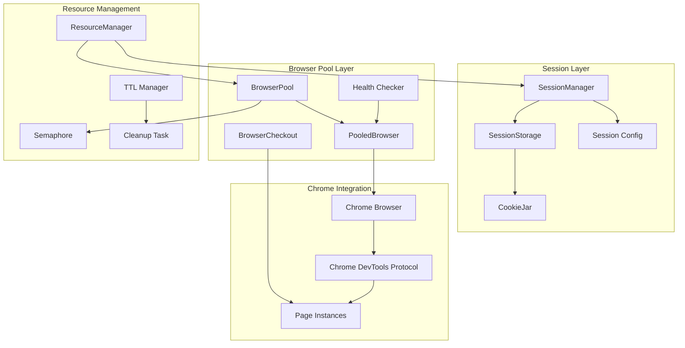
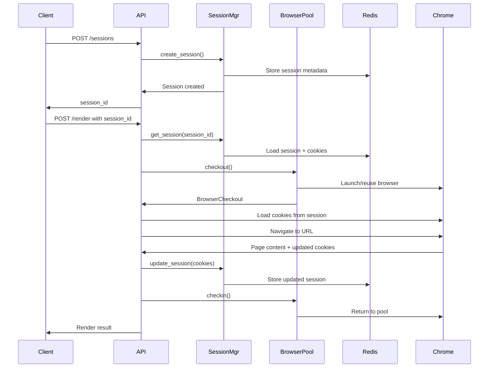

# Browser Pool and Session Management Integration

## Overview

This document provides comprehensive guidance for integrating browser pool management with session persistence in the riptide RipTide system. The architecture combines high-performance browser resource pooling with Redis-backed session management to enable stateful, scalable web scraping operations.

## Architecture Components

### 1. Browser Pool Architecture

The browser pool system provides managed access to Chrome browser instances through the `chromiumoxide` crate, with automatic resource lifecycle management and health monitoring.



### 2. Session Management System

Sessions provide persistent state management across browser requests, with automatic cookie handling and Redis-backed storage.



## Core Components

### Browser Pool Configuration

```rust
use riptide_headless::pool::{BrowserPool, BrowserPoolConfig};
use chromiumoxide::BrowserConfig;
use std::time::Duration;

// Production-optimized configuration
let pool_config = BrowserPoolConfig {
    min_pool_size: 2,           // Keep 2 browsers warm
    max_pool_size: 10,          // Maximum concurrent browsers
    initial_pool_size: 3,       // Start with 3 browsers
    idle_timeout: Duration::from_secs(120),     // 2 minute idle timeout
    max_lifetime: Duration::from_secs(1800),   // 30 minute max lifetime
    health_check_interval: Duration::from_secs(30),  // Health check every 30s
    memory_threshold_mb: 512,   // Memory limit per browser
    enable_recovery: true,      // Auto-recovery for crashed browsers
    max_retries: 3,            // Maximum operation retries
};

let browser_config = BrowserConfig::builder()
    .no_sandbox()
    .disable_dev_shm_usage()
    .disable_gpu()
    .window_size(1920, 1080)
    .build()?;

let pool = BrowserPool::new(pool_config, browser_config).await?;
```

### Session Manager Setup

```rust
use riptide_api::sessions::{SessionManager, SessionConfig};
use std::path::PathBuf;

let session_config = SessionConfig {
    base_data_dir: PathBuf::from("/var/lib/riptide/sessions"),
    default_ttl: Duration::from_secs(86400),  // 24 hours
    max_sessions: 10000,                      // Support 10k concurrent sessions
    cleanup_interval: Duration::from_secs(300), // Cleanup every 5 minutes
    persist_cookies: true,                    // Enable cookie persistence
    encrypt_session_data: false,              // Disable encryption (use TLS instead)
};

let session_manager = SessionManager::new(session_config).await?;
```

## Integration Patterns

### 1. Session-Aware Browser Checkout

```rust
use riptide_headless::pool::BrowserCheckout;
use riptide_api::sessions::{Session, Cookie};

pub async fn render_with_session(
    pool: &BrowserPool,
    session_manager: &SessionManager,
    session_id: &str,
    url: &str
) -> Result<String> {
    // Get or create session
    let session = session_manager.get_or_create_session(session_id).await?;

    // Checkout browser from pool
    let checkout = pool.checkout().await?;
    let page = checkout.new_page("about:blank").await?;

    // Load session cookies into browser
    let cookies = session_manager.get_all_cookies(session_id).await?;
    for (domain, domain_cookies) in cookies.cookies {
        for (name, cookie) in domain_cookies {
            page.set_cookie(cookie.into_chrome_cookie(&domain)).await?;
        }
    }

    // Navigate and extract content
    page.goto(url).await?;
    page.wait_for_load_state().await?;
    let content = page.content().await?;

    // Extract updated cookies
    let updated_cookies = page.get_cookies(None).await?;
    for chrome_cookie in updated_cookies {
        let cookie = Cookie::from_chrome_cookie(chrome_cookie);
        let domain = cookie.domain.as_ref().unwrap_or(&extract_domain(url));
        session_manager.set_cookie(session_id, domain, cookie).await?;
    }

    // Return browser to pool
    checkout.checkin().await?;

    Ok(content)
}
```

### 2. Resource Lifecycle Management

```rust
use std::sync::Arc;
use tokio::sync::RwLock;

pub struct IntegratedRenderer {
    browser_pool: Arc<BrowserPool>,
    session_manager: Arc<SessionManager>,
    active_renders: Arc<RwLock<HashMap<String, RenderContext>>>,
}

impl IntegratedRenderer {
    pub async fn new(
        pool_config: BrowserPoolConfig,
        session_config: SessionConfig
    ) -> Result<Self> {
        let browser_config = BrowserConfig::builder()
            .args(vec![
                "--no-sandbox",
                "--disable-dev-shm-usage",
                "--disable-gpu",
                "--disable-web-security",
                "--disable-features=VizDisplayCompositor"
            ])
            .build()?;

        let browser_pool = Arc::new(BrowserPool::new(pool_config, browser_config).await?);
        let session_manager = Arc::new(SessionManager::new(session_config).await?);

        Ok(Self {
            browser_pool,
            session_manager,
            active_renders: Arc::new(RwLock::new(HashMap::new())),
        })
    }

    pub async fn render_page(&self, request: RenderRequest) -> Result<RenderResponse> {
        let render_id = Uuid::new_v4().to_string();

        // Track active render
        {
            let mut active = self.active_renders.write().await;
            active.insert(render_id.clone(), RenderContext {
                session_id: request.session_id.clone(),
                started_at: Instant::now(),
                url: request.url.clone(),
            });
        }

        let result = self.perform_render(&render_id, request).await;

        // Cleanup tracking
        {
            let mut active = self.active_renders.write().await;
            active.remove(&render_id);
        }

        result
    }

    async fn perform_render(&self, render_id: &str, request: RenderRequest) -> Result<RenderResponse> {
        // Implementation with error recovery and cleanup
        let _browser_checkout = match self.browser_pool.checkout().await {
            Ok(checkout) => checkout,
            Err(e) => {
                error!(render_id = %render_id, error = %e, "Failed to checkout browser");
                return Err(anyhow!("Browser unavailable: {}", e));
            }
        };

        // Continue with session integration...
        // Implementation details follow the pattern above

        Ok(RenderResponse {
            content: "".to_string(),
            cookies_updated: true,
            render_time_ms: 0,
        })
    }
}
```

## Session Persistence

### Cookie Management

```rust
impl SessionManager {
    /// Import cookies from Chrome browser after rendering
    pub async fn sync_cookies_from_browser(
        &self,
        session_id: &str,
        browser_cookies: Vec<chromiumoxide::cookie::Cookie>
    ) -> Result<()> {
        for chrome_cookie in browser_cookies {
            let cookie = Cookie {
                name: chrome_cookie.name,
                value: chrome_cookie.value,
                domain: chrome_cookie.domain,
                path: chrome_cookie.path,
                expires: chrome_cookie.expires.map(|ts| {
                    SystemTime::UNIX_EPOCH + Duration::from_secs(ts as u64)
                }),
                secure: chrome_cookie.secure,
                http_only: chrome_cookie.http_only,
                same_site: chrome_cookie.same_site.map(|ss| match ss {
                    chromiumoxide::cookie::SameSite::Strict => SameSite::Strict,
                    chromiumoxide::cookie::SameSite::Lax => SameSite::Lax,
                    chromiumoxide::cookie::SameSite::None => SameSite::None,
                }),
            };

            let domain = cookie.domain.as_ref().unwrap_or(&"localhost".to_string());
            self.set_cookie(session_id, domain, cookie).await?;
        }

        Ok(())
    }

    /// Export cookies for browser loading
    pub async fn export_cookies_for_browser(
        &self,
        session_id: &str,
        url: &str
    ) -> Result<Vec<chromiumoxide::cookie::SetCookieParam>> {
        let domain = extract_domain(url);
        let cookies = self.get_cookies_for_domain(session_id, &domain).await?;

        Ok(cookies.into_iter()
            .filter(|cookie| !cookie.is_expired())
            .map(|cookie| chromiumoxide::cookie::SetCookieParam {
                name: cookie.name,
                value: cookie.value,
                url: Some(format!("https://{}", domain)),
                domain: cookie.domain,
                path: cookie.path,
                secure: Some(cookie.secure),
                http_only: Some(cookie.http_only),
                same_site: cookie.same_site.map(|ss| match ss {
                    SameSite::Strict => chromiumoxide::cookie::SameSite::Strict,
                    SameSite::Lax => chromiumoxide::cookie::SameSite::Lax,
                    SameSite::None => chromiumoxide::cookie::SameSite::None,
                }),
                expires: cookie.expires.map(|exp| {
                    exp.duration_since(SystemTime::UNIX_EPOCH)
                        .unwrap_or_default()
                        .as_secs() as f64
                }),
            })
            .collect())
    }
}
```

### Session Recovery

```rust
impl SessionStorage {
    /// Recover sessions after system restart
    pub async fn recover_sessions(&self) -> Result<usize> {
        let mut recovered = 0;

        let mut entries = fs::read_dir(&self.config.base_data_dir).await?;
        while let Some(entry) = entries.next_entry().await? {
            if entry.path().is_dir() {
                let session_file = entry.path().join("session.json");
                if session_file.exists() {
                    match self.load_session_file(&session_file).await {
                        Ok(Some(session)) if !session.is_expired() => {
                            self.sessions.write().await
                                .insert(session.session_id.clone(), session);
                            recovered += 1;
                        }
                        Ok(_) => {
                            // Expired session, will be cleaned up
                        }
                        Err(e) => {
                            warn!(file = %session_file.display(), error = %e,
                                  "Failed to recover session");
                        }
                    }
                }
            }
        }

        info!(recovered_count = recovered, "Session recovery completed");
        Ok(recovered)
    }
}
```

## Connection Pooling & Timeouts

### Pool Configuration Tuning

```rust
/// Production pool configuration for high-throughput scenarios
pub fn create_production_pool_config() -> BrowserPoolConfig {
    BrowserPoolConfig {
        min_pool_size: std::env::var("BROWSER_MIN_POOL_SIZE")
            .unwrap_or("3".to_string())
            .parse()
            .unwrap_or(3),
        max_pool_size: std::env::var("BROWSER_MAX_POOL_SIZE")
            .unwrap_or("20".to_string())
            .parse()
            .unwrap_or(20),
        initial_pool_size: std::env::var("BROWSER_INITIAL_POOL_SIZE")
            .unwrap_or("5".to_string())
            .parse()
            .unwrap_or(5),
        idle_timeout: Duration::from_secs(
            std::env::var("BROWSER_IDLE_TIMEOUT_SECS")
                .unwrap_or("300".to_string())
                .parse()
                .unwrap_or(300)
        ),
        max_lifetime: Duration::from_secs(
            std::env::var("BROWSER_MAX_LIFETIME_SECS")
                .unwrap_or("3600".to_string())
                .parse()
                .unwrap_or(3600)
        ),
        health_check_interval: Duration::from_secs(30),
        memory_threshold_mb: std::env::var("BROWSER_MEMORY_THRESHOLD_MB")
            .unwrap_or("1024".to_string())
            .parse()
            .unwrap_or(1024),
        enable_recovery: true,
        max_retries: 3,
    }
}

/// Timeout management for render operations
pub struct TimeoutConfig {
    pub browser_checkout_timeout: Duration,
    pub page_load_timeout: Duration,
    pub session_lookup_timeout: Duration,
    pub cookie_sync_timeout: Duration,
}

impl Default for TimeoutConfig {
    fn default() -> Self {
        Self {
            browser_checkout_timeout: Duration::from_secs(30),
            page_load_timeout: Duration::from_secs(60),
            session_lookup_timeout: Duration::from_secs(5),
            cookie_sync_timeout: Duration::from_secs(10),
        }
    }
}
```

### Timeout-Aware Operations

```rust
use tokio::time::timeout;

impl IntegratedRenderer {
    async fn render_with_timeouts(
        &self,
        request: RenderRequest,
        timeouts: &TimeoutConfig
    ) -> Result<RenderResponse> {
        // Browser checkout with timeout
        let checkout = timeout(
            timeouts.browser_checkout_timeout,
            self.browser_pool.checkout()
        ).await
        .map_err(|_| anyhow!("Browser checkout timeout"))?
        .map_err(|e| anyhow!("Browser checkout failed: {}", e))?;

        // Session lookup with timeout
        let session = timeout(
            timeouts.session_lookup_timeout,
            self.session_manager.get_or_create_session(&request.session_id)
        ).await
        .map_err(|_| anyhow!("Session lookup timeout"))?
        .map_err(|e| anyhow!("Session lookup failed: {}", e))?;

        // Page operations with timeout
        let result = timeout(
            timeouts.page_load_timeout,
            self.perform_page_operations(&checkout, &session, &request)
        ).await
        .map_err(|_| anyhow!("Page operations timeout"))?;

        // Cookie sync with timeout
        if let Ok(ref response) = result {
            let _ = timeout(
                timeouts.cookie_sync_timeout,
                self.sync_cookies(&request.session_id, &response.updated_cookies)
            ).await;
        }

        result
    }
}
```

## Error Handling & Recovery

### Browser Pool Error Recovery

```rust
use tracing::{error, warn, info};

impl BrowserPool {
    /// Recover from browser crashes with exponential backoff
    pub async fn recover_browser(&self, browser_id: &str) -> Result<()> {
        let mut attempt = 1;
        let max_attempts = self.config.max_retries;

        while attempt <= max_attempts {
            let backoff = Duration::from_millis(100 * (2_u64.pow(attempt - 1)));

            match self.create_replacement_browser().await {
                Ok(new_browser) => {
                    info!(
                        old_browser_id = %browser_id,
                        new_browser_id = %new_browser.id,
                        attempt = attempt,
                        "Browser recovery successful"
                    );
                    return Ok(());
                }
                Err(e) => {
                    warn!(
                        browser_id = %browser_id,
                        attempt = attempt,
                        error = %e,
                        backoff_ms = backoff.as_millis(),
                        "Browser recovery attempt failed"
                    );

                    if attempt < max_attempts {
                        tokio::time::sleep(backoff).await;
                    }
                }
            }
            attempt += 1;
        }

        error!(browser_id = %browser_id, "Browser recovery failed after all attempts");
        Err(anyhow!("Failed to recover browser after {} attempts", max_attempts))
    }

    async fn create_replacement_browser(&self) -> Result<PooledBrowser> {
        PooledBrowser::new(self.browser_config.clone()).await
    }
}
```

### Session Error Recovery

```rust
impl SessionManager {
    /// Handle session corruption with automatic recovery
    pub async fn recover_corrupted_session(
        &self,
        session_id: &str,
        error: &SessionError
    ) -> Result<Session> {
        match error {
            SessionError::DeserializationError { .. } => {
                warn!(session_id = %session_id, "Session data corrupted, recreating");

                // Remove corrupted session
                let _ = self.remove_session(session_id).await;

                // Create new session with same ID
                self.create_session_with_id(session_id.to_string()).await
            }
            SessionError::SessionExpired { .. } => {
                info!(session_id = %session_id, "Session expired, creating new one");
                self.create_session_with_id(session_id.to_string()).await
            }
            _ => Err(anyhow!("Unrecoverable session error: {}", error))
        }
    }

    async fn create_session_with_id(&self, session_id: String) -> Result<Session> {
        // Validate session ID is safe to reuse
        if self.storage.get_session(&session_id).await?.is_some() {
            return Err(anyhow!("Session ID still exists: {}", session_id));
        }

        self.storage.create_session(session_id).await.map_err(|e| e.into())
    }
}
```

## Performance Tuning

### Memory Management

```rust
/// Monitor and optimize memory usage across the system
pub struct MemoryMonitor {
    browser_pool: Arc<BrowserPool>,
    session_manager: Arc<SessionManager>,
    memory_threshold_bytes: u64,
}

impl MemoryMonitor {
    pub async fn check_memory_pressure(&self) -> Result<MemoryPressure> {
        let pool_stats = self.browser_pool.get_stats().await;
        let session_stats = self.session_manager.get_stats().await;

        // Calculate total memory usage
        let browser_memory = self.estimate_browser_memory(&pool_stats).await?;
        let session_memory = session_stats.total_disk_usage_bytes;
        let total_memory = browser_memory + session_memory;

        if total_memory > self.memory_threshold_bytes {
            Ok(MemoryPressure::High {
                current_bytes: total_memory,
                threshold_bytes: self.memory_threshold_bytes,
                browser_usage: browser_memory,
                session_usage: session_memory,
            })
        } else {
            Ok(MemoryPressure::Normal { current_bytes: total_memory })
        }
    }

    pub async fn handle_memory_pressure(&self, pressure: MemoryPressure) -> Result<()> {
        if let MemoryPressure::High { browser_usage, session_usage, .. } = pressure {
            // Clean up expired sessions first
            let cleaned_sessions = self.session_manager.cleanup_expired().await?;
            info!(cleaned_sessions = cleaned_sessions, "Cleaned up expired sessions");

            // If still high pressure, force browser pool shrink
            if browser_usage > session_usage {
                self.shrink_browser_pool().await?;
            }
        }

        Ok(())
    }

    async fn shrink_browser_pool(&self) -> Result<()> {
        // Implementation to reduce pool size temporarily
        warn!("Shrinking browser pool due to memory pressure");
        // Pool shrinking logic here
        Ok(())
    }
}

#[derive(Debug)]
pub enum MemoryPressure {
    Normal { current_bytes: u64 },
    High {
        current_bytes: u64,
        threshold_bytes: u64,
        browser_usage: u64,
        session_usage: u64,
    },
}
```

### Connection Pool Optimization

```rust
/// Optimize pool size based on actual usage patterns
pub struct PoolOptimizer {
    browser_pool: Arc<BrowserPool>,
    usage_history: Arc<RwLock<Vec<PoolUsageSnapshot>>>,
}

#[derive(Debug, Clone)]
pub struct PoolUsageSnapshot {
    timestamp: Instant,
    available_browsers: usize,
    in_use_browsers: usize,
    queue_length: usize,
    avg_checkout_time_ms: f64,
}

impl PoolOptimizer {
    pub async fn optimize_pool_size(&self) -> Result<OptimizationResult> {
        let history = self.usage_history.read().await;
        let recent_snapshots: Vec<_> = history
            .iter()
            .filter(|snapshot| snapshot.timestamp.elapsed() < Duration::from_secs(300))
            .collect();

        if recent_snapshots.len() < 10 {
            return Ok(OptimizationResult::InsufficientData);
        }

        let avg_utilization = recent_snapshots.iter()
            .map(|s| s.in_use_browsers as f64 / (s.available_browsers + s.in_use_browsers) as f64)
            .sum::<f64>() / recent_snapshots.len() as f64;

        let avg_queue_length = recent_snapshots.iter()
            .map(|s| s.queue_length as f64)
            .sum::<f64>() / recent_snapshots.len() as f64;

        // Optimization logic
        match (avg_utilization, avg_queue_length) {
            (util, queue) if util > 0.8 || queue > 2.0 => {
                Ok(OptimizationResult::ShouldExpand {
                    current_max: self.get_current_max_size().await?,
                    recommended_max: (self.get_current_max_size().await? as f64 * 1.5) as usize,
                    reason: format!("High utilization: {:.1}%, avg queue: {:.1}", util * 100.0, queue)
                })
            }
            (util, _) if util < 0.3 => {
                Ok(OptimizationResult::ShouldShrink {
                    current_max: self.get_current_max_size().await?,
                    recommended_max: std::cmp::max(3, (self.get_current_max_size().await? as f64 * 0.8) as usize),
                    reason: format!("Low utilization: {:.1}%", util * 100.0)
                })
            }
            _ => Ok(OptimizationResult::NoChangeNeeded)
        }
    }

    async fn get_current_max_size(&self) -> Result<usize> {
        Ok(self.browser_pool.get_stats().await.total_capacity)
    }
}

#[derive(Debug)]
pub enum OptimizationResult {
    ShouldExpand { current_max: usize, recommended_max: usize, reason: String },
    ShouldShrink { current_max: usize, recommended_max: usize, reason: String },
    NoChangeNeeded,
    InsufficientData,
}
```

## Integration with Render Endpoints

### Unified Render Handler

```rust
use axum::{extract::State, http::StatusCode, response::IntoResponse, Json};

#[derive(Deserialize)]
pub struct RenderRequest {
    pub url: String,
    pub session_id: Option<String>,
    pub wait_for: Option<String>,
    pub timeout_ms: Option<u64>,
    pub viewport: Option<ViewportConfig>,
    pub block_resources: Option<Vec<String>>,
}

#[derive(Serialize)]
pub struct RenderResponse {
    pub content: String,
    pub status_code: u16,
    pub cookies: Vec<CookieResponse>,
    pub session_id: String,
    pub render_time_ms: u64,
    pub memory_usage_mb: u64,
}

pub async fn render_with_session(
    State(state): State<AppState>,
    Json(request): Json<RenderRequest>
) -> Result<impl IntoResponse, ApiError> {
    let start_time = Instant::now();

    // Get or create session
    let session_id = match request.session_id {
        Some(id) => id,
        None => state.session_manager.create_session().await
            .map_err(|e| ApiError::dependency("session_manager", e.to_string()))?
            .session_id,
    };

    // Checkout browser with timeout
    let checkout = tokio::time::timeout(
        Duration::from_secs(30),
        state.browser_pool.checkout()
    ).await
    .map_err(|_| ApiError::timeout("browser_checkout", Duration::from_secs(30)))?
    .map_err(|e| ApiError::dependency("browser_pool", e.to_string()))?;

    // Create new page
    let page = checkout.new_page("about:blank").await
        .map_err(|e| ApiError::dependency("chrome", e.to_string()))?;

    // Load cookies from session
    let cookies = state.session_manager.get_all_cookies(&session_id).await
        .map_err(|e| ApiError::dependency("session_manager", e.to_string()))?;

    let cookie_params = convert_cookies_for_chrome(&cookies, &request.url);
    for param in cookie_params {
        page.set_cookie(param).await
            .map_err(|e| ApiError::dependency("chrome", e.to_string()))?;
    }

    // Configure page settings
    if let Some(viewport) = request.viewport {
        page.set_viewport(chromiumoxide::Viewport {
            width: viewport.width,
            height: viewport.height,
            device_scale_factor: Some(viewport.device_scale_factor),
            ..Default::default()
        }).await
        .map_err(|e| ApiError::dependency("chrome", e.to_string()))?;
    }

    // Navigate to URL
    let navigation_timeout = Duration::from_millis(request.timeout_ms.unwrap_or(30000));
    tokio::time::timeout(navigation_timeout, page.goto(&request.url)).await
        .map_err(|_| ApiError::timeout("navigation", navigation_timeout))?
        .map_err(|e| ApiError::dependency("chrome", e.to_string()))?;

    // Wait for specific condition if requested
    if let Some(wait_selector) = request.wait_for {
        page.wait_for_selector(&wait_selector).await
            .map_err(|e| ApiError::dependency("chrome", e.to_string()))?;
    }

    // Extract content and metadata
    let content = page.content().await
        .map_err(|e| ApiError::dependency("chrome", e.to_string()))?;

    let updated_cookies = page.get_cookies(None).await
        .map_err(|e| ApiError::dependency("chrome", e.to_string()))?;

    // Update session with new cookies
    for chrome_cookie in updated_cookies {
        let cookie = convert_chrome_cookie_to_session_cookie(chrome_cookie);
        let domain = cookie.domain.as_ref().unwrap_or(&extract_domain(&request.url));
        state.session_manager.set_cookie(&session_id, domain, cookie).await
            .map_err(|e| ApiError::dependency("session_manager", e.to_string()))?;
    }

    // Return browser to pool
    checkout.checkin().await
        .map_err(|e| ApiError::dependency("browser_pool", e.to_string()))?;

    let render_time = start_time.elapsed();

    let response = RenderResponse {
        content,
        status_code: 200,
        cookies: convert_session_cookies_to_response(&cookies),
        session_id,
        render_time_ms: render_time.as_millis() as u64,
        memory_usage_mb: 0, // TODO: Get actual memory usage
    };

    Ok(Json(response))
}

fn convert_cookies_for_chrome(
    cookie_jar: &CookieJar,
    url: &str
) -> Vec<chromiumoxide::cookie::SetCookieParam> {
    let domain = extract_domain(url);

    cookie_jar.get_cookies_for_domain(&domain)
        .map(|domain_cookies| {
            domain_cookies.values()
                .filter(|cookie| !cookie.is_expired())
                .map(|cookie| chromiumoxide::cookie::SetCookieParam {
                    name: cookie.name.clone(),
                    value: cookie.value.clone(),
                    url: Some(format!("https://{}", domain)),
                    domain: cookie.domain.clone(),
                    path: cookie.path.clone(),
                    secure: Some(cookie.secure),
                    http_only: Some(cookie.http_only),
                    same_site: cookie.same_site.as_ref().map(|ss| match ss {
                        SameSite::Strict => chromiumoxide::cookie::SameSite::Strict,
                        SameSite::Lax => chromiumoxide::cookie::SameSite::Lax,
                        SameSite::None => chromiumoxide::cookie::SameSite::None,
                    }),
                    expires: cookie.expires.map(|exp| {
                        exp.duration_since(SystemTime::UNIX_EPOCH)
                            .unwrap_or_default()
                            .as_secs() as f64
                    }),
                })
                .collect()
        })
        .unwrap_or_default()
}

fn extract_domain(url: &str) -> String {
    url::Url::parse(url)
        .ok()
        .and_then(|parsed| parsed.host_str().map(|h| h.to_string()))
        .unwrap_or_else(|| "localhost".to_string())
}
```

## Production Deployment

### Environment Configuration

```bash
# Browser Pool Settings
BROWSER_MIN_POOL_SIZE=5
BROWSER_MAX_POOL_SIZE=50
BROWSER_INITIAL_POOL_SIZE=10
BROWSER_IDLE_TIMEOUT_SECS=300
BROWSER_MAX_LIFETIME_SECS=3600
BROWSER_MEMORY_THRESHOLD_MB=1024

# Session Management
SESSION_BASE_DIR=/var/lib/riptide/sessions
SESSION_DEFAULT_TTL_SECS=86400
SESSION_MAX_CONCURRENT=50000
SESSION_CLEANUP_INTERVAL_SECS=300
SESSION_PERSIST_COOKIES=true

# Redis Configuration (if using Redis backend)
REDIS_URL=redis://redis-cluster:6379
REDIS_DB=0
REDIS_MAX_CONNECTIONS=100

# Chrome Configuration
CHROME_EXECUTABLE_PATH=/usr/bin/google-chrome
CHROME_USER_DATA_DIR=/var/lib/riptide/chrome-profiles
CHROME_DISABLE_GPU=true
CHROME_NO_SANDBOX=true
```

### Docker Configuration

```dockerfile
FROM rust:1.70-slim as builder

# Install Chrome dependencies
RUN apt-get update && apt-get install -y \
    wget \
    gnupg \
    ca-certificates \
    fonts-liberation \
    libasound2 \
    libatk-bridge2.0-0 \
    libgtk-3-0 \
    libx11-xcb1 \
    libxcomposite1 \
    libxdamage1 \
    libxrandr2 \
    xdg-utils \
    && rm -rf /var/lib/apt/lists/*

# Install Chrome
RUN wget -q -O - https://dl.google.com/linux/linux_signing_key.pub | apt-key add - \
    && echo "deb [arch=amd64] https://dl.google.com/linux/chrome/deb/ stable main" > /etc/apt/sources.list.d/google-chrome.list \
    && apt-get update \
    && apt-get install -y google-chrome-stable \
    && rm -rf /var/lib/apt/lists/*

WORKDIR /app
COPY . .
RUN cargo build --release

FROM debian:bullseye-slim

# Install runtime dependencies
RUN apt-get update && apt-get install -y \
    ca-certificates \
    fonts-liberation \
    libasound2 \
    libatk-bridge2.0-0 \
    libgtk-3-0 \
    libx11-xcb1 \
    libxcomposite1 \
    libxdamage1 \
    libxrandr2 \
    xdg-utils \
    && rm -rf /var/lib/apt/lists/*

# Copy Chrome from builder
COPY --from=builder /usr/bin/google-chrome /usr/bin/google-chrome
COPY --from=builder /usr/lib/google-chrome /usr/lib/google-chrome

# Copy application
COPY --from=builder /app/target/release/riptide-api /usr/local/bin/

# Create directories with proper permissions
RUN mkdir -p /var/lib/riptide/sessions /var/lib/riptide/chrome-profiles \
    && chmod 755 /var/lib/riptide/sessions /var/lib/riptide/chrome-profiles

# Create non-root user
RUN useradd --create-home --shell /bin/bash riptide \
    && chown -R riptide:riptide /var/lib/riptide

USER riptide
WORKDIR /home/riptide

EXPOSE 8080
CMD ["/usr/local/bin/riptide-api"]
```

### Health Monitoring

```rust
use axum::{extract::State, response::IntoResponse, Json};
use serde_json::json;

/// Health check endpoint for browser pool and session system
pub async fn health_check(
    State(state): State<AppState>
) -> Result<impl IntoResponse, ApiError> {
    let pool_stats = state.browser_pool.get_stats().await;
    let session_stats = state.session_manager.get_stats().await;

    // Check browser pool health
    let pool_healthy = pool_stats.available > 0 && pool_stats.utilization < 0.95;

    // Check session system health
    let session_healthy = session_stats.total_sessions < 45000; // 90% of max

    let overall_healthy = pool_healthy && session_healthy;

    let health_response = json!({
        "status": if overall_healthy { "healthy" } else { "unhealthy" },
        "timestamp": chrono::Utc::now().to_rfc3339(),
        "browser_pool": {
            "status": if pool_healthy { "healthy" } else { "unhealthy" },
            "available_browsers": pool_stats.available,
            "in_use_browsers": pool_stats.in_use,
            "total_capacity": pool_stats.total_capacity,
            "utilization_percent": (pool_stats.utilization * 100.0).round()
        },
        "sessions": {
            "status": if session_healthy { "healthy" } else { "unhealthy" },
            "total_sessions": session_stats.total_sessions,
            "expired_cleaned": session_stats.expired_sessions_cleaned,
            "disk_usage_mb": session_stats.total_disk_usage_bytes / 1024 / 1024,
            "avg_age_seconds": session_stats.avg_session_age_seconds.round()
        }
    });

    let status_code = if overall_healthy {
        StatusCode::OK
    } else {
        StatusCode::SERVICE_UNAVAILABLE
    };

    Ok((status_code, Json(health_response)))
}

/// Metrics endpoint for Prometheus scraping
pub async fn metrics(
    State(state): State<AppState>
) -> Result<impl IntoResponse, ApiError> {
    let pool_stats = state.browser_pool.get_stats().await;
    let session_stats = state.session_manager.get_stats().await;

    let metrics = format!(
        r#"# HELP riptide_browser_pool_available Available browsers in pool
# TYPE riptide_browser_pool_available gauge
riptide_browser_pool_available {{}} {}

# HELP riptide_browser_pool_in_use Browsers currently in use
# TYPE riptide_browser_pool_in_use gauge
riptide_browser_pool_in_use {{}} {}

# HELP riptide_browser_pool_utilization Browser pool utilization percentage
# TYPE riptide_browser_pool_utilization gauge
riptide_browser_pool_utilization {{}} {}

# HELP riptide_sessions_total Total active sessions
# TYPE riptide_sessions_total gauge
riptide_sessions_total {{}} {}

# HELP riptide_sessions_disk_usage_bytes Session data disk usage in bytes
# TYPE riptide_sessions_disk_usage_bytes gauge
riptide_sessions_disk_usage_bytes {{}} {}

# HELP riptide_sessions_avg_age_seconds Average session age in seconds
# TYPE riptide_sessions_avg_age_seconds gauge
riptide_sessions_avg_age_seconds {{}} {}
"#,
        pool_stats.available,
        pool_stats.in_use,
        pool_stats.utilization * 100.0,
        session_stats.total_sessions,
        session_stats.total_disk_usage_bytes,
        session_stats.avg_session_age_seconds
    );

    Ok((
        StatusCode::OK,
        [("content-type", "text/plain; charset=utf-8")],
        metrics
    ))
}
```

## API Endpoints Summary

| Method | Endpoint | Description |
|--------|----------|-------------|
| POST | `/sessions` | Create new session |
| GET | `/sessions/{id}` | Get session info |
| DELETE | `/sessions/{id}` | Delete session |
| POST | `/sessions/{id}/cookies` | Set cookie in session |
| GET | `/sessions/{id}/cookies/{domain}/{name}` | Get specific cookie |
| GET | `/sessions/{id}/cookies/{domain}` | Get domain cookies |
| DELETE | `/sessions/{id}/cookies/{domain}/{name}` | Delete cookie |
| DELETE | `/sessions/{id}/cookies` | Clear all cookies |
| POST | `/sessions/{id}/extend` | Extend session expiry |
| GET | `/sessions` | List active sessions |
| GET | `/sessions/stats` | Get session statistics |
| POST | `/sessions/cleanup` | Manual cleanup |
| POST | `/render` | Render with session support |
| GET | `/health` | Health check |
| GET | `/metrics` | Prometheus metrics |

This comprehensive integration enables scalable, stateful web scraping with automatic resource management, session persistence, and production-ready monitoring capabilities.