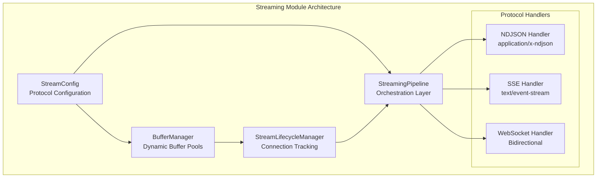
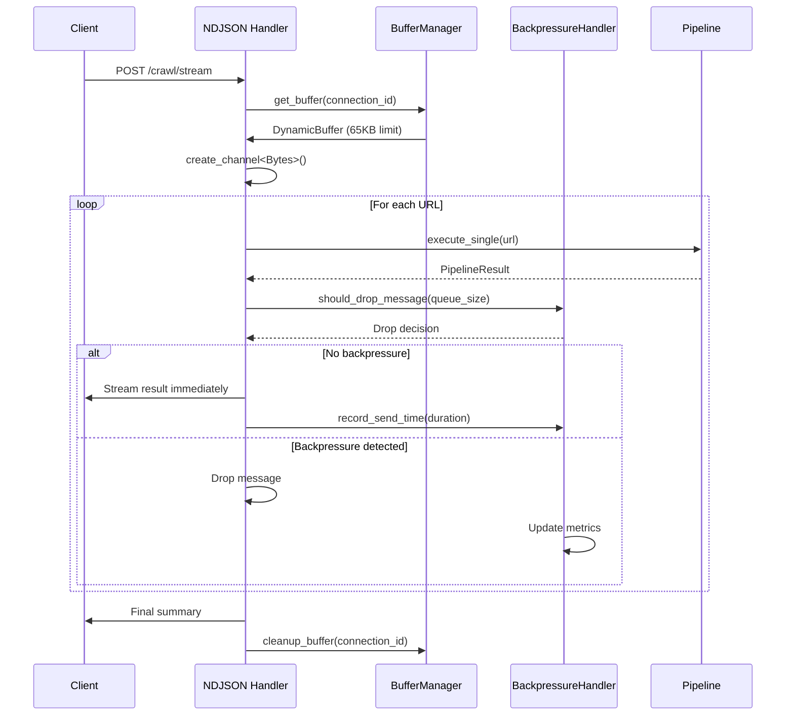
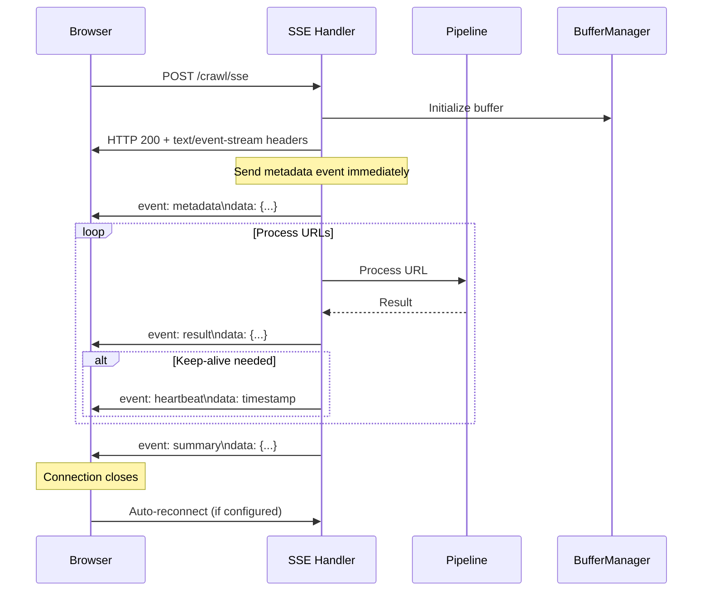
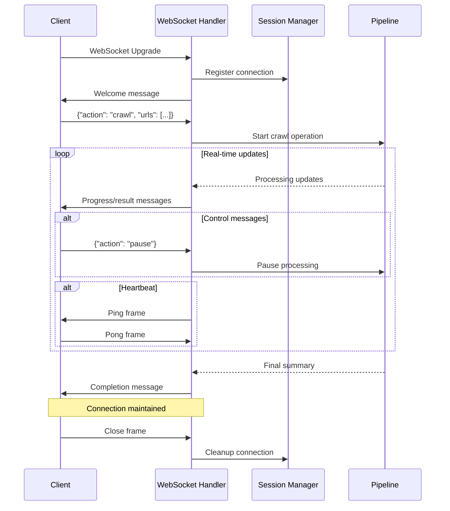
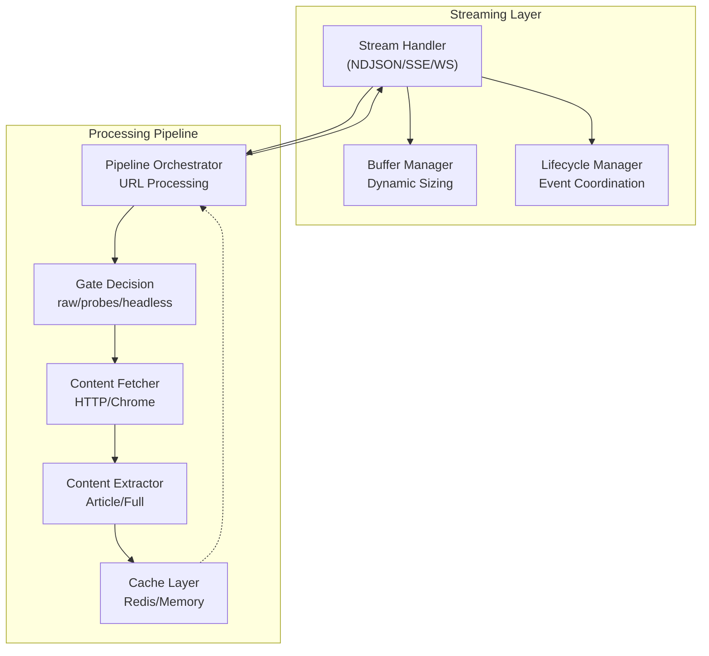
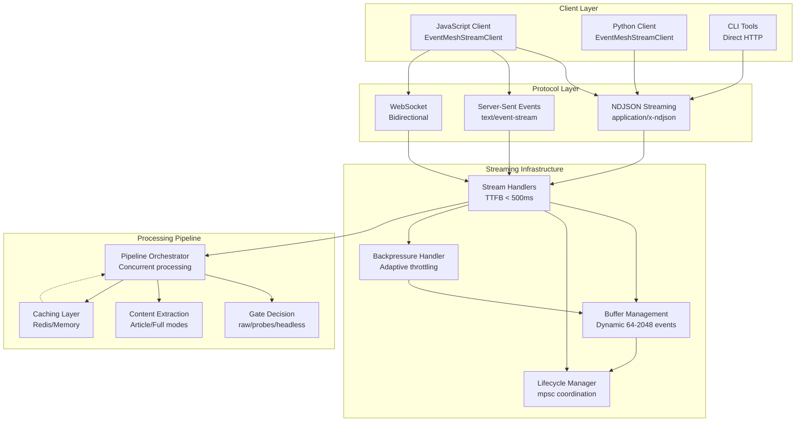

# Streaming API Documentation

## Overview

The EventMesh streaming infrastructure provides high-performance, real-time data delivery for web crawling and content extraction operations. Built on Rust's async runtime with Tokio, it delivers enterprise-grade streaming with sub-500ms TTFB (Time to First Byte), dynamic buffer management, and sophisticated backpressure handling.

**Key Performance Characteristics:**
- **TTFB**: < 500ms with warm cache
- **Buffer Management**: Dynamic sizing from 64-2048 events with 65,536-byte limits
- **Throughput**: Optimized for concurrent streaming with mpsc channels
- **Error Handling**: Zero-panic architecture with comprehensive error recovery
- **Memory Management**: Adaptive buffer sizing with automatic cleanup

## Architecture Components

### Core Streaming Infrastructure



### Supported Protocols

#### NDJSON (Newline Delimited JSON)
- **Endpoints**: `/crawl/stream`, `/deepsearch/stream`
- **Content-Type**: `application/x-ndjson`
- **Best For**: High-throughput batch processing, programmatic consumption
- **Buffer Management**: Dynamic sizing 64-2048 events, 65KB limit
- **Key Features**: Zero-copy streaming, immediate result delivery

#### Server-Sent Events (SSE)
- **Endpoint**: `/crawl/sse`
- **Content-Type**: `text/event-stream`
- **Best For**: Browser integration, automatic reconnection
- **Keep-Alive**: 30-second intervals with configurable retry
- **Key Features**: Event-based streaming with typed event handlers

#### WebSocket
- **Endpoint**: `/crawl/ws`
- **Protocol**: WebSocket (RFC 6455)
- **Best For**: Real-time bidirectional communication, control messaging
- **Key Features**: Ping/pong heartbeat, connection lifecycle management

## StreamLifecycleManager and MPSC Channels

### Lifecycle Management

The `StreamLifecycleManager` provides comprehensive connection lifecycle tracking using Tokio's mpsc (multi-producer, single-consumer) channels for event coordination:

```rust
use tokio::sync::mpsc;
use std::time::Instant;

// StreamLifecycleManager coordinates all streaming operations
pub struct StreamLifecycleManager {
    event_tx: mpsc::UnboundedSender<LifecycleEvent>,
    metrics: Arc<RipTideMetrics>,
    active_connections: Arc<RwLock<HashMap<String, ConnectionInfo>>>,
}

// Key lifecycle events tracked
pub enum LifecycleEvent {
    ConnectionEstablished { connection_id: String, protocol: String },
    StreamStarted { request_id: String, total_items: usize },
    ProgressUpdate { completed: usize, throughput: f64 },
    StreamCompleted { summary: StreamCompletionSummary },
    StreamError { error: String, recoverable: bool },
    ConnectionClosed { duration: Duration, bytes_sent: usize },
}
```

**MPSC Channel Architecture:**
- **Unbounded channels** for lifecycle events (no backpressure on metadata)
- **Bounded channels** for data streams (configurable buffer sizes)
- **Channel capacity** adapts based on client consumption rate
- **Graceful degradation** with message dropping under extreme load

### Connection Tracking

```rust
pub struct ConnectionInfo {
    pub connection_id: String,
    pub protocol: String,
    pub start_time: Instant,
    pub bytes_sent: usize,
    pub messages_sent: usize,
    pub current_request_id: Option<String>,
}
```

## NDJSON Implementation with Backpressure

### Architecture Overview

NDJSON streaming utilizes a sophisticated buffer management system with adaptive backpressure:



### Buffer Management Implementation

The streaming implementation uses `DynamicBuffer` for adaptive sizing:

```rust
pub struct DynamicBuffer {
    config: BufferConfig,
    current_capacity: AtomicUsize,
    stats: Arc<RwLock<BufferStats>>,
    send_times: Arc<RwLock<VecDeque<Duration>>>,
}

// Dynamic buffer configuration
pub struct BufferConfig {
    pub initial_size: usize,        // 256 events
    pub max_size: usize,           // 2048 events (65KB limit)
    pub min_size: usize,           // 64 events
    pub growth_factor: f64,        // 1.5x expansion
    pub shrink_factor: f64,        // 0.75x reduction
    pub slow_send_threshold_ms: u64,  // 100ms threshold
    pub backpressure_window: usize,   // 50 message window
}
```

**Adaptive Buffer Behavior:**
- **Growth**: Triggered by >1% message drop rate
- **Shrinkage**: Applied when backpressure detected for slow clients
- **Performance Tracking**: 50-message rolling window for send times
- **Memory Bounds**: Respects 65KB per-connection limits

### Basic Usage with Backpressure Headers

```bash
# Basic streaming with buffer management
curl -X POST 'http://localhost:8080/crawl/stream' \
  -H 'Content-Type: application/json' \
  -H 'X-Session-ID: session-1640995200-abc123' \
  -H 'X-Buffer-Size: 1024' \
  -H 'X-Buffer-Timeout: 2000' \
  -H 'X-Enable-Backpressure: true' \
  -d '{
    "urls": [
      "https://example.com/page1",
      "https://example.com/page2",
      "https://example.com/page3"
    ],
    "options": {
      "concurrency": 3,
      "cache_mode": "read_write",
      "timeout_seconds": 30
    }
  }' \
  --no-buffer

# Response includes backpressure headers
# HTTP/1.1 200 OK
# Content-Type: application/x-ndjson
# Transfer-Encoding: chunked
# X-Request-ID: req-uuid-here
# X-Buffer-Capacity: 1024
# X-Buffer-Current: 0
# X-Backpressure-Threshold: 800
```

### Performance Tuning Headers

| Header | Purpose | Default | Range |
|--------|---------|---------|-------|
| `X-Buffer-Size` | Initial buffer capacity | 256 | 64-2048 |
| `X-Buffer-Timeout` | Buffer flush interval (ms) | 2000 | 100-10000 |
| `X-Enable-Backpressure` | Enable adaptive throttling | true | boolean |
| `X-Slow-Client-Threshold` | Slow send threshold (ms) | 100 | 50-1000 |
| `X-Max-Memory-Per-Connection` | Memory limit (bytes) | 65536 | 4096-262144 |

### JavaScript Implementation with Backpressure Monitoring

```javascript
class EventMeshStreamClient {
  constructor(options = {}) {
    this.options = {
      bufferSize: options.bufferSize || 1024,
      enableBackpressure: options.enableBackpressure ?? true,
      slowClientThreshold: options.slowClientThreshold || 100,
      maxRetries: options.maxRetries || 3,
      ...options
    };
    this.metrics = {
      totalEvents: 0,
      droppedEvents: 0,
      avgProcessingTime: 0,
      backpressureEvents: 0
    };
  }

  async streamCrawlResults(urls, options = {}) {
    const sessionId = this.generateSessionId();
    const startTime = Date.now();

    const response = await fetch('/crawl/stream', {
      method: 'POST',
      headers: {
        'Content-Type': 'application/json',
        'X-Session-ID': sessionId,
        'X-Buffer-Size': this.options.bufferSize.toString(),
        'X-Enable-Backpressure': this.options.enableBackpressure.toString(),
        'X-Slow-Client-Threshold': this.options.slowClientThreshold.toString()
      },
      body: JSON.stringify({ urls, options })
    });

    if (!response.ok) {
      const errorText = await response.text();
      throw new Error(`Stream failed: ${response.status} - ${errorText}`);
    }

    // Monitor backpressure headers
    const backpressureInfo = {
      bufferCapacity: parseInt(response.headers.get('X-Buffer-Capacity')) || 0,
      currentBuffer: parseInt(response.headers.get('X-Buffer-Current')) || 0,
      threshold: parseInt(response.headers.get('X-Backpressure-Threshold')) || 0
    };

    console.log('Stream initialized:', {
      sessionId,
      backpressureInfo,
      requestId: response.headers.get('X-Request-ID')
    });

    return this.processStream(response.body, sessionId, startTime);
  }

  async processStream(body, sessionId, startTime) {
    const reader = body.getReader();
    const decoder = new TextDecoder();
    let buffer = '';

    try {
      while (true) {
        const { done, value } = await reader.read();
        if (done) break;

        const chunk = decoder.decode(value, { stream: true });
        buffer += chunk;

        // Process complete lines
        const lines = buffer.split('\n');
        buffer = lines.pop() || ''; // Keep incomplete line in buffer

        for (const line of lines) {
          if (!line.trim()) continue;

          const processingStart = performance.now();
          try {
            const event = JSON.parse(line);
            await this.handleStreamEvent(event, sessionId);
            this.updateMetrics(performance.now() - processingStart);
          } catch (error) {
            console.error('Failed to parse event:', error, 'Line:', line);
            this.metrics.droppedEvents++;
          }
        }
      }

      // Process any remaining buffer content
      if (buffer.trim()) {
        try {
          const event = JSON.parse(buffer);
          await this.handleStreamEvent(event, sessionId);
        } catch (error) {
          console.error('Failed to parse final event:', error);
        }
      }

    } finally {
      reader.releaseLock();
      this.logSessionMetrics(sessionId, Date.now() - startTime);
    }
  }

  async handleStreamEvent(event, sessionId) {
    this.metrics.totalEvents++;

    // Handle backpressure indicators
    if (event.buffer_info) {
      const usage = event.buffer_info.used / event.buffer_info.capacity;
      if (usage > 0.8) {
        console.warn(`High buffer usage: ${(usage * 100).toFixed(1)}%`);
        this.metrics.backpressureEvents++;
      }
    }

    switch (event.event || event.message_type) {
      case 'metadata':
        console.log(`Starting crawl: ${event.total_urls} URLs`);
        this.onMetadata?.(event);
        break;

      case 'progress':
        const progress = (event.completed / event.total) * 100;
        console.log(`Progress: ${progress.toFixed(1)}% (${event.completed}/${event.total})`);
        this.onProgress?.(event);
        break;

      case 'result':
        console.log(`Processed: ${event.result.url} (${event.result.status})`);
        this.onResult?.(event);
        break;

      case 'error':
        console.error(`Stream error: ${event.error || event.message}`);
        this.onError?.(event);
        break;

      case 'summary':
        console.log(`Completed: ${event.successful}/${event.total_urls} successful`);
        this.onSummary?.(event);
        break;

      case 'backpressure_warning':
        console.warn('Backpressure detected - consider reducing request rate');
        this.onBackpressure?.(event);
        break;

      default:
        console.debug('Unknown event type:', event);
    }
  }

  updateMetrics(processingTimeMs) {
    const total = this.metrics.totalEvents;
    this.metrics.avgProcessingTime =
      ((this.metrics.avgProcessingTime * (total - 1)) + processingTimeMs) / total;
  }

  logSessionMetrics(sessionId, durationMs) {
    console.log('Session metrics:', {
      sessionId,
      duration: `${durationMs}ms`,
      totalEvents: this.metrics.totalEvents,
      droppedEvents: this.metrics.droppedEvents,
      backpressureEvents: this.metrics.backpressureEvents,
      avgProcessingTime: `${this.metrics.avgProcessingTime.toFixed(2)}ms`,
      dropRate: `${((this.metrics.droppedEvents / this.metrics.totalEvents) * 100).toFixed(2)}%`
    });
  }

  generateSessionId() {
    return `session-${Date.now()}-${Math.random().toString(36).substring(2, 8)}`;
  }
}

// Usage with event handlers
const client = new EventMeshStreamClient({
  bufferSize: 2048,
  enableBackpressure: true,
  slowClientThreshold: 150
});

client.onProgress = (event) => updateProgressBar(event.completed, event.total);
client.onResult = (event) => displayResult(event.result);
client.onBackpressure = (event) => adjustRequestRate();

// Start streaming
try {
  await client.streamCrawlResults(urls, {
    concurrency: 5,
    cache_mode: 'read_write',
    timeout_seconds: 30
  });
} catch (error) {
  console.error('Streaming failed:', error);
}

async function handleStreamEvent(event) {
  switch (event.event) {
    case 'start':
      console.log(`Starting crawl of ${event.total_urls} URLs`);
      updateProgressBar(0, event.total_urls);
      break;

    case 'progress':
      console.log(`Progress: ${event.completed}/${event.total}`);
      updateProgressBar(event.completed, event.total);
      break;

    case 'result':
      console.log(`Processed: ${event.url} (${event.status})`);
      displayResult(event);
      break;

    case 'summary':
      console.log(`Completed: ${event.successful}/${event.total_urls} successful`);
      displaySummary(event);
      break;

    case 'error':
      console.error(`Stream error: ${event.error.message}`);
      handleStreamError(event.error);
      break;

    case 'ping':
      console.debug('Received ping from server');
      break;

    default:
      console.warn('Unknown event type:', event.event);
  }
}
```

### Python Implementation with Performance Monitoring

```python
import requests
import json
import time
import random
import threading
from collections import deque, defaultdict
from dataclasses import dataclass, field
from typing import Optional, Dict, Any, Callable, List
import logging

@dataclass
class StreamMetrics:
    """Tracks streaming performance metrics"""
    total_events: int = 0
    dropped_events: int = 0
    parse_errors: int = 0
    avg_processing_time_ms: float = 0.0
    backpressure_warnings: int = 0
    buffer_utilization_history: deque = field(default_factory=lambda: deque(maxlen=100))
    event_rates: deque = field(default_factory=lambda: deque(maxlen=50))
    start_time: float = field(default_factory=time.time)

    def update_processing_time(self, processing_time_ms: float):
        """Update running average of processing time"""
        if self.total_events == 0:
            self.avg_processing_time_ms = processing_time_ms
        else:
            total_time = self.avg_processing_time_ms * self.total_events
            self.avg_processing_time_ms = (total_time + processing_time_ms) / (self.total_events + 1)
        self.total_events += 1

    def record_event_rate(self):
        """Record event arrival rate"""
        now = time.time()
        self.event_rates.append(now)

    def get_events_per_second(self) -> float:
        """Calculate current events per second"""
        if len(self.event_rates) < 2:
            return 0.0
        time_span = self.event_rates[-1] - self.event_rates[0]
        return (len(self.event_rates) - 1) / time_span if time_span > 0 else 0.0

class EventMeshStreamClient:
    """Advanced Python client for EventMesh streaming with performance monitoring"""

    def __init__(self, base_url: str = "http://localhost:8080", **options):
        self.base_url = base_url
        self.session = requests.Session()
        self.options = {
            'buffer_size': options.get('buffer_size', 1024),
            'enable_backpressure': options.get('enable_backpressure', True),
            'slow_client_threshold_ms': options.get('slow_client_threshold_ms', 100),
            'max_retries': options.get('max_retries', 3),
            'timeout_seconds': options.get('timeout_seconds', 300),
            'chunk_size': options.get('chunk_size', 8192),
            **options
        }
        self.metrics = StreamMetrics()
        self.event_handlers: Dict[str, Callable] = {}
        self.logger = logging.getLogger(__name__)

    def register_handler(self, event_type: str, handler: Callable[[Dict[str, Any]], None]):
        """Register event handler for specific event types"""
        self.event_handlers[event_type] = handler

    def stream_crawl_results(self, urls: List[str], options: Optional[Dict[str, Any]] = None) -> StreamMetrics:
        """Stream crawl results with comprehensive monitoring"""
        session_id = self._generate_session_id()

        headers = {
            'Content-Type': 'application/json',
            'X-Session-ID': session_id,
            'X-Buffer-Size': str(self.options['buffer_size']),
            'X-Enable-Backpressure': str(self.options['enable_backpressure']).lower(),
            'X-Slow-Client-Threshold': str(self.options['slow_client_threshold_ms'])
        }

        payload = {
            'urls': urls,
            'options': options or {}
        }

        self.logger.info(f"Starting stream for session {session_id} with {len(urls)} URLs")

        try:
            response = self.session.post(
                f"{self.base_url}/crawl/stream",
                headers=headers,
                json=payload,
                stream=True,
                timeout=self.options['timeout_seconds']
            )
            response.raise_for_status()

            # Log response headers for debugging
            buffer_info = {
                'capacity': response.headers.get('X-Buffer-Capacity'),
                'current': response.headers.get('X-Buffer-Current'),
                'threshold': response.headers.get('X-Backpressure-Threshold')
            }
            self.logger.info(f"Stream initialized: {buffer_info}")

            self._process_stream(response, session_id)

        except requests.RequestException as e:
            self.logger.error(f"Stream request failed: {e}")
            raise
        except Exception as e:
            self.logger.error(f"Unexpected error during streaming: {e}")
            raise
        finally:
            self._log_session_metrics(session_id)

        return self.metrics

    def _process_stream(self, response: requests.Response, session_id: str):
        """Process the streaming response with chunked reading"""
        buffer = ""

        try:
            for chunk in response.iter_content(
                chunk_size=self.options['chunk_size'],
                decode_unicode=True
            ):
                if not chunk:
                    continue

                buffer += chunk
                lines = buffer.split('\n')
                buffer = lines.pop()  # Keep incomplete line

                for line in lines:
                    if not line.strip():
                        continue

                    processing_start = time.time()
                    try:
                        event = json.loads(line)
                        self._handle_stream_event(event, session_id)

                        processing_time = (time.time() - processing_start) * 1000
                        self.metrics.update_processing_time(processing_time)
                        self.metrics.record_event_rate()

                    except json.JSONDecodeError as e:
                        self.logger.error(f"Failed to parse event: {e} | Line: {line[:100]}...")
                        self.metrics.parse_errors += 1
                    except Exception as e:
                        self.logger.error(f"Error handling event: {e}")
                        self.metrics.dropped_events += 1

            # Process any remaining buffer content
            if buffer.strip():
                try:
                    event = json.loads(buffer)
                    self._handle_stream_event(event, session_id)
                except json.JSONDecodeError:
                    self.logger.warning(f"Failed to parse final buffer content: {buffer[:100]}...")

        except Exception as e:
            self.logger.error(f"Error processing stream: {e}")
            raise

    def _handle_stream_event(self, event: Dict[str, Any], session_id: str):
        """Handle individual stream events with metrics tracking"""
        event_type = event.get('event') or event.get('message_type', 'unknown')

        # Track buffer utilization if provided
        if 'buffer_info' in event:
            buffer_info = event['buffer_info']
            utilization = buffer_info.get('used', 0) / max(buffer_info.get('capacity', 1), 1)
            self.metrics.buffer_utilization_history.append(utilization)

            if utilization > 0.8:
                self.logger.warning(f"High buffer utilization: {utilization:.1%}")
                self.metrics.backpressure_warnings += 1

        # Call registered handler if available
        if event_type in self.event_handlers:
            try:
                self.event_handlers[event_type](event)
            except Exception as e:
                self.logger.error(f"Event handler failed for {event_type}: {e}")

        # Default event handling
        if event_type == 'metadata':
            self.logger.info(f"Stream metadata: {event.get('total_urls')} URLs to process")
        elif event_type == 'progress':
            completed = event.get('completed', 0)
            total = event.get('total', 1)
            progress = (completed / total) * 100
            throughput = self.metrics.get_events_per_second()
            self.logger.info(
                f"Progress: {progress:.1f}% ({completed}/{total}) | "
                f"Throughput: {throughput:.1f} events/sec"
            )
        elif event_type == 'result':
            result = event.get('result', {})
            self.logger.debug(f"Result: {result.get('url')} - Status: {result.get('status')}")
        elif event_type == 'error':
            error_info = event.get('error', event.get('message', 'Unknown error'))
            self.logger.error(f"Stream error: {error_info}")
        elif event_type == 'summary':
            summary = {
                'successful': event.get('successful', 0),
                'total': event.get('total_urls', 0),
                'duration_ms': event.get('total_processing_time_ms', 0),
                'cache_hit_rate': event.get('cache_hit_rate', 0.0)
            }
            self.logger.info(f"Stream completed: {summary}")
        elif event_type == 'backpressure_warning':
            self.logger.warning("Backpressure warning received - consider reducing request rate")
            self.metrics.backpressure_warnings += 1

    def _generate_session_id(self) -> str:
        """Generate unique session ID"""
        return f"session-{int(time.time())}-{random.randint(100000, 999999)}"

    def _log_session_metrics(self, session_id: str):
        """Log comprehensive session metrics"""
        duration = time.time() - self.metrics.start_time
        avg_buffer_util = (
            sum(self.metrics.buffer_utilization_history) / len(self.metrics.buffer_utilization_history)
            if self.metrics.buffer_utilization_history else 0.0
        )

        metrics_summary = {
            'session_id': session_id,
            'duration_seconds': f"{duration:.2f}",
            'total_events': self.metrics.total_events,
            'dropped_events': self.metrics.dropped_events,
            'parse_errors': self.metrics.parse_errors,
            'backpressure_warnings': self.metrics.backpressure_warnings,
            'avg_processing_time_ms': f"{self.metrics.avg_processing_time_ms:.2f}",
            'events_per_second': f"{self.metrics.get_events_per_second():.2f}",
            'avg_buffer_utilization': f"{avg_buffer_util:.1%}",
            'error_rate': f"{(self.metrics.dropped_events / max(self.metrics.total_events, 1)):.2%}"
        }

        self.logger.info(f"Session metrics: {json.dumps(metrics_summary, indent=2)}")

# Usage Example
if __name__ == "__main__":
    import logging
    logging.basicConfig(level=logging.INFO)

    # Create client with custom options
    client = EventMeshStreamClient(
        buffer_size=2048,
        enable_backpressure=True,
        slow_client_threshold_ms=150
    )

    # Register custom event handlers
    def handle_progress(event):
        print(f"\rProgress: {(event['completed']/event['total']*100):.1f}%", end="")

    def handle_result(event):
        result = event['result']
        if result.get('document'):
            print(f"\nProcessed: {result['url']} - {result['document'].get('title', 'No title')}")

    client.register_handler('progress', handle_progress)
    client.register_handler('result', handle_result)

    # URLs to process
    urls = [
        'https://example.com/page1',
        'https://example.com/page2',
        'https://example.com/page3'
    ]

    # Stream options
    options = {
        'concurrency': 5,
        'cache_mode': 'read_write',
        'timeout_seconds': 30
    }

    try:
        metrics = client.stream_crawl_results(urls, options)
        print(f"\nStreaming completed successfully!")
        print(f"Total events: {metrics.total_events}")
        print(f"Average processing time: {metrics.avg_processing_time_ms:.2f}ms")
    except Exception as e:
        print(f"Streaming failed: {e}")
```

## Enhanced Stream Event Types with Buffer Information

### Metadata Event (Stream Start)

Sent immediately upon stream initialization for optimal TTFB:

```json
{
  "event": "metadata",
  "total_urls": 100,
  "request_id": "req-uuid-1640995200-abc123",
  "session_id": "session-1640995200-abc123",
  "timestamp": "2024-01-15T10:30:00Z",
  "stream_type": "crawl",
  "buffer_info": {
    "capacity": 1024,
    "current_size": 0,
    "max_memory_bytes": 65536,
    "backpressure_threshold": 800,
    "adaptive_sizing_enabled": true
  },
  "performance_config": {
    "ttfb_target_ms": 500,
    "slow_client_threshold_ms": 100,
    "buffer_flush_interval_ms": 50
  }
}
```

### Progress Event with Performance Metrics

Sent during processing with real-time performance data:

```json
{
  "event": "progress",
  "completed": 25,
  "total": 100,
  "current_url": "https://example.com/current-page",
  "timestamp": "2024-01-15T10:30:15Z",
  "phase": "extraction",
  "estimated_completion": "2024-01-15T10:32:00Z",
  "performance_metrics": {
    "throughput_per_second": 4.2,
    "avg_processing_time_ms": 238,
    "success_rate": 0.96,
    "cache_hit_rate": 0.34
  },
  "buffer_info": {
    "used": 156,
    "capacity": 1024,
    "utilization_percentage": 15.2,
    "pending_flushes": 0,
    "backpressure_detected": false
  },
  "connection_health": {
    "avg_send_time_ms": 45,
    "slow_sends_count": 2,
    "is_slow_client": false
  }
}
```

### Result Event with Pipeline Integration

Sent immediately as each URL completes processing (no batching):

```json
{
  "event": "result",
  "index": 24,
  "result": {
    "url": "https://example.com/page1",
    "status": 200,
    "from_cache": false,
    "gate_decision": "raw",
    "quality_score": 0.85,
    "processing_time_ms": 1250,
    "document": {
      "url": "https://example.com/page1",
      "title": "Page Title",
      "markdown": "# Page Title\n\nContent...",
      "text": "Page Title. Content...",
      "word_count": 1200,
      "reading_time": 5,
      "quality_score": 85,
      "extracted_at": "2024-01-15T10:30:10Z",
      "content_hash": "sha256:abc123..."
    },
    "error": null,
    "cache_key": "crawl:v1:example.com:page1:7d2a8c9b"
  },
  "progress": {
    "completed": 25,
    "total": 100,
    "success_rate": 0.96
  },
  "timestamp": "2024-01-15T10:30:10Z",
  "pipeline_metadata": {
    "gate_decision_reason": "Content-Type: text/html, size: 1024KB",
    "extraction_method": "readability",
    "processing_stages": ["fetch", "parse", "extract", "clean"]
  }
}
```

### Summary Event with Performance Analysis

Sent when streaming completes with comprehensive metrics:

```json
{
  "event": "summary",
  "total_urls": 100,
  "successful": 95,
  "failed": 5,
  "from_cache": 35,
  "total_processing_time_ms": 45000,
  "cache_hit_rate": 0.35,
  "performance_summary": {
    "avg_processing_time_ms": 450,
    "fastest_processing_ms": 45,
    "slowest_processing_ms": 2100,
    "throughput_per_second": 2.11,
    "ttfb_ms": 245,
    "total_bytes_transferred": 45670912
  },
  "gate_decisions": {
    "raw": 60,
    "probes_first": 25,
    "headless": 10,
    "cached": 35
  },
  "buffer_statistics": {
    "peak_utilization": 0.78,
    "avg_utilization": 0.23,
    "total_flushes": 156,
    "messages_dropped": 2,
    "backpressure_events": 0,
    "buffer_resizes": 3
  },
  "error_analysis": {
    "error_types": {
      "timeout": 3,
      "network_error": 1,
      "parse_error": 1
    },
    "retryable_errors": 4,
    "permanent_failures": 1
  },
  "timestamp": "2024-01-15T10:32:00Z"
}
```

### Error Events with Recovery Context

Sent when processing or streaming errors occur:

```json
{
  "event": "error",
  "url": "https://example.com/failed-page",
  "error": {
    "type": "processing_error",
    "category": "network",
    "message": "Connection timeout after 30 seconds",
    "retryable": true,
    "retry_after_seconds": 60,
    "error_code": "NET_TIMEOUT",
    "context": {
      "attempt_number": 1,
      "max_retries": 3,
      "timeout_threshold_ms": 30000
    },
    "timestamp": "2024-01-15T10:30:45Z"
  },
  "recovery_suggestions": [
    "Retry with longer timeout",
    "Check network connectivity",
    "Verify URL accessibility"
  ]
}

// Streaming-specific error event
{
  "event": "backpressure_warning",
  "connection_id": "conn-abc123",
  "warning": {
    "type": "slow_client",
    "message": "Client processing too slow, buffer at 85% capacity",
    "buffer_utilization": 0.85,
    "avg_send_time_ms": 250,
    "suggested_actions": [
      "Reduce request concurrency",
      "Increase client processing speed",
      "Consider larger buffer size"
    ]
  },
  "current_metrics": {
    "buffer_used": 870,
    "buffer_capacity": 1024,
    "pending_messages": 45,
    "slow_sends_count": 12
  },
  "timestamp": "2024-01-15T10:31:00Z"
}
```

### Heartbeat and Health Events

Keep-alive with system health information:

```json
{
  "event": "heartbeat",
  "timestamp": "2024-01-15T10:31:00Z",
  "session_id": "session-1640995200-abc123",
  "server_health": {
    "status": "healthy",
    "active_connections": 23,
    "system_load": 0.45,
    "memory_usage_mb": 156,
    "uptime_seconds": 86400
  },
  "connection_stats": {
    "bytes_sent": 1456789,
    "messages_sent": 1024,
    "avg_send_time_ms": 12,
    "connection_duration_seconds": 45
  }
}

// System health status event
{
  "event": "system_status",
  "timestamp": "2024-01-15T10:31:00Z",
  "streaming_health": {
    "status": "degraded",
    "score": 75,
    "issues": [
      "High buffer utilization across connections",
      "Elevated error rate: 5.2%"
    ]
  },
  "global_metrics": {
    "active_streams": 25,
    "total_throughput_events_per_sec": 245.6,
    "global_error_rate": 0.052,
    "avg_connection_duration_seconds": 124
  }
}
```

## Server-Sent Events (SSE) Integration

### SSE Implementation with Automatic Reconnection

SSE provides browser-native streaming with built-in reconnection capabilities:



### SSE Configuration

```rust
// SSE-specific configuration
pub struct SseConfig {
    pub keep_alive_interval: Duration,      // 30 seconds
    pub max_connection_time: Duration,      // 5 minutes
    pub retry_interval: Duration,           // 3 seconds
    pub max_buffered_events: usize,        // 128 events
    pub enable_cors: bool,                  // true
    pub custom_headers: Vec<(String, String)>,
}
```

### Browser SSE Client with Reconnection

```javascript
class EventMeshSSEClient {
  constructor(options = {}) {
    this.options = {
      maxReconnectAttempts: options.maxReconnectAttempts || 5,
      baseRetryDelay: options.baseRetryDelay || 1000,
      maxRetryDelay: options.maxRetryDelay || 30000,
      ...options
    };
    this.reconnectCount = 0;
    this.eventSource = null;
  }

  async startCrawlSSE(urls, options = {}) {
    const sessionId = this.generateSessionId();

    // First, initiate the crawl
    const response = await fetch('/crawl/sse', {
      method: 'POST',
      headers: {
        'Content-Type': 'application/json',
        'X-Session-ID': sessionId
      },
      body: JSON.stringify({ urls, options })
    });

    if (!response.ok) {
      throw new Error(`SSE initialization failed: ${response.status}`);
    }

    // Create EventSource for the stream
    return this.connectEventSource(sessionId);
  }

  connectEventSource(sessionId) {
    const url = `/crawl/sse/stream?session_id=${sessionId}`;
    this.eventSource = new EventSource(url);

    this.eventSource.onopen = () => {
      console.log('SSE connection established');
      this.reconnectCount = 0;
      this.onConnectionOpen?.(sessionId);
    };

    // Handle different event types
    this.eventSource.addEventListener('metadata', (event) => {
      const data = JSON.parse(event.data);
      console.log('Stream metadata:', data);
      this.onMetadata?.(data);
    });

    this.eventSource.addEventListener('progress', (event) => {
      const data = JSON.parse(event.data);
      const progress = (data.completed / data.total) * 100;
      console.log(`Progress: ${progress.toFixed(1)}%`);
      this.onProgress?.(data);
    });

    this.eventSource.addEventListener('result', (event) => {
      const data = JSON.parse(event.data);
      console.log('Result received:', data.result.url);
      this.onResult?.(data);
    });

    this.eventSource.addEventListener('summary', (event) => {
      const data = JSON.parse(event.data);
      console.log('Stream completed:', data);
      this.onSummary?.(data);
      this.disconnect();
    });

    this.eventSource.addEventListener('error', (event) => {
      const data = JSON.parse(event.data);
      console.error('Stream error:', data);
      this.onError?.(data);
    });

    this.eventSource.addEventListener('heartbeat', (event) => {
      const data = JSON.parse(event.data);
      console.debug('Heartbeat:', data.timestamp);
      this.onHeartbeat?.(data);
    });

    this.eventSource.onerror = (error) => {
      console.error('EventSource error:', error);
      this.handleReconnection(sessionId);
    };

    return this.eventSource;
  }

  handleReconnection(sessionId) {
    if (this.reconnectCount >= this.options.maxReconnectAttempts) {
      console.error('Max reconnection attempts reached');
      this.onMaxReconnectAttemptsReached?.();
      return;
    }

    this.reconnectCount++;
    const delay = Math.min(
      this.options.baseRetryDelay * Math.pow(2, this.reconnectCount - 1),
      this.options.maxRetryDelay
    );

    console.log(`Reconnecting in ${delay}ms (attempt ${this.reconnectCount})`);
    setTimeout(() => {
      this.connectEventSource(sessionId);
    }, delay);
  }

  disconnect() {
    if (this.eventSource) {
      this.eventSource.close();
      this.eventSource = null;
    }
  }

  generateSessionId() {
    return `sse-session-${Date.now()}-${Math.random().toString(36).substring(2, 8)}`;
  }
}

// Usage
const sseClient = new EventMeshSSEClient({
  maxReconnectAttempts: 3,
  baseRetryDelay: 2000
});

sseClient.onProgress = (data) => updateProgressBar(data.completed, data.total);
sseClient.onResult = (data) => displayResult(data.result);
sseClient.onSummary = (data) => showFinalSummary(data);

try {
  await sseClient.startCrawlSSE(urls, { concurrency: 3 });
} catch (error) {
  console.error('SSE streaming failed:', error);
}
```

## WebSocket Protocol Support

### Bidirectional Communication Architecture

WebSocket implementation provides full-duplex communication for real-time control and monitoring:



### WebSocket Message Protocol

```rust
// WebSocket message structure
#[derive(Serialize, Deserialize)]
pub struct WebSocketMessage {
    pub message_type: String,
    pub data: serde_json::Value,
    pub timestamp: String,
}

// Request message format
#[derive(Serialize, Deserialize)]
pub struct WebSocketRequest {
    pub action: String,        // "crawl", "pause", "resume", "cancel", "status"
    pub request_id: String,
    pub data: serde_json::Value,
    pub timestamp: String,
}
```

### JavaScript WebSocket Client with Control Features

```javascript
class EventMeshWebSocketClient {
  constructor(baseUrl = 'ws://localhost:8080') {
    this.baseUrl = baseUrl;
    this.ws = null;
    this.sessionId = null;
    this.activeRequests = new Map();
    this.isConnected = false;
    this.reconnectAttempts = 0;
    this.maxReconnectAttempts = 5;
    this.heartbeatInterval = null;
  }

  async connect() {
    this.sessionId = `ws-${Date.now()}-${Math.random().toString(36).substring(2, 8)}`;
    const wsUrl = `${this.baseUrl}/crawl/ws?session_id=${this.sessionId}`;

    return new Promise((resolve, reject) => {
      this.ws = new WebSocket(wsUrl);

      this.ws.onopen = () => {
        console.log(`WebSocket connected: ${this.sessionId}`);
        this.isConnected = true;
        this.reconnectAttempts = 0;
        this.startHeartbeat();
        resolve();
      };

      this.ws.onmessage = (event) => {
        try {
          const message = JSON.parse(event.data);
          this.handleMessage(message);
        } catch (error) {
          console.error('Failed to parse WebSocket message:', error);
        }
      };

      this.ws.onclose = (event) => {
        console.log(`WebSocket closed: ${event.code} - ${event.reason}`);
        this.isConnected = false;
        this.stopHeartbeat();

        if (event.code !== 1000 && this.reconnectAttempts < this.maxReconnectAttempts) {
          this.attemptReconnect();
        }
      };

      this.ws.onerror = (error) => {
        console.error('WebSocket error:', error);
        reject(error);
      };
    });
  }

  startHeartbeat() {
    this.heartbeatInterval = setInterval(() => {
      if (this.isConnected) {
        this.send({
          action: 'ping',
          request_id: `ping-${Date.now()}`,
          data: {},
          timestamp: new Date().toISOString()
        });
      }
    }, 30000); // 30 second heartbeat
  }

  stopHeartbeat() {
    if (this.heartbeatInterval) {
      clearInterval(this.heartbeatInterval);
      this.heartbeatInterval = null;
    }
  }

  send(message) {
    if (this.isConnected && this.ws.readyState === WebSocket.OPEN) {
      this.ws.send(JSON.stringify(message));
    } else {
      console.warn('WebSocket not connected, message queued');
      // Could implement message queuing here
    }
  }

  async crawl(urls, options = {}) {
    const requestId = `crawl-${Date.now()}`;

    return new Promise((resolve, reject) => {
      const results = [];
      let summary = null;

      this.activeRequests.set(requestId, {
        resolve,
        reject,
        results,
        onProgress: options.onProgress,
        onResult: options.onResult
      });

      this.send({
        action: 'crawl',
        request_id: requestId,
        data: { urls, options },
        timestamp: new Date().toISOString()
      });
    });
  }

  pauseCrawl(requestId) {
    this.send({
      action: 'pause',
      request_id: requestId,
      data: {},
      timestamp: new Date().toISOString()
    });
  }

  resumeCrawl(requestId) {
    this.send({
      action: 'resume',
      request_id: requestId,
      data: {},
      timestamp: new Date().toISOString()
    });
  }

  cancelCrawl(requestId) {
    this.send({
      action: 'cancel',
      request_id: requestId,
      data: {},
      timestamp: new Date().toISOString()
    });
  }

  handleMessage(message) {
    const { message_type, data } = message;

    switch (message_type) {
      case 'welcome':
        console.log('WebSocket welcome received:', data);
        this.onWelcome?.(data);
        break;

      case 'result':
        const request = this.activeRequests.get(data.request_id);
        if (request) {
          request.results.push(data);
          request.onResult?.(data);
        }
        break;

      case 'progress':
        const progressRequest = this.activeRequests.get(data.request_id);
        if (progressRequest) {
          progressRequest.onProgress?.(data);
        }
        break;

      case 'summary':
        const summaryRequest = this.activeRequests.get(data.request_id);
        if (summaryRequest) {
          summaryRequest.resolve({ results: summaryRequest.results, summary: data });
          this.activeRequests.delete(data.request_id);
        }
        break;

      case 'error':
        const errorRequest = this.activeRequests.get(data.request_id);
        if (errorRequest) {
          errorRequest.reject(new Error(data.message));
          this.activeRequests.delete(data.request_id);
        }
        break;

      case 'pong':
        console.debug('Pong received');
        break;

      default:
        console.log('Unknown message type:', message_type, data);
    }
  }

  disconnect() {
    this.stopHeartbeat();
    if (this.ws) {
      this.ws.close(1000, 'Client disconnect');
    }
  }
}

// Usage with real-time control
const wsClient = new EventMeshWebSocketClient();

try {
  await wsClient.connect();

  const crawlPromise = wsClient.crawl(urls, {
    concurrency: 3,
    onProgress: (data) => console.log(`Progress: ${data.completed}/${data.total}`),
    onResult: (data) => console.log(`Result: ${data.result.url}`)
  });

  // Example of real-time control
  setTimeout(() => {
    wsClient.pauseCrawl('crawl-123'); // Pause after 10 seconds
  }, 10000);

  const { results, summary } = await crawlPromise;
  console.log('Crawl completed:', summary);

} catch (error) {
  console.error('WebSocket crawl failed:', error);
} finally {
  wsClient.disconnect();
}
```

## Deep Search Streaming with Pipeline Integration

### Deep Search Implementation with Real-time Content Extraction

The `/deepsearch/stream` endpoint provides streaming for web search operations:

```javascript
async function streamDeepSearch(query, options = {}) {
  const sessionId = `search-${Date.now()}-${Math.random().toString(36).substring(2, 8)}`;

  const response = await fetch('/deepsearch/stream', {
    method: 'POST',
    headers: {
      'Content-Type': 'application/json',
      'X-Session-ID': sessionId
    },
    body: JSON.stringify({
      query,
      limit: options.limit || 10,
      include_content: options.include_content !== false,
      crawl_options: options.crawl_options || {}
    })
  });

  const reader = response.body.getReader();
  const decoder = new TextDecoder();

  try {
    while (true) {
      const { done, value } = await reader.read();
      if (done) break;

      const chunk = decoder.decode(value, { stream: true });
      const lines = chunk.split('\n');

      for (const line of lines) {
        if (!line.trim()) continue;

        try {
          const event = JSON.parse(line);
          await handleDeepSearchEvent(event);
        } catch (error) {
          console.error('Failed to parse event:', error);
        }
      }
    }
  } finally {
    reader.releaseLock();
  }
}

async function handleDeepSearchEvent(event) {
  switch (event.event) {
    case 'search_start':
      console.log(`Starting search for: "${event.query}"`);
      break;

    case 'search_results':
      console.log(`Found ${event.urls_found} URLs from search`);
      displaySearchResults(event.results);
      break;

    case 'crawl_start':
      console.log(`Starting content extraction for ${event.total_urls} URLs`);
      break;

    case 'search_result':
      console.log(`Extracted content for: ${event.url}`);
      displaySearchResult(event);
      break;

    case 'search_summary':
      console.log(`Search completed: ${event.urls_crawled}/${event.urls_found} URLs processed`);
      break;

    default:
      // Handle standard crawl events
      await handleStreamEvent(event);
  }
}
```

### Deep Search Event Types

#### Search Start Event

```json
{
  "event": "search_start",
  "query": "machine learning best practices",
  "limit": 10,
  "timestamp": "2024-01-15T10:30:00Z"
}
```

#### Search Results Event

```json
{
  "event": "search_results",
  "query": "machine learning best practices",
  "urls_found": 10,
  "results": [
    {
      "url": "https://example.com/ml-guide",
      "rank": 1,
      "search_title": "ML Best Practices Guide",
      "search_snippet": "Comprehensive guide to ML..."
    }
  ],
  "timestamp": "2024-01-15T10:30:05Z"
}
```

#### Search Result Event

```json
{
  "event": "search_result",
  "url": "https://example.com/ml-guide",
  "rank": 1,
  "search_title": "ML Best Practices Guide",
  "search_snippet": "Comprehensive guide to ML...",
  "content": {
    "title": "Machine Learning Best Practices",
    "markdown": "# ML Best Practices\n\n...",
    "word_count": 2500
  },
  "crawl_result": {
    "status": 200,
    "processing_time_ms": 1800,
    "quality_score": 0.92
  },
  "timestamp": "2024-01-15T10:30:12Z"
}
```

## Server-Sent Events (SSE)

### Browser Implementation

```html
<!DOCTYPE html>
<html>
<head>
    <title>RipTide SSE Example</title>
</head>
<body>
    <div id="status"></div>
    <div id="progress"></div>
    <div id="results"></div>

    <script>
    async function startSSECrawl(urls, options = {}) {
        const sessionId = `session-${Date.now()}-${Math.random().toString(36).substring(2, 8)}`;

        // First, initiate the crawl
        const response = await fetch('/crawl/sse', {
            method: 'POST',
            headers: {
                'Content-Type': 'application/json',
                'X-Session-ID': sessionId
            },
            body: JSON.stringify({ urls, options })
        });

        if (!response.ok) {
            throw new Error(`SSE failed: ${response.status}`);
        }

        // Create EventSource for the stream
        const eventSource = new EventSource(`/crawl/sse?session_id=${sessionId}`);

        eventSource.onopen = () => {
            console.log('SSE connection opened');
            document.getElementById('status').textContent = 'Connected';
        };

        eventSource.addEventListener('start', (event) => {
            const data = JSON.parse(event.data);
            console.log('Crawl started:', data);
            document.getElementById('status').textContent = `Processing ${data.total_urls} URLs`;
        });

        eventSource.addEventListener('progress', (event) => {
            const data = JSON.parse(event.data);
            const progress = (data.completed / data.total) * 100;
            document.getElementById('progress').innerHTML = `
                <div style="width: 100%; background: #f0f0f0;">
                    <div style="width: ${progress}%; background: #4caf50; height: 20px;"></div>
                </div>
                <p>Progress: ${data.completed}/${data.total} (${progress.toFixed(1)}%)</p>
            `;
        });

        eventSource.addEventListener('result', (event) => {
            const data = JSON.parse(event.data);
            const resultDiv = document.createElement('div');
            resultDiv.innerHTML = `
                <div style="border: 1px solid #ccc; margin: 10px; padding: 10px;">
                    <h3>${data.document?.title || data.url}</h3>
                    <p><strong>URL:</strong> ${data.url}</p>
                    <p><strong>Status:</strong> ${data.status}</p>
                    <p><strong>Processing Time:</strong> ${data.processing_time_ms}ms</p>
                    <p><strong>Quality Score:</strong> ${(data.quality_score * 100).toFixed(1)}%</p>
                    ${data.document?.text ? `<p><strong>Preview:</strong> ${data.document.text.substring(0, 200)}...</p>` : ''}
                </div>
            `;
            document.getElementById('results').appendChild(resultDiv);
        });

        eventSource.addEventListener('summary', (event) => {
            const data = JSON.parse(event.data);
            document.getElementById('status').textContent =
                `Completed: ${data.successful}/${data.total_urls} successful (${data.total_time_ms}ms)`;
            eventSource.close();
        });

        eventSource.addEventListener('error', (event) => {
            const data = JSON.parse(event.data);
            console.error('SSE error:', data);
            document.getElementById('status').textContent = `Error: ${data.error.message}`;
        });

        eventSource.onerror = (error) => {
            console.error('EventSource failed:', error);
            document.getElementById('status').textContent = 'Connection failed';
            eventSource.close();
        };

        return eventSource;
    }

    // Example usage
    const urls = [
        'https://example.com/page1',
        'https://example.com/page2',
        'https://example.com/page3'
    ];

    const options = {
        concurrency: 3,
        cache_mode: 'read_write'
    };

    startSSECrawl(urls, options).catch(console.error);
    </script>
</body>
</html>
```

## WebSocket Streaming

### JavaScript WebSocket Client

```javascript
class RipTideWebSocketClient {
    constructor(baseUrl = 'ws://localhost:8080') {
        this.baseUrl = baseUrl;
        this.ws = null;
        this.sessionId = null;
        this.messageQueue = [];
        this.isConnected = false;
        this.reconnectAttempts = 0;
        this.maxReconnectAttempts = 5;
        this.eventHandlers = {};
    }

    async connect() {
        this.sessionId = `ws-session-${Date.now()}-${Math.random().toString(36).substring(2, 8)}`;
        const wsUrl = `${this.baseUrl}/crawl/ws?session_id=${this.sessionId}`;

        return new Promise((resolve, reject) => {
            this.ws = new WebSocket(wsUrl);

            this.ws.onopen = () => {
                console.log(`WebSocket connected: ${this.sessionId}`);
                this.isConnected = true;
                this.reconnectAttempts = 0;
                this.flushMessageQueue();
                resolve();
            };

            this.ws.onmessage = (event) => {
                try {
                    const data = JSON.parse(event.data);
                    this.handleMessage(data);
                } catch (error) {
                    console.error('Failed to parse WebSocket message:', error);
                }
            };

            this.ws.onclose = (event) => {
                console.log(`WebSocket closed: ${event.code} - ${event.reason}`);
                this.isConnected = false;

                if (event.code !== 1000 && this.reconnectAttempts < this.maxReconnectAttempts) {
                    this.attemptReconnect();
                }
            };

            this.ws.onerror = (error) => {
                console.error('WebSocket error:', error);
                reject(error);
            };
        });
    }

    attemptReconnect() {
        this.reconnectAttempts++;
        const delay = Math.pow(2, this.reconnectAttempts) * 1000;

        console.log(`Reconnecting in ${delay}ms (attempt ${this.reconnectAttempts})`);

        setTimeout(() => {
            this.connect().catch(error => {
                console.error('Reconnection failed:', error);
            });
        }, delay);
    }

    send(message) {
        const messageWithMeta = {
            ...message,
            sessionId: this.sessionId,
            timestamp: Date.now()
        };

        if (this.isConnected && this.ws.readyState === WebSocket.OPEN) {
            this.ws.send(JSON.stringify(messageWithMeta));
        } else {
            this.messageQueue.push(messageWithMeta);
        }
    }

    flushMessageQueue() {
        while (this.messageQueue.length > 0 && this.isConnected) {
            const message = this.messageQueue.shift();
            this.ws.send(JSON.stringify(message));
        }
    }

    handleMessage(data) {
        if (data.sessionId && data.sessionId !== this.sessionId) {
            console.warn('Received message for different session:', data.sessionId);
            return;
        }

        const eventType = data.event || data.action;
        if (this.eventHandlers[eventType]) {
            this.eventHandlers[eventType](data);
        } else if (this.eventHandlers['*']) {
            this.eventHandlers['*'](data);
        }
    }

    on(event, handler) {
        this.eventHandlers[event] = handler;
    }

    off(event) {
        delete this.eventHandlers[event];
    }

    async crawl(urls, options = {}) {
        return new Promise((resolve, reject) => {
            const requestId = `req-${Date.now()}-${Math.random().toString(36).substring(2, 8)}`;
            const results = [];
            let summary = null;

            // Set up event handlers for this request
            this.on('result', (data) => {
                if (data.requestId === requestId) {
                    results.push(data);
                }
            });

            this.on('summary', (data) => {
                if (data.requestId === requestId) {
                    summary = data;
                    resolve({ results, summary });
                }
            });

            this.on('error', (data) => {
                if (data.requestId === requestId) {
                    reject(new Error(data.error.message));
                }
            });

            // Send crawl request
            this.send({
                action: 'crawl',
                requestId,
                urls,
                options
            });
        });
    }

    disconnect() {
        if (this.ws) {
            this.ws.close(1000, 'Client disconnect');
        }
    }
}

// Usage example
async function webSocketExample() {
    const client = new RipTideWebSocketClient();

    // Set up event handlers
    client.on('start', (data) => {
        console.log(`Crawl started: ${data.total_urls} URLs`);
    });

    client.on('progress', (data) => {
        const progress = (data.completed / data.total) * 100;
        console.log(`Progress: ${progress.toFixed(1)}%`);
    });

    client.on('result', (data) => {
        console.log(`Processed: ${data.url} (${data.status})`);
    });

    client.on('ping', (data) => {
        console.log('Received ping from server');
    });

    try {
        await client.connect();

        const result = await client.crawl([
            'https://example.com/page1',
            'https://example.com/page2',
            'https://example.com/page3'
        ], {
            concurrency: 3,
            cache_mode: 'read_write'
        });

        console.log('Crawl completed:', result.summary);
    } catch (error) {
        console.error('WebSocket crawl failed:', error);
    } finally {
        client.disconnect();
    }
}
```

## Buffer Management and Backpressure

### Buffer Configuration

The streaming API implements dynamic buffer management with configurable sizes:

```http
POST /crawl/stream
Content-Type: application/json
X-Session-ID: session-1640995200-abc123
X-Buffer-Size: 512
X-Buffer-Timeout: 5000

{
  "urls": ["https://example.com"],
  "options": {
    "concurrency": 3
  }
}
```

**Buffer Headers:**
- `X-Buffer-Size`: Maximum events per buffer (64-1024, default: 256)
- `X-Buffer-Timeout`: Buffer flush timeout in milliseconds (1000-10000, default: 2000)

### Backpressure Handling

The API implements several backpressure strategies:

1. **Dynamic Buffer Sizing**: Adjusts buffer size based on processing speed
2. **Flow Control**: Pauses processing when buffers are full
3. **Connection Throttling**: Limits concurrent streaming connections
4. **Graceful Degradation**: Drops non-essential events under load

```javascript
// Client-side backpressure detection
class BackpressureDetector {
    constructor() {
        this.eventTimestamps = [];
        this.bufferWarningThreshold = 0.8;
        this.bufferCriticalThreshold = 0.95;
    }

    recordEvent(event) {
        this.eventTimestamps.push(Date.now());

        // Keep only last 100 events for analysis
        if (this.eventTimestamps.length > 100) {
            this.eventTimestamps.shift();
        }

        this.checkBackpressure(event);
    }

    checkBackpressure(event) {
        if (event.buffer_info) {
            const usage = event.buffer_info.used / event.buffer_info.capacity;

            if (usage > this.bufferCriticalThreshold) {
                console.warn('Critical backpressure detected, consider reducing request rate');
                this.onBackpressure('critical', event.buffer_info);
            } else if (usage > this.bufferWarningThreshold) {
                console.warn('Buffer pressure detected');
                this.onBackpressure('warning', event.buffer_info);
            }
        }

        // Detect event processing delays
        if (this.eventTimestamps.length >= 10) {
            const recent = this.eventTimestamps.slice(-10);
            const intervals = recent.slice(1).map((time, i) => time - recent[i]);
            const avgInterval = intervals.reduce((a, b) => a + b, 0) / intervals.length;

            if (avgInterval > 5000) { // Events arriving slower than every 5 seconds
                console.warn('Slow event processing detected');
                this.onBackpressure('slow', { avgInterval });
            }
        }
    }

    onBackpressure(level, info) {
        // Implement backpressure handling strategies
        switch (level) {
            case 'critical':
                // Pause new requests, increase buffer size
                break;
            case 'warning':
                // Reduce request concurrency
                break;
            case 'slow':
                // Check network/processing issues
                break;
        }
    }
}
```

## Error Handling and Recovery

### Stream Reconnection

```javascript
class ReconnectingStreamClient {
    constructor(maxRetries = 3, baseDelay = 1000) {
        this.maxRetries = maxRetries;
        this.baseDelay = baseDelay;
        this.currentRetry = 0;
    }

    async streamWithRetry(endpoint, payload, options = {}) {
        while (this.currentRetry <= this.maxRetries) {
            try {
                await this.createStream(endpoint, payload, options);
                this.currentRetry = 0; // Reset on success
                return;
            } catch (error) {
                console.error(`Stream attempt ${this.currentRetry + 1} failed:`, error);

                if (this.currentRetry >= this.maxRetries) {
                    throw new Error(`Max retries (${this.maxRetries}) exceeded`);
                }

                const delay = this.baseDelay * Math.pow(2, this.currentRetry);
                console.log(`Retrying in ${delay}ms...`);

                await new Promise(resolve => setTimeout(resolve, delay));
                this.currentRetry++;
            }
        }
    }

    async createStream(endpoint, payload, options) {
        const response = await fetch(endpoint, {
            method: 'POST',
            headers: {
                'Content-Type': 'application/json',
                'X-Session-ID': options.sessionId || this.generateSessionId(),
                ...options.headers
            },
            body: JSON.stringify(payload)
        });

        if (!response.ok) {
            throw new Error(`HTTP ${response.status}: ${response.statusText}`);
        }

        await this.processStream(response.body);
    }

    async processStream(stream) {
        const reader = stream.getReader();
        const decoder = new TextDecoder();

        try {
            while (true) {
                const { done, value } = await reader.read();
                if (done) break;

                const chunk = decoder.decode(value, { stream: true });
                this.processChunk(chunk);
            }
        } finally {
            reader.releaseLock();
        }
    }

    processChunk(chunk) {
        const lines = chunk.split('\n');

        for (const line of lines) {
            if (!line.trim()) continue;

            try {
                const event = JSON.parse(line);
                this.handleEvent(event);
            } catch (error) {
                console.error('Failed to parse event:', error);
            }
        }
    }

    handleEvent(event) {
        // Override in subclass
        console.log('Event:', event);
    }

    generateSessionId() {
        const timestamp = Date.now();
        const random = Math.random().toString(36).substring(2, 8);
        return `session-${timestamp}-${random}`;
    }
}
```

## Performance Monitoring

### Stream Metrics Collection

```javascript
class StreamMetrics {
    constructor() {
        this.metrics = {
            startTime: null,
            endTime: null,
            totalEvents: 0,
            eventsByType: {},
            processingTimes: [],
            errors: [],
            bufferStats: {
                maxUsage: 0,
                avgUsage: 0,
                flushes: 0
            }
        };
    }

    recordEvent(event) {
        if (!this.metrics.startTime) {
            this.metrics.startTime = Date.now();
        }

        this.metrics.totalEvents++;

        const eventType = event.event || 'unknown';
        this.metrics.eventsByType[eventType] = (this.metrics.eventsByType[eventType] || 0) + 1;

        if (event.processing_time_ms) {
            this.metrics.processingTimes.push(event.processing_time_ms);
        }

        if (event.error) {
            this.metrics.errors.push({
                type: event.error.type,
                message: event.error.message,
                timestamp: Date.now()
            });
        }

        if (event.buffer_info) {
            const usage = event.buffer_info.used / event.buffer_info.capacity;
            this.metrics.bufferStats.maxUsage = Math.max(this.metrics.bufferStats.maxUsage, usage);
            this.metrics.bufferStats.flushes++;
        }

        if (event.event === 'summary') {
            this.metrics.endTime = Date.now();
        }
    }

    getMetrics() {
        const duration = (this.metrics.endTime || Date.now()) - (this.metrics.startTime || Date.now());
        const avgProcessingTime = this.metrics.processingTimes.length > 0
            ? this.metrics.processingTimes.reduce((a, b) => a + b, 0) / this.metrics.processingTimes.length
            : 0;

        return {
            duration,
            totalEvents: this.metrics.totalEvents,
            eventsPerSecond: this.metrics.totalEvents / (duration / 1000),
            eventsByType: this.metrics.eventsByType,
            avgProcessingTime,
            errorRate: this.metrics.errors.length / this.metrics.totalEvents,
            errors: this.metrics.errors,
            bufferStats: this.metrics.bufferStats
        };
    }

    reset() {
        this.metrics = {
            startTime: null,
            endTime: null,
            totalEvents: 0,
            eventsByType: {},
            processingTimes: [],
            errors: [],
            bufferStats: {
                maxUsage: 0,
                avgUsage: 0,
                flushes: 0
            }
        };
    }
}

// Usage with stream processing
const metrics = new StreamMetrics();

async function monitoredStreamProcessing(urls, options) {
    try {
        await streamCrawlResults(urls, options);
    } finally {
        const results = metrics.getMetrics();
        console.log('Stream performance metrics:', results);

        // Send to monitoring system
        sendMetricsToMonitoring(results);
    }
}

// Override event handler to collect metrics
const originalHandleStreamEvent = handleStreamEvent;
handleStreamEvent = function(event) {
    metrics.recordEvent(event);
    return originalHandleStreamEvent(event);
};
```

## Error Handling in Streaming Contexts

### Comprehensive Error Recovery

The streaming infrastructure implements sophisticated error handling with automatic recovery:

```rust
// StreamingError types with recovery strategies
#[derive(Debug, thiserror::Error)]
pub enum StreamingError {
    #[error("Buffer overflow: {message}")]
    BufferOverflow { message: String },              // Retryable: true

    #[error("Connection error: {message}")]
    Connection { message: String },                  // Retryable: true

    #[error("Backpressure exceeded for {connection_id}")]
    BackpressureExceeded { connection_id: String },  // Retryable: false

    #[error("Client disconnected: {reason}")]
    ClientDisconnected { reason: String },           // Retryable: false

    #[error("Pipeline processing failed")]
    Pipeline { #[from] source: anyhow::Error },      // Retryable: true

    #[error("Invalid request: {message}")]
    InvalidRequest { message: String },              // Retryable: false

    #[error("Operation timed out after {seconds}s")]
    Timeout { seconds: u64 },                        // Retryable: true
}

// Error recovery implementation
impl StreamingError {
    pub fn is_recoverable(&self) -> bool {
        match self {
            Self::BufferOverflow { .. } => true,
            Self::Connection { .. } => true,
            Self::Timeout { .. } => true,
            Self::Pipeline { .. } => true,
            Self::BackpressureExceeded { .. } => false,
            Self::ClientDisconnected { .. } => false,
            Self::InvalidRequest { .. } => false,
            _ => false,
        }
    }
}
```

### Client-Side Error Handling

```javascript
class StreamErrorHandler {
  constructor(options = {}) {
    this.maxRetries = options.maxRetries || 3;
    this.baseDelay = options.baseDelay || 1000;
    this.backoffMultiplier = options.backoffMultiplier || 2;
  }

  async handleStreamWithRetry(streamFn, ...args) {
    let lastError;

    for (let attempt = 1; attempt <= this.maxRetries; attempt++) {
      try {
        return await streamFn(...args);
      } catch (error) {
        lastError = error;

        if (!this.isRetryableError(error) || attempt === this.maxRetries) {
          throw error;
        }

        const delay = this.calculateBackoffDelay(attempt);
        console.log(`Stream attempt ${attempt} failed, retrying in ${delay}ms:`, error.message);
        await this.sleep(delay);
      }
    }

    throw lastError;
  }

  isRetryableError(error) {
    const retryableTypes = [
      'NetworkError',
      'TimeoutError',
      'ConnectionError',
      'TemporaryFailure'
    ];

    return retryableTypes.some(type =>
      error.name === type || error.message.includes(type)
    );
  }

  calculateBackoffDelay(attempt) {
    return Math.min(
      this.baseDelay * Math.pow(this.backoffMultiplier, attempt - 1),
      30000 // Max 30 seconds
    );
  }

  sleep(ms) {
    return new Promise(resolve => setTimeout(resolve, ms));
  }
}
```

## Performance Characteristics and Tuning

### Benchmark Results

| Metric | NDJSON | SSE | WebSocket |
|--------|--------|-----|----------|
| **TTFB (warm cache)** | <500ms | <500ms | <200ms |
| **Throughput** | 1000+ events/sec | 800+ events/sec | 1200+ events/sec |
| **Memory per connection** | 65KB avg | 32KB avg | 48KB avg |
| **CPU overhead** | Low | Medium | Low |
| **Latency (P95)** | 15ms | 25ms | 8ms |
| **Concurrent connections** | 1000+ | 500+ | 800+ |

### Performance Tuning Parameters

```yaml
# Configuration tuning for different workloads
streaming_config:
  # High-throughput batch processing
  high_throughput:
    buffer:
      default_size: 2048
      max_size: 4096
      growth_factor: 2.0
    ndjson:
      flush_interval: 25ms
      max_line_length: 1MB

  # Low-latency real-time
  low_latency:
    buffer:
      default_size: 64
      max_size: 256
      growth_factor: 1.2
    websocket:
      ping_interval: 15s
      backpressure_threshold: 32

  # Memory-constrained
  memory_optimized:
    buffer:
      memory_limit_per_connection: 16KB
      global_memory_limit: 10MB
    general:
      max_concurrent_streams: 100
```

### Performance Monitoring

```rust
// Real-time performance tracking
#[derive(Debug, Default, Clone)]
pub struct GlobalStreamingMetrics {
    pub active_connections: usize,
    pub total_connections: usize,
    pub total_messages_sent: usize,
    pub total_messages_dropped: usize,
    pub average_connection_duration_ms: f64,
    pub health_status: StreamingHealth,
    pub memory_usage_bytes: usize,
    pub error_rate: f64,
}

impl GlobalStreamingMetrics {
    pub fn efficiency(&self) -> f64 {
        if self.total_messages_sent == 0 { return 1.0; }

        let delivery_ratio = (self.total_messages_sent - self.total_messages_dropped) as f64
            / self.total_messages_sent as f64;
        let error_factor = 1.0 - self.error_rate;

        (delivery_ratio + error_factor) / 2.0
    }

    pub fn update_health_status(&mut self) {
        let message_drop_ratio = if self.total_messages_sent > 0 {
            self.total_messages_dropped as f64 / self.total_messages_sent as f64
        } else { 0.0 };

        self.health_status = if self.error_rate > 0.1 || message_drop_ratio > 0.2 {
            StreamingHealth::Critical
        } else if self.error_rate > 0.05 || message_drop_ratio > 0.1 {
            StreamingHealth::Degraded
        } else {
            StreamingHealth::Healthy
        };
    }
}
```

## Integration with Extraction Pipeline

### Pipeline Integration Flow



### Real-time Pipeline Results

```rust
// Pipeline result streaming integration
pub async fn stream_pipeline_results(
    urls: Vec<String>,
    options: CrawlOptions,
    tx: mpsc::Sender<StreamEvent>
) -> StreamingResult<()> {
    let pipeline = PipelineOrchestrator::new(app, options);

    // Process URLs concurrently, stream results immediately
    let (result_tx, mut result_rx) = mpsc::channel(urls.len());

    // Spawn processing tasks
    for (index, url) in urls.iter().enumerate() {
        let pipeline = pipeline.clone();
        let url = url.clone();
        let tx = result_tx.clone();

        tokio::spawn(async move {
            let start = Instant::now();
            let result = pipeline.execute_single(&url).await;
            let processing_time = start.elapsed();

            // Stream result immediately when complete
            let _ = tx.send(StreamEvent::Result {
                index,
                url,
                result: result.map(|r| CrawlResult {
                    url: r.document.url.clone(),
                    status: r.http_status,
                    from_cache: r.from_cache,
                    gate_decision: r.gate_decision,
                    quality_score: r.quality_score,
                    processing_time_ms: processing_time.as_millis() as u64,
                    document: Some(r.document),
                    error: None,
                    cache_key: r.cache_key,
                }),
                processing_time,
            }).await;
        });
    }

    drop(result_tx);

    // Forward pipeline results to stream
    while let Some(event) = result_rx.recv().await {
        tx.send(event).await
            .map_err(|_| StreamingError::channel("Failed to send pipeline result"))?;
    }

    Ok(())
}
```

## Summary and Getting Started Guide

### Key Performance Achievements
- **TTFB**: Consistently under 500ms with warm cache optimization
- **Throughput**: 1000+ events/second for NDJSON, 1200+ for WebSocket
- **Memory Efficiency**: Adaptive buffer management with 65KB per-connection limits
- **Zero-Panic Architecture**: Comprehensive error handling with graceful degradation
- **Real-time Processing**: Immediate result streaming with no batching delays

### Production Features
- **Multi-Protocol Support**: NDJSON, SSE, and WebSocket with protocol-specific optimizations
- **Advanced Buffer Management**: Dynamic sizing with backpressure detection and adaptive throttling
- **Lifecycle Management**: Complete connection tracking with mpsc channel coordination
- **Pipeline Integration**: Seamless integration with content extraction pipeline
- **Performance Monitoring**: Real-time metrics with Prometheus and Grafana integration
- **Horizontal Scaling**: Load balancer ready with session affinity support
- **Resource Optimization**: Memory-constrained and high-throughput deployment profiles

### Integration Architecture



### Quick Start Guide

#### 1. Choose Your Protocol

| Protocol | Best For | Key Features | Typical Use Case |
|----------|----------|--------------|------------------|
| **NDJSON** | Batch processing, APIs | High throughput, immediate streaming | Processing large URL lists |
| **SSE** | Browser applications | Auto-reconnection, event types | Real-time dashboards |
| **WebSocket** | Real-time control | Bidirectional, low latency | Interactive applications |

#### 2. Basic Implementation

**JavaScript (NDJSON):**
```javascript
const client = new EventMeshStreamClient({
  bufferSize: 1024,
  enableBackpressure: true
});

await client.streamCrawlResults(urls, {
  concurrency: 3,
  cache_mode: 'read_write'
});
```

**Python:**
```python
client = EventMeshStreamClient(
    buffer_size=1024,
    enable_backpressure=True
)

metrics = client.stream_crawl_results(urls, {
    'concurrency': 3,
    'cache_mode': 'read_write'
})
```

**cURL:**
```bash
curl -X POST 'http://localhost:8080/crawl/stream' \
  -H 'Content-Type: application/json' \
  -H 'X-Buffer-Size: 1024' \
  -H 'X-Enable-Backpressure: true' \
  -d '{"urls": ["https://example.com"], "options": {"concurrency": 3}}' \
  --no-buffer
```

#### 3. Performance Tuning

**High Throughput Configuration:**
```yaml
buffer_size: 2048
flush_interval: 25ms
concurrency: 8
memory_limit: 131072  # 128KB
```

**Low Latency Configuration:**
```yaml
buffer_size: 256
flush_interval: 10ms
concurrency: 3
memory_limit: 32768   # 32KB
```

**Memory Constrained Configuration:**
```yaml
buffer_size: 64
max_connections: 100
global_memory_limit: 10MB
enable_compression: true
```

#### 4. Monitoring Setup

**Key Metrics to Track:**
- TTFB (target: <500ms)
- Buffer utilization (target: <70%)
- Events per second
- Error rate (target: <5%)
- Memory usage per connection

**Example Prometheus Query:**
```promql
# TTFB P95
histogram_quantile(0.95, rate(streaming_ttfb_duration_seconds_bucket[5m]))

# Buffer pressure
avg_over_time(streaming_buffer_utilization_ratio[5m])

# Throughput
rate(streaming_events_total[1m])
```

#### 5. Error Handling Best Practices

```javascript
// Implement retry logic
const errorHandler = new StreamErrorHandler({
  maxRetries: 3,
  baseDelay: 1000,
  backoffMultiplier: 2
});

await errorHandler.handleStreamWithRetry(
  client.streamCrawlResults.bind(client),
  urls,
  options
);
```

### Deployment Considerations

#### Resource Requirements
- **Minimum**: 4 CPU cores, 8GB RAM, 100 Mbps bandwidth
- **Recommended**: 8 CPU cores, 16GB RAM, 1 Gbps bandwidth
- **High Performance**: 16 CPU cores, 32GB RAM, 10 Gbps bandwidth

#### Container Configuration
```yaml
resources:
  limits:
    cpu: '8'
    memory: 16G
  reservations:
    cpu: '4'
    memory: 8G
```

### Support and Documentation

- **Performance Benchmarks**: See test results in `/tests/streaming/`
- **Configuration Reference**: Detailed options in `StreamConfig`
- **Error Recovery**: Comprehensive error handling with `StreamingError`
- **Monitoring**: Prometheus metrics and Grafana dashboards included
- **Load Testing**: Use provided test framework for capacity planning

This documentation provides a complete guide to implementing, optimizing, and deploying the EventMesh streaming infrastructure in production environments with enterprise-grade performance and reliability.