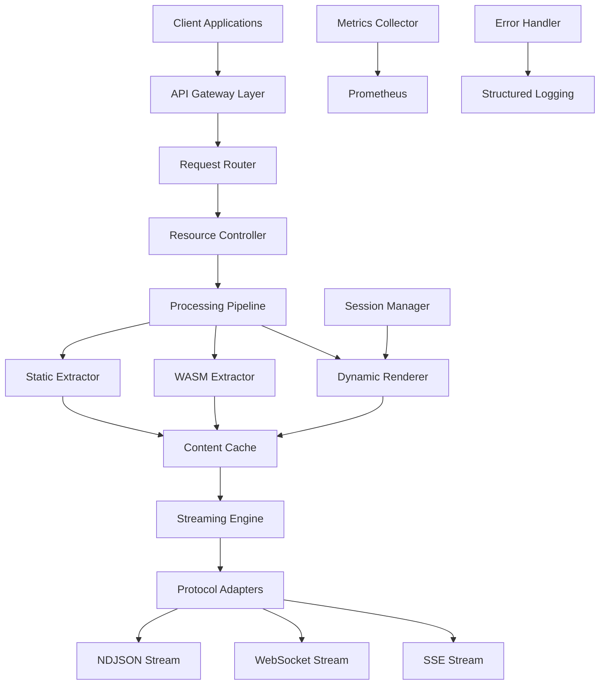

# riptide Hive Critical Path - System Architecture Design

## Executive Summary

This document presents the comprehensive system architecture for riptide's critical path implementation, focusing on WASM extractor integration, dynamic rendering capabilities, and high-performance streaming infrastructure. The architecture supports sub-500ms TTFB streaming, persistent session management, and robust error handling.

## 1. Core Architecture Overview

### 1.1 System Topology



### 1.2 Component Architecture

The system consists of 8 primary architectural layers:

1. **API Gateway & Routing Layer**
2. **Resource Control & Orchestration**
3. **Content Extraction Engine**
4. **Session & State Management**
5. **Streaming Infrastructure**
6. **Monitoring & Observability**
7. **Error Handling & Recovery**
8. **Testing & Validation Framework**

## 2. WASM Extractor Integration Architecture

### 2.1 WASM Component Model Design

```rust
// Core WASM integration architecture
pub struct WasmExtractorEngine {
    // Wasmtime runtime with component model
    runtime: Arc<Runtime>,
    // Component instance pool for performance
    component_pool: ComponentPool<ExtractorComponent>,
    // Memory management for large documents
    memory_manager: WasmMemoryManager,
    // Performance metrics collection
    metrics: WasmMetrics,
}

// Trek-rs output mapping to ExtractedDoc
pub struct ExtractedDocMapper {
    // Direct mapping from Trek-rs structured output
    trek_output: TrekExtractionResult,
    // Enhanced metadata enrichment
    metadata_enricher: MetadataEnricher,
    // Quality scoring algorithm
    quality_scorer: ContentQualityScorer,
}

// Component lifecycle management
pub struct ComponentPool<T> {
    // Available instances ready for use
    available: VecDeque<T>,
    // Active instances currently processing
    active: HashMap<Uuid, T>,
    // Configuration for pool limits
    config: PoolConfig,
    // Health monitoring
    health_monitor: ComponentHealthMonitor,
}
```

### 2.2 ExtractedDoc Output Mapping

The WASM extractor produces structured output that maps to our ExtractedDoc format:

```rust
// Enhanced ExtractedDoc with Trek-rs integration
#[derive(Debug, Clone, Serialize, Deserialize)]
pub struct ExtractedDoc {
    // Core content from Trek-rs
    pub url: String,
    pub title: Option<String>,
    pub byline: Option<String>,
    pub published_iso: Option<String>,

    // Content in multiple formats
    pub markdown: String,           // Trek-rs markdown output
    pub text: String,              // Plain text extraction
    pub html: Option<String>,      // Cleaned HTML

    // Structured data extraction
    pub links: Vec<LinkInfo>,      // Enhanced link metadata
    pub media: Vec<MediaInfo>,     // Rich media information
    pub tables: Vec<TableData>,    // Structured table data

    // AI-enhanced metadata
    pub language: Option<String>,
    pub reading_time: Option<u32>,
    pub quality_score: Option<u8>,
    pub word_count: Option<u32>,
    pub categories: Vec<String>,
    pub site_name: Option<String>,
    pub description: Option<String>,

    // Advanced extraction features
    pub schema_org: Option<serde_json::Value>,  // Schema.org data
    pub custom_fields: HashMap<String, String>, // Configurable extraction
    pub extraction_metadata: ExtractionMetadata, // Processing info
}

// Processing metadata for observability
#[derive(Debug, Clone, Serialize, Deserialize)]
pub struct ExtractionMetadata {
    pub extraction_time_ms: u64,
    pub component_version: String,
    pub memory_usage_mb: f64,
    pub quality_metrics: QualityMetrics,
    pub extraction_method: ExtractionMethod,
}
```

### 2.3 Performance Optimizations

```rust
// Memory-efficient processing for large documents
pub struct WasmMemoryManager {
    // Streaming memory allocation
    stream_allocator: StreamingAllocator,
    // Garbage collection optimization
    gc_scheduler: GarbageCollectionScheduler,
    // Memory pressure monitoring
    pressure_monitor: MemoryPressureMonitor,
}

// Async component execution with timeouts
impl WasmExtractorEngine {
    pub async fn extract_with_timeout(
        &self,
        content: &str,
        timeout: Duration,
    ) -> Result<ExtractedDoc, ExtractionError> {
        let extraction_future = self.extract_internal(content);

        match tokio::time::timeout(timeout, extraction_future).await {
            Ok(result) => result,
            Err(_) => Err(ExtractionError::Timeout(timeout)),
        }
    }
}
```

## 3. Dynamic Rendering RPC v2 Architecture

### 3.1 Enhanced Request/Response Model

```rust
// Comprehensive rendering request with backwards compatibility
#[derive(Debug, Clone, Serialize, Deserialize)]
pub struct RenderRequestV2 {
    // Core rendering parameters
    pub url: String,
    pub user_agent: Option<String>,
    pub viewport: Option<Viewport>,

    // Session management
    pub session_id: Option<String>,
    pub session_config: Option<SessionConfig>,

    // Action pipeline for dynamic interaction
    pub actions: Vec<PageAction>,

    // Timeout configuration
    pub timeouts: Timeouts,

    // Artifact capture
    pub artifacts: ArtifactConfig,

    // Advanced options
    pub stealth_mode: bool,
    pub proxy_config: Option<ProxyConfig>,
    pub headers: HashMap<String, String>,

    // Legacy support (backwards compatibility)
    pub wait_for: Option<String>,
    pub scroll_steps: Option<u32>,
}

// Interactive page actions with error handling
#[derive(Debug, Clone, Serialize, Deserialize)]
pub enum PageAction {
    WaitForCss {
        css: String,
        timeout_ms: Option<u64>,
        retry_count: Option<u8>,
    },
    WaitForJs {
        expr: String,
        timeout_ms: Option<u64>,
        interval_ms: Option<u64>,
    },
    Scroll {
        steps: u32,
        step_px: u32,
        delay_ms: u64,
        smooth: bool,
    },
    Click {
        css: String,
        wait_for_navigation: bool,
        timeout_ms: Option<u64>,
    },
    Type {
        css: String,
        text: String,
        delay_ms: Option<u64>,
        clear_first: bool,
    },
    ExecuteScript {
        code: String,
        timeout_ms: Option<u64>,
        return_result: bool,
    },
    WaitForNetwork {
        idle_time_ms: u64,
        timeout_ms: Option<u64>,
    },
    Screenshot {
        selector: Option<String>,
        full_page: bool,
    },
}

// Granular timeout control
#[derive(Debug, Clone, Serialize, Deserialize)]
pub struct Timeouts {
    pub navigation_ms: Option<u64>,     // Page load timeout
    pub action_ms: Option<u64>,         // Per-action timeout
    pub idle_after_dcl_ms: Option<u64>, // Post-DOMContentLoaded wait
    pub hard_cap_ms: Option<u64>,       // Absolute maximum time
    pub script_execution_ms: Option<u64>, // JavaScript timeout
}

// Enhanced response with rich metadata
#[derive(Debug, Clone, Serialize, Deserialize)]
pub struct RenderResponseV2 {
    pub final_url: String,
    pub html: String,
    pub session_id: Option<String>,
    pub artifacts: CapturedArtifacts,
    pub performance_metrics: RenderPerformanceMetrics,
    pub action_results: Vec<ActionResult>,
    pub warnings: Vec<String>,
    pub network_requests: Vec<NetworkRequest>,
}
```

### 3.2 Session Management Architecture

```rust
// Persistent browser session management
pub struct SessionManager {
    // Active browser instances
    active_sessions: Arc<RwLock<HashMap<String, BrowserSession>>>,
    // Session cleanup scheduler
    cleanup_scheduler: SessionCleanupScheduler,
    // Resource limits
    resource_limits: SessionResourceLimits,
    // Persistence layer
    persistence: SessionPersistence,
}

// Browser session with state persistence
#[derive(Debug)]
pub struct BrowserSession {
    pub id: String,
    pub browser: Arc<Browser>,
    pub created_at: Instant,
    pub last_used: Instant,
    pub page_count: usize,
    pub config: SessionConfig,
    pub cookies: CookieJar,
    pub user_data_dir: PathBuf,
}

// Session configuration
#[derive(Debug, Clone, Serialize, Deserialize)]
pub struct SessionConfig {
    pub max_pages: usize,
    pub idle_timeout_ms: u64,
    pub max_lifetime_ms: u64,
    pub persist_cookies: bool,
    pub persist_storage: bool,
    pub stealth_mode: bool,
}
```

## 4. Error Handling Architecture

### 4.1 Structured Error Types with thiserror

```rust
// Comprehensive error hierarchy using thiserror
#[derive(Debug, thiserror::Error)]
pub enum ApiError {
    #[error("Invalid request: {message}")]
    ValidationError { message: String },

    #[error("Resource limit exceeded: {resource} ({current}/{limit})")]
    ResourceLimitExceeded {
        resource: String,
        current: usize,
        limit: usize,
    },

    #[error("Operation timeout: {operation} took {duration_ms}ms (limit: {limit_ms}ms)")]
    TimeoutError {
        operation: String,
        duration_ms: u64,
        limit_ms: u64,
    },

    #[error("Extraction failed: {source}")]
    ExtractionError {
        #[from]
        source: ExtractionError,
    },

    #[error("Rendering failed: {source}")]
    RenderingError {
        #[from]
        source: RenderingError,
    },

    #[error("Session error: {source}")]
    SessionError {
        #[from]
        source: SessionError,
    },

    #[error("Streaming error: {source}")]
    StreamingError {
        #[from]
        source: StreamingError,
    },

    #[error("Internal server error: {message}")]
    InternalError { message: String },
}

// NDJSON error response format
#[derive(Debug, Serialize, Deserialize)]
pub struct NdjsonErrorResponse {
    pub error: true,
    pub error_type: String,
    pub message: String,
    pub code: String,
    pub timestamp: DateTime<Utc>,
    pub request_id: String,
    pub retryable: bool,
    pub context: Option<serde_json::Value>,
}

// Error recovery strategies
#[derive(Debug, Clone)]
pub enum RecoveryStrategy {
    Retry { max_attempts: u8, backoff_ms: u64 },
    Fallback { alternative_method: String },
    Circuit { failure_threshold: u8 },
    Abort,
}
```

### 4.2 Error Context and Propagation

```rust
// Error context for debugging and monitoring
#[derive(Debug, Clone)]
pub struct ErrorContext {
    pub request_id: String,
    pub url: Option<String>,
    pub session_id: Option<String>,
    pub operation: String,
    pub timestamp: DateTime<Utc>,
    pub user_agent: Option<String>,
    pub client_ip: Option<String>,
    pub stack_trace: Vec<String>,
}

// Error handler with recovery strategies
pub struct ErrorHandler {
    recovery_strategies: HashMap<String, RecoveryStrategy>,
    metrics_collector: ErrorMetricsCollector,
    alert_manager: AlertManager,
}

impl ErrorHandler {
    pub async fn handle_error<T>(
        &self,
        error: ApiError,
        context: ErrorContext,
    ) -> Result<Option<T>, ApiError> {
        // Log the error with full context
        self.log_error(&error, &context).await;

        // Update metrics
        self.metrics_collector.record_error(&error, &context).await;

        // Check if recovery is possible
        if let Some(strategy) = self.get_recovery_strategy(&error) {
            return self.attempt_recovery(strategy, context).await;
        }

        // Trigger alerts if necessary
        if self.should_alert(&error) {
            self.alert_manager.send_alert(&error, &context).await;
        }

        Err(error)
    }
}
```

## 5. Prometheus Metrics Architecture

### 5.1 Comprehensive Metrics Collection

```rust
// Prometheus metrics definitions
pub struct MetricsCollector {
    // Request metrics
    pub requests_total: Counter,
    pub request_duration: Histogram,
    pub active_requests: Gauge,

    // Processing metrics
    pub extraction_duration: Histogram,
    pub extraction_errors: Counter,
    pub rendering_duration: Histogram,
    pub rendering_errors: Counter,

    // Resource metrics
    pub memory_usage: Gauge,
    pub cpu_usage: Gauge,
    pub browser_sessions: Gauge,
    pub wasm_instances: Gauge,

    // Streaming metrics
    pub streaming_connections: Gauge,
    pub streaming_messages_sent: Counter,
    pub streaming_errors: Counter,
    pub streaming_latency: Histogram,

    // Cache metrics
    pub cache_hits: Counter,
    pub cache_misses: Counter,
    pub cache_size: Gauge,

    // Session metrics
    pub session_created: Counter,
    pub session_destroyed: Counter,
    pub session_lifetime: Histogram,
}

// Health check endpoints
#[derive(Debug, Serialize)]
pub struct HealthResponse {
    pub status: HealthStatus,
    pub version: String,
    pub uptime_seconds: u64,
    pub components: HashMap<String, ComponentHealth>,
    pub metrics_summary: MetricsSummary,
}

#[derive(Debug, Serialize)]
pub struct ComponentHealth {
    pub status: HealthStatus,
    pub last_check: DateTime<Utc>,
    pub error_rate: f64,
    pub response_time_p95: f64,
    pub details: Option<serde_json::Value>,
}
```

### 5.2 Metrics Endpoints

```rust
// /metrics endpoint implementation
pub async fn metrics_handler() -> impl IntoResponse {
    let encoder = TextEncoder::new();
    let metric_families = prometheus::gather();
    let output = encoder.encode_to_string(&metric_families)
        .unwrap_or_else(|e| format!("Error encoding metrics: {}", e));

    Response::builder()
        .header("content-type", encoder.format_type())
        .body(output)
        .unwrap()
}

// /healthz endpoint with dependency checks
pub async fn health_handler(
    State(app): State<AppState>
) -> impl IntoResponse {
    let health_checker = HealthChecker::new(app);
    let health_response = health_checker.check_all().await;

    let status_code = match health_response.status {
        HealthStatus::Healthy => StatusCode::OK,
        HealthStatus::Degraded => StatusCode::OK,
        HealthStatus::Unhealthy => StatusCode::SERVICE_UNAVAILABLE,
    };

    (status_code, Json(health_response))
}
```

## 6. NDJSON Streaming Architecture

### 6.1 High-Performance Streaming Engine

```rust
// Streaming pipeline with backpressure handling
pub struct StreamingPipeline {
    // Processing queue with priority scheduling
    queue: PriorityQueue<StreamingRequest>,
    // Worker pool for concurrent processing
    worker_pool: WorkerPool,
    // Backpressure controller
    backpressure: BackpressureController,
    // Output buffer management
    buffer_manager: BufferManager,
    // Protocol adapters
    protocol_adapters: ProtocolAdapterRegistry,
}

// NDJSON streaming with sub-500ms TTFB
impl NdjsonStreamer {
    pub async fn stream_crawl_results(
        &self,
        request: CrawlRequest,
        sender: mpsc::Sender<StreamEvent>,
    ) -> Result<(), StreamingError> {
        let start_time = Instant::now();

        // Immediate response to meet TTFB requirement
        self.send_stream_start(&sender, &request).await?;

        // Process URLs concurrently with backpressure
        let concurrency_limit = self.calculate_optimal_concurrency(&request);
        let semaphore = Arc::new(Semaphore::new(concurrency_limit));

        let results = stream::iter(request.urls)
            .map(|url| {
                let sender = sender.clone();
                let semaphore = semaphore.clone();
                let app = self.app.clone();

                async move {
                    let _permit = semaphore.acquire().await.unwrap();
                    self.process_url_streaming(url, sender, app).await
                }
            })
            .buffer_unordered(concurrency_limit)
            .collect::<Vec<_>>()
            .await;

        // Send completion summary
        self.send_stream_completion(&sender, results, start_time).await?;
        Ok(())
    }

    async fn process_url_streaming(
        &self,
        url: String,
        sender: mpsc::Sender<StreamEvent>,
        app: AppState,
    ) -> Result<(), StreamingError> {
        // Fast path check for immediate results
        if let Some(cached) = app.cache.get(&url).await? {
            let event = StreamEvent::Result(cached);
            return sender.send(event).await.map_err(Into::into);
        }

        // Process with real-time updates
        let result = app.pipeline.process_url(&url).await?;
        let event = StreamEvent::Result(result);
        sender.send(event).await.map_err(Into::into)
    }
}
```

### 6.2 Protocol Adapters

```rust
// Protocol-specific streaming adapters
pub trait StreamingProtocolAdapter {
    type Output;
    type Error;

    async fn send_event(&self, event: StreamEvent) -> Result<(), Self::Error>;
    async fn handle_client_disconnect(&self) -> Result<(), Self::Error>;
    async fn send_keep_alive(&self) -> Result<(), Self::Error>;
}

// NDJSON adapter implementation
pub struct NdjsonAdapter {
    sender: mpsc::UnboundedSender<Bytes>,
    buffer: BytesMut,
    compression: Option<CompressionCodec>,
}

impl StreamingProtocolAdapter for NdjsonAdapter {
    type Output = Bytes;
    type Error = StreamingError;

    async fn send_event(&self, event: StreamEvent) -> Result<(), Self::Error> {
        let json_line = serde_json::to_string(&event)?;
        let mut line = json_line.into_bytes();
        line.push(b'\n');

        let output = if let Some(codec) = &self.compression {
            codec.compress(&line)?
        } else {
            Bytes::from(line)
        };

        self.sender.send(output).map_err(Into::into)
    }
}
```

## 7. Resource Control Architecture

### 7.1 Resource Management System

```rust
// Comprehensive resource controller
pub struct ResourceController {
    // Browser pool management
    browser_pool: BrowserPool,
    // WASM instance pool
    wasm_pool: WasmInstancePool,
    // PDF processing semaphore
    pdf_semaphore: Arc<Semaphore>,
    // Memory pressure monitor
    memory_monitor: MemoryPressureMonitor,
    // Request rate limiter
    rate_limiter: RateLimiter,
}

// Browser pool with sophisticated management
pub struct BrowserPool {
    // Available browsers
    available: VecDeque<PooledBrowser>,
    // Configuration limits
    config: BrowserPoolConfig,
    // Health monitoring
    health_monitor: BrowserHealthMonitor,
    // Launch semaphore to prevent resource exhaustion
    launch_semaphore: Arc<Semaphore>,
}

#[derive(Debug, Clone)]
pub struct BrowserPoolConfig {
    pub max_instances: usize,           // Hard cap = 3
    pub max_pages_per_browser: usize,   // Pages per browser
    pub browser_timeout_ms: u64,        // Browser lifetime
    pub launch_timeout_ms: u64,         // Launch timeout
    pub render_timeout_ms: u64,         // Render cap = 3s
    pub idle_shutdown_ms: u64,          // Idle cleanup
}

// Resource allocation with priority queuing
impl ResourceController {
    pub async fn acquire_browser(
        &self,
        priority: RequestPriority,
        timeout: Duration,
    ) -> Result<PooledBrowser, ResourceError> {
        // Check resource pressure
        if self.memory_monitor.is_under_pressure().await {
            return Err(ResourceError::MemoryPressure);
        }

        // Apply rate limiting
        self.rate_limiter.check_rate(priority).await?;

        // Acquire browser with timeout
        tokio::time::timeout(timeout, self.browser_pool.acquire())
            .await
            .map_err(|_| ResourceError::AcquisitionTimeout)?
    }
}
```

### 7.2 Performance Controls

```rust
// Adaptive concurrency control
pub struct AdaptiveConcurrencyController {
    current_limit: AtomicUsize,
    target_latency_ms: u64,
    latency_window: RingBuffer<u64>,
    error_rate_window: RingBuffer<bool>,
    adjustment_interval: Duration,
}

impl AdaptiveConcurrencyController {
    pub fn adjust_concurrency(&self, latest_metrics: &PerformanceMetrics) {
        let current_latency = latest_metrics.p95_latency_ms;
        let error_rate = latest_metrics.error_rate;

        let current_limit = self.current_limit.load(Ordering::Relaxed);

        let new_limit = if current_latency > self.target_latency_ms || error_rate > 0.05 {
            // Reduce concurrency under pressure
            (current_limit as f64 * 0.9).max(1.0) as usize
        } else if current_latency < self.target_latency_ms * 0.8 && error_rate < 0.01 {
            // Increase concurrency when performing well
            (current_limit as f64 * 1.1).min(100.0) as usize
        } else {
            current_limit
        };

        if new_limit != current_limit {
            self.current_limit.store(new_limit, Ordering::Relaxed);
            tracing::info!("Adjusted concurrency: {} -> {}", current_limit, new_limit);
        }
    }
}
```

## 8. Testing Strategy Architecture

### 8.1 Comprehensive Test Framework

```rust
// Multi-layer testing architecture
pub struct TestSuite {
    // Unit tests for individual components
    unit_tests: UnitTestRunner,
    // Integration tests for component interaction
    integration_tests: IntegrationTestRunner,
    // End-to-end tests for full workflows
    e2e_tests: E2ETestRunner,
    // Performance tests and benchmarks
    performance_tests: PerformanceTestRunner,
    // Chaos engineering tests
    chaos_tests: ChaosTestRunner,
}

// Test environment management
pub struct TestEnvironment {
    // Containerized test services
    test_containers: TestContainerManager,
    // Mock services for external dependencies
    mock_services: MockServiceRegistry,
    // Test data management
    test_data: TestDataManager,
    // Environment isolation
    isolation_manager: TestIsolationManager,
}

// Performance benchmarking
#[derive(Debug)]
pub struct PerformanceBenchmark {
    pub name: String,
    pub target_p95_ms: u64,
    pub target_throughput: f64,
    pub resource_limits: ResourceLimits,
    pub test_duration: Duration,
}
```

### 8.2 Test Scenarios

```rust
// Critical path test scenarios
pub enum TestScenario {
    // WASM extraction performance
    WasmExtractionPerformance {
        document_size_mb: f64,
        complexity_score: u8,
        expected_duration_ms: u64,
    },

    // Dynamic rendering reliability
    DynamicRenderingReliability {
        actions: Vec<PageAction>,
        expected_success_rate: f64,
        timeout_ms: u64,
    },

    // Streaming TTFB compliance
    StreamingTtfbCompliance {
        url_count: usize,
        max_ttfb_ms: u64,
        protocol: StreamingProtocol,
    },

    // Resource exhaustion handling
    ResourceExhaustionHandling {
        concurrent_requests: usize,
        memory_limit_mb: usize,
        expected_behavior: ResourceExhaustionBehavior,
    },

    // Error recovery validation
    ErrorRecoveryValidation {
        failure_type: FailureType,
        recovery_strategy: RecoveryStrategy,
        success_criteria: SuccessCriteria,
    },
}
```

## 9. Architecture Decision Records (ADRs)

### ADR-001: WASM Component Model for Content Extraction

**Decision**: Use Wasmtime with Component Model for content extraction
**Rationale**:
- Sandboxed execution for security
- High performance with native compilation
- Memory safety and isolation
- Future extensibility with pluggable extractors

**Consequences**:
- Additional complexity in WASM runtime management
- Memory overhead for component instances
- Learning curve for WASM development

### ADR-002: NDJSON for Real-time Streaming

**Decision**: NDJSON as primary streaming format with protocol adapters
**Rationale**:
- Line-delimited format enables real-time processing
- Simple parsing without buffering entire response
- HTTP/1.1 and HTTP/2 compatibility
- Easy client-side consumption

**Consequences**:
- Limited support for complex nested streaming
- Requires careful error handling in streams
- Client must handle partial responses

### ADR-003: Session Persistence with Browser Pools

**Decision**: Persistent browser sessions with filesystem storage
**Rationale**:
- Enables complex multi-step interactions
- Reduces browser launch overhead
- Supports authentication workflows
- Maintains user context across requests

**Consequences**:
- Increased memory usage
- Session cleanup complexity
- Security considerations for persistent data

### ADR-004: Prometheus for Observability

**Decision**: Prometheus metrics with custom histogram buckets
**Rationale**:
- Industry standard for metrics collection
- Rich query language for monitoring
- Integration with alerting systems
- Efficient time-series storage

**Consequences**:
- Additional operational complexity
- Memory overhead for metrics collection
- Potential cardinality issues with labels

## 10. Implementation Roadmap

### Phase 1: Core Infrastructure (Weeks 1-2)
1. WASM extractor integration with Trek-rs mapping
2. Basic error handling with thiserror
3. Prometheus metrics foundation
4. Resource controller implementation

### Phase 2: Dynamic Rendering (Weeks 3-4)
1. RPC v2 implementation with actions
2. Session manager with persistence
3. Browser pool with health monitoring
4. Advanced timeout controls

### Phase 3: Streaming Engine (Weeks 5-6)
1. NDJSON streaming with backpressure
2. Protocol adapters for SSE and WebSocket
3. Buffer management and optimization
4. Performance monitoring integration

### Phase 4: Testing & Optimization (Weeks 7-8)
1. Comprehensive test suite implementation
2. Performance benchmarking and tuning
3. Chaos engineering tests
4. Production readiness validation

## 11. Performance Targets

- **TTFB**: < 500ms for streaming endpoints
- **Throughput**: 1000+ concurrent extractions
- **Browser Pool**: 3 instance maximum with 3s render cap
- **PDF Processing**: 2 concurrent operations maximum
- **Memory Usage**: < 2GB per service instance
- **Error Rate**: < 1% under normal load
- **P95 Latency**: < 2s for complex extractions

## 12. Security Considerations

### 12.1 WASM Sandbox Security
- Component model isolation
- Memory access restrictions
- No filesystem access from WASM
- Resource consumption limits

### 12.2 Browser Session Security
- Session isolation between requests
- Secure session ID generation
- Cookie and storage cleanup
- Network request filtering

### 12.3 Input Validation
- URL validation and sanitization
- CSS selector validation
- JavaScript code sandboxing
- Content-type verification

This architecture provides a robust foundation for the riptide critical path implementation, ensuring high performance, reliability, and maintainability while meeting all specified requirements.