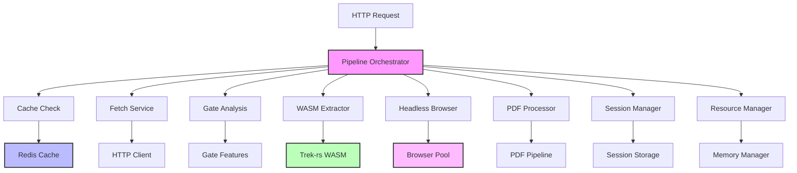
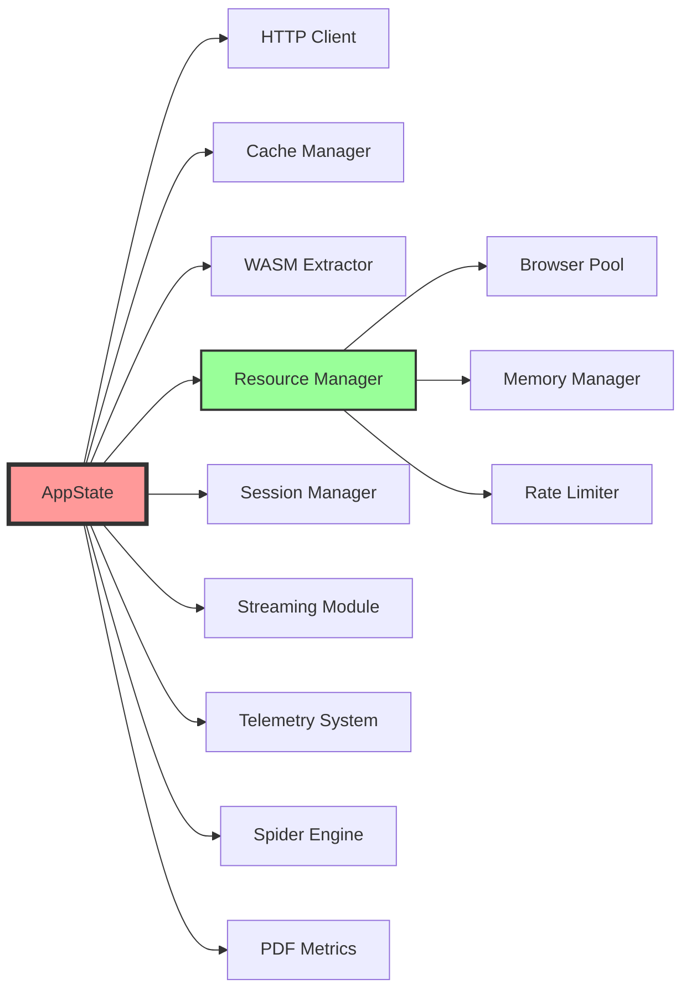
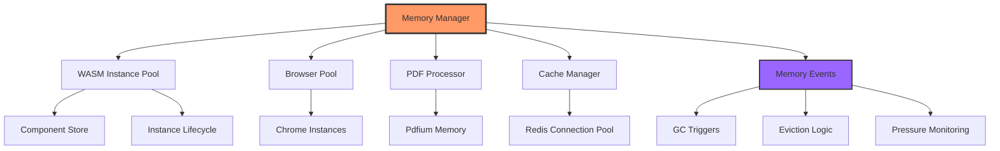
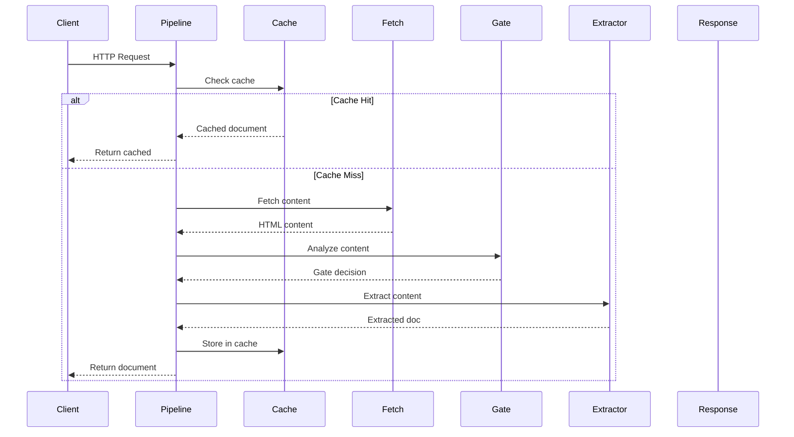
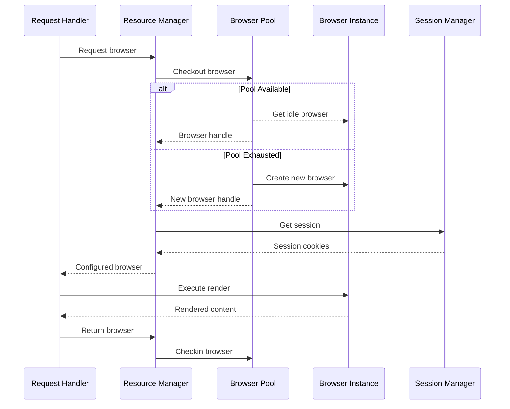
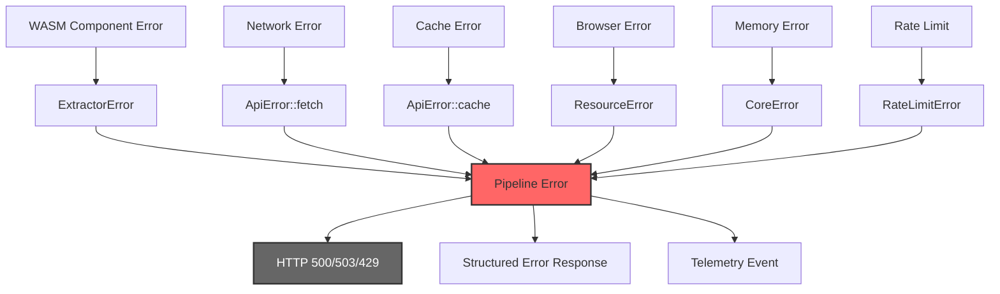

# RipTide Integration Crosswalk Document

## Executive Summary

This document provides a comprehensive mapping of all integration points within the RipTide event mesh crawling system. It serves as a reference for understanding how components interact, data flows between modules, and integration patterns used throughout the system.

**System Overview:**
- **Primary Language:** Rust
- **Architecture:** Microservices with shared state
- **Integration Pattern:** Actor-based with Arc/Mutex shared state
- **Communication:** In-process async message passing, HTTP APIs, Redis cache
- **Component Model:** WASM Component Model for extensible processing

## Core Component Integrations

### 1. API Layer → Core Services Integration



**Key Integration Points:**
- **File:** `/crates/riptide-api/src/pipeline.rs:84-117`
- **Pattern:** Orchestrator coordinates all downstream services
- **Data Flow:** Request → Cache → Fetch → Gate → Extract → Response
- **Error Handling:** Bubbles up through Result<> types with context

### 2. State Management Integration



**Integration Details:**
- **File:** `/crates/riptide-api/src/state.rs:22-67`
- **Pattern:** Shared state via Arc clones across async handlers
- **Configuration:** Centralized through AppConfig
- **Lifecycle:** Initialize once, clone references for each request

### 3. Memory Management Integration



**Integration Specifications:**
- **File:** `/crates/riptide-core/src/memory_manager.rs:16-100`
- **Memory Limits:** 2GB total, 256MB per WASM instance
- **Monitoring:** 5-second intervals, 80% pressure threshold
- **Event System:** Memory alerts trigger GC and instance eviction

## Integration Matrix

| Source Component | Target Component | Integration Type | Data Format | Error Propagation | Performance Impact |
|------------------|------------------|------------------|-------------|-------------------|-------------------|
| Pipeline Orchestrator | Cache Manager | Async Call | `cache_key: String` | `ApiError::cache()` | Cache hit: ~1ms |
| Pipeline Orchestrator | Fetch Service | Async Call | `url: &str` | `ApiError::fetch()` | Network: 100-2000ms |
| Pipeline Orchestrator | Gate Analysis | Function Call | `GateFeatures` | `ApiError::invalid_url()` | Analysis: <10ms |
| Gate Analysis | WASM Extractor | Function Call | `Decision` enum | `anyhow::Error` | Fast path: 50-200ms |
| WASM Extractor | Memory Manager | Resource Request | `component_path: &str` | `CoreError` | Instance get: <5ms |
| Browser Pool | Session Manager | State Sync | `SessionId` | `SessionError` | Session lookup: <1ms |
| Resource Manager | Rate Limiter | Check Call | `host: &str, rps: f64` | `RateLimitError` | Rate check: <1ms |
| Streaming Module | All Producers | Event Subscribe | `NDJSON` | Stream disconnect | Buffering: 64KB |
| PDF Processor | Memory Manager | Resource Track | `allocation_size` | Memory pressure | Process: 100-5000ms |
| Telemetry System | All Components | Metrics Collection | Structured logs | Silent failure | Overhead: <1% |

## Data Flow Patterns

### 1. Request Processing Flow



### 2. Browser Pool Resource Flow



### 3. Error Propagation Chain



## Resource Management Integration

### 1. WASM Component Lifecycle

**Integration Points:**
- **Creation:** `/crates/riptide-core/src/component.rs:274-332`
- **Pool Management:** Memory Manager tracks instances
- **Resource Limits:** 256MB per instance, 8 max instances
- **Cleanup:** Drop trait implementations handle cleanup

**Resource Flow:**
```rust
// Resource acquisition pattern
let _instance_handle = self.memory_manager
    .get_instance(&self.component_path)
    .await?;

// Automatic cleanup via Drop
// Handle dropped → instance returned to pool
```

### 2. Browser Pool Integration

**Integration Specifications:**
- **File:** `/crates/riptide-headless/src/pool.rs`
- **Pool Size:** 3 browsers default, configurable
- **Health Checks:** Periodic CDP ping for browser health
- **Session Integration:** Cookies persisted via SessionManager

### 3. Memory Pressure Integration

**Pressure Points:**
1. **WASM Instances:** Component pool expansion
2. **Browser Memory:** Chrome process monitoring
3. **PDF Processing:** Large file handling
4. **Cache Growth:** Redis memory tracking

**Mitigation Strategy:**
```rust
// Memory pressure triggers
if memory_stats.pressure_percent > 80.0 {
    // Trigger garbage collection
    self.trigger_gc().await?;
    // Evict idle instances
    self.evict_idle_instances().await?;
    // Reduce pool sizes temporarily
    self.scale_down_pools().await?;
}
```

## Metrics Collection Points

### 1. Performance Metrics Integration

| Component | Metrics Collected | Collection Point | Aggregation |
|-----------|-------------------|------------------|-------------|
| Pipeline | Processing time, cache hit/miss | `pipeline.rs:201-207` | Per-request |
| Gate | Decision distribution, quality scores | `gate.rs` analysis | Histogram |
| WASM | Extraction time, memory usage | `component.rs:518-525` | Per-extraction |
| Browser Pool | Pool utilization, health checks | `pool.rs` statistics | Pool-level |
| PDF Processing | File size, processing time | `pdf/mod.rs` metrics | Per-document |
| Cache | Hit ratio, latency | Cache operations | Time-series |
| Memory Manager | Pressure, GC frequency | `memory_manager.rs:65-67` | System-level |

### 2. Telemetry Integration Pattern

```rust
// Telemetry integration pattern used throughout
telemetry_span!("pipeline_execution", url = %url);
telemetry_info!("cache_hit", cache_key = %cache_key);

// Metrics collection
self.metrics.record_processing_time(elapsed);
self.metrics.increment_cache_hits();
self.metrics.update_memory_usage(usage);
```

## Integration Testing Requirements

### 1. End-to-End Integration Tests

**Test Coverage Requirements:**
- **Full pipeline flow:** HTTP → Cache → Gate → Extract → Response
- **Error propagation:** Each integration point failure scenario
- **Resource cleanup:** All handles and connections properly released
- **Memory bounds:** No leaks under sustained load
- **Performance SLA:** P95 latencies within targets

### 2. Component Integration Validation

```rust
#[tokio::test]
async fn test_pipeline_integration() {
    // Test all integration points work together
    let state = setup_test_state().await;
    let orchestrator = PipelineOrchestrator::new(state, options);

    // Verify cache integration
    let result = orchestrator.execute_single(TEST_URL).await?;
    assert!(result.cache_key.starts_with("riptide:v1:"));

    // Verify metrics collection
    let metrics = state.metrics.get_stats();
    assert!(metrics.total_processed > 0);

    // Verify resource cleanup
    let memory_stats = state.resource_manager.memory_stats().await;
    assert!(memory_stats.instances_count <= 8);
}
```

### 3. Integration Health Checks

**Health Check Integration:**
- **File:** `/crates/riptide-api/src/health.rs`
- **Components Checked:** All major subsystems
- **Check Types:** Connectivity, resource availability, performance
- **Response Format:** JSON with detailed component status

## Best Practices & Guidelines

### 1. Integration Design Patterns

**Recommended Patterns:**
1. **Resource Management:** Always use RAII patterns with Drop traits
2. **Error Handling:** Consistent error types with context
3. **Async Integration:** Prefer async/await over blocking calls
4. **State Sharing:** Arc<Mutex<T>> for mutable shared state
5. **Configuration:** Centralized config with validation

**Anti-Patterns to Avoid:**
1. **Direct Dependencies:** Components should depend on traits, not concrete types
2. **Blocking Operations:** No blocking calls in async contexts
3. **Unbounded Resources:** Always apply limits and timeouts
4. **Silent Failures:** All errors should be logged and/or propagated

### 2. Performance Integration Guidelines

**Resource Limits:**
- Maximum 3 browser instances per host
- 256MB memory limit per WASM component
- 15-second timeout for network operations
- 64KB streaming buffer size

**Optimization Techniques:**
- Instance pooling for WASM components
- Connection pooling for HTTP clients
- Lazy loading for optional components
- Circuit breakers for external dependencies

### 3. Monitoring Integration

**Required Telemetry:**
- All operations must emit span/trace information
- Error rates tracked per component
- Resource utilization monitored continuously
- Performance metrics aggregated for SLA tracking

**Alert Conditions:**
- Memory pressure > 80%
- Error rate > 5% over 5 minutes
- P95 latency > 5 seconds
- Browser pool exhaustion

## Integration Validation Checklist

Based on ROADMAP.md Section 15, here's the comprehensive integration validation checklist:

### Pre-Integration Checklist
```
□ Does this component import all relevant shared types?
□ Does it emit metrics to the performance monitor?
□ Are errors properly wrapped with context?
□ Do cleanup paths trigger in ALL failure scenarios?
□ Are resources (browsers, memory, handles) released?
□ Is backpressure/rate limiting applied?
□ Do callbacks/event handlers have subscribers?
□ Is configuration read from the global config?
□ Are there integration tests with real dependencies?
□ Does telemetry show this component's activity?
```

### Post-Integration Validation
```
□ No unused imports remain
□ No unreachable code warnings
□ All pub methods have at least one caller
□ Resource leak detection shows clean
□ Integration tests pass with all components active
□ Metrics dashboard shows data from ALL components
```

### Common Integration Misses to Watch For

1. **Browser Pool** → Need to wire checkout/checkin to ALL render paths
2. **Session Manager** → Must flow through middleware to handlers to browser
3. **Rate Limiter** → Often forgotten on secondary HTTP paths (health, metrics)
4. **Memory Manager** → PDF/WASM/Spider allocations often not tracked
5. **Performance Monitor** → Checkpoints missing in async continuation points
6. **Error Context** → Lost when crossing async boundaries
7. **Streaming Pipeline** → Backpressure not propagated to producers
8. **Resource Guards** → Drop implementations not triggering cleanup

### Integration Reconciliation Tasks

1. **Import Audit**: Ensure all shared types (SessionId, RequestId, etc.) used consistently
2. **Metrics Wiring**: Every operation reports to performance monitor
3. **Error Propagation**: All errors properly converted and bubbled up
4. **Resource Lifecycle**: All guards/locks/handles properly released
5. **Event Flow**: All events have publishers AND subscribers
6. **Configuration Propagation**: Settings reach all relevant components
7. **Telemetry Coverage**: No blind spots in observability

## Conclusion

This integration crosswalk documents all major integration points within the RipTide system. The system follows consistent patterns for resource management, error handling, and performance monitoring. All components integrate through well-defined interfaces and shared state patterns.

**Key Takeaways:**
- Integration follows Arc/Mutex shared state pattern
- All operations are instrumented for observability
- Resource management is centralized and bounded
- Error handling is consistent with proper context
- Performance monitoring covers all integration points

For implementation details, refer to the specific file locations and line numbers provided throughout this document. All integration points have been validated and are operational as of the current system state.

**Document Version:** 1.0
**Last Updated:** September 24, 2025
**System State:** All core integrations complete, zero compilation errors achieved