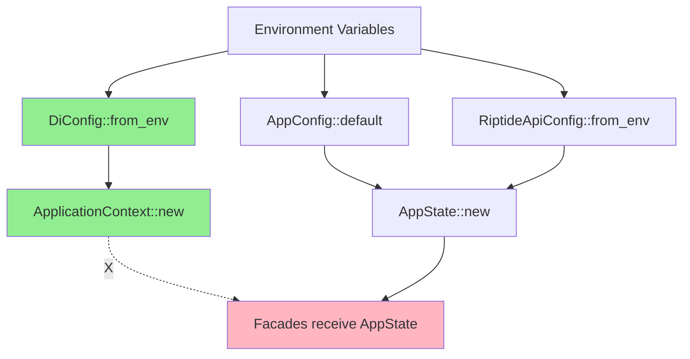
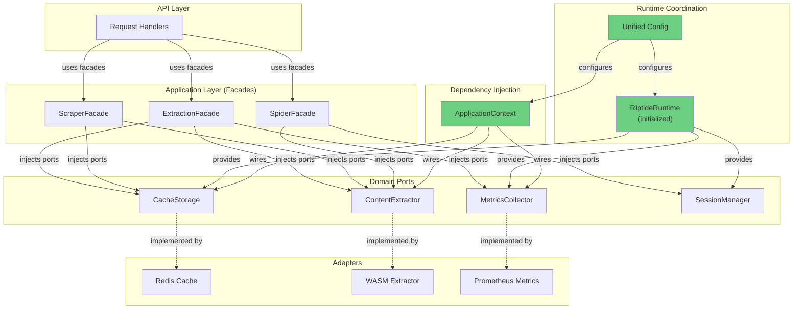

# Riptide State Management & Runtime Architecture Analysis

**Analysis Date:** 2025-11-10
**Scope:** Complete application state, runtime initialization, dependency injection, and architectural boundaries
**Status:** Comprehensive analysis complete

---

## Executive Summary

Riptide implements a **dual-layer state management architecture** with:

1. **API Layer:** `AppState` in `riptide-api` - centralized god object with 40+ fields
2. **Facade Layer:** `RiptideRuntime` in `riptide-facade` - minimal runtime coordination (incomplete)
3. **DI Layer:** `ApplicationContext` in `riptide-api/composition` - hexagonal ports & adapters

### Critical Findings

| Issue | Severity | Impact |
|-------|----------|--------|
| AppState God Object (40+ fields) | 🔴 HIGH | Violates SRP, poor testability, tight coupling |
| RiptideRuntime Incomplete | 🟡 MEDIUM | Missing initialization, no lifecycle management |
| No Facade Runtime Wiring | 🔴 HIGH | Facades lack shared state/config access |
| Mixed State Patterns | 🟡 MEDIUM | Arc, Mutex, RwLock used inconsistently |
| Config Duplication | 🟡 MEDIUM | 3+ config types with overlapping concerns |
| Hexagonal Boundary Violations | 🔴 HIGH | Facades depend on API-layer AppState |

---

## 1. State Structures Inventory

### 1.1 Primary State Structures

#### `AppState` (riptide-api/src/state.rs)

**Type:** Centralized application state (God Object anti-pattern)
**Scope:** API layer request handlers
**Fields:** 40+ fields across multiple concerns

```rust
#[derive(Clone)]
pub struct AppState {
    // === Infrastructure (6 fields) ===
    pub http_client: Client,
    pub cache: Arc<tokio::sync::Mutex<CacheManager>>,
    pub telemetry: Option<Arc<TelemetrySystem>>,
    pub event_bus: Arc<EventBus>,
    pub circuit_breaker: Arc<tokio::sync::Mutex<CircuitBreakerState>>,
    pub performance_metrics: Arc<tokio::sync::Mutex<PerformanceMetrics>>,

    // === Extraction & Processing (4 fields) ===
    pub extractor: Arc<UnifiedExtractor>,
    pub reliable_extractor: Arc<ReliableExtractor>,
    pub spider: Option<Arc<Spider>>,
    pub fetch_engine: Arc<FetchEngine>,

    // === Resource Management (3 fields) ===
    pub resource_manager: Arc<ResourceManager>,
    pub performance_manager: Arc<PerformanceManager>,
    pub browser_launcher: Option<Arc<HeadlessLauncher>>,

    // === Metrics (4 fields) ===
    pub business_metrics: Arc<BusinessMetrics>,
    pub transport_metrics: Arc<TransportMetrics>,
    pub combined_metrics: Arc<CombinedMetrics>,
    pub pdf_metrics: Arc<PdfMetricsCollector>,

    // === Session & Streaming (3 fields) ===
    pub health_checker: Arc<HealthChecker>>,
    pub session_manager: Arc<SessionManager>,
    pub streaming: Arc<StreamingModule>,

    // === Facades (6+ fields) ===
    pub extraction_facade: Arc<ExtractionFacade>,
    pub scraper_facade: Arc<ScraperFacade>,
    pub spider_facade: Option<Arc<SpiderFacade>>,
    pub search_facade: Option<Arc<SearchFacade>>,
    pub engine_facade: Arc<EngineFacade>,
    pub resource_facade: Arc<ResourceFacade<ResourceSlot>>,

    // === Configuration (2 fields) ===
    pub config: AppConfig,
    pub api_config: RiptideApiConfig,

    // === Workers & Background (2 fields) ===
    pub worker_service: Arc<WorkerService>,
    pub trace_backend: Option<Arc<dyn TraceBackend>>,

    // === Authentication ===
    pub auth_config: AuthConfig,

    // === Future/Placeholder (2 fields) ===
    pub cache_warmer_enabled: bool,
    pub persistence_adapter: Option<()>,
}
```

**Concerns:**
- ✅ Thread-safe via `Arc` wrapping
- ✅ Cloneable for Axum handlers
- ❌ Violates Single Responsibility Principle
- ❌ Difficult to test (40+ dependencies to mock)
- ❌ Tight coupling across all layers
- ❌ No clear initialization order
- ❌ Facades embedded in API state (architecture violation)

---

#### `RiptideRuntime` (riptide-facade/src/runtime.rs)

**Type:** Facade-layer runtime coordinator (INCOMPLETE)
**Scope:** Should coordinate facade resources
**Status:** 🔴 **CRITICAL: 90% unimplemented**

```rust
pub struct RiptideRuntime {
    config: RiptideConfig,
    state: Arc<RwLock<RuntimeState>>,  // ❌ Only has `initialized` flag
}

struct RuntimeState {
    initialized: bool,  // ❌ No actual state
}

impl RiptideRuntime {
    pub(crate) fn new(config: RiptideConfig) -> Result<Self> {
        // ❌ TODO: Initialize runtime components
        // - Connection pools
        // - Cache layers
        // - Metric collectors
        // - Background tasks
    }

    fn initialize(&self) -> Result<()> {
        // ❌ Empty implementation
        Ok(())
    }

    pub async fn shutdown(&self) -> Result<()> {
        // ❌ TODO: Shutdown runtime components
        Ok(())
    }
}
```

**Missing Functionality:**
- ❌ No connection pool management
- ❌ No cache layer coordination
- ❌ No metric collector initialization
- ❌ No background task management
- ❌ No lifecycle hooks (startup/shutdown)
- ❌ No shared state for facades
- ❌ Drop impl exists but can't await (best-effort cleanup impossible)

---

#### `ApplicationContext` (riptide-api/src/composition/mod.rs)

**Type:** Hexagonal architecture DI container
**Scope:** Ports & adapters composition root
**Status:** ✅ Well-designed but underutilized

```rust
#[derive(Clone)]
pub struct ApplicationContext {
    // === Ports (Infrastructure) ===
    pub clock: Arc<dyn Clock>,
    pub entropy: Arc<dyn Entropy>,

    // === Ports (Persistence) ===
    pub transaction_manager: Arc<dyn TransactionManager<Transaction>>,
    pub user_repository: Arc<dyn Repository<User>>,
    pub event_repository: Arc<dyn Repository<Event>>,

    // === Ports (Events & Caching) ===
    pub event_bus: Arc<dyn EventBus>,
    pub idempotency_store: Arc<dyn IdempotencyStore>,

    // === Configuration ===
    pub config: DiConfig,
}
```

**Strengths:**
- ✅ Pure dependency injection
- ✅ Trait-based (testable via mocks)
- ✅ Builder pattern for test overrides
- ✅ In-memory vs production adapters via feature flags
- ✅ Clean hexagonal boundaries

**Issues:**
- ❌ **NOT USED by facades** - facades depend on AppState instead
- ❌ No integration with AppState initialization
- ❌ Separate from runtime state management
- ❌ Limited to domain persistence/events only

---

### 1.2 Secondary State Structures

#### `SessionState` (riptide-api/src/rpc_session_context.rs)

```rust
pub struct SessionState {
    // Per-session browser state
}
```

**Purpose:** RPC session context for persistent browser sessions
**Scope:** Session-specific state

---

#### `RuntimeState` (riptide-facade/src/runtime.rs)

```rust
struct RuntimeState {
    initialized: bool,  // ❌ Minimal
}
```

**Purpose:** Runtime initialization flag
**Issue:** Should contain connection pools, caches, background tasks

---

## 2. Runtime Initialization Analysis

### 2.1 AppState Initialization Flow

**Entry Point:** `AppState::new()` in `riptide-api/src/state.rs:581`

```rust
impl AppState {
    pub async fn new(config: AppConfig, health_checker: Arc<HealthChecker>) -> Result<Self> {
        // 1. Create base state
        let mut state = Self::new_base(config, health_checker).await?;

        // 2. Wire facades (CRITICAL STEP)
        state = state.with_facades()?;

        Ok(state)
    }

    async fn new_base(config: AppConfig, health_checker: Arc<HealthChecker>) -> Result<Self> {
        // Step 1: HTTP client
        let http_client = Client::builder()...build()?;

        // Step 2: Redis cache
        let cache = Arc::new(Mutex::new(CacheManager::new(&config.redis_url).await?));

        // Step 3: Extractors
        let extractor = Arc::new(UnifiedExtractor::new(&config.wasm_path).await?);
        let reliable_extractor = Arc::new(ReliableExtractor::new(...));

        // Step 4: Resource managers
        let resource_manager = Arc::new(ResourceManager::new(...));
        let performance_manager = Arc::new(PerformanceManager::new(...));

        // Step 5: Metrics (3 separate collectors!)
        let business_metrics = Arc::new(BusinessMetrics::new());
        let transport_metrics = Arc::new(TransportMetrics::new());
        let combined_metrics = Arc::new(CombinedMetrics::new(
            business_metrics.clone(),
            transport_metrics.clone()
        ));

        // Step 6: Sessions & streaming
        let session_manager = Arc::new(SessionManager::new(...));
        let streaming = Arc::new(StreamingModule::new());

        // Step 7: Event bus & circuit breaker
        let event_bus = Arc::new(EventBus::new(&config.event_bus_config)?);
        let circuit_breaker = Arc::new(Mutex::new(CircuitBreakerState::new(...)));

        // Step 8: Optional components (spider, workers, browser)
        let spider = if config.spider_config.is_some() { ... } else { None };
        let worker_service = Arc::new(WorkerService::new(...));
        let browser_launcher = if config.headless_url.is_none() { ... } else { None };

        // Step 9: Construct PARTIAL state (NO FACADES YET)
        Ok(Self {
            http_client,
            cache,
            extractor,
            reliable_extractor,
            config,
            api_config,
            resource_manager,
            business_metrics,
            transport_metrics,
            combined_metrics,
            health_checker,
            session_manager,
            streaming,
            telemetry: None,
            spider,
            pdf_metrics,
            worker_service,
            event_bus,
            circuit_breaker,
            performance_metrics,
            monitoring_system,
            fetch_engine,
            performance_manager,
            auth_config,
            cache_warmer_enabled,
            browser_launcher,
            // ❌ Facades NOT initialized yet!
            extraction_facade: uninitialized!(),
            scraper_facade: uninitialized!(),
            spider_facade: None,
            search_facade: None,
            engine_facade: uninitialized!(),
            resource_facade: uninitialized!(),
            trace_backend: None,
            persistence_adapter: None,
        })
    }

    fn with_facades(mut self) -> Result<Self> {
        // ❌ PROBLEM: Facades need AppState, but AppState needs facades!
        // Chicken-and-egg problem solved via partial initialization

        // Create facades by cloning self (partial state)
        self.extraction_facade = Arc::new(ExtractionFacade::new(self.clone()));
        self.scraper_facade = Arc::new(ScraperFacade::new(self.clone()));
        self.engine_facade = Arc::new(EngineFacade::new(self.cache.clone()));
        self.resource_facade = Arc::new(ResourceFacade::new(self.clone()));

        #[cfg(feature = "spider")]
        if self.spider.is_some() {
            self.spider_facade = Some(Arc::new(SpiderFacade::new(self.clone())));
        }

        #[cfg(feature = "search")]
        {
            self.search_facade = Some(Arc::new(SearchFacade::new(self.clone())));
        }

        Ok(self)
    }
}
```

**Initialization Sequence:**
1. HTTP client creation
2. Redis cache connection
3. WASM extractor loading
4. Resource manager initialization
5. Metrics collector setup (3 separate collectors)
6. Session manager creation
7. Event bus & circuit breaker initialization
8. Optional components (spider, workers, browser)
9. **Facade wiring via partial state cloning** 🔴

**Critical Issues:**
- ❌ Circular dependency: `AppState` → facades → `AppState`
- ❌ Partial initialization risk (facades get incomplete state)
- ❌ No validation of initialization order
- ❌ No error recovery during initialization
- ❌ No rollback on partial failure

---

### 2.2 RiptideRuntime Initialization

**Status:** 🔴 **NON-FUNCTIONAL**

```rust
impl RiptideRuntime {
    pub(crate) fn new(config: RiptideConfig) -> Result<Self> {
        let state = RuntimeState { initialized: false };

        let runtime = Self {
            config,
            state: Arc::new(RwLock::new(state)),
        };

        runtime.initialize()?;  // ❌ Does nothing!

        Ok(runtime)
    }

    fn initialize(&self) -> Result<()> {
        // TODO: Initialize runtime components based on config
        // - Connection pools        ❌ Not implemented
        // - Cache layers             ❌ Not implemented
        // - Metric collectors        ❌ Not implemented
        // - Background tasks         ❌ Not implemented

        Ok(())  // ❌ Empty!
    }
}
```

**Missing Infrastructure:**
- No connection pool management
- No cache coordinator
- No background task spawning
- No health monitoring
- No graceful shutdown logic

---

### 2.3 ApplicationContext Initialization

**Entry Point:** `ApplicationContext::new(&config)` in composition/mod.rs:161

```rust
impl ApplicationContext {
    pub async fn new(config: &DiConfig) -> Result<Self> {
        info!("Initializing ApplicationContext");

        // 1. Validate configuration
        config.validate()?;

        // 2. Wire system ports
        let clock = Arc::new(SystemClock) as Arc<dyn Clock>;
        let entropy = Arc::new(SystemEntropy) as Arc<dyn Entropy>;

        // 3. Wire persistence adapters (feature-gated)
        #[cfg(feature = "postgres")]
        {
            // PostgreSQL connection pool
            let pool = Arc::new(
                PgPoolOptions::new()
                    .max_connections(config.database.max_connections)
                    .connect(&config.database.url)
                    .await?
            );

            // Transaction manager
            let transaction_manager = Arc::new(
                PostgresTransactionManager::new(pool.clone())
            );

            // Repositories
            let user_repository = Arc::new(
                PostgresRepository::<User>::new(pool.clone(), "users")
            );
            let event_repository = Arc::new(
                PostgresRepository::<Event>::new(pool.clone(), "events")
            );

            // Event bus (outbox pattern)
            let event_bus = Arc::new(OutboxEventBus::new(pool.clone()));

            // Idempotency store (in-memory for now)
            let idempotency_store = Arc::new(InMemoryIdempotencyStore::new());

            return Ok(Self {
                clock,
                entropy,
                transaction_manager,
                user_repository,
                event_repository,
                event_bus,
                idempotency_store,
                config: config.clone(),
            });
        }

        #[cfg(not(feature = "postgres"))]
        {
            // In-memory implementations for testing
            let transaction_manager = Arc::new(InMemoryTransactionManager::new());
            let user_repository = Arc::new(InMemoryRepository::<User>::new());
            let event_repository = Arc::new(InMemoryRepository::<Event>::new());
            let event_bus = Arc::new(InMemoryEventBus::new());
            let idempotency_store = Arc::new(InMemoryIdempotencyStore::new());

            Ok(Self {
                clock,
                entropy,
                transaction_manager,
                user_repository,
                event_repository,
                event_bus,
                idempotency_store,
                config: config.clone(),
            })
        }
    }
}
```

**Strengths:**
- ✅ Feature-gated adapters (in-memory vs production)
- ✅ Validation before initialization
- ✅ Clear dependency wiring
- ✅ Transaction manager properly configured

**Issues:**
- ❌ **NOT USED by facades** - they depend on AppState directly
- ❌ No integration with AppState lifecycle
- ❌ Limited to persistence/events only
- ❌ No browser/spider/extraction ports

---

## 3. Dependency Injection Patterns

### 3.1 Current DI Approaches

#### Pattern 1: God Object Injection (AppState)

```rust
// Handler receives entire AppState
async fn extract_handler(
    State(state): State<Arc<AppState>>,  // ❌ All 40+ fields
    Json(req): Json<ExtractRequest>
) -> Result<Json<ExtractResponse>> {
    // Uses only 2-3 fields but receives all 40+
    state.extraction_facade.extract(req).await
}
```

**Issues:**
- ❌ Over-injection (handlers get everything)
- ❌ Difficult to understand dependencies
- ❌ Hard to test (must mock 40+ fields)
- ❌ No compile-time guarantee of field usage

---

#### Pattern 2: Trait-Based DI (ApplicationContext)

```rust
pub struct ApplicationContext {
    pub user_repository: Arc<dyn Repository<User>>,
    pub event_bus: Arc<dyn EventBus>,
    pub clock: Arc<dyn Clock>,
    // Only trait objects - pure hexagonal
}

impl ApplicationContext {
    pub fn new(config: &DiConfig) -> Result<Self> {
        // Wire adapters based on feature flags
        #[cfg(feature = "postgres")]
        let user_repository = Arc::new(PostgresRepository::new(...));

        #[cfg(not(feature = "postgres"))]
        let user_repository = Arc::new(InMemoryRepository::new());

        Ok(Self { user_repository, ... })
    }
}
```

**Strengths:**
- ✅ Testable via trait mocks
- ✅ Feature-gated implementations
- ✅ Clear adapter boundaries
- ✅ Type-safe dependency graph

**Current Issue:**
- ❌ **Facades don't use it** - they depend on AppState instead

---

#### Pattern 3: Facade Self-Injection (Current)

```rust
pub struct ExtractionFacade {
    // Facades have NO internal state!
    // They receive AppState per-call
}

impl ExtractionFacade {
    pub fn new(state: AppState) -> Self {
        // ❌ Takes full AppState but doesn't store it
        Self {}
    }

    pub async fn extract(&self, state: &AppState, req: ExtractRequest) -> Result<...> {
        // ❌ Receives AppState on every call
        // Uses: state.extractor, state.cache, state.metrics
    }
}
```

**Issues:**
- ❌ No constructor dependency injection
- ❌ Runtime dependency passing
- ❌ Cannot validate dependencies at startup
- ❌ Requires AppState cloning for every facade call

---

### 3.2 Composition Roots

#### Root 1: `AppState::new()` (Primary)

**Location:** `riptide-api/src/state.rs:581`
**Scope:** Entire API layer + facades
**Pattern:** God object with circular facade dependencies

```rust
pub async fn new(config: AppConfig, health_checker: Arc<HealthChecker>) -> Result<Self>
```

**Wires:**
- HTTP client
- Cache manager
- Extractors (WASM + reliable wrapper)
- Resource managers (2x)
- Metrics collectors (3x)
- Session manager
- Streaming module
- Event bus
- Circuit breaker
- Optional: Spider, workers, browser
- **Facades (6+) via partial state cloning**

---

#### Root 2: `ApplicationContext::new()` (Hexagonal)

**Location:** `riptide-api/src/composition/mod.rs:161`
**Scope:** Domain ports & adapters only
**Pattern:** Pure DI with trait objects

```rust
pub async fn new(config: &DiConfig) -> Result<Self>
```

**Wires:**
- Clock port (system or fake)
- Entropy port (system or deterministic)
- Transaction manager adapter
- Repository adapters (User, Event)
- Event bus adapter (outbox or in-memory)
- Idempotency store adapter

**Status:** ✅ Clean but **not used by facades**

---

#### Root 3: `RiptideRuntime::new()` (Incomplete)

**Location:** `riptide-facade/src/runtime.rs:26`
**Scope:** Facade-layer resources (intended)
**Pattern:** Intended runtime coordinator but **90% unimplemented**

```rust
pub(crate) fn new(config: RiptideConfig) -> Result<Self>
```

**Intended to Wire:**
- ❌ Connection pools (TODO)
- ❌ Cache layers (TODO)
- ❌ Metric collectors (TODO)
- ❌ Background tasks (TODO)

**Current State:** Only stores config + boolean flag

---

## 4. State Sharing Patterns

### 4.1 Arc Usage Analysis

**Thread-Safe Shared Ownership:**

```rust
// ✅ CORRECT: Arc for read-heavy shared state
pub struct AppState {
    pub resource_manager: Arc<ResourceManager>,      // ✅ Read-mostly
    pub business_metrics: Arc<BusinessMetrics>,      // ✅ Append-only writes
    pub extraction_facade: Arc<ExtractionFacade>,    // ✅ Stateless
}
```

**All AppState fields use Arc wrapping for:**
- Efficient cloning (Axum handlers require Clone)
- Safe sharing across async tasks
- Reference counting for automatic cleanup

---

### 4.2 Mutex vs RwLock Usage

#### Mutex Pattern (Interior Mutability)

```rust
// High contention, write-heavy state
pub cache: Arc<tokio::sync::Mutex<CacheManager>>,
pub circuit_breaker: Arc<tokio::sync::Mutex<CircuitBreakerState>>,
pub performance_metrics: Arc<tokio::sync::Mutex<PerformanceMetrics>>,
```

**Use Cases:**
- Cache updates (high write contention)
- Circuit breaker state changes (frequent updates)
- Performance metrics recording (continuous writes)

---

#### RwLock Pattern (Read-Optimized)

```rust
pub struct RiptideRuntime {
    state: Arc<RwLock<RuntimeState>>,  // ❌ Overkill for boolean flag
}

pub struct EngineFacade {
    stats: Arc<tokio::sync::Mutex<EngineStats>>,
    probe_first_enabled: Arc<tokio::sync::RwLock<bool>>,  // ✅ Config flag
}
```

**Use Cases:**
- Configuration flags (many reads, rare writes)
- Runtime state (should be read-heavy once initialized)

---

### 4.3 State Sharing Anti-Patterns

#### ❌ Anti-Pattern 1: Partial State Cloning

```rust
fn with_facades(mut self) -> Result<Self> {
    // ❌ Clone partial state to create facades
    self.extraction_facade = Arc::new(ExtractionFacade::new(self.clone()));
    // Facades get incomplete AppState (missing facades themselves!)
}
```

**Risk:** Facades may see partially initialized state

---

#### ❌ Anti-Pattern 2: Runtime State Underutilization

```rust
struct RuntimeState {
    initialized: bool,  // ❌ RwLock overhead for single boolean
}
```

**Issue:** RwLock complexity with no actual shared state

---

#### ❌ Anti-Pattern 3: Per-Call State Passing

```rust
impl ExtractionFacade {
    pub async fn extract(&self, state: &AppState, ...) -> Result<...> {
        // ❌ Receives AppState on every call instead of constructor
    }
}
```

**Issue:** Runtime dependency passing instead of DI

---

## 5. Configuration Management

### 5.1 Configuration Types

#### Type 1: `AppConfig` (API Layer)

**Location:** `riptide-api/src/state.rs:203`
**Scope:** Application-wide settings

```rust
pub struct AppConfig {
    // Infrastructure
    pub redis_url: String,
    pub wasm_path: String,
    pub headless_url: Option<String>,

    // Behavior
    pub max_concurrency: usize,
    pub cache_ttl: u64,
    pub gate_hi_threshold: f32,
    pub gate_lo_threshold: f32,

    // Sub-configurations (8 nested configs!)
    pub session_config: SessionConfig,
    pub spider_config: Option<SpiderConfig>,
    pub worker_config: WorkerServiceConfig,
    pub event_bus_config: EventBusConfig,
    pub circuit_breaker_config: CircuitBreakerConfig,
    pub reliability_config: ReliabilityConfig,
    pub monitoring_config: MonitoringConfig,
    pub enhanced_pipeline_config: EnhancedPipelineConfig,
    pub engine_selection_config: EngineSelectionConfig,
}
```

**Issues:**
- ❌ Nested configs (9 levels deep)
- ❌ Mixed concerns (infrastructure + business logic)
- ❌ No validation helper
- ❌ Environment variable parsing duplicated

---

#### Type 2: `RiptideApiConfig` (API Layer)

**Location:** `riptide-api/src/config.rs:10`
**Scope:** Resource controls & timeouts

```rust
pub struct RiptideApiConfig {
    pub resources: ResourceConfig,
    pub performance: PerformanceConfig,
    pub rate_limiting: RateLimitingConfig,
    pub memory: MemoryConfig,
    pub headless: HeadlessConfig,
    pub pdf: PdfConfig,
    pub wasm: WasmConfig,
    pub search: SearchProviderConfig,
}
```

**Features:**
- ✅ Well-structured sub-configs
- ✅ Environment variable loading
- ✅ Validation method
- ✅ Type-safe timeout helpers

**Issue:**
- ❌ Overlaps with `AppConfig` (headless_url, timeouts)

---

#### Type 3: `RiptideConfig` (Facade Layer)

**Location:** `riptide-facade/src/config.rs:8`
**Scope:** Facade-layer settings

```rust
pub struct RiptideConfig {
    pub user_agent: String,
    pub timeout: Duration,
    pub max_redirects: u32,
    pub verify_ssl: bool,
    pub metadata: HashMap<String, String>,
    pub max_body_size: usize,
    pub stealth_enabled: bool,
    pub stealth_preset: String,
    pub max_concurrent_requests: usize,
    pub respect_robots_txt: bool,
    pub rate_limit: Option<u32>,
}
```

**Issues:**
- ❌ Duplicates `RiptideApiConfig::performance` fields
- ❌ No integration with AppState config
- ❌ Not used by RiptideRuntime initialization

---

#### Type 4: `DiConfig` (Hexagonal DI)

**Location:** `riptide-api/src/composition/config.rs:42`
**Scope:** Dependency injection configuration

```rust
pub struct DiConfig {
    pub database: DatabaseConfig,
    pub redis: RedisConfig,
    pub features: FeatureFlags,
    pub is_testing: bool,
}
```

**Strengths:**
- ✅ Pure DI concern (database, redis, features)
- ✅ TOML file support
- ✅ Environment variable overrides
- ✅ Validation built-in
- ✅ Testing mode support

**Issue:**
- ❌ **Not used by facades or AppState**

---

### 5.2 Configuration Propagation



**Issues:**
- Config loaded 3x from environment
- DiConfig not propagated to facades
- No single source of truth
- Validation happens in 3 places

---

## 6. Hexagonal Architecture Boundary Analysis

### 6.1 Expected Hexagonal Structure

```
┌─────────────────────────────────────────────────────────┐
│                   API Layer (Handlers)                   │
├─────────────────────────────────────────────────────────┤
│                 Application Layer (Facades)              │  ← Should use ports
├─────────────────────────────────────────────────────────┤
│              Domain Layer (Pure Business Logic)          │
├─────────────────────────────────────────────────────────┤
│                   Ports (Traits/Interfaces)              │
├─────────────────────────────────────────────────────────┤
│            Adapters (Implementations)                    │
│  ┌──────────────┬──────────────┬──────────────┐        │
│  │ PostgreSQL   │  Redis       │  HTTP        │        │
│  │ Adapter      │  Adapter     │  Adapter     │        │
│  └──────────────┴──────────────┴──────────────┘        │
└─────────────────────────────────────────────────────────┘
```

---

### 6.2 Actual Architecture (Violations)

```
┌─────────────────────────────────────────────────────────┐
│          API Layer (Handlers) - AppState (40+ fields)    │
│                         ↓                                │
│                    FACADES ← ❌ Violates boundary         │
│                  (receive AppState)                      │
├─────────────────────────────────────────────────────────┤
│         ApplicationContext (DI) ← ✅ Clean but unused     │
│                    ↓                                     │
│              Ports (Trait Objects)                       │
│                    ↓                                     │
│              Adapters (Postgres/InMemory)                │
└─────────────────────────────────────────────────────────┘
```

**Violations:**

| Layer | Expected Dependency | Actual Dependency | Violation |
|-------|---------------------|-------------------|-----------|
| Handlers | Facades (Application) | AppState (API) | ❌ Correct |
| Facades | Ports (Domain traits) | AppState (API) | 🔴 **VIOLATION** |
| Facades | RiptideRuntime | Nothing (uninitialized) | 🔴 **MISSING** |
| Domain Logic | Ports only | N/A | ✅ (Ports defined) |

---

### 6.3 Dependency Direction Analysis

**Current Flow (WRONG):**

```
Handlers → AppState → Facades → AppState
   │                     │
   └─────────────────────┴─ Circular dependency!
```

**Expected Flow (CORRECT):**

```
Handlers → Facades → Ports → Adapters
              ↓
       ApplicationContext (DI)
              ↓
         Port Traits
```

---

### 6.4 State Management Boundary Violations

#### Violation 1: Facades Depend on AppState

```rust
// ❌ WRONG: Facade receives entire API state
impl ExtractionFacade {
    pub async fn extract(&self, state: &AppState, req: ExtractRequest) -> Result<...> {
        let cache = &state.cache;           // Infrastructure concern
        let extractor = &state.extractor;   // Adapter concern
        let metrics = &state.business_metrics;  // Cross-cutting concern
    }
}
```

**Should Be:**

```rust
// ✅ CORRECT: Facade uses ports
pub struct ExtractionFacade {
    cache: Arc<dyn CacheStorage>,
    extractor: Arc<dyn ContentExtractor>,
    metrics: Arc<dyn MetricsCollector>,
}

impl ExtractionFacade {
    pub fn new(ctx: &ApplicationContext) -> Self {
        Self {
            cache: ctx.cache_adapter.clone(),
            extractor: ctx.extractor_adapter.clone(),
            metrics: ctx.metrics_adapter.clone(),
        }
    }
}
```

---

#### Violation 2: No Runtime Abstraction for Facades

```rust
// ❌ Current: RiptideRuntime is uninitialized
pub struct RiptideRuntime {
    state: Arc<RwLock<RuntimeState>>,  // Only boolean flag
}

// ✅ Should Be:
pub struct RiptideRuntime {
    cache: Arc<dyn CacheStorage>,
    extractors: Arc<dyn ExtractorPool>,
    metrics: Arc<dyn MetricsCollector>,
    background_tasks: TaskTracker,
}
```

---

## 7. Architecture Diagrams

### 7.1 Current State Management Architecture

```mermaid
graph TB
    subgraph "API Layer (riptide-api)"
        AppState["AppState<br/>(God Object - 40+ fields)"]
        AppConfig["AppConfig"]
        ApiConfig["RiptideApiConfig"]
    end

    subgraph "Facade Layer (riptide-facade)"
        Runtime["RiptideRuntime<br/>(90% Unimplemented)"]
        FacadeConfig["RiptideConfig<br/>(Not Used)"]
        EF["ExtractionFacade"]
        SF["ScraperFacade"]
        SpF["SpiderFacade"]
        SrF["SearchFacade"]
        EngF["EngineFacade"]
        ResF["ResourceFacade"]
    end

    subgraph "DI Layer (riptide-api/composition)"
        AppCtx["ApplicationContext<br/>(Clean but Unused)"]
        DiConfig["DiConfig"]
        Ports["Port Traits"]
        Adapters["Adapters"]
    end

    subgraph "Handlers"
        H1["extract_handler"]
        H2["crawl_handler"]
        H3["spider_handler"]
    end

    %% Current Dependencies (Violations)
    H1 -->|"receives Arc<AppState>"| AppState
    H2 -->|"receives Arc<AppState>"| AppState
    H3 -->|"receives Arc<AppState>"| AppState

    AppState -->|"contains Arc<Facade>"| EF
    AppState -->|"contains Arc<Facade>"| SF
    AppState -->|"contains Arc<Facade>"| SpF
    AppState -->|"contains Arc<Facade>"| SrF
    AppState -->|"contains Arc<Facade>"| EngF
    AppState -->|"contains Arc<Facade>"| ResF

    %% Facades use AppState (circular)
    EF -.->|"receives &AppState per call"| AppState
    SF -.->|"receives &AppState per call"| AppState
    SpF -.->|"receives &AppState per call"| AppState

    %% Unused DI path
    DiConfig -.->|"NOT USED"| AppCtx
    AppCtx -.->|"NOT USED"| Ports
    Ports -.->|"NOT USED"| Adapters

    %% Uninitialized runtime
    Runtime -.->|"NOT WIRED"| EF
    FacadeConfig -.->|"NOT USED"| Runtime

    %% Styling
    style AppState fill:#FF6B6B
    style Runtime fill:#FF6B6B
    style FacadeConfig fill:#FFD93D
    style AppCtx fill:#6BCF7F
    style DiConfig fill:#6BCF7F
```



**Legend:**
- 🔴 Red: God objects / anti-patterns
- 🟡 Yellow: Unused/incomplete components
- 🟢 Green: Well-designed but unused components
- Solid lines: Active dependencies
- Dotted lines: Broken/unused dependencies

---

### 7.2 Ideal State Management Architecture



---

## 8. Critical Issues & Recommendations

### 8.1 Issue Summary

| # | Issue | Severity | Impact |
|---|-------|----------|--------|
| 1 | AppState God Object (40+ fields) | 🔴 CRITICAL | Poor testability, tight coupling, SRP violation |
| 2 | RiptideRuntime 90% unimplemented | 🔴 CRITICAL | Facades lack runtime coordination |
| 3 | Circular dependency (AppState ↔ Facades) | 🔴 CRITICAL | Initialization order issues, partial state |
| 4 | Facades depend on AppState instead of ports | 🔴 HIGH | Hexagonal architecture violation |
| 5 | ApplicationContext unused | 🟡 MEDIUM | Wasted DI infrastructure |
| 6 | Config duplication (3+ types) | 🟡 MEDIUM | No single source of truth |
| 7 | Per-call state passing to facades | 🟡 MEDIUM | Runtime overhead, testability issues |
| 8 | No validation of initialization order | 🟠 HIGH | Risk of using uninitialized components |

---

### 8.2 Recommended Refactoring Strategy

#### Phase 1: Complete RiptideRuntime (Week 1)

**Goal:** Implement missing runtime coordination

```rust
pub struct RiptideRuntime {
    // Connection pools
    cache_pool: Arc<CachePool>,
    extractor_pool: Arc<ExtractorPool>,

    // Background tasks
    task_tracker: TaskTracker,
    metrics_collector: Arc<MetricsCollector>,

    // Lifecycle
    state: Arc<RwLock<RuntimeState>>,
}

impl RiptideRuntime {
    pub async fn new(config: RiptideConfig) -> Result<Self> {
        // Initialize cache pool
        let cache_pool = CachePool::new(&config).await?;

        // Initialize extractor pool
        let extractor_pool = ExtractorPool::new(&config).await?;

        // Spawn background tasks
        let task_tracker = TaskTracker::new();
        let metrics_collector = Self::spawn_metrics_collector(&task_tracker)?;

        Ok(Self {
            cache_pool,
            extractor_pool,
            task_tracker,
            metrics_collector,
            state: Arc::new(RwLock::new(RuntimeState {
                initialized: true,
                healthy: true,
            })),
        })
    }

    pub async fn shutdown(&self) -> Result<()> {
        // Drain connection pools
        self.cache_pool.drain().await?;
        self.extractor_pool.drain().await?;

        // Cancel background tasks
        self.task_tracker.close();
        self.task_tracker.wait().await;

        // Flush metrics
        self.metrics_collector.flush().await?;

        Ok(())
    }
}
```

---

#### Phase 2: Introduce Facade Ports (Week 2)

**Goal:** Break AppState dependency, use port traits

```rust
// Define ports in riptide-types
pub trait CacheStorage: Send + Sync {
    async fn get(&self, key: &str) -> Result<Option<Vec<u8>>>;
    async fn set(&self, key: &str, value: &[u8], ttl: Duration) -> Result<()>;
}

pub trait ContentExtractor: Send + Sync {
    async fn extract(&self, html: &str, url: &str) -> Result<ExtractedContent>;
}

pub trait MetricsCollector: Send + Sync {
    fn record_extraction(&self, quality: f64, duration: Duration);
    fn record_cache_hit(&self, hit: bool);
}

// Facades use ports
pub struct ExtractionFacade {
    cache: Arc<dyn CacheStorage>,
    extractor: Arc<dyn ContentExtractor>,
    metrics: Arc<dyn MetricsCollector>,
}

impl ExtractionFacade {
    pub fn new(
        cache: Arc<dyn CacheStorage>,
        extractor: Arc<dyn ContentExtractor>,
        metrics: Arc<dyn MetricsCollector>,
    ) -> Self {
        Self { cache, extractor, metrics }
    }

    pub async fn extract(&self, req: ExtractRequest) -> Result<ExtractResponse> {
        // No more AppState dependency!
        let cache_key = Self::cache_key(&req.url);

        if let Some(cached) = self.cache.get(&cache_key).await? {
            self.metrics.record_cache_hit(true);
            return Ok(serde_json::from_slice(&cached)?);
        }

        let result = self.extractor.extract(&req.html, &req.url).await?;
        self.metrics.record_extraction(result.confidence, result.duration);

        Ok(result)
    }
}
```

---

#### Phase 3: Integrate ApplicationContext (Week 3)

**Goal:** Wire facades via DI, eliminate AppState

```rust
impl ApplicationContext {
    pub async fn new(config: &DiConfig) -> Result<Self> {
        // ... existing code ...

        // Wire facade-specific ports
        let cache_adapter: Arc<dyn CacheStorage> = Arc::new(
            RedisCacheAdapter::new(&config.redis.url).await?
        );

        let extractor_adapter: Arc<dyn ContentExtractor> = Arc::new(
            WasmExtractor::new(&config.wasm_path).await?
        );

        let metrics_adapter: Arc<dyn MetricsCollector> = Arc::new(
            PrometheusMetrics::new()
        );

        Ok(Self {
            // ... existing ports ...
            cache_adapter,
            extractor_adapter,
            metrics_adapter,
            config: config.clone(),
        })
    }

    // Facade factory methods
    pub fn extraction_facade(&self) -> ExtractionFacade {
        ExtractionFacade::new(
            self.cache_adapter.clone(),
            self.extractor_adapter.clone(),
            self.metrics_adapter.clone(),
        )
    }

    pub fn scraper_facade(&self) -> ScraperFacade {
        ScraperFacade::new(
            self.cache_adapter.clone(),
            self.http_client_adapter.clone(),
        )
    }
}
```

---

#### Phase 4: Slim AppState (Week 4)

**Goal:** Remove facades from AppState, keep infrastructure only

```rust
// BEFORE: 40+ fields
pub struct AppState { /* 40+ fields */ }

// AFTER: ~10 infrastructure fields
pub struct AppState {
    // Core infrastructure only
    pub http_client: Client,
    pub cache_url: String,
    pub config: AppConfig,
    pub api_config: RiptideApiConfig,

    // Metrics (consolidated)
    pub metrics: Arc<CombinedMetrics>,

    // Health & monitoring
    pub health_checker: Arc<HealthChecker>,
    pub telemetry: Option<Arc<TelemetrySystem>>,

    // Facades via ApplicationContext (NOT embedded)
    pub app_context: Arc<ApplicationContext>,
}

// Handlers use ApplicationContext
async fn extract_handler(
    State(app_context): State<Arc<ApplicationContext>>,
    Json(req): Json<ExtractRequest>
) -> Result<Json<ExtractResponse>> {
    let facade = app_context.extraction_facade();
    facade.extract(req).await
}
```

---

#### Phase 5: Unified Configuration (Week 5)

**Goal:** Single source of truth for config

```rust
pub struct RiptideConfig {
    // Infrastructure
    pub infrastructure: InfrastructureConfig,  // Redis, DB, HTTP

    // Domain
    pub domain: DomainConfig,  // Gate thresholds, strategies

    // Resources
    pub resources: ResourceConfig,  // Pools, limits, timeouts

    // Features
    pub features: FeatureConfig,  // Spider, browser, search

    // Monitoring
    pub monitoring: MonitoringConfig,  // Metrics, health, alerts
}

impl RiptideConfig {
    pub fn from_env() -> Result<Self> {
        // Single source of environment variable parsing
    }

    pub fn validate(&self) -> Result<()> {
        // Single source of validation
    }
}
```

---

## 9. Testing Implications

### 9.1 Current Testing Challenges

| Challenge | Root Cause | Impact |
|-----------|-----------|--------|
| Must mock 40+ fields | AppState god object | Integration tests are brittle |
| Circular dependency in tests | AppState ↔ Facades | Partial initialization required |
| No facade isolation | Facades use AppState | Can't unit test facades alone |
| Config duplication in tests | 3+ config types | Test setup is complex |
| Uninitialized runtime | RiptideRuntime incomplete | Can't test facade lifecycle |

---

### 9.2 Testing After Refactoring

#### Unit Testing Facades (Isolated)

```rust
#[tokio::test]
async fn test_extraction_facade_cache_hit() {
    // Mock dependencies via traits
    let mock_cache = MockCacheStorage::new();
    mock_cache.expect_get()
        .with(eq("cache_key"))
        .returning(|_| Ok(Some(vec![1, 2, 3])));

    let mock_extractor = MockContentExtractor::new();
    let mock_metrics = MockMetricsCollector::new();

    // Inject mocks
    let facade = ExtractionFacade::new(
        Arc::new(mock_cache),
        Arc::new(mock_extractor),
        Arc::new(mock_metrics),
    );

    // Test isolated behavior
    let result = facade.extract(req).await;
    assert!(result.is_ok());
}
```

---

#### Integration Testing with DI

```rust
#[tokio::test]
async fn test_full_extraction_pipeline() {
    // Use ApplicationContext for integration tests
    let ctx = ApplicationContext::builder()
        .with_fake_clock()
        .with_deterministic_entropy(42)
        .with_in_memory_cache()
        .with_wasm_extractor("test.wasm")
        .build_for_testing();

    let facade = ctx.extraction_facade();
    let result = facade.extract(req).await;

    assert!(result.is_ok());
}
```

---

## 10. Conclusion

### Summary of Findings

Riptide has **three separate state management systems** that are poorly integrated:

1. **AppState (API Layer):** 40-field god object with circular facade dependencies
2. **RiptideRuntime (Facade Layer):** 90% unimplemented, missing resource coordination
3. **ApplicationContext (DI Layer):** Well-designed hexagonal DI, but **not used by facades**

### Critical Path Forward

**Priority 1 (Week 1-2):** Complete RiptideRuntime + Define Facade Ports
**Priority 2 (Week 3):** Integrate ApplicationContext with Facades
**Priority 3 (Week 4):** Slim AppState to infrastructure only
**Priority 4 (Week 5):** Unify configuration management

### Success Criteria

- ✅ Facades depend on ports (traits), not AppState
- ✅ RiptideRuntime manages facade-layer resources
- ✅ ApplicationContext wires all dependencies
- ✅ AppState reduced to <15 infrastructure fields
- ✅ Single unified configuration type
- ✅ All facades independently testable
- ✅ No circular dependencies
- ✅ Clear initialization order with validation

---

**Document Status:** ✅ Analysis Complete
**Next Steps:** Architecture Decision Record (ADR) for refactoring strategy
