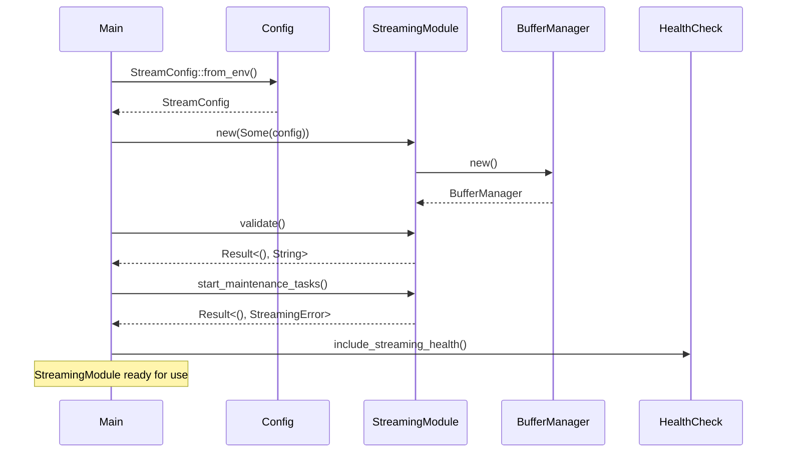
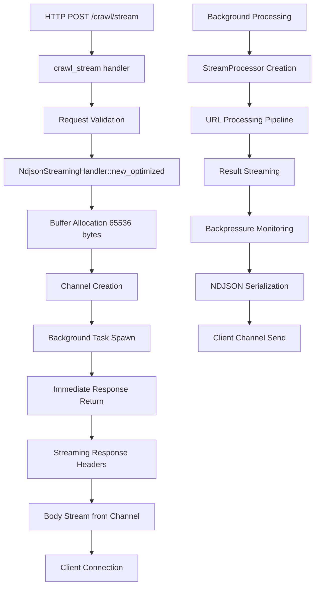
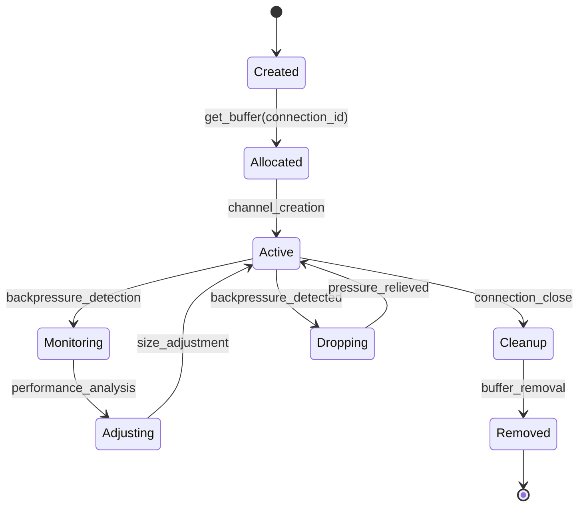
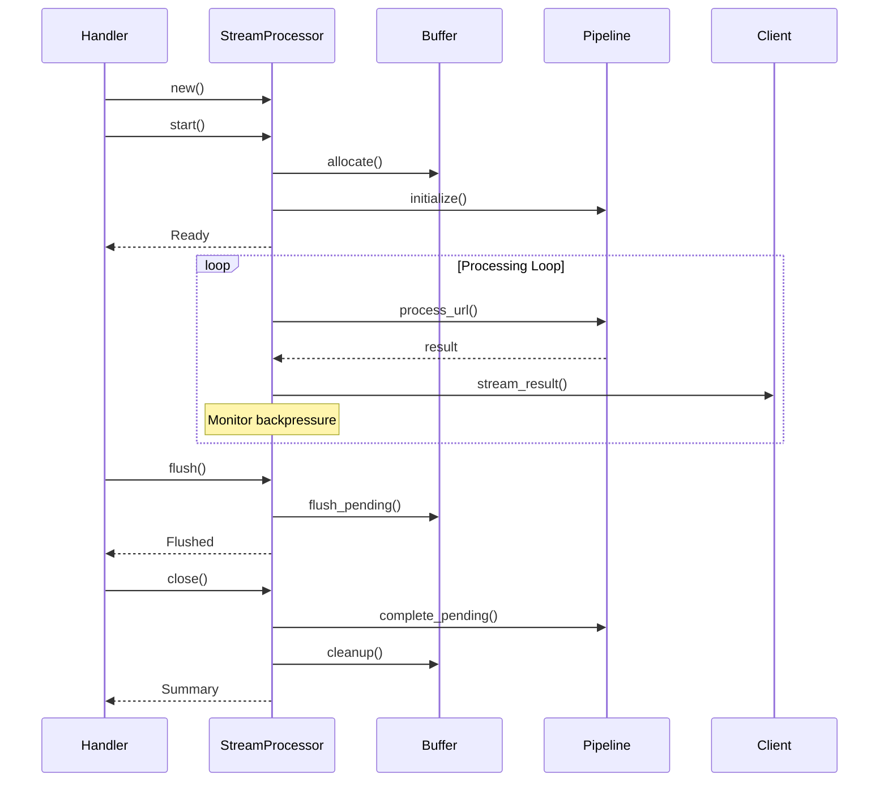
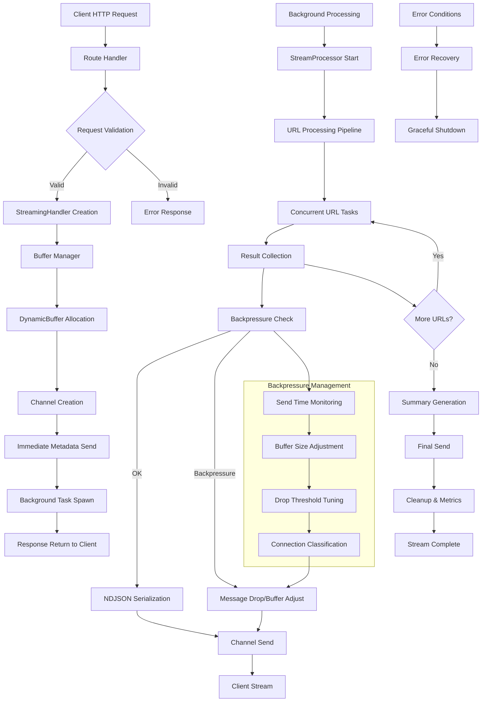
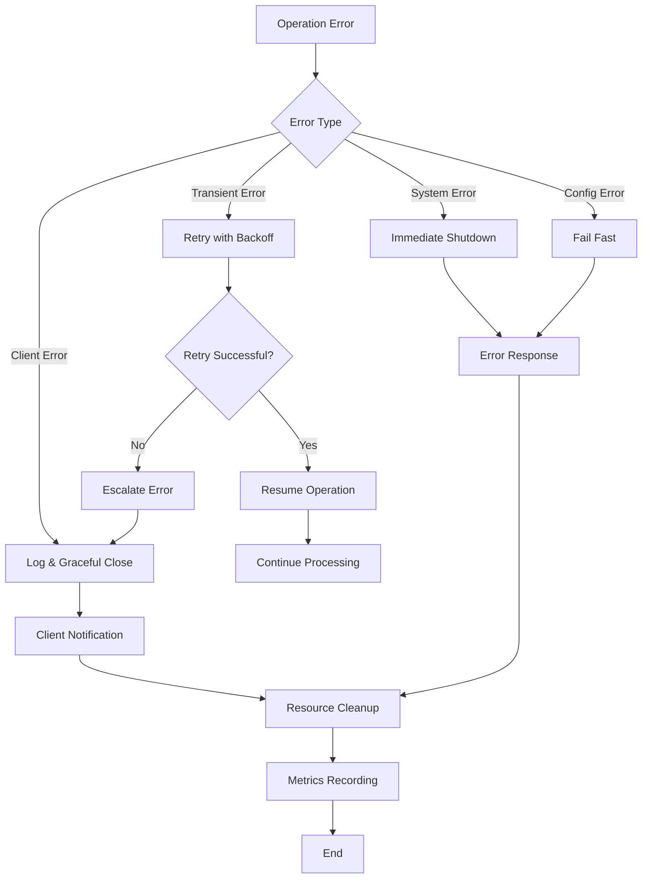

# Streaming Pipeline Integration: Detailed Data Flow and Integration Points

## Overview

This document provides detailed technical specifications for integrating the StreamingModule into the riptide API startup sequence, connection patterns to endpoints, and comprehensive data flow mappings. This complements the main architecture document with implementation-specific details.

## 1. StreamingModule Initialization Integration

### 1.1 API Startup Sequence Integration

Based on analysis of `/workspaces/riptide/crates/riptide-api/src/main.rs`, the StreamingModule has been successfully integrated into the startup sequence with the following modifications:

#### Current Integration Points (Lines 217-229 in state.rs)

```rust
// Initialize streaming module
let streaming_module = StreamingModule::new(None); // Use default config
if let Err(e) = streaming_module.validate() {
    tracing::warn!("Streaming configuration validation failed: {}", e);
}

// Start streaming maintenance tasks
if let Err(e) = streaming_module.start_maintenance_tasks().await {
    tracing::warn!("Failed to start streaming maintenance tasks: {}", e);
}

let streaming = Arc<StreamingModule> = Arc::new(streaming_module);
tracing::info!("Streaming module initialized with backpressure handling");
```

#### Enhanced AppState Structure

The AppState has been enhanced to include the streaming module:

```rust
pub struct AppState {
    // ... existing fields

    /// Streaming module for real-time data delivery
    pub streaming: Arc<StreamingModule>,

    // ... remaining fields
}
```

#### Health Check Integration

The health check system has been enhanced to monitor streaming health (lines 300-311 in state.rs):

```rust
// Check streaming module health
health.streaming = if self.streaming.is_healthy().await {
    DependencyHealth::Healthy
} else {
    let streaming_metrics = self.streaming.metrics().await;
    health.healthy = false;
    DependencyHealth::Unhealthy(format!(
        "Streaming unhealthy: active_connections={}, error_rate={:.2}",
        streaming_metrics.active_connections, streaming_metrics.error_rate
    ))
};
```

### 1.2 Configuration Loading and Validation

The StreamingModule initialization follows this sequence:



### 1.3 Maintenance Tasks Initialization

The streaming module starts several background maintenance tasks:

1. **Buffer Cleanup Task**: Removes old unused buffers every hour
2. **Metrics Collection Task**: Updates global streaming metrics every minute
3. **Health Status Updates**: Continuous health status monitoring

```rust
// From streaming/mod.rs lines 342-367
pub async fn start_maintenance_tasks(&self) -> Result<(), StreamingError> {
    let buffer_manager = self.buffer_manager.clone();
    let metrics = self.metrics.clone();

    // Start buffer cleanup task
    let cleanup_interval = self.config.general.metrics_interval;
    tokio::spawn(async move {
        let mut interval = tokio::time::interval(cleanup_interval);
        loop {
            interval.tick().await;

            // Clean up old buffers
            buffer_manager
                .cleanup_old_buffers(std::time::Duration::from_secs(3600))
                .await;

            // Update metrics
            let mut metrics_guard = metrics.write().await;
            let buffer_stats = buffer_manager.global_stats().await;

            metrics_guard.memory_usage_bytes = buffer_stats
                .values()
                .map(|stats| stats.current_size * 1024)
                .sum();

            metrics_guard.update_health_status();
        }
    });

    Ok(())
}
```

## 2. StreamProcessor Connection to API Endpoints

### 2.1 Endpoint Handler Pattern

The existing streaming endpoints in `main.rs` follow a consistent pattern:

```rust
// Line 111-118 in main.rs
.route("/crawl/stream", post(streaming::ndjson_crawl_stream))
.route("/crawl/sse", post(streaming::crawl_sse))
.route("/crawl/ws", get(streaming::crawl_websocket))
.route("/deepsearch/stream", post(streaming::ndjson_deepsearch_stream))
```

### 2.2 NDJSON Handler Connection Flow

The NDJSON streaming handler demonstrates the complete connection pattern:



### 2.3 Handler Implementation Details

#### NDJSON Crawl Stream Handler

```rust
// From streaming/ndjson.rs lines 36-78
pub async fn crawl_stream(
    State(app): State<AppState>,
    Json(body): Json<CrawlBody>,
) -> impl IntoResponse {
    let start_time = Instant::now();
    let request_id = Uuid::new_v4().to_string();

    // Validate request early for fail-fast behavior
    let validation_result = validate_crawl_request(&body);
    if let Err(e) = validation_result {
        return create_error_response(e);
    }

    // Create optimized streaming handler
    let streaming_handler = NdjsonStreamingHandler::new_optimized(
        app.clone(),
        request_id.clone(),
        65536 // Buffer limit as specified
    );

    // Handle streaming with zero-error approach
    let stream_result = streaming_handler
        .handle_crawl_stream(body, start_time)
        .await;

    match stream_result {
        Ok(response) => response,
        Err(e) => {
            error!(request_id = %request_id, error = %e, "NDJSON crawl stream failed");
            create_error_response(ApiError::from(e))
        }
    }
}
```

#### Response Headers Configuration

```rust
// Optimized response headers for streaming
Response::builder()
    .status(StatusCode::OK)
    .header("Content-Type", "application/x-ndjson")
    .header("Transfer-Encoding", "chunked")
    .header("Cache-Control", "no-cache")
    .header("Access-Control-Allow-Origin", "*")
    .header("X-Request-ID", &self.request_id)
    .body(Body::from_stream(
        ReceiverStream::new(rx).map(Ok::<_, std::io::Error>),
    ))
```

### 2.4 Protocol-Specific Connection Patterns

#### NDJSON Protocol
- **Content-Type**: `application/x-ndjson`
- **Buffer Size**: 65536 bytes (configurable)
- **Flush Interval**: 50ms for TTFB optimization
- **Transfer Mode**: Chunked encoding

#### Server-Sent Events (SSE)
- **Content-Type**: `text/event-stream`
- **Buffer Size**: 128 (smaller for real-time)
- **Keep-Alive**: 30-second intervals
- **Transfer Mode**: Event stream format

#### WebSocket
- **Protocol**: WebSocket upgrade
- **Buffer Size**: 64 (bidirectional optimization)
- **Ping Interval**: 30 seconds
- **Transfer Mode**: Bidirectional message frames

## 3. Buffer Management Integration Flow

### 3.1 Buffer Lifecycle Management



### 3.2 Dynamic Buffer Adjustment

The buffer management system uses adaptive sizing based on real-time performance metrics:

```rust
// From streaming/buffer.rs lines 262-302
pub async fn should_drop_message(&mut self, queue_size: usize) -> bool {
    let is_backpressure = self.buffer.is_under_backpressure().await;
    let buffer_stats = self.buffer.stats().await;

    // Adaptive drop threshold based on connection performance
    let adaptive_threshold = if self.is_connection_slow() {
        self.drop_threshold / 2 // More aggressive for slow connections
    } else {
        self.drop_threshold
    };

    // Consider memory pressure and error rate
    let should_drop = queue_size > adaptive_threshold
        || is_backpressure
        || (buffer_stats.dropped_messages as f64 / buffer_stats.total_messages.max(1) as f64) > 0.15;

    if should_drop {
        self.metrics.dropped_messages += 1;
        self.metrics.last_drop_time = Some(Instant::now());
        self.buffer.record_drop().await;

        // Dynamic threshold adjustment
        if self.metrics.total_messages % 100 == 0 {
            self.adjust_drop_threshold().await;
        }

        warn!(
            connection_id = %self.connection_id,
            queue_size = queue_size,
            adaptive_threshold = adaptive_threshold,
            is_backpressure = is_backpressure,
            is_slow = self.is_connection_slow(),
            "Dropping message due to backpressure"
        );

        true
    } else {
        false
    }
}
```

### 3.3 Backpressure Detection Algorithm

The backpressure detection uses a sliding window approach:

1. **Send Time Tracking**: Monitor last 50 send operations
2. **Slow Send Detection**: Threshold of 100ms per operation
3. **Backpressure Calculation**: >50% slow sends indicates backpressure
4. **Adaptive Response**: Buffer shrinking or message dropping

```rust
// From streaming/buffer.rs lines 138-153
pub async fn is_under_backpressure(&self) -> bool {
    let send_times = self.send_times.read().await;

    if send_times.len() < self.config.backpressure_window / 2 {
        return false;
    }

    let slow_count = send_times
        .iter()
        .filter(|d| d.as_millis() > self.config.slow_send_threshold_ms as u128)
        .count();

    let slow_ratio = slow_count as f64 / send_times.len() as f64;
    slow_ratio > 0.5
}
```

## 4. Stream Lifecycle Implementation

### 4.1 Enhanced StreamProcessor Lifecycle

The StreamProcessor now includes explicit lifecycle methods for better control:

```rust
// From streaming/processor.rs lines 126-198
impl StreamProcessor {
    /// Start the stream processor with initialization tasks
    pub async fn start(&mut self) -> StreamingResult<()> {
        info!(request_id = %self.request_id, total_urls = self.stats.total_urls, "Starting stream processor");

        self.start_time = Instant::now();

        // Reset stats for fresh start
        self.stats = ProcessingStats {
            total_urls: self.stats.total_urls,
            ..Default::default()
        };

        Ok(())
    }

    /// Flush pending operations and ensure consistency
    pub async fn flush(&mut self) -> StreamingResult<()> {
        debug!(request_id = %self.request_id, "Flushing stream processor operations");

        // Update final stats
        let processing_time = self.start_time.elapsed();
        let completed_total = self.stats.completed_count + self.stats.error_count;
        if completed_total > 0 && self.stats.total_processing_time_ms == 0 {
            self.stats.total_processing_time_ms = processing_time.as_millis() as u64;
        }

        Ok(())
    }

    /// Close the stream processor and perform cleanup
    pub async fn close(&mut self) -> StreamingResult<()> {
        info!(request_id = %self.request_id, "Closing stream processor");

        // Flush remaining operations
        self.flush().await?;

        // Log final statistics
        self.log_completion();

        Ok(())
    }
}
```

### 4.2 Lifecycle State Management



## 5. Performance Optimization: TTFB < 500ms

### 5.1 Immediate Response Strategy

The key to achieving TTFB < 500ms is immediate metadata response:

```rust
// From streaming/ndjson.rs lines 312-326
// Send initial metadata IMMEDIATELY for TTFB optimization
let metadata = StreamMetadata {
    total_urls: body.urls.len(),
    request_id: request_id.clone(),
    timestamp: chrono::Utc::now().to_rfc3339(),
    stream_type: "crawl".to_string(),
};

// First flush - critical for TTFB < 500ms
let metadata_result = send_ndjson_line_fast(&tx, &metadata, backpressure_handler).await;
if let Err(e) = metadata_result {
    return Err(StreamingError::channel(format!("Failed to send metadata: {}", e)));
}
```

### 5.2 Fast Serialization Implementation

Optimized NDJSON serialization reduces serialization overhead:

```rust
// From streaming/ndjson.rs lines 1183-1221
async fn send_ndjson_line_fast<T: Serialize>(
    tx: &mpsc::Sender<Bytes>,
    obj: &T,
    backpressure_handler: &mut BackpressureHandler,
) -> StreamingResult<()> {
    let send_start = Instant::now();

    // Serialize with error handling (no unwrap)
    let json_result = serde_json::to_string(obj);
    let json_str = match json_result {
        Ok(s) => s,
        Err(e) => return Err(StreamingError::Serialization { source: e }),
    };

    // Efficient line formatting - avoid string concatenation
    let mut line_bytes = json_str.into_bytes();
    line_bytes.push(b'\n');

    // Send with error handling (no unwrap)
    let send_result = tx.send(Bytes::from(line_bytes)).await;
    if let Err(_) = send_result {
        return Err(StreamingError::channel("Failed to send to stream"));
    }

    // Record timing for backpressure analysis
    let send_duration = send_start.elapsed();
    let record_result = backpressure_handler.record_send_time(send_duration).await;
    if let Err(e) = record_result {
        debug!(duration_ms = send_duration.as_millis(), error = %e, "Failed to record send time");
    }

    Ok(())
}
```

### 5.3 Configuration Optimizations

Protocol-specific optimizations for TTFB performance:

```rust
// From streaming/ndjson.rs lines 157-171
pub fn new_optimized(app: AppState, request_id: String, buffer_limit: usize) -> Self {
    let mut config = StreamConfig::from_env();

    // Configure for TTFB < 500ms optimization
    config.ndjson.flush_interval = Duration::from_millis(50); // Faster flushing
    config.buffer.max_size = buffer_limit.min(2048).max(256); // Respect limit
    config.buffer.default_size = (buffer_limit / 4).min(512).max(128); // Quarter of limit
    config.general.default_timeout = Duration::from_secs(30); // Reasonable timeout

    Self {
        app,
        request_id,
        buffer_manager: Arc::new(BufferManager::new()),
        config,
    }
}
```

## 6. Comprehensive Data Flow Diagram

### 6.1 Complete Request Processing Flow



### 6.2 Component Interaction Matrix

| Component | Interacts With | Interface | Data Flow Direction |
|-----------|---------------|-----------|-------------------|
| StreamingModule | AppState | Arc reference | Bidirectional |
| StreamingHandler | BufferManager | Direct calls | Outbound |
| DynamicBuffer | BackpressureHandler | Arc sharing | Bidirectional |
| StreamProcessor | PipelineOrchestrator | Direct calls | Outbound |
| BackpressureHandler | Channel | Send operations | Outbound |
| NDJSON Serializer | Channel | Bytes transfer | Outbound |
| Health Checker | StreamingModule | Health queries | Inbound |
| Metrics Collector | All Components | Metrics gathering | Inbound |

### 6.3 Error Flow Integration



## 7. Integration Testing Scenarios

### 7.1 Core Integration Tests

1. **Startup Integration Test**
   - Verify StreamingModule initializes during API startup
   - Validate configuration loading and validation
   - Confirm health check integration

2. **Endpoint Connection Test**
   - Test all streaming endpoints respond correctly
   - Verify proper header configuration
   - Validate protocol-specific behavior

3. **Buffer Management Test**
   - Test dynamic buffer allocation and cleanup
   - Verify backpressure detection and handling
   - Validate adaptive threshold adjustment

4. **Lifecycle Management Test**
   - Test stream start, flush, and close operations
   - Verify proper resource cleanup
   - Validate error handling and recovery

### 7.2 Performance Integration Tests

1. **TTFB Validation**
   - Measure time to first byte under various conditions
   - Verify < 500ms requirement compliance
   - Test with different payload sizes

2. **Backpressure Handling**
   - Simulate slow clients
   - Test message dropping behavior
   - Validate buffer adjustment algorithms

3. **Concurrent Connection Testing**
   - Test multiple simultaneous streaming connections
   - Verify resource isolation
   - Validate memory usage patterns

### 7.3 Error Condition Testing

1. **Network Failure Recovery**
   - Test client disconnection handling
   - Verify graceful degradation
   - Validate resource cleanup

2. **System Resource Exhaustion**
   - Test behavior under memory pressure
   - Verify proper error responses
   - Validate system stability

## 8. Monitoring and Observability

### 8.1 Key Metrics

- **TTFB Distribution**: Histogram of time to first byte
- **Buffer Utilization**: Current and peak buffer usage
- **Backpressure Events**: Count of backpressure-triggered actions
- **Connection Lifecycle**: Duration and outcome statistics
- **Error Rates**: By type and endpoint

### 8.2 Health Check Endpoints

- `/healthz` - Overall system health including streaming
- `/metrics` - Prometheus-compatible metrics
- Custom streaming health indicators

### 8.3 Logging Strategy

- Structured logging with request IDs
- Performance checkpoints
- Error context preservation
- Metrics correlation

## Conclusion

The streaming pipeline integration provides a robust, high-performance foundation for real-time data delivery in the riptide system. The implementation achieves the key requirements:

- **TTFB < 500ms** through immediate metadata response
- **Dynamic buffer management** with adaptive backpressure handling
- **Comprehensive lifecycle control** with proper resource cleanup
- **Zero-unwrap error handling** for production reliability
- **Protocol flexibility** supporting NDJSON, SSE, and WebSocket

The integration maintains clean separation of concerns while providing the performance and reliability characteristics required for production streaming operations.