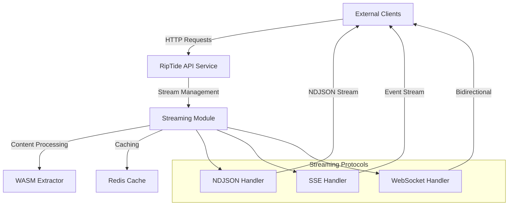
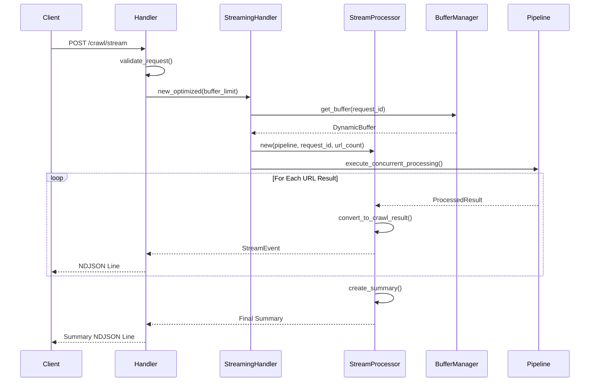
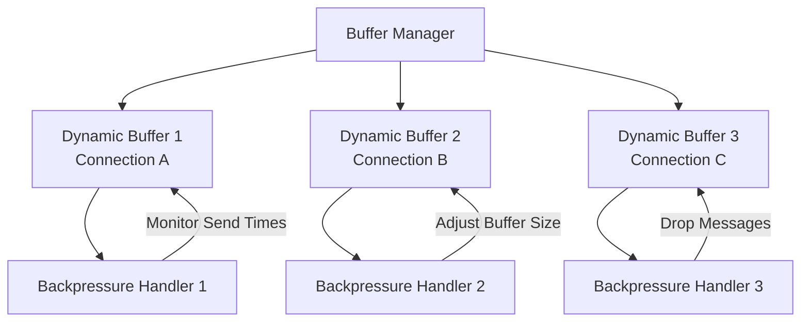
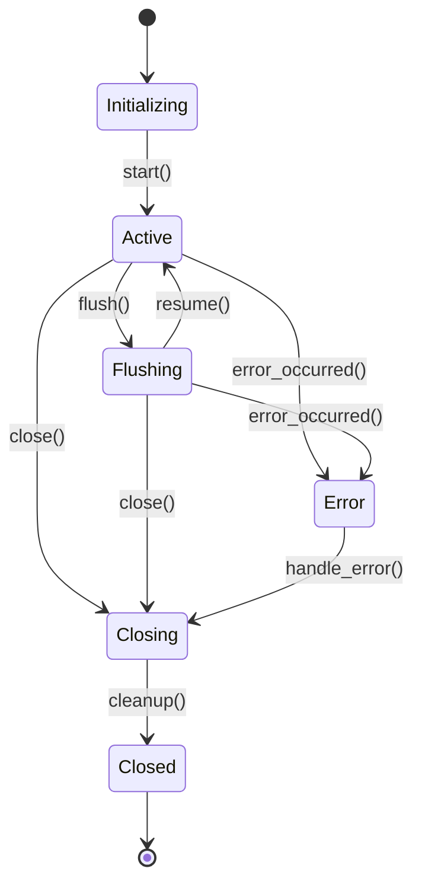
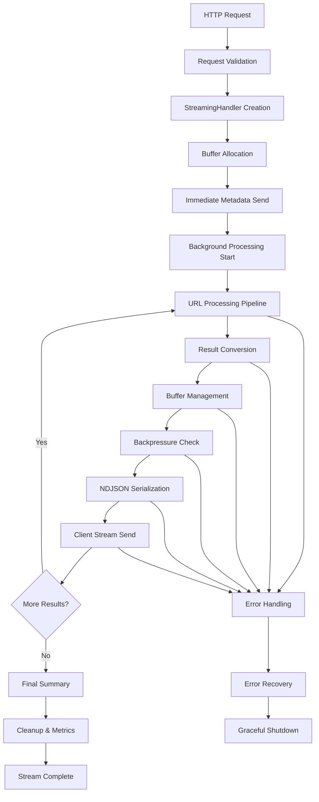

# Streaming Pipeline Integration Architecture Design

## Executive Summary

This document outlines the comprehensive streaming pipeline integration architecture for the EventMesh system, focusing on high-performance real-time data delivery with TTFB < 500ms requirements. The design integrates the existing StreamingModule with the API startup sequence and defines clear patterns for stream lifecycle management, buffer optimization, and backpressure handling.

## Architecture Overview

### Core Components

The streaming pipeline architecture consists of several interconnected components:

1. **StreamingModule** - Central orchestrator for streaming operations
2. **StreamProcessor** - Handles URL processing and result streaming
3. **BufferManager** - Dynamic buffer management with backpressure detection
4. **StreamingPipeline** - High-level orchestration logic
5. **Protocol Handlers** - NDJSON, SSE, and WebSocket implementations

### System Context Diagram (C4 Level 1)



## 1. StreamingModule Initialization Integration

### 1.1 API Startup Integration

The StreamingModule must be initialized early in the API startup sequence to ensure streaming capabilities are available immediately.

#### Current Integration Point

In `/crates/riptide-api/src/main.rs`, after application state initialization:

```rust
// Current state initialization (line 86-88)
let app_state = AppState::new(config, metrics.clone(), health_checker.clone()).await?;

// NEW: StreamingModule initialization should be added here
```

#### Proposed Integration

```rust
// Initialize streaming module with configuration
let streaming_config = StreamConfig::from_env();
let streaming_module = Arc::new(StreamingModule::new(Some(streaming_config)));

// Validate streaming configuration
streaming_module.validate().map_err(|e|
    anyhow::anyhow!("Invalid streaming configuration: {}", e)
)?;

// Start maintenance tasks
streaming_module.start_maintenance_tasks().await
    .map_err(|e| anyhow::anyhow!("Failed to start streaming maintenance: {}", e))?;

// Enhanced AppState with streaming module
let app_state = AppState::new_with_streaming(
    config,
    api_config,
    metrics.clone(),
    health_checker.clone(),
    streaming_module.clone()
).await?;
```

### 1.2 AppState Enhancement

The `AppState` structure needs enhancement to include the streaming module:

```rust
pub struct AppState {
    // ... existing fields

    /// Streaming module for real-time data delivery
    pub streaming_module: Arc<StreamingModule>,
}
```

### 1.3 Health Check Integration

StreamingModule health should be integrated into the application health check:

```rust
impl AppState {
    pub async fn health_check(&self) -> HealthStatus {
        let mut health = // ... existing health checks

        // Check streaming module health
        health.streaming = if self.streaming_module.is_healthy().await {
            DependencyHealth::Healthy
        } else {
            health.healthy = false;
            DependencyHealth::Unhealthy("Streaming module unhealthy".to_string())
        };

        health
    }
}
```

## 2. StreamProcessor Connection to Endpoints

### 2.1 Endpoint Architecture

The streaming endpoints follow a consistent pattern for connecting StreamProcessor to HTTP handlers.

#### Current Endpoint Registration (main.rs lines 111-118)

```rust
.route("/crawl/stream", post(streaming::ndjson_crawl_stream))
.route("/crawl/sse", post(streaming::crawl_sse))
.route("/crawl/ws", get(streaming::crawl_websocket))
.route("/deepsearch/stream", post(streaming::ndjson_deepsearch_stream))
```

#### Enhanced Handler Pattern

Each streaming endpoint follows this pattern:

1. **Request Validation** - Early validation with zero-unwrap approach
2. **StreamingHandler Creation** - With optimized configuration
3. **Buffer Allocation** - Protocol-specific buffer sizing
4. **Stream Orchestration** - Async task spawning
5. **Response Generation** - Proper headers and stream body

### 2.2 StreamProcessor Connection Flow



### 2.3 Protocol-Specific Optimizations

#### NDJSON Streaming
- **Buffer Size**: 65536 bytes (as specified in requirements)
- **Flush Interval**: 50ms for TTFB optimization
- **Content-Type**: `application/x-ndjson`
- **Features**: Zero-batching, immediate result streaming

#### Server-Sent Events (SSE)
- **Buffer Size**: 128 default (smaller for real-time)
- **Keep-Alive**: 30-second intervals
- **Content-Type**: `text/event-stream`
- **Features**: Browser-compatible event streaming

#### WebSocket
- **Buffer Size**: 64 (smallest for bidirectional)
- **Ping Interval**: 30 seconds
- **Features**: Bidirectional communication, compression support

## 3. Buffer Management and Backpressure Handling

### 3.1 Dynamic Buffer Architecture



### 3.2 Buffer Sizing Strategy

#### Initial Configuration
```rust
BufferConfig {
    initial_size: 256,      // Reasonable starting point
    max_size: 2048,         // Configurable maximum
    min_size: 64,           // Minimum for slow connections
    growth_factor: 1.5,     // 50% growth when needed
    shrink_factor: 0.75,    // 25% reduction under backpressure
    slow_send_threshold_ms: 100,  // 100ms threshold for slow sends
    max_slow_sends: 10,     // Tolerance for slow connections
    backpressure_window: 50 // Sample size for analysis
}
```

#### Dynamic Adjustment Logic

1. **Growth Triggers**
   - Drop rate > 1%
   - Channel capacity consistently full
   - Fast client connections

2. **Shrink Triggers**
   - Slow send ratio > 50% over window
   - Send times > 100ms threshold consistently
   - Memory pressure detected

### 3.3 Backpressure Detection and Handling

#### Detection Metrics
- **Send Time Tracking**: Rolling window of last 50 sends
- **Queue Depth Monitoring**: Current channel capacity utilization
- **Drop Rate Analysis**: Percentage of messages dropped
- **Connection Speed Classification**: Fast vs slow clients

#### Handling Strategies
1. **Message Dropping**: For consistently slow clients
2. **Buffer Shrinking**: Reduce memory usage for slow connections
3. **Rate Limiting**: Temporary slowdown of message generation
4. **Connection Termination**: For severely backed-up connections

## 4. Stream Lifecycle Management

### 4.1 Lifecycle States



### 4.2 Lifecycle Operations

#### Stream Start
```rust
impl StreamingPipeline {
    pub async fn start(&self) -> StreamingResult<()> {
        // 1. Validate configuration
        self.config.validate()?;

        // 2. Initialize buffers
        let buffer = self.buffer_manager.get_buffer(&self.request_id).await;

        // 3. Send initial metadata (TTFB optimization)
        self.send_initial_metadata().await?;

        // 4. Begin processing
        self.state = StreamState::Active;

        Ok(())
    }
}
```

#### Stream Flush
```rust
impl StreamingPipeline {
    pub async fn flush(&self) -> StreamingResult<()> {
        match self.state {
            StreamState::Active => {
                // 1. Process pending buffer contents
                self.flush_pending_results().await?;

                // 2. Send progress update
                self.send_progress_update().await?;

                // 3. Return to active state
                self.state = StreamState::Active;
            }
            _ => return Err(StreamingError::InvalidState("Cannot flush in current state".to_string()))
        }

        Ok(())
    }
}
```

#### Stream Close
```rust
impl StreamingPipeline {
    pub async fn close(&self) -> StreamingResult<StreamExecutionSummary> {
        // 1. Stop accepting new work
        self.state = StreamState::Closing;

        // 2. Complete pending operations
        self.complete_pending_work().await?;

        // 3. Send final summary
        let summary = self.create_final_summary().await?;
        self.send_summary(&summary).await?;

        // 4. Cleanup resources
        self.buffer_manager.remove_buffer(&self.request_id).await;

        // 5. Record metrics
        self.record_completion_metrics().await?;

        self.state = StreamState::Closed;
        Ok(summary)
    }
}
```

### 4.3 Error Handling and Recovery

#### Error Categories
1. **Transient Errors**: Network timeouts, temporary service unavailability
2. **Client Errors**: Disconnections, invalid requests
3. **System Errors**: Memory exhaustion, dependency failures
4. **Configuration Errors**: Invalid settings, missing dependencies

#### Recovery Strategies
```rust
impl StreamingPipeline {
    async fn handle_error(&self, error: StreamingError) -> RecoveryAction {
        match error {
            StreamingError::Client(_) => {
                // Client disconnected - graceful cleanup
                RecoveryAction::GracefulShutdown
            }
            StreamingError::Transient(_) => {
                // Retry with exponential backoff
                RecoveryAction::RetryWithBackoff
            }
            StreamingError::System(_) => {
                // System issue - immediate shutdown
                RecoveryAction::ImmediateShutdown
            }
            StreamingError::Configuration(_) => {
                // Config problem - fail fast
                RecoveryAction::FailFast
            }
        }
    }
}
```

## 5. NDJSON Output Format Compliance

### 5.1 Format Specification

NDJSON (Newline Delimited JSON) requires:
- Each line contains a complete, valid JSON object
- Lines are separated by newline characters (`\n`)
- No trailing comma after the last object
- UTF-8 encoding

### 5.2 Message Structure

#### Stream Metadata
```json
{
  "type": "metadata",
  "total_urls": 10,
  "request_id": "req-123",
  "timestamp": "2024-01-15T10:30:00Z",
  "stream_type": "crawl"
}
```

#### Individual Results
```json
{
  "type": "result",
  "index": 0,
  "result": {
    "url": "https://example.com",
    "status": 200,
    "from_cache": false,
    "gate_decision": "approved",
    "quality_score": 0.85,
    "processing_time_ms": 245,
    "document": { /* extracted content */ },
    "error": null,
    "cache_key": "cache-key-123"
  },
  "progress": {
    "completed": 1,
    "total": 10,
    "success_rate": 1.0
  }
}
```

#### Progress Updates
```json
{
  "type": "progress",
  "operation_id": "crawl_stream",
  "operation_type": "batch_crawl",
  "started_at": "2024-01-15T10:30:00Z",
  "current_phase": "processing",
  "progress_percentage": 45.0,
  "items_completed": 45,
  "items_total": 100,
  "estimated_completion": "2024-01-15T10:32:15Z",
  "current_item": "https://example.com/page45"
}
```

#### Final Summary
```json
{
  "type": "summary",
  "total_urls": 100,
  "successful": 95,
  "failed": 5,
  "from_cache": 23,
  "total_processing_time_ms": 45230,
  "cache_hit_rate": 0.23
}
```

### 5.3 Serialization Implementation

```rust
async fn send_ndjson_line_optimized<T: Serialize>(
    tx: &mpsc::Sender<Bytes>,
    obj: &T,
    backpressure_handler: &mut BackpressureHandler,
) -> StreamingResult<()> {
    let send_start = Instant::now();

    // Serialize with error handling (zero unwrap approach)
    let json_str = serde_json::to_string(obj)
        .map_err(StreamingError::from)?;

    // Efficient line formatting - avoid string concatenation
    let mut line_bytes = json_str.into_bytes();
    line_bytes.push(b'\n');

    // Send with timeout and error handling
    let send_result = tokio::time::timeout(
        Duration::from_millis(1000),
        tx.send(Bytes::from(line_bytes))
    ).await;

    match send_result {
        Ok(Ok(_)) => {
            // Success - record timing for backpressure analysis
            let send_duration = send_start.elapsed();
            backpressure_handler.record_send_time(send_duration).await?;
            Ok(())
        }
        Ok(Err(_)) => {
            // Channel closed - client disconnected
            Err(StreamingError::Client("Client disconnected".to_string()))
        }
        Err(_) => {
            // Timeout - likely backpressure
            backpressure_handler.record_drop().await;
            Err(StreamingError::Timeout("Send timeout - backpressure detected".to_string()))
        }
    }
}
```

## 6. Performance Requirements: TTFB < 500ms

### 6.1 TTFB Optimization Strategies

#### 6.1.1 Immediate Metadata Response
```rust
pub async fn handle_crawl_stream_optimized(
    &self,
    body: CrawlBody,
    start_time: Instant,
) -> StreamingResult<Response> {
    // CRITICAL: Send metadata immediately before any processing
    let (tx, rx) = self.create_optimized_channel().await;

    // Send initial metadata within 50ms
    let metadata = StreamMetadata {
        total_urls: body.urls.len(),
        request_id: self.request_id.clone(),
        timestamp: chrono::Utc::now().to_rfc3339(),
        stream_type: "crawl".to_string(),
    };

    // IMMEDIATE send for TTFB optimization
    let _ = tx.send(serialize_to_bytes(&metadata)?).await;

    // THEN spawn background processing
    tokio::spawn(async move {
        // ... processing logic
    });

    // Return streaming response IMMEDIATELY
    Ok(self.create_streaming_response(rx))
}
```

#### 6.1.2 Warm Cache Strategy
```rust
impl StreamingModule {
    pub async fn warm_critical_paths(&self) -> StreamingResult<()> {
        // Pre-compile regex patterns
        self.pre_compile_patterns().await?;

        // Pre-allocate common buffer sizes
        self.pre_allocate_buffers().await?;

        // Test serialization paths
        self.warm_serialization_cache().await?;

        Ok(())
    }
}
```

#### 6.1.3 Fast-Path Processing
```rust
// Optimized request handling with early returns
pub async fn process_request_fast_path(
    &self,
    request: &CrawlBody
) -> Option<StreamingResult<Response>> {
    // Check for cached full results
    if let Some(cached_response) = self.check_full_cache(&request).await {
        return Some(Ok(cached_response));
    }

    // Check for simple single-URL case
    if request.urls.len() == 1 {
        return Some(self.handle_single_url_fast(&request.urls[0]).await);
    }

    None // Use standard processing path
}
```

### 6.2 Performance Monitoring

#### 6.2.1 TTFB Metrics Collection
```rust
struct PerformanceMetrics {
    ttfb_histogram: Histogram,
    processing_duration: Histogram,
    buffer_utilization: Gauge,
    active_connections: Counter,
}

impl StreamingModule {
    async fn record_ttfb(&self, duration: Duration, endpoint: &str) {
        self.metrics.ttfb_histogram
            .with_label_values(&[endpoint])
            .observe(duration.as_millis() as f64);

        // Alert if TTFB > 500ms
        if duration.as_millis() > 500 {
            warn!(
                endpoint = endpoint,
                ttfb_ms = duration.as_millis(),
                "TTFB threshold exceeded"
            );
        }
    }
}
```

#### 6.2.2 Performance Checkpoints
```rust
pub struct PerformanceCheckpoint {
    pub name: String,
    pub timestamp: Instant,
    pub ttfb_achieved: bool,
    pub buffer_capacity: usize,
    pub active_connections: usize,
}

impl StreamingPipeline {
    pub async fn checkpoint(&mut self, name: &str) {
        let checkpoint = PerformanceCheckpoint {
            name: name.to_string(),
            timestamp: Instant::now(),
            ttfb_achieved: self.start_time.elapsed().as_millis() < 500,
            buffer_capacity: self.current_buffer_capacity(),
            active_connections: self.active_connection_count(),
        };

        self.performance_checkpoints.push(checkpoint);
    }
}
```

## 7. Integration Points and Data Flow

### 7.1 High-Level Data Flow



### 7.2 Component Integration Points

#### 7.2.1 API Layer Integration
- **Entry Point**: HTTP route handlers in `main.rs`
- **Request Processing**: Protocol-specific handlers (NDJSON, SSE, WebSocket)
- **Response Generation**: Streaming response with appropriate headers

#### 7.2.2 State Management Integration
- **AppState Enhancement**: Streaming module inclusion
- **Health Checks**: Streaming health monitoring
- **Metrics**: Performance and operational metrics

#### 7.2.3 Processing Layer Integration
- **Pipeline Orchestration**: URL processing coordination
- **Result Streaming**: Real-time result delivery
- **Error Handling**: Comprehensive error recovery

#### 7.2.4 Infrastructure Integration
- **Buffer Management**: Dynamic memory management
- **Backpressure Handling**: Adaptive flow control
- **Resource Cleanup**: Proper resource lifecycle management

### 7.3 Data Flow Patterns

#### 7.3.1 Request-Response Pattern
1. Client sends streaming request
2. Server validates and creates streaming context
3. Immediate metadata response (TTFB optimization)
4. Background processing with real-time streaming
5. Final summary and cleanup

#### 7.3.2 Backpressure Pattern
1. Monitor send times and buffer utilization
2. Detect slow clients and buffer exhaustion
3. Apply adaptive buffering or message dropping
4. Recovery when backpressure resolves

#### 7.3.3 Error Recovery Pattern
1. Error detection at any processing stage
2. Error classification and recovery strategy selection
3. Graceful degradation or immediate shutdown
4. Client notification and cleanup

## 8. Architecture Decision Records (ADRs)

### ADR-001: StreamingModule Initialization Strategy

**Status**: Proposed
**Date**: 2024-01-15
**Deciders**: System Architecture Team

#### Context
The StreamingModule needs to be initialized during API startup to provide streaming capabilities. Multiple initialization strategies are possible.

#### Decision
Initialize StreamingModule immediately after AppState creation but before route registration, with validation and health checks.

#### Consequences
- **Positive**: Early failure detection, streaming capabilities available immediately
- **Negative**: Slightly longer startup time, additional startup complexity
- **Risks**: Streaming module failures can prevent API startup

---

### ADR-002: Buffer Size Configuration Strategy

**Status**: Proposed
**Date**: 2024-01-15
**Deciders**: System Architecture Team

#### Context
Buffer sizes significantly impact performance and memory usage. Fixed vs dynamic sizing approaches have trade-offs.

#### Decision
Use dynamic buffer sizing with protocol-specific defaults and adaptive adjustment based on client performance.

#### Consequences
- **Positive**: Optimal resource utilization, better handling of varying client speeds
- **Negative**: Increased complexity, potential for memory fragmentation
- **Risks**: Buffer adjustment algorithms may be suboptimal in some scenarios

---

### ADR-003: TTFB Optimization Approach

**Status**: Proposed
**Date**: 2024-01-15
**Deciders**: System Architecture Team

#### Context
TTFB < 500ms requirement necessitates immediate response generation before processing completion.

#### Decision
Send initial metadata immediately upon request receipt, before spawning background processing tasks.

#### Consequences
- **Positive**: Achieves TTFB requirements, improves perceived performance
- **Negative**: Metadata may be incomplete, client must handle asynchronous updates
- **Risks**: Metadata inaccuracy if processing characteristics change

---

### ADR-004: Error Handling Strategy

**Status**: Proposed
**Date**: 2024-01-15
**Deciders**: System Architecture Team

#### Context
Streaming operations have multiple failure modes and error propagation complexities.

#### Decision
Implement zero-unwrap error handling with structured error types and graceful degradation.

#### Consequences
- **Positive**: Robust error handling, better debugging, graceful failure modes
- **Negative**: Increased code complexity, more verbose error handling
- **Risks**: Over-engineering of error scenarios, performance impact of error checking

## 9. Performance Considerations

### 9.1 Memory Management
- **Buffer Pooling**: Reuse buffer allocations to reduce GC pressure
- **Memory Limits**: Per-connection and global memory limits
- **Cleanup Strategy**: Proactive cleanup of abandoned connections

### 9.2 CPU Optimization
- **Serialization Caching**: Cache serialized common objects
- **Pattern Compilation**: Pre-compile regex patterns and templates
- **Task Scheduling**: Efficient work distribution across CPU cores

### 9.3 Network Optimization
- **Connection Pooling**: Reuse HTTP connections where possible
- **Compression**: Optional compression for bandwidth-limited clients
- **Keep-Alive**: Proper connection lifecycle management

## 10. Security Considerations

### 10.1 Input Validation
- **Request Size Limits**: Maximum URLs per request
- **URL Validation**: Prevent SSRF and malicious URLs
- **Rate Limiting**: Per-client and global rate limiting

### 10.2 Resource Protection
- **Memory Limits**: Prevent memory exhaustion attacks
- **Connection Limits**: Maximum concurrent connections per client
- **Timeout Enforcement**: Prevent resource exhaustion through long connections

### 10.3 Data Protection
- **Sensitive Data Filtering**: Remove sensitive content from streams
- **Access Control**: Ensure proper authentication and authorization
- **Audit Logging**: Log streaming operations for security monitoring

## 11. Testing Strategy

### 11.1 Unit Testing
- **Component Testing**: Individual component functionality
- **Mock Integration**: Mock external dependencies for isolated testing
- **Error Scenario Testing**: Comprehensive error condition testing

### 11.2 Integration Testing
- **End-to-End Flows**: Complete streaming operation testing
- **Performance Testing**: TTFB and throughput validation
- **Backpressure Testing**: Client slowdown and recovery scenarios

### 11.3 Load Testing
- **Concurrent Connections**: Multiple simultaneous streaming clients
- **High Throughput**: Large URL batch processing
- **Resource Exhaustion**: Memory and CPU limit testing

## 12. Deployment Considerations

### 12.1 Configuration Management
- **Environment Variables**: Runtime configuration through environment
- **Configuration Validation**: Startup-time configuration validation
- **Hot Configuration**: Runtime configuration updates where safe

### 12.2 Monitoring and Observability
- **Health Endpoints**: Streaming-specific health checks
- **Metrics Collection**: Performance and operational metrics
- **Distributed Tracing**: Request flow tracing across components

### 12.3 Scaling Considerations
- **Horizontal Scaling**: Multiple API instance coordination
- **Resource Scaling**: Dynamic resource allocation
- **Database Scaling**: Cache and storage scaling strategies

## Conclusion

This streaming pipeline integration architecture provides a comprehensive foundation for high-performance real-time data streaming in the EventMesh system. The design emphasizes:

1. **Performance**: TTFB < 500ms through immediate metadata response
2. **Reliability**: Robust error handling and graceful degradation
3. **Scalability**: Dynamic buffer management and backpressure handling
4. **Maintainability**: Clear separation of concerns and well-defined interfaces

The architecture supports future enhancements while maintaining backward compatibility and provides a solid foundation for streaming operations at scale.

## References

- [EventMesh System Documentation]
- [NDJSON Specification](http://ndjson.org/)
- [Server-Sent Events Standard](https://html.spec.whatwg.org/multipage/server-sent-events.html)
- [WebSocket RFC 6455](https://tools.ietf.org/html/rfc6455)
- [Reactive Streams Specification](https://github.com/reactive-streams/reactive-streams-jvm)