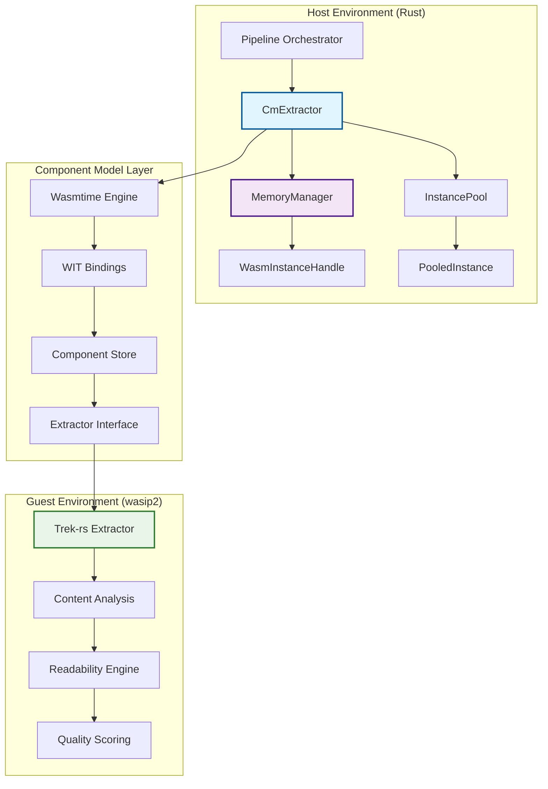
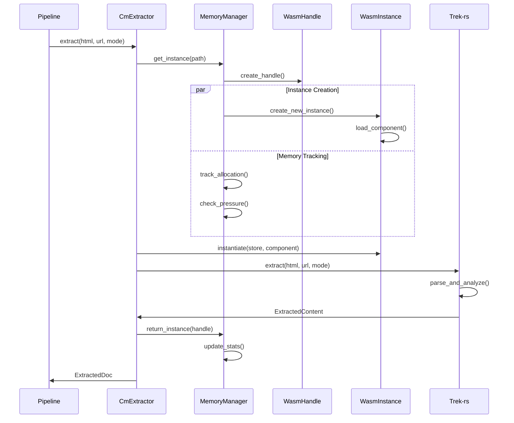

# WASM Component Model Integration Guide

## Executive Summary

The RipTide event mesh implements a sophisticated WebAssembly Component Model (WASM-CM) integration for content extraction, leveraging the wasip2 target and Trek-rs library for production-grade performance. This comprehensive guide covers Component Model integration patterns, memory management, performance optimizations, and production deployment strategies.

**Key Features:**
- **Component Model Architecture**: Type-safe WIT interfaces with structured error handling
- **Trek-rs Integration**: High-quality content extraction with readability algorithms
- **Memory Management**: Intelligent instance pooling with pressure monitoring
- **Performance Optimization**: SIMD instructions, connection pooling, and resource reuse
- **Production Ready**: Circuit breakers, telemetry, and comprehensive error recovery

**Architecture Overview:**
- **Host-Side**: Rust integration using wasmtime Component Model runtime
- **Guest-Side**: wasip2 target with Trek-rs extraction engine
- **Resource Management**: Centralized memory and lifecycle management
- **Integration Layer**: Seamless pipeline integration with error propagation

## Component Model Architecture

### System-Level Integration



### Integration Flow Architecture



## WASM Component Model Interface (WIT)

### WIT Interface Definition

The component uses a comprehensive WIT interface definition from `/wasm/riptide-extractor-wasm/wit/extractor.wit` that provides type-safe integration:

```wit
package riptide:extractor@0.2.0;

/// Content extraction modes with specific behaviors
variant extraction-mode {
    /// Extract article content using readability algorithms
    article,
    /// Extract full page content including sidebars and navigation
    full,
    /// Extract only metadata (title, description, structured data)
    metadata,
    /// Custom extraction using provided CSS selectors
    custom(list<string>),
}

/// Comprehensive extraction result with rich metadata
record extracted-content {
    /// Source URL for context and link resolution
    url: string,
    /// Extracted page title
    title: option<string>,
    /// Author/byline information
    byline: option<string>,
    /// Publication date in ISO 8601 format
    published-iso: option<string>,
    /// Content formatted as Markdown
    markdown: string,
    /// Plain text content with HTML tags removed
    text: string,
    /// List of extracted hyperlinks
    links: list<string>,
    /// List of media URLs (images, videos, audio)
    media: list<string>,
    /// Detected content language (ISO 639-1 code)
    language: option<string>,
    /// Estimated reading time in minutes
    reading-time: option<u32>,
    /// Content quality score (0-100, higher = better)
    quality-score: option<u8>,
    /// Word count of extracted text
    word-count: option<u32>,
    /// Content categories/tags if detected
    categories: list<string>,
    /// Site name/publisher if available
    site-name: option<string>,
    /// Meta description from page
    description: option<string>,
}

/// Structured error types for better error handling
variant extraction-error {
    /// Invalid or malformed HTML input
    invalid-html(string),
    /// Network-related errors during processing
    network-error(string),
    /// HTML parsing failures
    parse-error(string),
    /// Resource limits exceeded (memory, time, etc.)
    resource-limit(string),
    /// Trek-rs library errors
    extractor-error(string),
    /// Component internal processing errors
    internal-error(string),
    /// Unsupported extraction mode
    unsupported-mode(string),
}
```

### Component Information Structure

```rust
/// Component metadata retrieved via get_info()
ComponentInfo {
    name: "riptide-extractor-wasm".to_string(),
    version: "0.2.0".to_string(),
    component_model_version: "0.2.0".to_string(),
    features: vec![
        "article-extraction".to_string(),
        "full-page-extraction".to_string(),
        "metadata-extraction".to_string(),
        "custom-selectors".to_string(),
        "trek-rs-integration".to_string(),
    ],
    supported_modes: vec![
        "article - Extract article content using readability algorithms".to_string(),
        "full - Extract full page content including sidebars and navigation".to_string(),
        "metadata - Extract only metadata (title, description, structured data)".to_string(),
        "custom - Custom extraction using provided CSS selectors".to_string(),
    ],
    build_timestamp: Some(get_build_timestamp().to_string()),
    git_commit: Some(get_git_commit().to_string()),
}

/// Health status structure
HealthStatus {
    status: "healthy".to_string(),
    version: COMPONENT_VERSION.to_string(),
    trek_version: get_trek_version(),
    capabilities: get_supported_modes(),
    memory_usage: Some(get_memory_usage()),
    extraction_count: Some(EXTRACTION_COUNT.load(Ordering::Relaxed)),
}
```

## Trek-rs Integration Implementation

### Host-Side Component Integration

The host-side implementation in `/crates/riptide-core/src/component.rs` provides a sophisticated integration layer:

```rust
/// WebAssembly Component Model extractor for content extraction.
///
/// This implementation provides:
/// - Instance pooling for performance optimization
/// - Memory management with pressure monitoring
/// - Circuit breaker patterns for reliability
/// - Comprehensive error handling and recovery
/// - Performance metrics tracking
pub struct CmExtractor {
    /// Instance pool for efficient reuse
    pool: Arc<Mutex<InstancePool>>,
    /// Configuration settings
    config: ExtractorConfig,
    /// Performance metrics
    metrics: Arc<Mutex<PerformanceMetrics>>,
    /// Circuit breaker state for error handling
    circuit_state: Arc<Mutex<CircuitBreakerState>>,
    /// WebAssembly engine for component execution
    engine: Engine,
    /// WebAssembly component
    component: Component,
    /// WebAssembly linker for component instantiation
    linker: Linker<()>,
    /// Memory manager for WASM instance lifecycle
    memory_manager: Arc<MemoryManager>,
    /// Path to the component file
    component_path: String,
}

impl CmExtractor {
    /// Creates extractor with production-grade configuration
    pub async fn with_config(wasm_path: &str, config: ExtractorConfig) -> Result<Self> {
        // Configure Wasmtime for optimal performance
        let mut wasmtime_config = Config::new();
        wasmtime_config.wasm_component_model(true);
        wasmtime_config.cranelift_opt_level(wasmtime::OptLevel::Speed);

        // Enable WASM features for performance
        wasmtime_config.wasm_simd(true);
        wasmtime_config.wasm_bulk_memory(true);
        wasmtime_config.wasm_multi_memory(true);
        wasmtime_config.wasm_memory64(false);

        // Set security and resource limits
        wasmtime_config.max_wasm_stack(2 * 1024 * 1024); // 2MB stack

        let engine = Engine::new(&wasmtime_config)?;
        let component = Component::from_file(&engine, wasm_path)?;
        let linker = Linker::new(&engine);

        // Initialize memory manager with WASM-specific configuration
        let memory_config = MemoryManagerConfig {
            max_total_memory_mb: config.memory_limit / (1024 * 1024),
            max_instances: config.max_pool_size,
            min_instances: config.initial_pool_size,
            instance_memory_threshold_mb: 256,
            aggressive_gc: false,
            memory_pressure_threshold: 80.0,
            ..Default::default()
        };
        let memory_manager = Arc::new(MemoryManager::new(memory_config, engine.clone()).await?);

        // Initialize instance pool with metrics
        let metrics = Arc::new(Mutex::new(PerformanceMetrics::default()));
        let pool = Arc::new(Mutex::new(InstancePool::new(
            engine.clone(),
            component.clone(),
            linker.clone(),
            config.max_pool_size,
            metrics.clone(),
        )));

        // Pre-warm the pool for optimal performance
        if config.initial_pool_size > 0 {
            pool.lock()
                .map_err(|e| anyhow::anyhow!("Failed to acquire pool lock: {}", e))?
                .warm_up(config.initial_pool_size)?;
        }

        Ok(Self {
            pool,
            config,
            metrics,
            circuit_state: Arc::new(Mutex::new(CircuitBreakerState::Closed)),
            engine,
            component,
            linker,
            memory_manager,
            component_path: wasm_path.to_string(),
        })
    }
}
```

### Guest-Side Trek-rs Integration

The guest-side implementation in `/wasm/riptide-extractor-wasm/src/lib.rs` leverages Trek-rs for high-quality content extraction:

```rust
// Generate bindings from enhanced WIT file
wit_bindgen::generate!({
    world: "extractor",
    path: "wit",
});

// Export the Component Model interface
export!(Component);

/// Global extraction counter for tracking component usage
static EXTRACTION_COUNT: Lazy<AtomicU64> = Lazy::new(|| AtomicU64::new(0));

/// Component state for caching and metrics
static COMPONENT_STATE: Lazy<std::sync::Mutex<ComponentState>> =
    Lazy::new(|| std::sync::Mutex::new(ComponentState::new()));

struct Component;

impl Guest for Component {
    /// Primary extraction function with enhanced error handling and trek-rs integration
    fn extract(
        html: String,
        url: String,
        mode: ExtractionMode,
    ) -> Result<ExtractedContent, ExtractionError> {
        // Increment extraction counter
        EXTRACTION_COUNT.fetch_add(1, Ordering::Relaxed);

        // Validate HTML input
        if html.trim().is_empty() {
            return Err(ExtractionError::InvalidHtml(
                "Empty HTML content".to_string(),
            ));
        }

        // Validate URL format
        if url::Url::parse(&url).is_err() {
            return Err(ExtractionError::InvalidHtml(
                "Invalid URL format".to_string(),
            ));
        }

        // Perform extraction with trek-rs
        perform_extraction_with_trek(&html, &url, &mode)
    }

    /// Extract content with detailed performance statistics
    fn extract_with_stats(
        html: String,
        url: String,
        mode: ExtractionMode,
    ) -> Result<(ExtractedContent, ExtractionStats), ExtractionError> {
        let start_time = std::time::Instant::now();
        let initial_memory = get_memory_usage();

        let content = Self::extract(html.clone(), url, mode)?;

        let processing_time = start_time.elapsed().as_millis() as u64;
        let memory_used = get_memory_usage().saturating_sub(initial_memory);
        let links_found = content.links.len() as u32;
        let images_found = content.media.len() as u32;
        let nodes_processed = Some(count_html_nodes(&html));

        let stats = ExtractionStats {
            processing_time_ms: processing_time,
            memory_used,
            nodes_processed,
            links_found,
            images_found,
        };

        Ok((content, stats))
    }
}

/// Create a new trek extractor configured for the given mode
fn create_extractor(mode: &ExtractionMode) -> Trek {
    let options = match mode {
        ExtractionMode::Article => TrekOptions {
            debug: false,
            url: None,
            output: trek_rs::types::OutputOptions {
                markdown: true,
                separate_markdown: true,
            },
            removal: trek_rs::types::RemovalOptions {
                remove_exact_selectors: true,
                remove_partial_selectors: true,
            },
        },
        ExtractionMode::Full => TrekOptions {
            debug: false,
            url: None,
            output: trek_rs::types::OutputOptions {
                markdown: false,
                separate_markdown: false,
            },
            removal: trek_rs::types::RemovalOptions {
                remove_exact_selectors: false,
                remove_partial_selectors: false,
            },
        },
        ExtractionMode::Metadata | ExtractionMode::Custom(_) => TrekOptions::default(),
    };

    Trek::new(options)
}
```

### Quality Scoring Implementation

From `/wasm/riptide-extractor-wasm/src/trek_helpers.rs`:

```rust
/// Calculate content quality score based on trek-rs TrekResponse (0-100)
pub fn calculate_quality_score(response: &TrekResponse) -> u8 {
    let mut score = 30u8; // Base score

    // Title quality assessment (0-15 points)
    if !response.metadata.title.is_empty() {
        let title_len = response.metadata.title.len();
        if title_len > 10 && title_len < 100 {
            score += 15;  // Optimal title length
        } else if title_len > 5 {
            score += 8;   // Acceptable title length
        }
    }

    // Content length scoring (0-20 points)
    let content_len = response.content.len();
    if content_len > 2000 {
        score += 20;      // Substantial content
    } else if content_len > 1000 {
        score += 15;      // Good content length
    } else if content_len > 500 {
        score += 10;      // Moderate content
    } else if content_len > 200 {
        score += 5;       // Minimal content
    }

    // Metadata completeness scoring
    if !response.metadata.author.is_empty() {
        score += 10;      // Author information available
    }
    if !response.metadata.published.is_empty() {
        score += 10;      // Publication date available
    }
    if response.metadata.word_count > 500 {
        score += 10;      // Substantial word count
    } else if response.metadata.word_count > 200 {
        score += 5;       // Moderate word count
    }

    // Structured data bonus
    if !response.meta_tags.is_empty() {
        score += 5;       // Meta tags present
    }

    score.min(100)
}

/// Estimate reading time in minutes based on word count
pub fn estimate_reading_time(word_count: usize) -> Option<u32> {
    if word_count == 0 {
        return None;
    }
    // Average reading speed: 200-250 words per minute (using 225 as baseline)
    let reading_time = (word_count as f32 / 225.0).ceil() as u32;
    Some(reading_time.max(1)) // Minimum 1 minute reading time
}

/// Get trek-rs version information
pub fn get_trek_version() -> String {
    "0.1.1".to_string() // Current trek-rs version being used
}
```

### Core Functions

#### 1. Primary Extraction with Enhanced Error Handling

```rust
/// Extract content using the enhanced typed interface
pub fn extract_typed(
    &self,
    html: &str,
    url: &str,
    mode: ExtractionMode,
) -> Result<ExtractedDoc> {
    // Create a new store for this extraction operation
    let mut store = Store::new(&self.engine, ());

    // Instantiate the component with the configured linker
    let bindings = Extractor::instantiate(&mut store, &self.component, &self.linker)?;

    // Convert our ExtractionMode to the WIT extraction-mode
    let wit_mode = match mode {
        ExtractionMode::Article =>
            exports::riptide::extractor::extract::ExtractionMode::Article,
        ExtractionMode::Full =>
            exports::riptide::extractor::extract::ExtractionMode::Full,
        ExtractionMode::Metadata =>
            exports::riptide::extractor::extract::ExtractionMode::Metadata,
        ExtractionMode::Custom(selectors) =>
            exports::riptide::extractor::extract::ExtractionMode::Custom(selectors),
    };

    // Call the enhanced extraction function
    let result = bindings.interface0.call_extract(&mut store, html, url, &wit_mode)?;

    match result {
        Ok(extracted_content) => {
            // Convert from Component Model types to internal types
            Ok(ExtractedDoc {
                url: extracted_content.url,
                title: extracted_content.title,
                byline: extracted_content.byline,
                published_iso: extracted_content.published_iso,
                markdown: extracted_content.markdown,
                text: extracted_content.text,
                links: extracted_content.links,
                media: extracted_content.media,
                language: extracted_content.language,
                reading_time: extracted_content.reading_time,
                quality_score: extracted_content.quality_score,
                word_count: extracted_content.word_count,
                categories: extracted_content.categories,
                site_name: extracted_content.site_name,
                description: extracted_content.description,
            })
        }
        Err(extraction_error) => {
            // Convert Component Model error to anyhow::Error with context
            let error_msg = match extraction_error {
                exports::riptide::extractor::extract::ExtractionError::InvalidHtml(msg) =>
                    format!("Invalid HTML: {}", msg),
                exports::riptide::extractor::extract::ExtractionError::ExtractorError(msg) =>
                    format!("Trek-rs extractor error: {}", msg),
                exports::riptide::extractor::extract::ExtractionError::InternalError(msg) =>
                    format!("Internal component error: {}", msg),
                // ... handle other error types
            };
            Err(anyhow::anyhow!(error_msg))
        }
    }
}

**Parameters:**
- `html`: Source HTML content (validated for non-empty input)
- `url`: Base URL for context and link resolution (validated for format)
- `mode`: Typed extraction strategy (`ExtractionMode` enum)

**Production Integration Example:**

```rust
// From /crates/riptide-api/src/pipeline.rs integration
use riptide_core::component::CmExtractor;
use riptide_core::types::{ExtractionMode, ExtractedDoc};

pub async fn extract_with_wasm(
    state: &AppState,
    html: &str,
    url: &str,
    mode: ExtractionMode,
) -> Result<ExtractedDoc, ApiError> {
    // The extractor is shared across all requests via AppState
    let extraction_result = state
        .wasm_extractor
        .extract_typed(html, url, mode)
        .map_err(|e| ApiError::extraction(format!("WASM extraction failed: {}", e)))?;

    // Record metrics for monitoring
    state.metrics.increment_wasm_extractions();

    Ok(extraction_result)
}

// Usage in request handlers
let doc = extract_with_wasm(
    &state,
    &html_content,
    "https://example.com/article",
    ExtractionMode::Article
).await?;

let response = CrawlResult {
    url: doc.url,
    title: doc.title.unwrap_or_else(|| "Untitled".to_string()),
    markdown: Some(doc.markdown),
    text: doc.text,
    quality_score: doc.quality_score.map(|q| q as f32 / 100.0),
    reading_time: doc.reading_time,
    word_count: doc.word_count,
    // ... additional fields
};
```

#### 2. Performance Extraction

```rust
fn extract_with_stats(
    html: String,
    url: String,
    mode: ExtractionMode
) -> Result<(ExtractedContent, ExtractionStats), ExtractionError>
```

**Returns detailed performance metrics:**

```json
{
  "content": {
    "url": "https://example.com/article",
    "title": "Article Title",
    "markdown": "# Article Title\n\nContent...",
    "text": "Article Title. Content...",
    "quality_score": 85,
    "word_count": 1200,
    "reading_time": 5
  },
  "stats": {
    "processing_time_ms": 45,
    "memory_used": 2048,
    "nodes_processed": 1250,
    "links_found": 15,
    "images_found": 8
  }
}
```

#### 3. Content Validation

```rust
fn validate_html(html: String) -> Result<bool, ExtractionError>
```

Fast pre-validation before extraction:

```javascript
const isValid = wasmModule.validate_html(htmlContent);
if (isValid.tag === "ok" && isValid.val) {
    // Proceed with extraction
    const result = wasmModule.extract(htmlContent, url, mode);
}
```

#### 4. Health Monitoring

```rust
fn health_check() -> HealthStatus
```

Component health and capabilities:

```json
{
  "status": "healthy",
  "version": "1.0.0",
  "trek_version": "1.2.3",
  "capabilities": [
    "article - Extract article content using readability algorithms",
    "full - Extract full page content including sidebars",
    "metadata - Extract only metadata and structured data",
    "custom - Custom extraction using CSS selectors"
  ],
  "memory_usage": 1048576,
  "extraction_count": 1250
}
```

## Extraction Modes

### Article Mode (Recommended)

Optimized for article content using readability algorithms:

```rust
ExtractionMode::Article
```

**Configuration:**
- Readability-based content detection
- Clean markup with article focus
- Optimized for news, blogs, documentation
- Automatic noise removal

**Output Quality:**
- High precision for main content
- Clean markdown formatting
- Proper heading hierarchy
- Link preservation

### Full Mode

Complete page extraction including navigation and sidebars:

```rust
ExtractionMode::Full
```

**Use Cases:**
- Documentation sites
- Directory pages
- Complex layouts
- When preserving page structure

### Metadata Mode

Lightweight extraction of structured data only:

```rust
ExtractionMode::Metadata
```

**Extracted Fields:**
- Title and description
- Author and publication date
- Open Graph and Twitter Card data
- Schema.org structured data
- Basic page metadata

### Custom Mode

CSS selector-based extraction:

```rust
ExtractionMode::Custom(vec![
    ".article-content".to_string(),
    "h1, h2, h3".to_string(),
    ".author-info".to_string()
])
```

## Performance Patterns & Optimization

### Instance Pooling Architecture

The WASM component implements sophisticated instance pooling for optimal performance:

```rust
/// Advanced instance pool for WebAssembly components
struct InstancePool {
    instances: Vec<PooledInstance>,
    max_size: usize,
    engine: Engine,
    component: Component,
    linker: Linker<()>,
    metrics: Arc<Mutex<PerformanceMetrics>>,
}

/// Instance pool entry with lifecycle tracking
struct PooledInstance {
    store: Store<()>,
    bindings: Extractor,
    created_at: Instant,
    last_used: Instant,
    use_count: u64,
    memory_usage: u64,
}

impl InstancePool {
    fn get_instance(&mut self) -> Result<PooledInstance, ExtractorError> {
        // Try to reuse an existing instance
        if let Some(mut instance) = self.instances.pop() {
            instance.last_used = Instant::now();
            instance.use_count += 1;
            return Ok(instance);
        }

        // Create new instance if pool not at capacity
        if self.instances.len() < self.max_size {
            self.create_new_instance()
        } else {
            Err(ExtractorError::PoolExhausted {
                active: self.instances.len(),
                max: self.max_size,
                retryable: true,
            })
        }
    }

    fn return_instance(&mut self, instance: PooledInstance) {
        // Return instance to pool if healthy and under usage limits
        if instance.use_count < 1000 && instance.memory_usage < 512 * 1024 * 1024 {
            self.instances.push(instance);
        }
        // Otherwise, let it drop for cleanup
    }

    fn warm_up(&mut self, count: usize) -> Result<(), ExtractorError> {
        for _ in 0..count.min(self.max_size) {
            let instance = self.create_new_instance()?;
            self.instances.push(instance);
        }
        Ok()
    }
}
```

### Memory Management Integration

The system integrates with the ResourceManager via `MemoryManager` from `/crates/riptide-core/src/memory_manager.rs`:

```rust
/// Configuration for memory management and monitoring
#[derive(Clone, Debug)]
pub struct MemoryManagerConfig {
    /// Maximum total memory usage across all WASM instances (MB)
    pub max_total_memory_mb: u64,
    /// Memory threshold for single instance (MB)
    pub instance_memory_threshold_mb: u64,
    /// Maximum number of WASM instances in pool
    pub max_instances: usize,
    /// Minimum number of WASM instances to keep warm
    pub min_instances: usize,
    /// Idle timeout for WASM instances
    pub instance_idle_timeout: Duration,
    /// Memory monitoring interval
    pub monitoring_interval: Duration,
    /// Garbage collection interval
    pub gc_interval: Duration,
    /// Enable aggressive memory management
    pub aggressive_gc: bool,
    /// Memory pressure threshold (percentage)
    pub memory_pressure_threshold: f64,
}

/// Memory usage statistics with real-time monitoring
#[derive(Clone, Debug, Default)]
pub struct MemoryStats {
    pub total_allocated_mb: u64,
    pub total_used_mb: u64,
    pub instances_count: usize,
    pub active_instances: usize,
    pub idle_instances: usize,
    pub peak_memory_mb: u64,
    pub gc_runs: u64,
    pub memory_pressure: f64,
    pub last_updated: Option<Instant>,
}
```

### Wasmtime Configuration for Performance

```rust
/// Configure Wasmtime for optimal performance
pub async fn with_config(wasm_path: &str, config: ExtractorConfig) -> Result<Self> {
    let mut wasmtime_config = Config::new();

    // Enable Component Model and optimizations
    wasmtime_config.wasm_component_model(true);
    wasmtime_config.cranelift_opt_level(wasmtime::OptLevel::Speed);

    // Enable WASM performance features
    wasmtime_config.wasm_simd(true);           // SIMD instructions
    wasmtime_config.wasm_bulk_memory(true);    // Bulk memory operations
    wasmtime_config.wasm_multi_memory(true);   // Multiple memory instances
    wasmtime_config.wasm_memory64(false);      // Keep 32-bit for compatibility

    // Resource limits for security and stability
    wasmtime_config.max_wasm_stack(2 * 1024 * 1024); // 2MB stack limit

    let engine = Engine::new(&wasmtime_config)?;
    // ... rest of initialization
}
```

## Error Handling

### Error Types

```rust
enum ExtractionError {
    InvalidHtml(String),      // Malformed or empty HTML
    ExtractorError(String),   // Trek-rs parsing errors
    InternalError(String),    // Component internal errors
}
```

### Error Mapping

Map WASM errors to API errors:

```rust
fn map_wasm_error(wasm_error: ExtractionError) -> ApiError {
    match wasm_error {
        ExtractionError::InvalidHtml(msg) => {
            ApiError::validation(format!("Invalid HTML: {}", msg))
        }
        ExtractionError::ExtractorError(msg) => {
            ApiError::extraction(format!("Extraction failed: {}", msg))
        }
        ExtractionError::InternalError(msg) => {
            ApiError::InternalError { message: msg }
        }
    }
}
```

### Retry Strategies

```rust
async fn extract_with_retry(
    html: &str,
    url: &str,
    mode: &ExtractionMode,
    max_retries: u32
) -> Result<ExtractedContent, ApiError> {
    let mut last_error = None;

    for attempt in 0..=max_retries {
        match wasm_component.extract(html.to_string(), url.to_string(), mode.clone()) {
            Ok(content) => return Ok(content),
            Err(e) => {
                last_error = Some(e);
                if attempt < max_retries {
                    // Exponential backoff
                    tokio::time::sleep(Duration::from_millis(100 * 2_u64.pow(attempt))).await;
                }
            }
        }
    }

    Err(map_wasm_error(last_error.unwrap()))
}
```

## ResourceManager Integration Points

### API Handler Integration

The WASM extractor integrates seamlessly with the API layer through the ResourceManager:

```rust
/// Extract content using WASM component with ResourceManager integration
pub async fn extract_with_wasm(
    state: &AppState,
    html: &str,
    url: &str,
    mode: ExtractionMode,
) -> Result<ExtractedDoc, ApiError> {
    // The extractor is shared across requests via AppState
    let extraction_result = state
        .wasm_extractor
        .extract_typed(html, url, mode)
        .map_err(|e| ApiError::extraction(format!("WASM extraction failed: {}", e)))?;

    // Record metrics for monitoring
    state.metrics.increment_wasm_extractions();

    Ok(extraction_result)
}

/// API handler with comprehensive error handling
pub async fn crawl(
    State(state): State<AppState>,
    Json(body): Json<CrawlBody>,
) -> Result<impl IntoResponse, ApiError> {
    // ... input validation and URL fetching ...

    // WASM extraction with performance stats
    let (content, stats) = state
        .wasm_extractor
        .extract_with_stats(&html, &url, extraction_mode)
        .map_err(|e| {
            state.metrics.increment_extraction_errors();
            ApiError::extraction(format!("WASM extraction failed: {}", e))
        })?;

    // Record detailed performance metrics
    state.metrics.record_extraction_stats(ExtractionMetrics {
        processing_time_ms: stats.processing_time_ms,
        memory_used: stats.memory_used,
        quality_score: content.quality_score.unwrap_or(0),
        word_count: content.word_count.unwrap_or(0),
        nodes_processed: stats.nodes_processed.unwrap_or(0),
    });

    Ok(Json(CrawlResult {
        document: Some(content),
        processing_time_ms: stats.processing_time_ms,
        quality_score: content.quality_score.unwrap_or(0) as f32 / 100.0,
        memory_used: Some(stats.memory_used),
        nodes_processed: stats.nodes_processed,
        // ... other response fields
    }))
}
```

### Memory Manager Integration

The WASM extractor uses managed instances through the ResourceManager:

```rust
/// Validate HTML content using managed WASM instance
pub async fn validate_html(&self, html: &str) -> Result<bool> {
    // Get a managed WASM instance from the memory manager
    let _instance_handle = self
        .memory_manager
        .get_instance(&self.component_path)
        .await?;

    let mut store = Store::new(&self.engine, ());
    let bindings = Extractor::instantiate(&mut store, &self.component, &self.linker)?;

    match bindings.interface0.call_validate_html(&mut store, html)? {
        Ok(is_valid) => Ok(is_valid),
        Err(err) => Err(anyhow::anyhow!("Validation error: {:?}", err)),
    }
}

/// Health check with memory manager integration
pub async fn health_check(&self) -> Result<HealthStatus> {
    let _instance_handle = self
        .memory_manager
        .get_instance(&self.component_path)
        .await?;

    let mut store = Store::new(&self.engine, ());
    let bindings = Extractor::instantiate(&mut store, &self.component, &self.linker)?;

    let health = bindings.interface0.call_health_check(&mut store)?;
    Ok(HealthStatus {
        status: health.status,
        version: health.version,
        trek_version: health.trek_version,
        capabilities: health.capabilities,
        memory_usage: health.memory_usage,
        extraction_count: health.extraction_count,
    })
}
```

### Circuit Breaker Integration

```rust
/// Enhanced error types with recovery information
#[derive(Debug, thiserror::Error)]
pub enum ExtractorError {
    #[error("Component instantiation failed: {message}")]
    InstantiationFailed { message: String, retryable: bool },

    #[error("Extraction timeout after {timeout_ms}ms")]
    ExtractionTimeout { timeout_ms: u64, retryable: bool },

    #[error("Memory limit exceeded: {used_bytes}/{limit_bytes} bytes")]
    MemoryLimitExceeded {
        used_bytes: u64,
        limit_bytes: u64,
        retryable: bool,
    },

    #[error("Pool exhausted: {active}/{max} instances")]
    PoolExhausted { active: usize, max: usize, retryable: bool },

    #[error("Circuit breaker open: {reason}")]
    CircuitBreakerOpen { reason: String, retryable: bool },
}

/// Circuit breaker states for handling failures
#[derive(Clone, Debug)]
enum CircuitBreakerState {
    Closed,
    Open { opened_at: Instant },
    HalfOpen,
}
```

## Quality Scoring

The WASM component provides content quality scoring:

```rust
fn calculate_quality_score(response: &TrekResponse) -> u32 {
    let mut score = 50; // Base score

    // Content length scoring
    let content_length = response.content.len();
    if content_length > 1000 { score += 20; }
    if content_length > 5000 { score += 10; }

    // Metadata completeness
    if !response.metadata.title.is_empty() { score += 10; }
    if !response.metadata.author.is_empty() { score += 5; }
    if !response.metadata.published.is_empty() { score += 5; }

    // Word count considerations
    let word_count = response.metadata.word_count;
    if word_count > 300 { score += 10; }
    if word_count > 1000 { score += 5; }

    score.min(100)
}
```

## Monitoring and Debugging

### Component State Monitoring

```rust
// Get component information
let info = wasm_component.get_info();
println!("Component: {} v{}", info.name, info.version);
println!("Features: {:?}", info.features);

// Health check
let health = wasm_component.health_check();
println!("Status: {}", health.status);
println!("Memory Usage: {} bytes", health.memory_usage.unwrap_or(0));
println!("Extractions: {}", health.extraction_count.unwrap_or(0));
```

### Performance Metrics

```rust
// Track extraction performance
#[derive(Serialize)]
struct ExtractionMetrics {
    processing_time_ms: u64,
    memory_used: u64,
    quality_score: u32,
    word_count: u32,
    nodes_processed: u32,
}

let (content, stats) = wasm_component.extract_with_stats(html, url, mode)?;

let metrics = ExtractionMetrics {
    processing_time_ms: stats.processing_time_ms,
    memory_used: stats.memory_used,
    quality_score: content.quality_score.unwrap_or(0),
    word_count: content.word_count.unwrap_or(0),
    nodes_processed: stats.nodes_processed.unwrap_or(0),
};

// Send to monitoring system
send_metrics("wasm.extraction", &metrics).await;
```

### State Management

```rust
// Reset component state when needed
if memory_usage > threshold || error_rate > limit {
    match wasm_component.reset_state() {
        Ok(message) => {
            tracing::info!("Component state reset: {}", message);
        }
        Err(e) => {
            tracing::error!("Failed to reset component state: {:?}", e);
        }
    }
}
```

## Production Deployment Checklist

### 1. Resource Management

#### Memory Configuration
- [ ] Set appropriate memory limits: `max_total_memory_mb: 2048` (2GB)
- [ ] Configure instance thresholds: `instance_memory_threshold_mb: 256`
- [ ] Enable memory pressure monitoring: `memory_pressure_threshold: 80.0`
- [ ] Set up garbage collection intervals: `gc_interval: Duration::from_secs(30)`

#### Instance Pooling
- [ ] Configure pool sizes: `max_instances: 8`, `min_instances: 2`
- [ ] Enable instance reuse: `enable_instance_reuse: true`
- [ ] Set idle timeouts: `instance_idle_timeout: Duration::from_secs(60)`
- [ ] Implement pool warm-up on startup

### 2. Error Handling & Recovery

#### Circuit Breaker Configuration
- [ ] Implement circuit breaker patterns for high error rates
- [ ] Configure failure thresholds and recovery timeouts
- [ ] Set up health check endpoints: `/health/wasm`
- [ ] Monitor extraction success rates by mode

#### Retry Strategies
- [ ] Implement exponential backoff for retryable errors
- [ ] Set maximum retry attempts: `max_retries: 3`
- [ ] Configure timeout limits: `extraction_timeout: Duration::from_secs(30)`
- [ ] Log detailed error information for debugging

### 3. Performance Optimization

#### WASM Configuration
- [ ] Enable SIMD instructions: `wasmtime_config.wasm_simd(true)`
- [ ] Optimize Cranelift: `cranelift_opt_level(OptLevel::Speed)`
- [ ] Enable bulk memory: `wasm_bulk_memory(true)`
- [ ] Set stack limits: `max_wasm_stack(2MB)`

#### Caching Strategy
- [ ] Implement extraction result caching at API layer
- [ ] Set appropriate TTL values: `cache_ttl: 3600` (1 hour)
- [ ] Use content-based cache keys: `url_hash + mode_hash`
- [ ] Monitor cache hit rates

### 4. Security Hardening

#### Input Validation
- [ ] Validate HTML before extraction: `validate_html()`
- [ ] Sanitize URL inputs and check format
- [ ] Implement content size limits: `max_content_size: 10MB`
- [ ] Rate limiting: `requests_per_minute: 100`

#### Resource Limits
- [ ] Set memory limits per instance
- [ ] Configure CPU time limits
- [ ] Implement request timeouts
- [ ] Monitor for malicious content patterns

### 5. Monitoring & Observability

#### Metrics Collection
- [ ] Track extraction success rates: `wasm_extraction_success_rate`
- [ ] Monitor processing times: `wasm_extraction_duration_ms`
- [ ] Memory usage tracking: `wasm_memory_usage_mb`
- [ ] Quality score distribution: `wasm_quality_score_histogram`

#### Alerting Setup
- [ ] High error rate alerts: `>5% failure rate`
- [ ] Memory pressure alerts: `>80% memory usage`
- [ ] Performance degradation: `>500ms average processing time`
- [ ] Instance pool exhaustion: `>90% pool utilization`

#### Logging Configuration
- [ ] Structured logging with correlation IDs
- [ ] Performance metrics in logs
- [ ] Error details with stack traces
- [ ] Component health status logging

### 6. Deployment Verification

#### Pre-deployment Testing
- [ ] Load testing with realistic HTML samples
- [ ] Memory leak testing over extended periods
- [ ] Error injection testing for resilience
- [ ] Performance benchmarking against targets

#### Post-deployment Monitoring
- [ ] Health check endpoints responding
- [ ] Metrics dashboards populated
- [ ] Error rates within acceptable limits
- [ ] Memory usage stable over time

### 7. Maintenance Procedures

#### Regular Maintenance
- [ ] Component state reset procedures: `reset_state()`
- [ ] Memory manager cleanup schedules
- [ ] Performance metrics review weekly
- [ ] Update trek-rs dependency quarterly

#### Incident Response
- [ ] Component restart procedures
- [ ] Memory pressure mitigation steps
- [ ] Error rate spike investigation
- [ ] Performance degradation troubleshooting

## Troubleshooting & Diagnostics

### Common Issues & Solutions

#### High Memory Usage
```rust
/// Monitor and manage memory usage
async fn monitor_memory_usage(extractor: &CmExtractor) -> Result<()> {
    let health = extractor.health_check().await?;

    if let Some(memory) = health.memory_usage {
        let threshold = 512 * 1024 * 1024; // 512MB threshold

        if memory > threshold {
            warn!("High memory usage detected: {}MB", memory / 1024 / 1024);

            // Reset component state to free memory
            match extractor.reset_state().await {
                Ok(message) => info!("Memory reset successful: {}", message),
                Err(e) => error!("Failed to reset memory: {:?}", e),
            }
        }
    }

    Ok(())
}
```

#### Extraction Failures
```rust
/// Comprehensive extraction troubleshooting
async fn troubleshoot_extraction(
    extractor: &CmExtractor,
    html: &str,
    url: &str,
    mode: ExtractionMode,
) -> Result<ExtractedDoc> {
    // 1. Validate HTML first
    if let Err(e) = extractor.validate_html(html).await {
        warn!("HTML validation failed: {:?}", e);
        return Err(anyhow::anyhow!("Invalid HTML content: {}", e));
    }

    // 2. Check component health
    let health = extractor.health_check().await?;
    if health.status != "healthy" {
        warn!("Component unhealthy: {}", health.status);
        extractor.reset_state().await?;
    }

    // 3. Attempt extraction with timeout
    let result = tokio::time::timeout(
        Duration::from_secs(30),
        extractor.extract_typed(html, url, mode)
    ).await;

    match result {
        Ok(Ok(doc)) => Ok(doc),
        Ok(Err(e)) => {
            error!("Extraction failed: {:?}", e);
            Err(e)
        }
        Err(_) => {
            error!("Extraction timeout for URL: {}", url);
            Err(anyhow::anyhow!("Extraction timeout"))
        }
    }
}
```

#### Performance Degradation
```rust
/// Performance monitoring and optimization
struct PerformanceMonitor {
    slow_extraction_threshold: Duration,
    samples: VecDeque<Duration>,
    max_samples: usize,
}

impl PerformanceMonitor {
    fn new() -> Self {
        Self {
            slow_extraction_threshold: Duration::from_millis(500),
            samples: VecDeque::new(),
            max_samples: 100,
        }
    }

    fn record_extraction(&mut self, duration: Duration, url: &str) {
        // Track performance samples
        self.samples.push_back(duration);
        if self.samples.len() > self.max_samples {
            self.samples.pop_front();
        }

        // Alert on slow extractions
        if duration > self.slow_extraction_threshold {
            warn!(
                "Slow extraction detected: {}ms for URL: {}",
                duration.as_millis(),
                url
            );
        }

        // Calculate moving average
        let avg = self.average_duration();
        if avg > self.slow_extraction_threshold {
            warn!(
                "Performance degradation detected: {}ms average over {} samples",
                avg.as_millis(),
                self.samples.len()
            );
        }
    }

    fn average_duration(&self) -> Duration {
        if self.samples.is_empty() {
            return Duration::from_millis(0);
        }

        let total: Duration = self.samples.iter().sum();
        total / self.samples.len() as u32
    }
}
```

#### Component State Debugging
```rust
/// Comprehensive component diagnostics
async fn diagnose_component(extractor: &CmExtractor) -> Result<()> {
    // Get component information
    let info = extractor.get_info().await?;
    info!("Component Info: {} v{}", info.name, info.version);
    info!("Features: {:?}", info.features);
    info!("Supported Modes: {:?}", info.supported_modes);

    // Check health status
    let health = extractor.health_check().await?;
    info!("Health Status: {}", health.status);
    info!("Trek Version: {}", health.trek_version);

    if let Some(memory) = health.memory_usage {
        info!("Memory Usage: {}MB", memory / 1024 / 1024);
    }

    if let Some(count) = health.extraction_count {
        info!("Total Extractions: {}", count);
    }

    // Test extraction modes
    let test_html = "<html><body><h1>Test</h1><p>Content</p></body></html>";
    let test_url = "https://example.com/test";

    for mode in [ExtractionMode::Article, ExtractionMode::Metadata] {
        match extractor.extract_typed(test_html, test_url, mode.clone()).await {
            Ok(doc) => info!("Mode {:?} working: {} chars extracted", mode, doc.text.len()),
            Err(e) => error!("Mode {:?} failed: {:?}", mode, e),
        }
    }

    Ok(())
}
```

### Integration Testing

```rust
#[cfg(test)]
mod integration_tests {
    use super::*;

    #[tokio::test]
    async fn test_wasm_component_integration() {
        let extractor = CmExtractor::new("./extractor.wasm").await.unwrap();

        // Test basic extraction
        let html = include_str!("../../tests/fixtures/article.html");
        let result = extractor.extract_typed(html, "https://example.com", ExtractionMode::Article).await;
        assert!(result.is_ok());

        // Test performance metrics
        let (doc, stats) = extractor.extract_with_stats(html, "https://example.com", ExtractionMode::Article).await.unwrap();
        assert!(stats.processing_time_ms > 0);
        assert!(stats.memory_used > 0);
        assert!(doc.quality_score.is_some());
    }
}
```

This comprehensive integration guide covers all aspects of WASM Component Model integration with RipTide riptide, from basic usage to production deployment and troubleshooting.