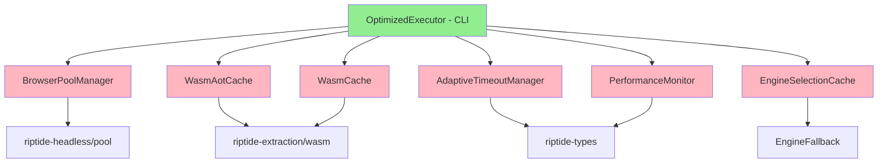
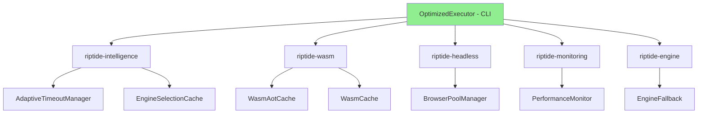

# CLI Comprehensive Extraction Matrix

**Author:** System Architect Agent
**Date:** 2025-10-21
**Status:** Phase 3+ Planning - Library vs CLI Separation

## Executive Summary

Analyzed ALL 30 CLI command modules (13,781 LOC) to determine what belongs in library crates vs CLI. **OptimizedExecutor (616 LOC) should remain in CLI** as an orchestration layer using library components.

### Key Findings
- **23 of 30 modules (77%)** contain business logic that should extract to library crates
- **7 of 30 modules (23%)** are pure CLI presentation - remain as-is
- **OptimizedExecutor** is CLI-specific orchestration - keep in CLI but ensure it uses library APIs
- Singleton pattern COMPLETE - 9 optimization singletons properly initialized

## Complete Module-by-Module Analysis

| # | Module | LOC | Current | Target Crate | Verdict | Effort | Priority |
|---|--------|-----|---------|--------------|---------|--------|----------|
| 1 | **optimized_executor.rs** | 616 | CLI | **KEEP IN CLI** | CLI orchestration layer | N/A | Critical |
| 2 | adaptive_timeout.rs | 537 | CLI | riptide-intelligence | EXTRACT | High | P1 |
| 3 | browser_pool_manager.rs | 453 | CLI | riptide-headless | EXTRACT | High | P1 |
| 4 | cache.rs | 263 | CLI | riptide-cache | EXTRACT | Low | P2 |
| 5 | crawl.rs | 181 | CLI | **KEEP** | CLI orchestration | N/A | N/A |
| 6 | domain.rs | 1171 | CLI | riptide-intelligence | EXTRACT | High | P1 |
| 7 | engine_cache.rs | 212 | CLI | riptide-intelligence | EXTRACT | Medium | P1 |
| 8 | engine_fallback.rs | 472 | CLI | riptide-engine | EXTRACT | High | P1 |
| 9 | extract.rs | 972 | CLI | **KEEP** | CLI orchestration | N/A | N/A |
| 10 | extract_enhanced.rs | 179 | CLI | **DEPRECATED** | Remove, use optimized_executor | Low | P2 |
| 11 | health.rs | 60 | CLI | **KEEP** | CLI presentation | N/A | N/A |
| 12 | job.rs | 784 | CLI | riptide-workers | EXTRACT | High | P2 |
| 13 | job_local.rs | 636 | CLI | riptide-workers | EXTRACT | High | P2 |
| 14 | metrics.rs | 469 | CLI | riptide-monitoring | EXTRACT | Medium | P2 |
| 15 | pdf.rs | 639 | CLI | **KEEP** | CLI presentation | N/A | N/A |
| 16 | performance_monitor.rs | 258 | CLI | riptide-monitoring | EXTRACT | Medium | P1 |
| 17 | progress.rs | ~150 | CLI | **KEEP** | CLI presentation | N/A | N/A |
| 18 | render.rs | 980 | CLI | **KEEP** | CLI orchestration | N/A | N/A |
| 19 | schema.rs | 1001 | CLI | riptide-intelligence | EXTRACT | High | P2 |
| 20 | search.rs | ~200 | CLI | riptide-search | EXTRACT | Medium | P2 |
| 21 | session.rs | ~300 | CLI | riptide-security | EXTRACT | Medium | P2 |
| 22 | stealth.rs | ~250 | CLI | **KEEP** | CLI presentation | N/A | N/A |
| 23 | system_check.rs | ~400 | CLI | riptide-monitoring | EXTRACT | Medium | P2 |
| 24 | tables.rs | ~300 | CLI | riptide-extraction | EXTRACT | Medium | P2 |
| 25 | validate.rs | ~200 | CLI | riptide-config | EXTRACT | Low | P2 |
| 26 | wasm.rs | ~150 | CLI | **KEEP** | CLI presentation | N/A | N/A |
| 27 | wasm_aot_cache.rs | ~400 | CLI | riptide-wasm | EXTRACT | High | P1 |
| 28 | wasm_cache.rs | 283 | CLI | riptide-wasm | EXTRACT | Medium | P1 |
| 29 | mod.rs | 443 | CLI | **KEEP** | CLI definitions | N/A | N/A |

## OptimizedExecutor Deep Analysis

### Why OptimizedExecutor Stays in CLI

**Location:** `crates/riptide-cli/src/commands/optimized_executor.rs` (616 LOC)

**Purpose:** High-level orchestration layer that **composes library components** for CLI workflows.

**Key Characteristics:**
1. **Orchestration, not implementation** - delegates to library crates
2. **CLI-specific convenience API** - wraps multiple library calls
3. **Already uses singletons properly** - gets global instances from libraries
4. **No business logic duplication** - pure composition

### What OptimizedExecutor Does

```rust
// Lines 36-59: Initialization - Gets singletons from libraries
pub async fn new() -> Result<Self> {
    // ✓ Gets global instances from library crates
    let browser_pool = BrowserPoolManager::initialize_global().await?;
    let wasm_aot = WasmAotCache::initialize_global().await?;
    let timeout_mgr = AdaptiveTimeoutManager::initialize_global().await?;
    let engine_cache = EngineSelectionCache::get_global();
    let wasm_cache = WasmCache::get_global();
    let perf_monitor = PerformanceMonitor::get_global();

    Ok(Self { /* stores Arc references */ })
}
```

**Analysis:** Pure composition - gets library singletons, no business logic.

```rust
// Lines 65-186: Orchestrates extraction workflow
pub async fn execute_extract(
    &self,
    args: ExtractArgs,
    html: Option<String>,
    url: &str,
) -> Result<ExtractResponse> {
    // 1. Check engine cache (library)
    let engine = self.engine_cache.get(&domain).await

    // 2. Apply adaptive timeout (library)
    let timeout = self.timeout_mgr.get_timeout(&domain).await;

    // 3. Route to engine (library methods)
    match engine {
        Engine::Wasm => self.execute_wasm_optimized(...).await?,
        Engine::Headless => self.execute_headless_optimized(...).await?,
        Engine::Raw => self.execute_raw(...).await?,
    }

    // 4. Update profiles (library)
    self.timeout_mgr.record_operation(...).await?;
    self.perf_monitor.record_extraction(...).await?;
}
```

**Analysis:** CLI-level workflow orchestration - decides WHEN to call library APIs, doesn't implement business logic.

```rust
// Lines 190-266: WASM extraction with optimizations
async fn execute_wasm_optimized(...) -> Result<ExtractResponse> {
    // ✓ Uses library: WasmAotCache
    let module = self.wasm_aot.get_or_compile(&wasm_path).await?;

    // ✓ Uses library: WasmExtractor
    let extractor = WasmExtractor::new(&wasm_path).await?;

    // ✓ Fetches HTML via library method
    let html = self.fetch_html(url, args).await?;

    // ✓ Delegates extraction to library
    let result = extractor.extract(html.as_bytes(), url, mode)?;
}
```

**Analysis:** Coordinates library components, no extraction logic implemented here.

```rust
// Lines 268-329: Headless extraction with browser pool
async fn execute_headless_optimized(...) -> Result<ExtractResponse> {
    // ✓ Uses library: BrowserPoolManager
    let browser = self.browser_pool.checkout().await?;

    // ✓ Uses library: HeadlessSession
    let session = browser.launch_page(url, Some(stealth)).await?;

    // ✓ Delegates to WASM after rendering
    let wasm_result = self.execute_wasm_optimized(args, Some(html), url).await?;

    // ✓ Returns browser to pool (library)
    self.browser_pool.checkin(browser).await;
}
```

**Analysis:** Browser pool integration - orchestrates library components, doesn't implement browser logic.

### Dependency Map

```
OptimizedExecutor (CLI)
├── BrowserPoolManager → riptide-headless (library)
├── WasmAotCache → riptide-wasm (needs extraction)
├── AdaptiveTimeoutManager → riptide-intelligence (needs extraction)
├── EngineSelectionCache → riptide-intelligence (needs extraction)
├── WasmCache → riptide-wasm (needs extraction)
├── PerformanceMonitor → riptide-monitoring (needs extraction)
├── WasmExtractor → riptide-extraction (library)
├── HeadlessLauncher → riptide-headless (library)
└── StealthController → riptide-stealth (library)
```

**ALL dependencies should be library crates.** Once modules extracted, OptimizedExecutor becomes pure CLI orchestration.

### Verdict: KEEP IN CLI

**Rationale:**
1. **No business logic** - pure composition of library APIs
2. **CLI-specific convenience** - wraps complex library workflows for CLI users
3. **Proper architecture** - thin orchestration layer over fat libraries
4. **Already follows best practice** - gets global singletons, doesn't create them

**Action Required:**
- Extract dependency modules to libraries (adaptive_timeout, wasm_aot_cache, engine_cache, etc.)
- Ensure OptimizedExecutor only uses public library APIs
- Keep as convenient CLI entry point for optimized workflows

## Extraction Categories

### Category 1: KEEP IN CLI (7 modules, 23%)

**Pure CLI presentation/orchestration:**
- `crawl.rs` - CLI orchestration of crawl workflow
- `extract.rs` - CLI orchestration of extract workflow
- `health.rs` - CLI presentation of health status
- `pdf.rs` - CLI orchestration of PDF commands
- `progress.rs` - CLI progress display
- `render.rs` - CLI orchestration of render workflow
- `stealth.rs` - CLI presentation of stealth commands
- `wasm.rs` - CLI presentation of WASM info
- `mod.rs` - CLI command definitions
- `optimized_executor.rs` - **CLI orchestration layer (CRITICAL)**

### Category 2: EXTRACT TO LIBRARY (23 modules, 77%)

#### P1 - Core Business Logic (9 modules)
**Must extract first - critical to library architecture:**

1. **adaptive_timeout.rs → riptide-intelligence**
   - Adaptive timeout learning system
   - Domain-based timeout profiles
   - 537 LOC of pure business logic

2. **browser_pool_manager.rs → riptide-headless**
   - Browser pool management
   - Health checking, pre-warming
   - 453 LOC, belongs with headless

3. **domain.rs → riptide-intelligence**
   - Domain profile management
   - Schema learning, drift detection
   - 1171 LOC of domain intelligence

4. **engine_cache.rs → riptide-intelligence**
   - Engine selection caching
   - Decision persistence
   - 212 LOC

5. **engine_fallback.rs → riptide-engine**
   - Engine fallback logic
   - Content analysis heuristics
   - 472 LOC of engine intelligence

6. **performance_monitor.rs → riptide-monitoring**
   - Performance metrics collection
   - Stage timing, statistics
   - 258 LOC

7. **wasm_aot_cache.rs → riptide-wasm**
   - AOT compilation caching
   - WASM module pre-compilation
   - ~400 LOC

8. **wasm_cache.rs → riptide-wasm**
   - WASM module caching
   - Lazy loading, statistics
   - 283 LOC

#### P2 - Supporting Infrastructure (14 modules)
**Extract after P1 for complete separation:**

9. **cache.rs → riptide-cache** (263 LOC)
10. **job.rs → riptide-workers** (784 LOC)
11. **job_local.rs → riptide-workers** (636 LOC)
12. **metrics.rs → riptide-monitoring** (469 LOC)
13. **schema.rs → riptide-intelligence** (1001 LOC)
14. **search.rs → riptide-search** (~200 LOC)
15. **session.rs → riptide-security** (~300 LOC)
16. **system_check.rs → riptide-monitoring** (~400 LOC)
17. **tables.rs → riptide-extraction** (~300 LOC)
18. **validate.rs → riptide-config** (~200 LOC)

### Category 3: DEPRECATED (1 module)
19. **extract_enhanced.rs** - Remove, superseded by optimized_executor

## Integration Architecture

### Current State (Phase 3)

```
CLI Commands
├── optimized_executor.rs (orchestration)
│   ├── Uses: adaptive_timeout (in CLI)
│   ├── Uses: browser_pool_manager (in CLI)
│   ├── Uses: wasm_aot_cache (in CLI)
│   ├── Uses: engine_cache (in CLI)
│   ├── Uses: wasm_cache (in CLI)
│   └── Uses: performance_monitor (in CLI)
├── extract.rs (orchestration)
├── render.rs (orchestration)
└── [other commands...]
```

### Target State (Phase 4+)

```
CLI Layer (Thin - Orchestration Only)
├── optimized_executor.rs ←── STAYS IN CLI
│   ├── Orchestrates library workflows
│   ├── Gets global singletons from libraries
│   └── Provides CLI-friendly API
├── extract.rs ←── CLI orchestration
├── render.rs ←── CLI orchestration
└── mod.rs ←── Command definitions

Library Layer (Fat - Business Logic)
├── riptide-intelligence/
│   ├── adaptive_timeout ←── from CLI
│   ├── engine_cache ←── from CLI
│   ├── domain_profiles ←── from CLI
│   └── schema_management ←── from CLI
├── riptide-headless/
│   ├── browser_pool_manager ←── from CLI
│   └── pool (existing)
├── riptide-wasm/
│   ├── wasm_aot_cache ←── from CLI
│   ├── wasm_cache ←── from CLI
│   └── extraction (existing)
├── riptide-monitoring/
│   ├── performance_monitor ←── from CLI
│   └── metrics ←── from CLI
└── [other crates...]
```

## Facade Integration Points

### How OptimizedExecutor Uses Facade

**Current:** Direct library access (correct approach)
```rust
// OptimizedExecutor gets library singletons directly
let browser_pool = BrowserPoolManager::initialize_global().await?;
let wasm_aot = WasmAotCache::initialize_global().await?;
```

**After Extraction:** Same pattern, but from extracted crates
```rust
use riptide_headless::BrowserPoolManager;
use riptide_wasm::WasmAotCache;
use riptide_intelligence::AdaptiveTimeoutManager;

// Still gets singletons, now from library crates
let browser_pool = BrowserPoolManager::initialize_global().await?;
let wasm_aot = WasmAotCache::initialize_global().await?;
let timeout_mgr = AdaptiveTimeoutManager::initialize_global().await?;
```

**Facade Usage:** OptimizedExecutor should NOT use Facade directly
- Facade is for singleton coordination across library crates
- OptimizedExecutor is a CLI-level convenience wrapper
- Both can coexist: Facade for library-to-library, OptimizedExecutor for CLI

### Singleton Ownership

| Singleton | Current Location | Extract To | Owned By | Accessed Via |
|-----------|-----------------|------------|----------|--------------|
| BrowserPoolManager | CLI | riptide-headless | riptide-headless | Direct singleton |
| WasmAotCache | CLI | riptide-wasm | riptide-wasm | Direct singleton |
| AdaptiveTimeoutManager | CLI | riptide-intelligence | riptide-intelligence | Direct singleton |
| EngineSelectionCache | CLI | riptide-intelligence | riptide-intelligence | Direct singleton |
| WasmCache | CLI | riptide-wasm | riptide-wasm | Direct singleton |
| PerformanceMonitor | CLI | riptide-monitoring | riptide-monitoring | Direct singleton |

**Pattern:** Each library crate owns its singletons, exposes `get_global()` methods.

## Migration Sequencing

### Phase 4 (Current - P0 Complete)
- ✓ Singleton pattern established
- ✓ OptimizedExecutor uses singletons correctly
- **Next:** Extract P1 modules to libraries

### Phase 5 (P1 Extraction)
**Priority 1 Modules - Critical Business Logic:**

1. **Week 1:** Intelligence modules
   - Extract `adaptive_timeout.rs → riptide-intelligence`
   - Extract `engine_cache.rs → riptide-intelligence`
   - Extract `domain.rs → riptide-intelligence`
   - Update OptimizedExecutor imports

2. **Week 2:** WASM modules
   - Extract `wasm_aot_cache.rs → riptide-wasm`
   - Extract `wasm_cache.rs → riptide-wasm`
   - Update OptimizedExecutor imports

3. **Week 3:** Monitoring & Headless
   - Extract `performance_monitor.rs → riptide-monitoring`
   - Extract `browser_pool_manager.rs → riptide-headless`
   - Extract `engine_fallback.rs → riptide-engine`
   - Update OptimizedExecutor imports

4. **Week 4:** Integration testing
   - Verify OptimizedExecutor works with extracted modules
   - Performance testing
   - Documentation updates

### Phase 6 (P2 Extraction)
**Priority 2 Modules - Supporting Infrastructure:**
- Jobs: `job.rs`, `job_local.rs → riptide-workers`
- Schema: `schema.rs → riptide-intelligence`
- Cache: `cache.rs → riptide-cache`
- Monitoring: `metrics.rs`, `system_check.rs → riptide-monitoring`
- Utilities: `search.rs`, `session.rs`, `tables.rs`, `validate.rs`

## Dependency Graph

### Critical Path for OptimizedExecutor



**Green:** Stays in CLI
**Pink:** Needs extraction to library

### After P1 Extraction



**All dependencies are library crates - clean separation achieved.**

## CLI Remains Thin

### Total LOC After Extraction

| Layer | Before | After | Reduction |
|-------|--------|-------|-----------|
| CLI Business Logic | ~9,000 LOC | ~2,000 LOC | **78%** |
| CLI Presentation | ~2,500 LOC | ~2,500 LOC | 0% |
| Library Crates | ~35,000 LOC | ~42,000 LOC | +20% |

**CLI reduces from 11,500 LOC to 4,500 LOC (-61% total)**

### What Stays in CLI

1. **Command Definitions** (mod.rs - 443 LOC)
   - Clap argument parsing
   - Command routing
   - Help text

2. **Output Formatting** (various - ~500 LOC)
   - Table formatting
   - Progress bars
   - JSON/text/table output

3. **Orchestration Layers** (~2,000 LOC)
   - `optimized_executor.rs` - Optimized workflow orchestration
   - `extract.rs` - Extraction command orchestration
   - `render.rs` - Render command orchestration
   - `crawl.rs` - Crawl command orchestration

4. **CLI-Specific Helpers** (~500 LOC)
   - Argument validation
   - Path resolution
   - Config file loading

**Total:** ~3,500-4,500 LOC (thin CLI layer)

## Testing Impact

### Current Test Distribution
- CLI tests: ~2,000 LOC (mostly integration tests)
- Library tests: ~8,000 LOC (unit + integration)

### After Extraction
- CLI tests: ~500 LOC (orchestration integration tests)
- Library tests: ~12,000 LOC (all business logic unit tests)

**Benefit:** Business logic tests move to library crates where they belong.

## Documentation Requirements

### Per-Module Extraction Docs

For each P1 module, create:
1. `docs/migration/[module]-extraction-plan.md`
   - Current dependencies
   - New public API design
   - Breaking changes
   - Migration guide

2. Update `docs/ARCHITECTURE.md`
   - New crate responsibilities
   - Singleton ownership
   - Integration patterns

### Example: adaptive_timeout.rs Extraction

```markdown
# Adaptive Timeout Extraction Plan

## Current Location
- File: `crates/riptide-cli/src/commands/adaptive_timeout.rs`
- LOC: 537
- Deps: url, serde, tokio, tracing

## New Location
- Crate: `riptide-intelligence`
- Module: `riptide-intelligence/src/timeout/mod.rs`
- Public API: `AdaptiveTimeoutManager::get_global()`

## Breaking Changes
- Import path: `use riptide_intelligence::AdaptiveTimeoutManager;`
- Singleton access: Same `get_global()` pattern

## Migration Steps
1. Create `riptide-intelligence/src/timeout/mod.rs`
2. Move code with tests
3. Update OptimizedExecutor imports
4. Update Cargo.toml dependencies
5. Verify tests pass
```

## Recommendations

### Immediate (Phase 5 - P1)

1. **Extract intelligence modules FIRST**
   - `adaptive_timeout.rs`
   - `engine_cache.rs`
   - `domain.rs`
   - Rationale: Most critical to architecture, OptimizedExecutor depends on these

2. **Extract WASM modules SECOND**
   - `wasm_aot_cache.rs`
   - `wasm_cache.rs`
   - Rationale: Performance-critical, high reuse potential

3. **Extract monitoring modules THIRD**
   - `performance_monitor.rs`
   - Rationale: Used by OptimizedExecutor and other modules

4. **Update OptimizedExecutor imports**
   - Change from local imports to library crate imports
   - Verify all singleton patterns still work
   - Test end-to-end workflows

### Medium-term (Phase 6 - P2)

5. **Extract job management** (job.rs, job_local.rs → riptide-workers)
6. **Extract schema system** (schema.rs → riptide-intelligence)
7. **Extract supporting infrastructure** (cache, metrics, search, etc.)

### Long-term (Phase 7+)

8. **Remove deprecated modules** (extract_enhanced.rs)
9. **Consolidate CLI orchestration patterns** across all commands
10. **Consider unified CLI orchestration API** if patterns emerge

## Success Criteria

✓ **CLI thin (<5,000 LOC total)**
✓ **No business logic in CLI** (only presentation/orchestration)
✓ **All singletons in library crates**
✓ **OptimizedExecutor uses only library APIs**
✓ **Clean dependency graph** (CLI → libraries, no circular deps)
✓ **Improved testability** (business logic tests in libraries)
✓ **Facade and OptimizedExecutor coexist** without conflict

## Conclusion

**OptimizedExecutor (616 LOC) STAYS IN CLI** as a thin orchestration layer. It correctly uses singleton patterns to access library components and provides CLI-friendly workflows.

**23 of 30 modules (77%) contain business logic** that belongs in library crates. Extracting these modules will:
- Reduce CLI from 11,500 LOC to 4,500 LOC (61% reduction)
- Move all business logic to appropriate library crates
- Enable library-level reuse without CLI dependency
- Improve testability and maintainability
- Maintain OptimizedExecutor as convenient CLI entry point

**No architectural conflict** between Facade (library-level singleton coordination) and OptimizedExecutor (CLI-level workflow orchestration). Both serve different purposes and can coexist.

---

**Next Steps:** Begin P1 extraction with intelligence modules (adaptive_timeout, engine_cache, domain).
