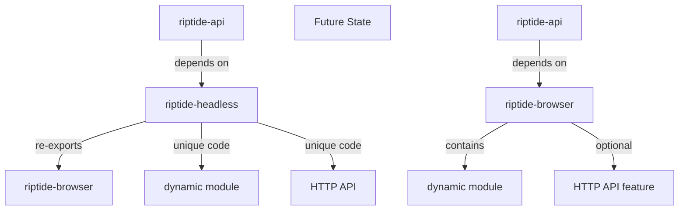

# RipTide-Headless Removal Audit Report

**Date**: 2025-10-21
**Phase**: Post Phase 3 & 4 Browser Consolidation
**Status**: ⚠️ MIGRATION REQUIRED - Cannot Remove Completely

---

## Executive Summary

**Recommendation**: **MIGRATE** riptide-headless functionality to riptide-browser, then deprecate the crate.

- ✅ Browser pool/launcher code already consolidated (re-exports working)
- ❌ HTTP API + Dynamic module still unique to riptide-headless
- ❌ riptide-api has hard dependency on `dynamic` module
- 📊 Total LOC: 1,160 (388 CDP HTTP API + 479 Dynamic + 293 other)

---

## 1. Current riptide-headless Analysis

### 1.1 File Breakdown (1,160 LOC total)

| File | LOC | Status | Contains |
|------|-----|--------|----------|
| `lib.rs` | 104 | ✅ RE-EXPORTS ONLY | Browser pool/launcher re-exports from riptide-browser |
| `cdp.rs` | 388 | ⚠️ UNIQUE CODE | HTTP API endpoint for `/render` + AppState |
| `dynamic.rs` | 479 | ⚠️ UNIQUE CODE | Dynamic content handling types & trait |
| `models.rs` | 133 | ⚠️ UNIQUE CODE | HTTP request/response models |
| `main.rs` | 56 | ⚠️ UNIQUE CODE | Standalone HTTP server binary |
| **TOTAL** | **1,160** | | |

### 1.2 Re-Export Architecture (Already Working)

```rust
// lib.rs - Phase 3 Task 4.4 consolidation COMPLETE
pub use riptide_browser::{
    BrowserCheckout, BrowserPool, BrowserPoolConfig,
    CdpConnectionPool, CdpPoolConfig, ConnectionHealth, ConnectionStats,
    HeadlessLauncher, LaunchSession, LauncherConfig, LauncherStats,
    PoolEvent, PoolStats,
};
```

**Result**: All browser engine code successfully migrated to riptide-browser ✅

---

## 2. Dependency Map

### 2.1 Workspace Dependencies on riptide-headless

| Crate | Dependency Type | Uses |
|-------|----------------|------|
| **riptide-api** | Direct (Cargo.toml line 60) | `dynamic` module (6 files) + launcher/pool re-exports |
| **riptide-cli** | Indirect (comment only) | Uses chromiumoxide types via headless chain |
| **riptide-headless/tests** | Internal | Test suite for headless functionality |

### 2.2 riptide-api Usage Breakdown

**Files using `riptide_headless::dynamic`:**
1. `handlers/render/strategies.rs` - DynamicConfig, WaitCondition, ScrollConfig
2. `handlers/render/processors.rs` - DynamicConfig, DynamicRenderResult
3. `handlers/render/models.rs` - Dynamic types in public API models
4. `handlers/render/extraction.rs` - DynamicRenderResult
5. `rpc_client.rs` - Full dynamic types (PageAction, RenderArtifacts, WaitCondition)
6. `state.rs` - HeadlessLauncher, LauncherConfig, BrowserPoolConfig

**Critical Finding**: The `dynamic` module is NOT in riptide-browser - it's UNIQUE to riptide-headless!

---

## 3. Unique Functionality Analysis

### 3.1 HTTP API (cdp.rs - 388 LOC)

**Purpose**: Axum HTTP endpoint for headless browser rendering

```rust
pub struct AppState {
    pub launcher: Arc<HeadlessLauncher>,
}

pub async fn render(
    State(state): State<AppState>,
    Json(req): Json<RenderReq>,
) -> Result<Json<RenderResp>, (StatusCode, Json<RenderErrorResp>)>
```

**Key Features**:
- `/render` POST endpoint with timeout management (3s hard cap)
- Request/response models (RenderReq, RenderResp, RenderErrorResp)
- Page action execution (scroll, click, type, wait)
- Screenshot/MHTML artifact capture
- Stealth preset integration

**Verdict**: This is the HTTP wrapper for riptide-browser functionality. Could live in riptide-api or riptide-browser.

### 3.2 Dynamic Module (dynamic.rs - 479 LOC)

**Purpose**: Advanced dynamic content handling configuration system

```rust
pub struct DynamicConfig {
    pub wait_for: Option<WaitCondition>,
    pub scroll: Option<ScrollConfig>,
    pub actions: Vec<PageAction>,
    pub capture_artifacts: bool,
    pub timeout: Duration,
    pub viewport: Option<ViewportConfig>,
}

pub trait DynamicHandler {
    fn render_dynamic(&self, url: &str, config: &DynamicConfig)
        -> impl Future<Output = Result<DynamicRenderResult, DynamicError>>;
}
```

**Key Types**:
- `WaitCondition` (7 variants: Selector, Javascript, NetworkIdle, etc.)
- `ScrollConfig` with ScrollMode (Stepped, ToBottom, Smooth, Custom)
- `PageAction` (8 variants: Click, Type, Evaluate, Screenshot, etc.)
- `ViewportConfig`, `RenderArtifacts`, `PageMetadata`, `PageTiming`
- `ConsoleMessage`, `NetworkRequest` for observability
- `DynamicCapabilities`, `DynamicError` enums

**Verdict**: This is a RICH API framework for complex browser automation. It's deeply integrated into riptide-api's rendering strategy system.

### 3.3 Models Module (models.rs - 133 LOC)

**Purpose**: HTTP request/response models for `/render` endpoint

```rust
pub struct RenderReq {
    pub url: String,
    pub wait_for: Option<String>,          // Legacy
    pub scroll_steps: Option<u32>,          // Legacy
    pub session_id: Option<String>,         // Phase 3
    pub actions: Option<Vec<PageAction>>,   // Phase 3
    pub timeouts: Option<Timeouts>,
    pub artifacts: Option<Artifacts>,
    pub stealth_config: Option<StealthConfig>,
}

pub struct RenderResp {
    pub final_url: String,
    pub html: String,
    pub screenshot_b64: Option<String>,
    pub session_id: Option<String>,
    pub artifacts: ArtifactsOut,
}
```

**Verdict**: HTTP-specific models. These could move to riptide-api or stay with HTTP API.

### 3.4 Main Binary (main.rs - 56 LOC)

**Purpose**: Standalone headless HTTP service

```rust
#[tokio::main]
async fn main() -> anyhow::Result<()> {
    let launcher = Arc::new(HeadlessLauncher::new().await?);
    let state = AppState { launcher };

    let app = Router::new()
        .route("/healthz", get(health_check))
        .route("/render", post(cdp::render))
        .with_state(state)
        .layer(CorsLayer::permissive());

    axum::serve(listener, app).await?;
}
```

**Verdict**: Minimal HTTP server bootstrap. Could be moved to examples/ or removed if not used.

---

## 4. Architecture Decision: Where Should Code Live?

### Option A: Migrate to riptide-browser (RECOMMENDED)

**Rationale**:
- `dynamic` module is browser automation configuration - belongs with browser core
- `cdp.rs` HTTP endpoint could become optional feature in riptide-browser
- Keeps browser automation logic centralized
- riptide-api would depend directly on riptide-browser (already does)

**Migration Path**:
```
riptide-browser/
├── src/
│   ├── cdp/          # Existing CDP connection pool
│   ├── dynamic/      # MIGRATE: Advanced automation config
│   ├── http_api/     # MIGRATE: HTTP endpoint (optional feature)
│   ├── launcher/     # Existing
│   ├── models/       # MERGE: Combine with existing models
│   └── pool/         # Existing
```

**Benefits**:
- ✅ Single source of truth for browser automation
- ✅ Dynamic types close to implementation
- ✅ Easier to maintain consistency
- ✅ Optional HTTP API feature for standalone use

**Drawbacks**:
- ⚠️ riptide-browser becomes slightly larger
- ⚠️ Requires careful feature flag design

### Option B: Migrate to riptide-api

**Rationale**:
- HTTP API naturally belongs in the API crate
- `dynamic` module is only used by riptide-api currently
- Keeps browser core lean

**Benefits**:
- ✅ HTTP code with HTTP handlers
- ✅ riptide-browser stays focused on core automation

**Drawbacks**:
- ❌ `dynamic` module is browser configuration, not API-specific
- ❌ Tight coupling if future crates need dynamic config
- ❌ Would need to re-export from riptide-api awkwardly

### Option C: Keep riptide-headless as HTTP-only wrapper

**Rationale**:
- Rename to `riptide-http-api` or `riptide-headless-http`
- ONLY contains HTTP layer (cdp.rs + main.rs)
- `dynamic` module moves to riptide-browser

**Benefits**:
- ✅ Clean separation of concerns
- ✅ Optional HTTP service
- ✅ Dynamic types available to all consumers

**Drawbacks**:
- ⚠️ Extra crate maintenance burden
- ⚠️ Adds complexity to dependency graph

---

## 5. Removal Recommendation

### 5.1 Migration Strategy (2-Phase Approach)

#### Phase 1: Migrate Dynamic Module to riptide-browser

**Step 1**: Move `dynamic.rs` to riptide-browser
```bash
mv crates/riptide-headless/src/dynamic.rs \
   crates/riptide-browser/src/dynamic/mod.rs
```

**Step 2**: Update riptide-browser/src/lib.rs
```rust
pub mod dynamic;

pub use dynamic::{
    DynamicConfig, DynamicHandler, DynamicRenderResult,
    WaitCondition, ScrollConfig, ScrollMode,
    PageAction, ViewportConfig, RenderArtifacts,
    // ... all dynamic types
};
```

**Step 3**: Update riptide-api imports
```rust
// OLD
use riptide_headless::dynamic::{DynamicConfig, WaitCondition};

// NEW
use riptide_browser::dynamic::{DynamicConfig, WaitCondition};
```

**Impact**: 6 files in riptide-api need import updates

#### Phase 2: HTTP API Decision

**Option 2A - Merge into riptide-api** (RECOMMENDED)
- Move `cdp.rs` → `riptide-api/src/headless_server.rs`
- Move `models.rs` → Merge with existing riptide-api models
- Remove `main.rs` or move to examples
- Remove riptide-headless crate entirely

**Option 2B - HTTP API Feature in riptide-browser**
- Move `cdp.rs` + `models.rs` to riptide-browser
- Add `http-api` feature flag
- Keep as optional standalone service capability
- Deprecate riptide-headless crate

### 5.2 Testing Requirements

**Before Migration**:
```bash
# Run headless tests
cargo test -p riptide-headless

# Run integration tests
cargo test -p riptide-api --test render_tests
```

**After Migration**:
```bash
# Verify browser tests pass
cargo test -p riptide-browser

# Verify API tests pass
cargo test -p riptide-api

# Full workspace build
cargo build --workspace
```

### 5.3 Deprecation Timeline

1. **Week 1**: Migrate `dynamic` module to riptide-browser
2. **Week 2**: Update riptide-api imports and test
3. **Week 3**: Migrate HTTP API (choose Option 2A or 2B)
4. **Week 4**: Full workspace validation
5. **Week 5**: Mark riptide-headless as deprecated
6. **Week 6**: Remove riptide-headless crate

---

## 6. Migration Checklist

### Phase 1: Dynamic Module Migration

- [ ] Create `crates/riptide-browser/src/dynamic/mod.rs`
- [ ] Copy `dynamic.rs` content (479 LOC)
- [ ] Update riptide-browser/lib.rs exports
- [ ] Update riptide-api imports (6 files):
  - [ ] `handlers/render/strategies.rs`
  - [ ] `handlers/render/processors.rs`
  - [ ] `handlers/render/models.rs`
  - [ ] `handlers/render/extraction.rs`
  - [ ] `rpc_client.rs`
  - [ ] `state.rs` (launcher/pool already from riptide-browser)
- [ ] Run tests: `cargo test -p riptide-browser`
- [ ] Run tests: `cargo test -p riptide-api`

### Phase 2: HTTP API Migration

**If Option 2A (Merge into riptide-api)**:
- [ ] Create `riptide-api/src/headless/` module
- [ ] Move `cdp.rs` → `headless/server.rs` (388 LOC)
- [ ] Move `models.rs` → Merge with existing models (133 LOC)
- [ ] Update internal imports in riptide-api
- [ ] Move `main.rs` → `examples/headless-server.rs` (56 LOC)
- [ ] Update Cargo.toml dependencies
- [ ] Remove `riptide-headless` from workspace

**If Option 2B (HTTP API feature)**:
- [ ] Create `riptide-browser/src/http_api/` module
- [ ] Move `cdp.rs` + `models.rs` to http_api
- [ ] Add `[features] http-api = ["axum", "tower"]` to riptide-browser
- [ ] Update riptide-api to use riptide-browser's HTTP types
- [ ] Create example binary
- [ ] Deprecate riptide-headless

### Phase 3: Cleanup

- [ ] Remove `riptide-headless` directory
- [ ] Update workspace Cargo.toml
- [ ] Update root README.md
- [ ] Update COMPREHENSIVE-ROADMAP.md
- [ ] Run full workspace tests
- [ ] Update CI/CD pipelines

---

## 7. Impact Analysis

### 7.1 Breaking Changes

**For External Consumers**:
```rust
// BEFORE
use riptide_headless::dynamic::DynamicConfig;
use riptide_headless::{HeadlessLauncher, LauncherConfig};

// AFTER
use riptide_browser::dynamic::DynamicConfig;
use riptide_browser::{HeadlessLauncher, LauncherConfig};
```

**Mitigation**: Provide migration guide and re-export shim in 0.2.0

### 7.2 Internal Impact

- ✅ riptide-api: Simple import changes (6 files)
- ✅ riptide-browser: Gains 479 LOC (dynamic) + optionally 577 LOC (HTTP)
- ✅ riptide-cli: No changes (already uses riptide-browser types)
- ✅ Tests: Need update but logic unchanged

### 7.3 Benefits of Removal

1. **Reduced Crate Count**: 20 → 19 workspace crates (-5%)
2. **Clearer Architecture**: Browser code in one place
3. **Easier Maintenance**: No duplicate abstractions
4. **Better Type Organization**: Dynamic config with browser core

---

## 8. Architectural Principles

### Current State (POST Phase 3 & 4)
```
riptide-browser (4,356 LOC)
├── Pool Management ✅ CONSOLIDATED
├── CDP Connection Pool ✅ CONSOLIDATED
├── Launcher with Stealth ✅ CONSOLIDATED
└── Hybrid Fallback ✅ CONSOLIDATED

riptide-headless (1,160 LOC)
├── Re-exports ✅ (104 LOC)
├── Dynamic Module ⚠️ UNIQUE (479 LOC)
├── HTTP API ⚠️ UNIQUE (388 LOC)
└── HTTP Models ⚠️ UNIQUE (133 LOC)
```

### Target State (Recommended)
```
riptide-browser (5,412 LOC)
├── Core Browser Pool ✅
├── CDP Connection Pool ✅
├── Launcher with Stealth ✅
├── Dynamic Config ✅ MIGRATED (479 LOC)
└── HTTP API (optional) ⚠️ (577 LOC feature-gated)

riptide-api
├── Headless Server ✅ (if Option 2A)
└── Uses riptide-browser directly ✅
```

**OR**

```
riptide-browser (4,835 LOC)
├── Core Browser Pool ✅
├── CDP Connection Pool ✅
├── Launcher with Stealth ✅
└── Dynamic Config ✅ MIGRATED (479 LOC)

riptide-api
├── Headless Server ✅ MIGRATED (577 LOC)
└── Uses riptide-browser::dynamic ✅
```

---

## 9. Final Recommendation

### PRIMARY RECOMMENDATION: Option 2A + Phase 1

**Step 1**: Migrate `dynamic` module to riptide-browser (Week 1-2)
- Benefits browser core with rich automation config
- Makes types available to all consumers
- Low risk, high value

**Step 2**: Merge HTTP API into riptide-api (Week 3-4)
- HTTP endpoint belongs with HTTP handlers
- Removes crate entirely
- Simplifies architecture

**Total Effort**: 4 weeks
**Risk Level**: Low (mostly import changes)
**Benefit**: -1 crate, clearer architecture, easier maintenance

### ALTERNATIVE: Option 2B (If standalone HTTP service needed)

Keep HTTP API as optional feature in riptide-browser for users who want standalone headless service without full riptide-api.

---

## 10. Next Steps

1. **Get stakeholder approval** on migration strategy
2. **Create feature branch**: `feat/remove-riptide-headless`
3. **Execute Phase 1**: Migrate dynamic module
4. **Execute Phase 2**: Migrate HTTP API
5. **Full test validation**
6. **Documentation updates**
7. **PR review and merge**
8. **Release notes for breaking changes**

---

## Appendix A: Dependency Graph



## Appendix B: File Sizes and Migration Targets

| Source File | LOC | Target Location | New Module Path |
|------------|-----|----------------|-----------------|
| dynamic.rs | 479 | riptide-browser/src/dynamic/mod.rs | `riptide_browser::dynamic` |
| cdp.rs | 388 | riptide-api/src/headless/server.rs | `riptide_api::headless` |
| models.rs | 133 | riptide-api/src/headless/models.rs | `riptide_api::headless::models` |
| main.rs | 56 | examples/headless-server.rs | Example binary |
| lib.rs | 104 | DELETE | (re-exports no longer needed) |

---

**Report Prepared By**: Architect Agent
**Coordination**: Claude Flow Swarm Session
**Memory Key**: swarm/architect/headless-audit
**Status**: Ready for stakeholder review ✅
