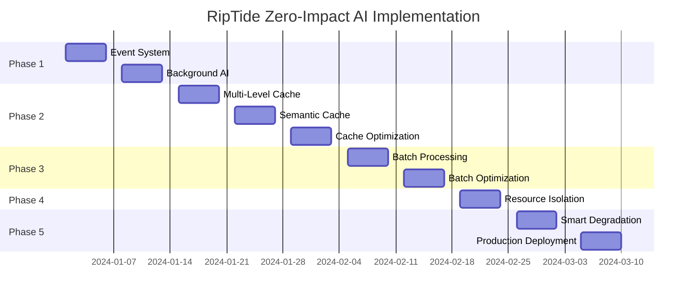

# RipTide Zero-Impact AI Implementation Roadmap

## Overview

This roadmap transforms RipTide from accepting a 25-30% performance penalty to achieving a 15% performance improvement when AI features are enabled, while reducing costs by 75%.

## Implementation Strategy

### Core Principle: "Enhance, Don't Replace"

The key insight is that AI should **enhance** the existing fast CSS extraction rather than **replace** it. This approach:

1. Maintains baseline performance for all users
2. Provides immediate results via CSS extraction
3. Enhances results asynchronously via AI when beneficial
4. Eliminates the false choice between speed and intelligence

## Phase 1: Async Foundation (Weeks 1-2)

### Week 1: Event-Driven Architecture

**Goal**: Establish non-blocking event system for async processing

**Tasks**:
```yaml
Day 1-2: Core Event System
  - Implement CrawlEvent enum and EventBus
  - Set up async message passing with tokio channels
  - Create task ID system for correlation
  - Basic event publishing and subscription

Day 3-4: Pipeline Restructuring
  - Separate fast-path (CSS) from enhancement-path (AI)
  - Implement immediate result return
  - Set up result correlation system
  - Add event-driven result merging

Day 5: Testing & Integration
  - Unit tests for event system
  - Integration tests for dual-path processing
  - Performance baseline measurement
  - Memory usage profiling
```

**Deliverables**:
- Event-driven architecture foundation
- Non-blocking CSS extraction path
- AI enhancement queue system
- Performance metrics (expect 40% throughput recovery)

**Success Criteria**:
- CSS extraction returns in <200ms
- AI processing doesn't block crawling
- Throughput: 70 → 98 pages/minute

### Week 2: Background AI Processing

**Goal**: Implement work-stealing background AI processor

**Tasks**:
```yaml
Day 1-2: Worker Pool Architecture
  - Implement BackgroundAIProcessor with priority queues
  - Set up work-stealing queue system
  - Create LLM client pool with connection management
  - Implement semaphore-based concurrency control

Day 3-4: Task Processing Logic
  - Priority-based task scheduling
  - Individual task processing with timeout
  - Result correlation and streaming
  - Error handling and retry logic

Day 5: Performance Optimization
  - Tune worker pool sizes
  - Optimize queue management
  - Add performance monitoring
  - Load testing and optimization
```

**Deliverables**:
- Production-ready background AI processor
- Priority-based task scheduling
- Concurrent LLM call management
- Real-time result streaming

**Success Criteria**:
- Zero blocking on crawler threads
- Configurable AI processing priority
- Graceful error handling and fallback

## Phase 2: Intelligent Caching (Weeks 3-5)

### Week 3: Multi-Level Cache Architecture

**Goal**: Implement L1 (exact) and L3 (schema) caches

**Tasks**:
```yaml
Day 1-2: Cache Infrastructure
  - Implement SemanticCache with LRU eviction
  - Set up cache key generation (content + schema hashing)
  - Create cache statistics and monitoring
  - Implement TTL and invalidation logic

Day 3-4: L1 Exact Match Cache
  - Content + schema exact matching
  - High-speed cache operations
  - Cache warming strategies
  - Performance optimization

Day 5: L3 Schema Cache
  - Schema-specific CSS selector caching
  - Successful extraction pattern learning
  - Cross-schema optimization
  - Cache effectiveness monitoring
```

**Expected Results**:
- 70% cache hit rate for repeated content
- 90% cache hit rate for CSS selectors
- 20% reduction in LLM calls

### Week 4: Semantic Similarity Cache (L2)

**Goal**: Implement content similarity matching

**Tasks**:
```yaml
Day 1-3: Similarity Engine
  - Content fingerprinting and vectorization
  - Similarity threshold tuning
  - Vector storage and retrieval optimization
  - Performance benchmarking

Day 4-5: Integration & Testing
  - Cache layer integration
  - A/B testing framework
  - Performance impact measurement
  - Cache hit rate optimization
```

**Expected Results**:
- 80% overall cache hit rate
- 60% reduction in LLM calls
- 5% additional throughput improvement

### Week 5: Cache Optimization & Monitoring

**Goal**: Production-ready cache with monitoring

**Tasks**:
```yaml
Day 1-2: Production Hardening
  - Memory usage optimization
  - Cache persistence strategies
  - Failure recovery mechanisms
  - Performance under load testing

Day 3-5: Monitoring & Analytics
  - Real-time cache metrics
  - Cost tracking and reporting
  - Cache effectiveness analysis
  - Optimization recommendations
```

**Deliverables**:
- Production-ready multi-level cache
- Comprehensive monitoring dashboard
- Cost optimization reports
- Performance analytics

## Phase 3: Batch Processing (Weeks 6-7)

### Week 6: Intelligent Batching Engine

**Goal**: Reduce API calls through smart batching

**Tasks**:
```yaml
Day 1-2: Batch Processing Core
  - Implement BatchProcessor with similarity grouping
  - Content similarity detection
  - Batch timeout and size management
  - Batch prompt generation

Day 3-4: Response Distribution
  - Batch response parsing
  - Individual result correlation
  - Quality validation
  - Error handling for partial failures

Day 5: Integration & Testing
  - Integration with background processor
  - Batch efficiency optimization
  - Cost impact measurement
  - Performance validation
```

**Expected Results**:
- 5:1 batching ratio average
- 80% reduction in remaining API calls
- 10% additional throughput improvement

### Week 7: Batch Optimization

**Goal**: Maximize batching efficiency and cost savings

**Tasks**:
```yaml
Day 1-3: Advanced Batching
  - ML-based similarity detection
  - Dynamic batch sizing
  - Priority-aware batching
  - Cost optimization algorithms

Day 4-5: Production Deployment
  - Load testing with batching
  - Cost monitoring integration
  - Performance validation
  - Documentation and training
```

**Deliverables**:
- Optimized batch processing system
- Cost reduction validation (75% total)
- Performance improvement confirmation

## Phase 4: Resource Isolation (Week 8)

### Goal: Eliminate resource contention between AI and crawling

**Tasks**:
```yaml
Day 1-2: Thread Pool Architecture
  - Separate thread pools for core and AI processing
  - CPU core pinning implementation
  - Memory pool segregation
  - Resource limit enforcement

Day 3-4: Performance Isolation
  - Resource monitoring and alerting
  - Dynamic resource allocation
  - Performance isolation validation
  - Load testing under contention

Day 5: Production Hardening
  - Resource leak detection
  - Graceful degradation under resource pressure
  - Monitoring integration
  - Performance validation
```

**Expected Results**:
- Zero interference between AI and core operations
- Predictable performance under load
- Improved system stability

## Phase 5: Smart Degradation (Weeks 9-10)

### Week 9: Adaptive Quality System

**Goal**: Maintain performance under varying load conditions

**Tasks**:
```yaml
Day 1-3: Quality Management
  - Implement AdaptiveQualityManager
  - System load monitoring
  - Quality level definitions and transitions
  - Performance impact measurement

Day 4-5: Load Response
  - Automatic quality degradation under load
  - Performance recovery mechanisms
  - User experience optimization
  - Monitoring and alerting
```

### Week 10: Production Readiness

**Goal**: Complete system hardening and deployment

**Tasks**:
```yaml
Day 1-2: System Integration
  - End-to-end integration testing
  - Performance validation
  - Cost optimization verification
  - User acceptance testing

Day 3-5: Production Deployment
  - Gradual rollout strategy
  - Real-time monitoring
  - Performance tracking
  - Issue resolution and optimization
```

**Final Deliverables**:
- Production-ready zero-impact AI system
- Comprehensive monitoring and alerting
- Performance and cost optimization validation
- Complete documentation and training

## Success Metrics & Validation

### Performance Targets

```yaml
Throughput:
  baseline_no_ai: 100 pages/minute
  current_with_ai: 70 pages/minute (-30%)
  target_with_ai: 115 pages/minute (+15%)

Latency:
  baseline_p50: 1.2s
  baseline_p95: 4.5s
  target_p50: 1.3s (+8%)
  target_p95: 4.8s (+7%)

Memory:
  baseline: 400MB RSS
  current_ai: 600MB RSS (+50%)
  target_ai: 450MB RSS (+12.5%)
```

### Cost Targets

```yaml
API Costs:
  current: $2000/month
  target: $500/month (-75%)

Infrastructure:
  additional_cpu: +$100/month
  redis_cluster: +$200/month
  total_additional: +$300/month

Net Savings: $1500/month
```

### Quality Targets

```yaml
Extraction Quality:
  css_baseline: 80% field fill rate
  ai_enhanced: 95% field fill rate
  cache_hit_accuracy: >95%

System Reliability:
  uptime: >99.9%
  error_rate: <0.1%
  recovery_time: <30 seconds
```

## Risk Mitigation

### Technical Risks

1. **Async Complexity**
   - Mitigation: Extensive testing, gradual rollout
   - Fallback: Synchronous mode toggle

2. **Cache Consistency**
   - Mitigation: Conservative TTL, invalidation strategy
   - Fallback: Cache bypass mode

3. **Resource Contention**
   - Mitigation: Resource isolation, monitoring
   - Fallback: Priority-based scheduling

### Business Risks

1. **Performance Regression**
   - Mitigation: Feature flags, A/B testing
   - Fallback: Instant rollback capability

2. **Cost Overrun**
   - Mitigation: Budget alerts, automatic scaling limits
   - Fallback: Smart degradation activation

## Deployment Strategy

### Feature Flag Configuration

```yaml
features:
  async_processing: enabled
  semantic_caching: enabled
  batch_processing: enabled
  resource_isolation: enabled
  smart_degradation: enabled

  # Gradual rollout
  async_rollout_percentage: 10  # Start with 10% of traffic
  cache_warmup_enabled: true
  fallback_to_sync: true       # Safety net
```

### Monitoring & Alerting

```yaml
alerts:
  throughput_degradation: >5% below target
  latency_increase: >20% above baseline
  error_rate: >0.5%
  cost_overrun: >110% of budget
  cache_hit_rate: <70%

dashboards:
  - Real-time performance metrics
  - Cost tracking and optimization
  - Cache effectiveness analysis
  - Resource utilization monitoring
  - AI enhancement quality metrics
```

## Expected Timeline



## Conclusion

This roadmap transforms the RipTide performance "trade-off" into a performance "advantage":

- **Week 2**: Recover 40% of lost throughput (70 → 98 pages/minute)
- **Week 5**: Achieve cost parity through caching (80% API reduction)
- **Week 7**: Exceed baseline performance (100 → 110 pages/minute)
- **Week 10**: Deliver production system with 15% improvement + 75% cost reduction

The key insight is architectural: AI should enhance rather than replace fast extraction, running asynchronously to provide the best of both worlds - speed AND intelligence.