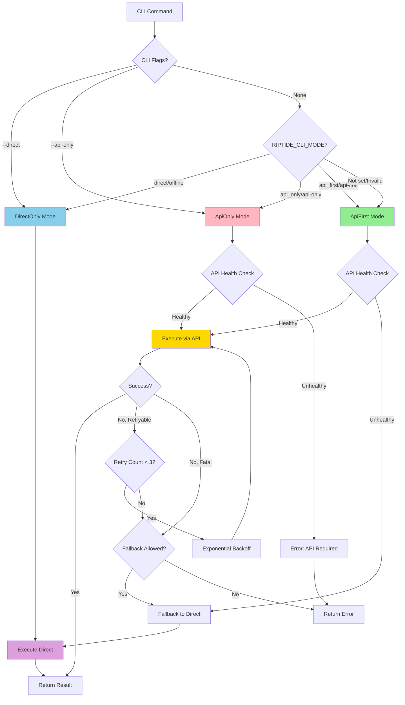
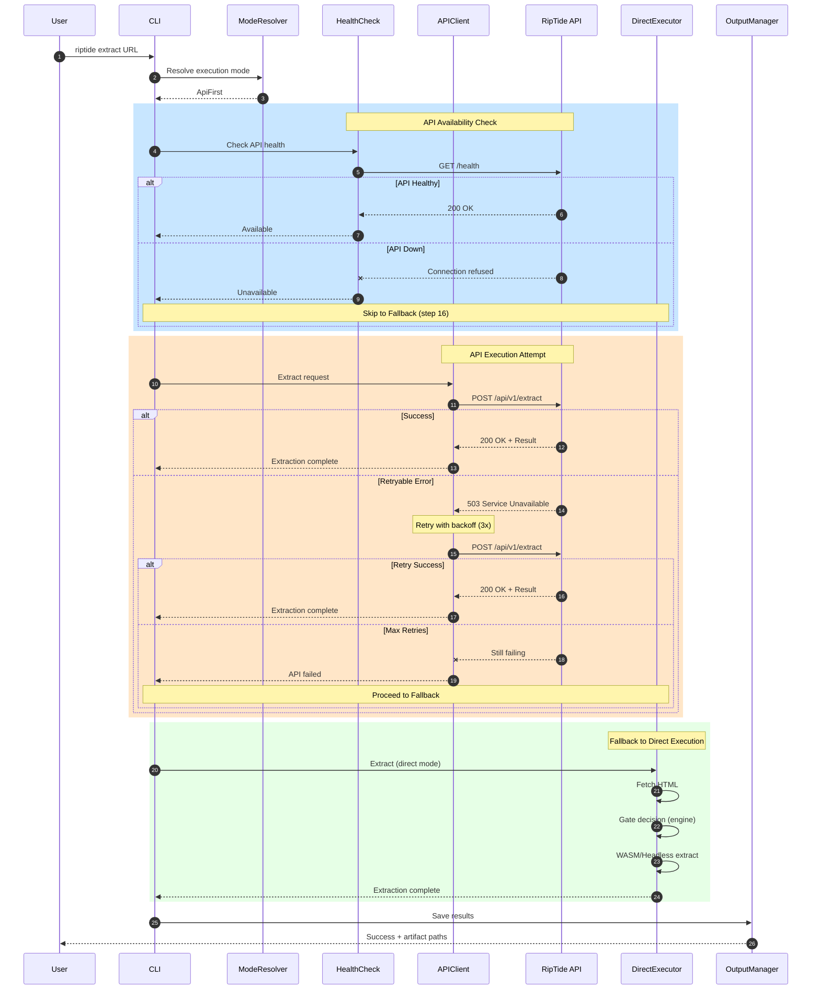
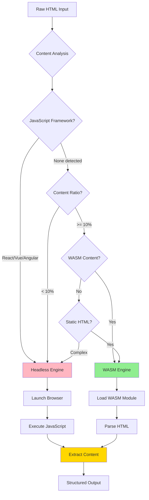
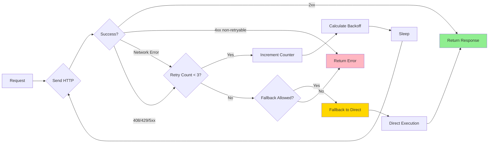
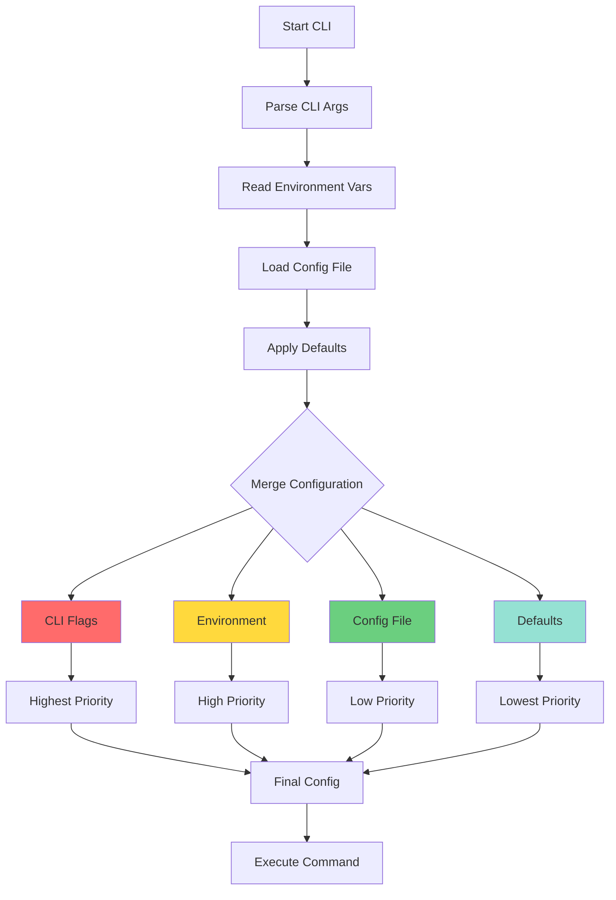
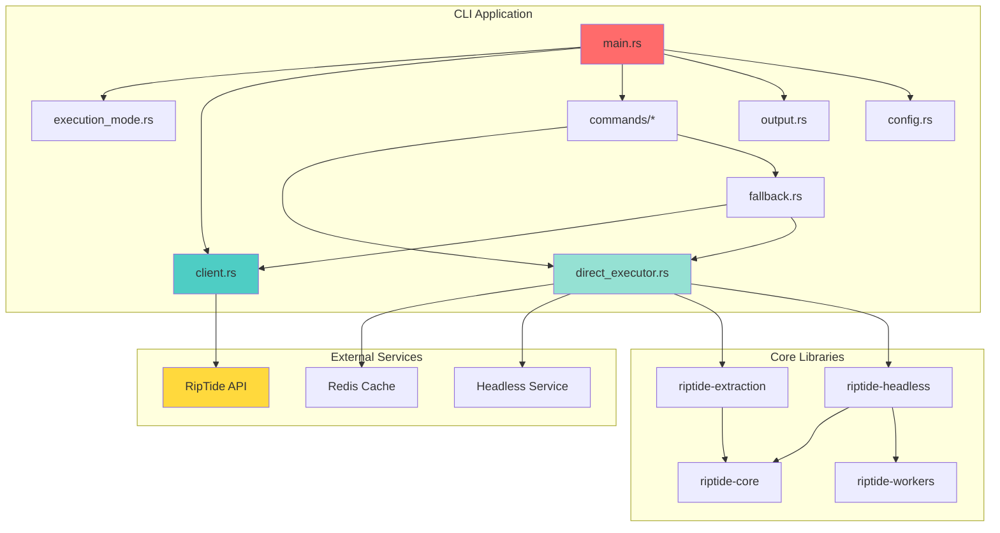
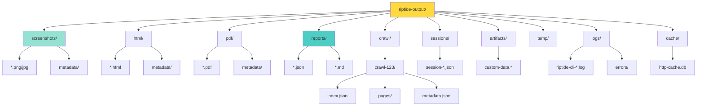
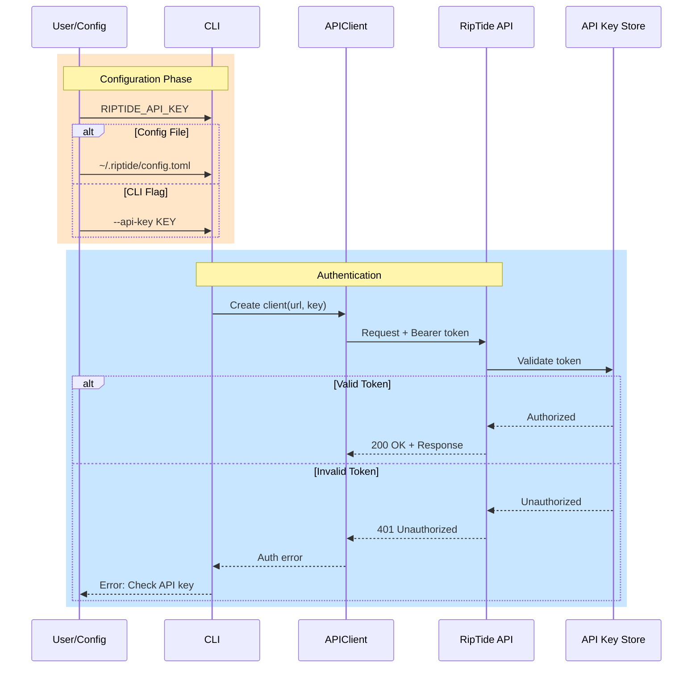
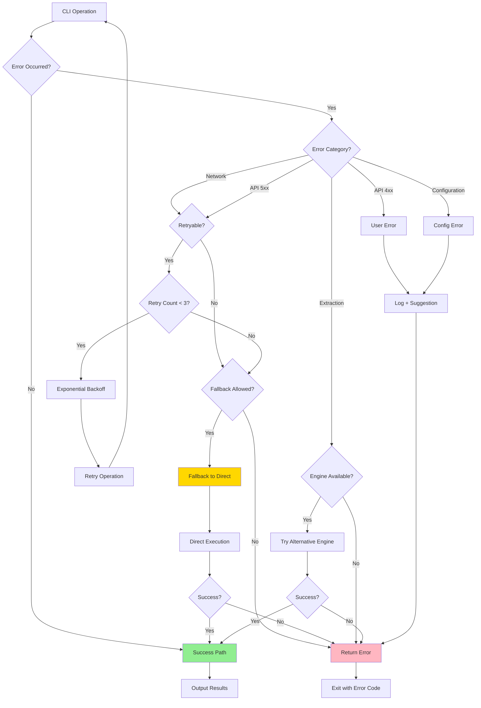

# RipTide CLI-API Architecture Diagrams

**Created By:** Hive Mind System Architect
**Date:** 2025-10-17
**Related:** [architecture-cli-api-hybrid.md](./architecture-cli-api-hybrid.md)

---

## Execution Mode Decision Tree

---

## API-First Execution Flow

---

## Engine Selection Gate

---

## Retry Logic with Exponential Backoff

---

## Configuration Priority

---

## Component Dependencies

---

## Output Directory Structure

---

## Authentication Flow

---

## Error Handling Strategy

---

## Legend

**Colors:**
- 🟢 Green: Success/Happy path
- 🔴 Pink: Error/Failure path
- 🟡 Yellow: Fallback/Alternative path
- 🔵 Blue: API communication
- 🟣 Purple: Direct execution

**Diagram Types:**
- **Flowcharts**: Decision logic and branching
- **Sequence Diagrams**: Time-ordered interactions
- **Component Diagrams**: System structure
- **State Machines**: Status transitions

---

## Notes

These diagrams visualize the key architectural decisions in the RipTide hybrid CLI-API system:

1. **Execution Mode Decision Tree**: Shows how CLI determines which mode to use
2. **API-First Execution Flow**: Complete sequence with health check, API call, retry, and fallback
3. **Engine Selection Gate**: Logic for choosing WASM vs Headless extraction
4. **Retry Logic**: Exponential backoff implementation
5. **Configuration Priority**: How config values are resolved
6. **Component Dependencies**: System architecture and module relationships
7. **Output Directory**: Organized artifact storage
8. **Authentication Flow**: API key validation process
9. **Error Handling**: Comprehensive error recovery strategy

Refer to [architecture-cli-api-hybrid.md](./architecture-cli-api-hybrid.md) for detailed specifications.
