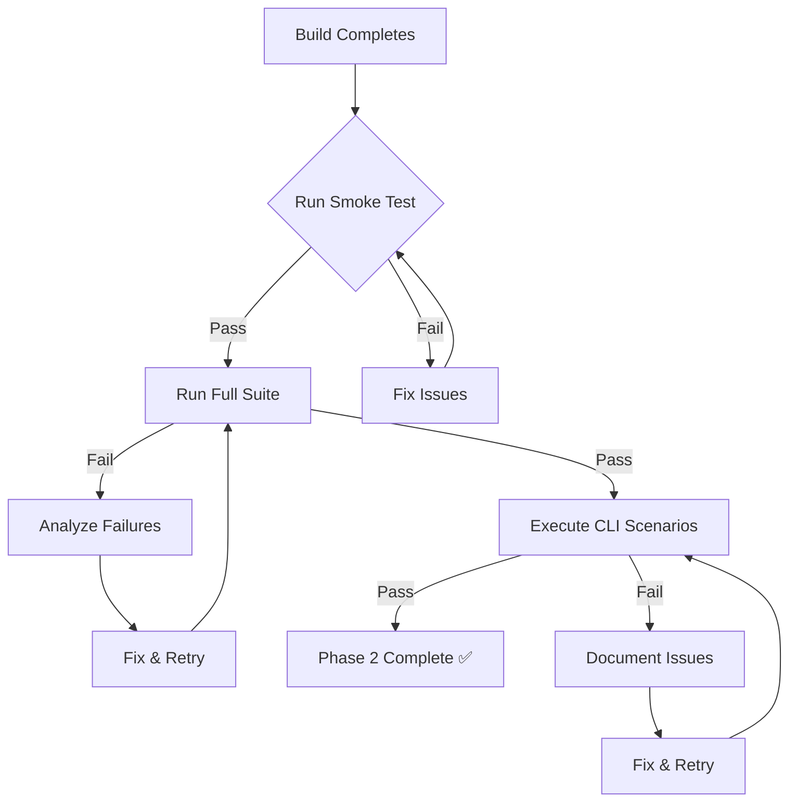

# 🚀 Quick Start - Spider-Chrome Testing

**For:** Phase 2 validation after build completion
**Time:** 2-45 minutes depending on test scope

---

## ⚡ Quick Commands

### 1. Smoke Test (2-3 minutes)
```bash
cd /workspaces/eventmesh
./docs/testing/smoke-test.sh
```

**What it tests:**
- ✓ Compilation succeeds
- ✓ Type definitions work
- ✓ Basic configuration works
- ✓ Pool creation works (if browser available)

### 2. Full Test Suite (30-45 minutes)
```bash
cd /workspaces/eventmesh
./docs/testing/run-spider-chrome-tests.sh
```

**What it tests:**
- ✓ All unit tests
- ✓ All integration tests
- ✓ Browser pool tests
- ✓ CLI tests
- ✓ Error handling

### 3. Specific Tests
```bash
# Browser abstraction only (1-2 min)
cargo test -p riptide-browser-abstraction --test spider_chrome_integration_tests -- --test-threads=1

# Engine pool only (3-5 min)
cargo test -p riptide-engine --test browser_pool_lifecycle_tests -- --test-threads=1

# Headless only (2-3 min)
cargo test -p riptide-headless --test headless_tests -- --test-threads=1

# CLI tests only (5-10 min)
cd tests/cli && cargo test -- --test-threads=1
```

---

## 📊 Test Results

### Check Status
```bash
# View all results
ls -la docs/testing/results/

# Check for failures
grep "FAIL" docs/testing/results/*.log

# View specific test log
cat docs/testing/results/integration-spider-chrome.log
```

### Success Indicators
```bash
✓ Exit code 0
✓ "PASS" in output
✓ No compilation errors
✓ No "FAIL" in logs
✓ All browsers cleaned up
```

---

## 🔧 Quick Fixes

### Browser Not Found
```bash
# Install Chrome/Chromium
sudo apt-get update
sudo apt-get install -y chromium-browser

# Or use system Chrome
which google-chrome || which chromium
```

### Port Conflicts
```bash
# Kill existing browsers
pkill -f "chromium|chrome"

# Check ports
lsof -i :9222-9230
```

### Memory Issues
```bash
# Check memory
free -h

# Clear caches
sync && echo 3 | sudo tee /proc/sys/vm/drop_caches
```

### Test Failures
```bash
# Clean and rebuild
cargo clean
cargo build --release

# Run specific failing test
cargo test -p <crate> --test <test> -- --nocapture --test-threads=1
```

---

## 📋 Test Priorities

### Must Pass (Critical)
1. ✅ `test_chromiumoxide_engine_initialization`
2. ✅ `test_navigate_params_chromiumoxide`
3. ✅ `test_browser_pool_config_defaults`
4. 🔄 `test_spider_chrome_basic_navigation` (build dependent)
5. 🔄 `test_browser_pool_creation` (build dependent)

### Should Pass (Important)
6. Screenshot tests
7. PDF generation tests
8. CLI integration tests
9. Stealth tests
10. Error handling tests

---

## 🎯 After Tests Complete

### Success ✅
```bash
# Generate summary
echo "✓ All tests passed!"
echo "✓ Phase 2 validation complete"
echo "✓ Ready for Phase 3"

# Tag the state
git tag -a phase2-validated -m "Phase 2: Spider-chrome tests passing"
```

### Failures ❌
```bash
# Analyze failures
grep -A 10 "FAIL" docs/testing/results/*.log

# Check compilation errors
grep "error\[E" docs/testing/results/*.log

# Review specific test
cargo test -p <crate> --test <test> -- --nocapture
```

---

## 📚 Documentation References

| Document | Purpose | Location |
|----------|---------|----------|
| **Test Infrastructure Report** | Complete test analysis | `/docs/testing/test-infrastructure-report.md` |
| **CLI Test Scenarios** | Manual CLI tests | `/docs/testing/cli-test-scenarios.md` |
| **Infrastructure Ready** | Status summary | `/docs/testing/TEST-INFRASTRUCTURE-READY.md` |
| **This Quick Start** | Quick commands | `/docs/testing/QUICK-START.md` |

---

## 🔄 Test Flow



---

## ⚡ One-Line Test Commands

```bash
# Fastest smoke test
./docs/testing/smoke-test.sh && echo "✓ Smoke test passed!"

# Full suite with summary
./docs/testing/run-spider-chrome-tests.sh 2>&1 | tee test-run.log && grep -E "(✓|✗)" test-run.log

# Parallel unit tests (safe, no browser)
cargo test --lib --all-features --workspace -- --test-threads=4

# Sequential browser tests
cargo test --test '*' -- --test-threads=1 --nocapture

# CLI validation
cd tests/cli && cargo test -- --test-threads=1 && echo "✓ CLI tests passed!"
```

---

## 📞 Emergency Commands

### Tests Hanging
```bash
# Kill all
Ctrl+C
pkill -9 -f "cargo|chromium|chrome"

# Clean up
rm -rf target/debug/deps/*test*
cargo clean
```

### Out of Memory
```bash
# Free memory
sync && sudo sysctl vm.drop_caches=3

# Run fewer tests
cargo test -p riptide-browser-abstraction --lib  # Unit tests only
```

### Port Already in Use
```bash
# Find and kill
lsof -ti:9222 | xargs kill -9
lsof -ti:9223 | xargs kill -9

# Wait and retry
sleep 5 && cargo test ...
```

---

## ✅ Test Completion Checklist

- [ ] Smoke test passes
- [ ] Unit tests pass
- [ ] Browser abstraction tests pass
- [ ] Engine pool tests pass
- [ ] Headless tests pass
- [ ] Integration tests pass
- [ ] CLI tests pass
- [ ] No compilation errors
- [ ] No clippy warnings
- [ ] All browsers cleaned up
- [ ] Results documented

---

## 🎉 Success Criteria

**Phase 2 Complete When:**
- ✅ All critical tests passing
- ✅ No compilation errors
- ✅ CLI commands work
- ✅ Screenshots/PDFs generate
- ✅ Error handling works
- ✅ Performance acceptable

**Next Phase:** Phase 3 - Full spider-chrome implementation

---

Generated: 2025-10-20
Status: READY
Blocker: Build completion
